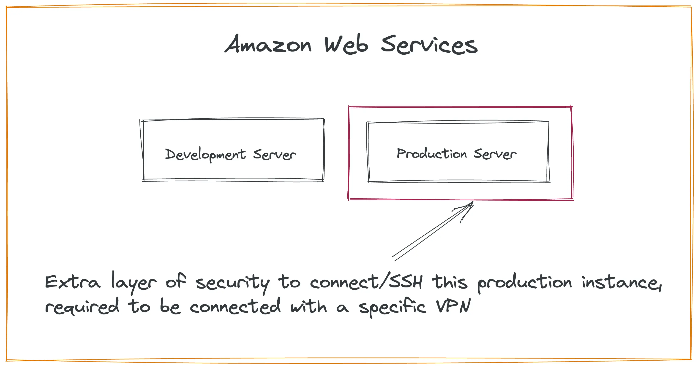
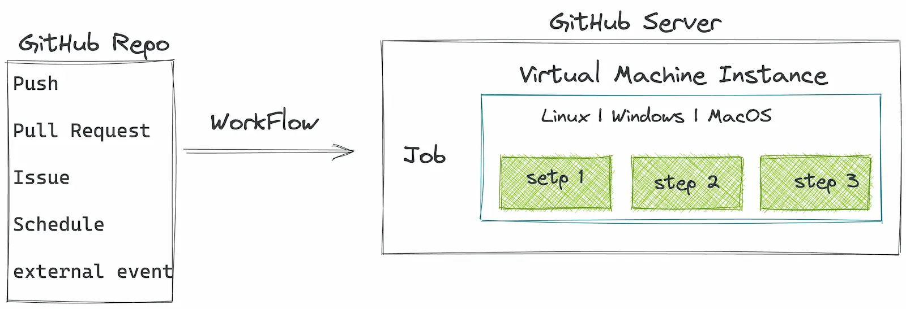
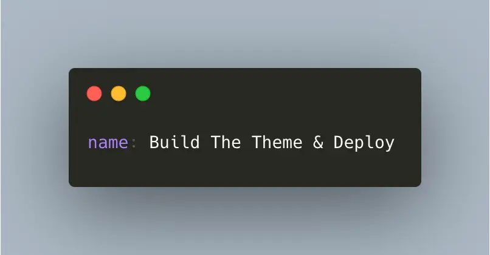
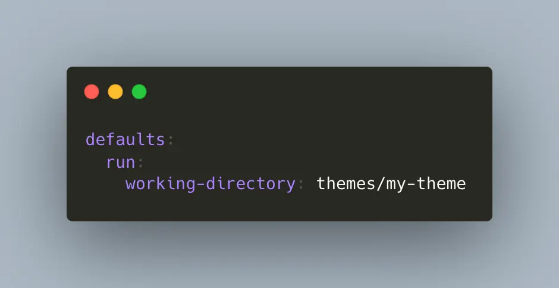
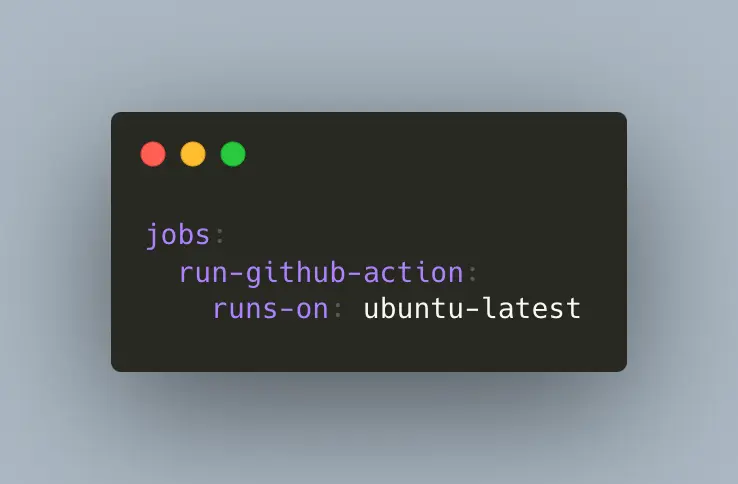
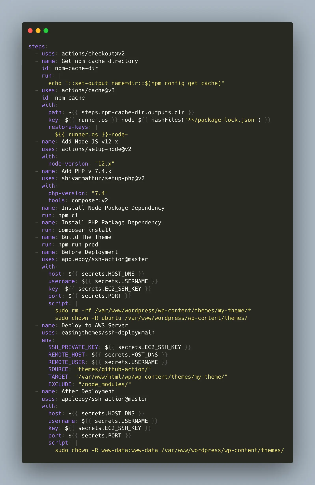
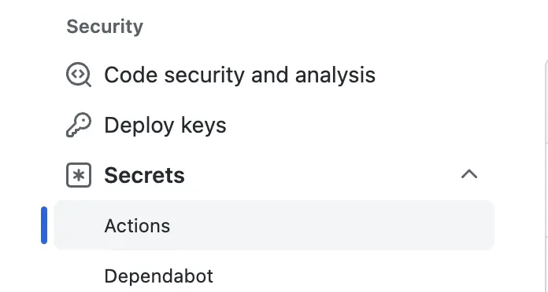

GitHub Actions can be used to automate almost any type of project, but in this article, I will cover how can we automate deployment (CI/CD) for WordPress. I personally chose WordPress as an example as is the world’s most popular CMS, with over 455 million websites that use WordPress, a number which is increasing day by day. With this in mind, this tutorial will hopefully be useful for many. To know more benefits of using WordPress I would suggest reading [this article](https://www.dreamhost.com/blog/why-use-wordpress/).

## What are GitHub Actions?

GitHub Actions are a convenient service where we can automate our builds, tests, and deployments instead of doing them manually. Every time we complete a task locally and want to deploy it on a server, we want to minimize redundant work especially when we want to deploy only minor fixes.
CI/CD (Continuous Integration and Continuous Delivery) helps us automate those processes and GitHub Actions do this for us with a couple of settings.
You can also check out the [GitHub Actions official documentation](https://github.com/features/actions) for more detailed information.

## How do GitHub Actions work

There are many events for GitHub Actions. Some handy and frequent-use events are pull_request, push, schedule, etc. You can find them all on [GitHub's official documentation](https://docs.github.com/en/actions/using-workflows/events-that-trigger-workflows).

Let's see our GitHub branches and how we would like to organize GitHub Actions on them.

**_GitHub Branches:_**

| Branch Name       | Our Actions Based on it                                                                    |
| ----------------- | ------------------------------------------------------------------------------------------ |
| **_master_**      | Here we keep all up-to-date codebase.                                                      |
| **_prod-deploy_** | If any code is merge in this branch, We run a GitHub Action for the production deployment. |
| **_dev_**         | We work on this branch for fixing issues and building features.                            |
| **_dev-deploy_**  | If any code is merge in this branch, We run a GitHub Action for development deployment.    |

### Our servers architecture

I made a minimal server architecture, I am not going to display a complex architecture but at the end, we will move a bit deeper.

We have two server environment for one website.  

1. Development Server
2. Production Server

After developing any new features or bug fixes we will send a Pull Request to the **_"dev"_** branch and after the code has been reviewed, if the **_"code reviewer"_** approves the code then s/he will merge and send another Pull Request to the **_"dev-deploy"_** branch.
The GitHub Action will run when the code is merged on **_"dev-deploy"_**.

Now, this is the time to create a GitHub Action for the **_"dev-deploy"_** branch. I will try to provide as many details as possible step by step. Let's create a **_"development"_** workflow in our repository.
Create a folder named **`".github"`** in the root of your project directory.
Create another folder named **`"workflows"`** inside the **`".github"`** directory and create a file named **`"dev_deploy.yml"`**, you can name it anything but the file extension should be **`".yml"`**. We will write all deployment code in this file. 

###### Step 1:

Let's add a "name". You can name it whatever you want but meaningful name is better.

###### Step 2:

We want to run our GitHub Action when anything merges with the **`"dev-deploy"`** branch. We have to write the code on the **`"on step"`** how we would like to trigger the event. Here is an example **`"on"`** event that we are firing when the code merges with the **`"dev-deploy"`** git branch.

###### Step 3:

We can set a default directory before the **`"jobs"`** run. We know that our root directory has no WordPress theme, so we can set the directory in the "theme directory" so that we do not need to change the directory in every **`"steps"`**.

###### Step 4:

**`"GitHub workflow"`** is a collection of **`"jobs,"`** and we write the **`"jobs"`** based on our needs. In this stage, we create a job that will run a virtual server based on our settings. We run **`"Ubuntu Linux"`** here but you can run `macOS or Microsoft Windows` if needed.

###### Step 5:

Here we write some **`"steps"`** that will be executed sequentially. If we define a **`"step"`** with **`"uses"`** it will execute as an action and if **`"step"`** with **`"run"`** then it will execute as a shell script.

##### We are already done! And it is as simple as I said it would be. Now let's see what it looks like when we write all the code together.

##### Let's describe each step:

- **`checkout:`** We checkout with our files into the virtual server with the GitHub checkout action https://github.com/actions/checkout

- **`cache:`** It keeps the cache so the theme build will be faster after the 1st time. (if the cache exists). More about the cache action here https://github.com/actions/cache

- **`Node JS:`** Our theme requires building the JavaScript packages and it has node version dependency v12.x.x so we just take the node version **`12.x`** on our virtual server. You can pick your own version from here: https://github.com/actions/setup-node

- **`PHP:`** Our theme requires building the PHP packages and it has PHP version dependency v7.4 so we just take the PHP version **`"7.4"`** on our virtual server. You can pick your own version from here: https://github.com/shivammathur/setup-php

- **`Install Node dependency:`** Here we run an action to install our npm package dependencies.

- **`Install PHP dependency:`** Here we run an action to install the PHP package dependencies.

- **`Build The Theme:`** Here we run the internal package command to build our WordPress theme. We are using the "Tonic starter" theme for our WordPress Theme.

- **`Before Deployment:`** Before deployment, we have to do some tasks if required. In my case, I do not want to mess up the setting that our "infrastructure team" made and I need the right permission to move the files too. so here I do some tasks like removing the old theme and change the folder ownership to mine.  
  To perform these actions we need to login/SSH to the server. For example, we need a DNS/IP, username, ssh key, port, etc to connect the AWS EC2 instance. I use here **`ssh-action`** to make my job easy. https://github.com/appleboy/ssh-action

`To add these things just follow below steps:`

1. Go to the Repository and click on the "Settings" tab
   
2. In the left side: menu, you will find **`"actions"`** under the **`"secrets"`** menu.
   
3. Click on **`"New repository secret"`**.
4. Provide a **`"name"`** on that specific **`"secret"`** and later you can access it by its name **_`${{ secrets.PORT }}`_** here **`"PORT"`** was the name.  
   You might not want to write permission or ownership command openly in the .yml file that is kept in Github. It leads a security thread later on so we can add this command in the secret and later access it when needed.
   

- **`Deploy to AWS Server:`** Here we just move the build theme into the right directory and here also I am using another pre-build GitHub Action named "ssh-deploy". More about the ssh deploy action here: https://github.com/easingthemes/ssh-deploy

- **`After Deployment:`** The changes we made before theme deployment, we do revert file permission and the ownership.

Congratulations! You have done all the steps, now it's time to run the auto-deployment by merging code on **`"dev-deploy"`**.

Would you like to know a bit deeper about GitHub Actions? One of our colleagues named "Sabrina Rashid", wrote a stunning article regarding [GitHub Actions]({{ baseurl }}/post/2022/07/15/A-Guideline-to-GitHub-Actions-with-CI-Pipeline/), you can check that too.

[In Part 2 of the article]({{ baseurl }}/post/2023/08/07/How-to-setup-CI-CD-pipeline-for-WordPress-with-GitHub-Actions-and-AWS-part-2), I have covered the setup and configuration of a GitHub self-hosted runner. If you are interested in using self-hosted runners for your deployment process, I highly recommend reading the section as it provides detailed steps and insights into the advantages of utilizing self-hosted runners.

## Resources

- [WordPress Market Share Statistics](https://www.envisagedigital.co.uk/wordpress-market-share/)

_Article Photo by [Roman Synkevych](https://unsplash.com/@synkevych)_
