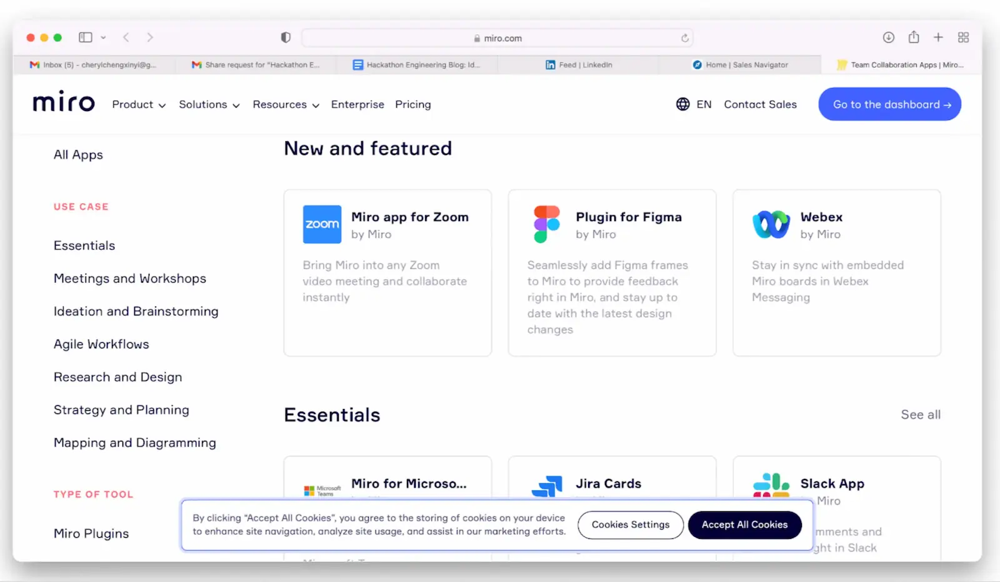

Restrictions on Face-to-Face meetings are always an archenemy of collaboration. Many of us facing this issue had to adapt and find other means to work around our limitations. And it came with no surprise that when it was our time to discuss and ideate for the Monstarlab's hackathon - [MonstarHacks](https://www.linkedin.com/showcase/monstarhacks), we turned to [Miro](https://miro.com/index/).

Miro gave us the opportunity to do live collaboration without meeting physically, and the best part of it is the ease and convenience to input our ideas together and structure them in a neat and wholesome way. Miro gives you the templates according to your preference of collaboration - in our case, it was brainstorming and ideation.

As we are brainstorming through our concept, we are able to leave notes in the platform and our ideas grew and gave birth to the flowchart of the application. From the overarching goals and recognising the problem statements, to the minute details of the app’s features, to the wire frames - we did it all on Miro. It allows extensive information to be stored on cloud so that we may go back to it anytime with just a click of the link.

We can just select the stick notes in the left banner and select the color for categorisation purposes to make it easier to segmentise our ideas.

Even with our research on the topic, all we have to do is just to copy and paste the link to the board and it will be instantaneously be reflected with the details of the webpage. From the start to the end of our ideation, it took us 2-3 hours to get our framework together and when we went on our separate ways to work on individual tasks, it became the foundation of our reference point and it helped to accelerate the process.

You can also link Miro to other apps such as Slack, Zoom and Figma to integrate your work smoothly across the other platforms.

There is much to explore for Miro but it is a starting point for everyone to try it out and use the platform to experience a more efficient and effective work process.

### Resources
- [Miro](https://miro.com/index/)
- [Miro Academy](https://miro.com/academy/)
- [Miro Webinars](https://go.miro.com/webinars)
