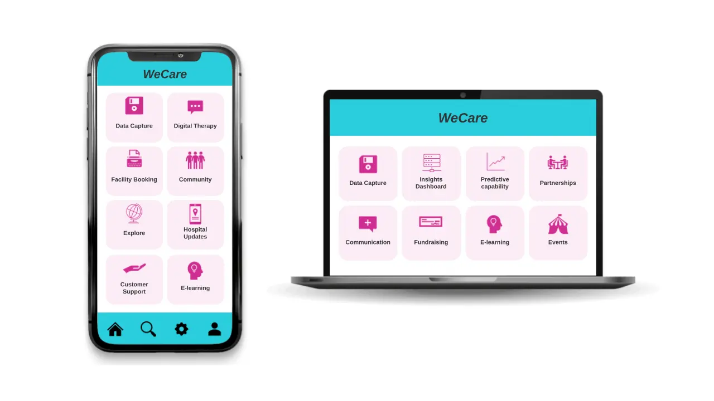

Dealing with families with a seriously ill child can be an emotionally challenging experience for them and requires the utmost sensitivity. Currently, the admissions process has its own challenges. The process involves the manual transfer of personal details and information from cards to an Excel spreadsheet, which is then transferred to their internal CRM system. This process is not only time-consuming but also prone to human errors, resulting in inaccurate records. Additionally, there are risks to the security of personal data due to the storage of cards in a secure box or filing cabinet.

To address these challenges and improve the admissions process, our Team Monstars Inc., as part of the [MonstarHacks](https://www.linkedin.com/showcase/monstarhacks) 2023 Monstarlab internal hackathon, proposed a value-added solution for the NGO [The Sick Children's Trust](https://www.sickchildrenstrust.org/) delivered in three phases (short-term, medium-term, and long-term) through the development of a super app. The short-term solution will consist of two steps. The first step will address the first pain point in the data collection process by implementing an API integration between hospitals partnered with the NGO and the CRM tools currently in place by the NGO for automatic data transfer.

The second step will involve configuring integration between the NGO CRM and ChatGPT image analysis capabilities to extract the relevant data into the CRM system automatically. This two-step solution will provide immediate value creation for the NGO, allowing the team to focus on developing plans to achieve the long-term vision of a super app called **weCare**. Our plan will deliver benefits in the short, medium, and long term for both the NGO and the families they help.

## Short-term solution

We propose the creation of an API between hospitals and the NGO CRM to mitigate the risks of inaccurate records and data security. The API will retrieve patient data upon consent directly from the hospital's electronic medical records system. This will save time and effort while ensuring the accuracy of data. Additionally, this API will comply with GDPR regulations, ensuring the security and privacy of personal data.

By digitizing this process, we can eliminate human errors and ensure the security of personal data. This resolves the most pressing challenge of manual information collection with creative and simple digital solutions. We will also create an integration between ChatGPT image upload capabilities and the NGO CRM to automatically extract the relevant data from the physically stored cards directly into the CRM tool.

## Medium-term solution

To further improve the admissions process, we propose the creation of an app that integrates the various functions of the NGO. The app will provide staff with a unified platform to manage guests' and partners' data. It will be designed with a user-friendly interface to ensure ease of use for both staff and families. The app will provide automated emotional support services and guides to the facilities and local points of interest.

## Long-term Solution

In the longer perspective, the super app **weCare** will be gradually updated to further support the NGO and their guest experience to provide 360-degree support through automated processes. the NGO will have access to a larger set of guest data, which can be used to maintain and build on their existing guest relationship management. This can include automated notification of when it's a good time to reach out to previous guests for fundraising or other requests.

## Conclusion

Improving the admissions process for families with seriously ill children is a crucial step towards ensuring that they receive the care and support they need. By implementing an API between hospitals and the NGO, along with the creation of a super app, we can streamline the admissions process, eliminate human errors, ensure data security, and improve the overall guest experience.

Our immediate solution will allow for a modular and scalable process that streamlines admissions and data collection, by replacing the manual card system with a digital solution. In the medium term, we propose the creation of the app weCare. In the long term, we propose the expansion of the created app into a super app to integrate the various functions of the NGO.

With these solutions, we can ensure that families feel welcome and supported during their stay, allowing the NGO to really focus on what matters - supporting the families.

_Article Photo by [The Sick Children's Trust](https://www.sickchildrenstrust.org/)_
