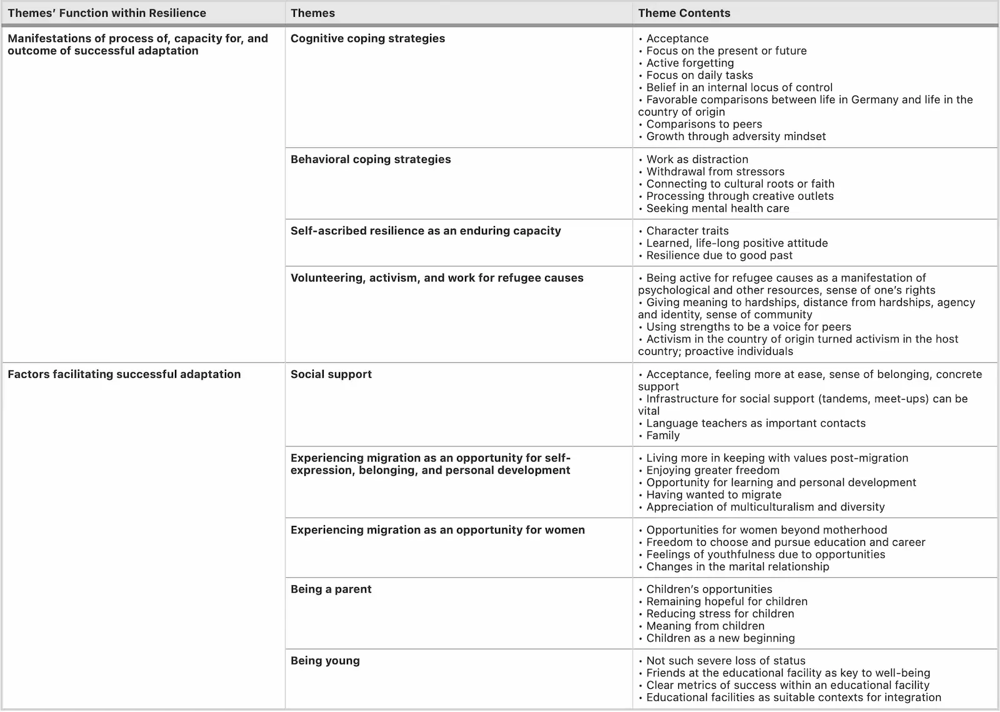

Refugee crises continue to be a major concern around the world. As of today, the number of refugees and internally displaced people worldwide has grown to almost 90 million. Due to multiple barriers like culture, language, etc., ensuring adequate access to health care and connecting the community to these huge populations remains a major challenge.

## Problem Statement
Millions of people around the world are forced to be dislocated due to war and other humanitarian crises, thus becoming refugees. Due to many different obstacles, such as language or cultural barriers, refugees are not only burdened with the disease but also compromised access to healthcare. However, knowledge of the living experience of this demographic is very limited. In addition, the strategies that people may develop to access health care, which is very essential to peer support and the establishment of community-based programs, have not been studied in detail.

_Image Source: [UN Refugee Agency](https://reporting.unhcr.org/globalappeal2022?page=6#_ga=2.220820248.1411705371.1648888640-227061203.1648888640)_

## Proposed Solution
A greater understanding of the different refugee statuses, such as gender, literacy, ethnicity, culture, etc can guide healthcare workers and policymakers in improving services for these refugees. Furthermore, it is important to enable seldom-heard, hard-to-reach populations and facilitate their research participants to understand how vectors of disadvantage intersect.

Here is MonstarHack 2022, what we are proposing is a means to store semi-structured data of challenges/experiences refugees face and how healthcare professionals around the world developed different strategies to overcome those challenges. These data will be available to explore the experiences of refugees, healthcare professionals, and administrators in the healthcare system.

## Case Study
This is a thematic analysis^1 of semi-structured interviews with refugee participants who arrived in Germany between 2013 and 2018.

_Image Source: [A qualitative study on resilience in adult refugees in Germany](https://bmcpublichealth.biomedcentral.com/articles/10.1186/s12889-021-10817-6)_

> The above image shows the nine themes we identified, specific points within each, as well as the two broad categories into which we organized themes based on their function within resilience. The themes of Cognitive coping strategies, Behavioral coping strategies, Self-ascribed resilience as an enduring capacity, and Volunteering, activism, and work for refugee causes all capture ways in which participants manifest resilience as the “process of, capacity for, or outcome of successful adaptation despite challenging or threatening circumstances”. The themes of Social support, Experiencing migration as an opportunity for self-expression, belonging, and personal development, Experiencing migration as an opportunity for women, Being a parent, and Being young all cover factors that appear to facilitate successful adaptation. Within overarching categories, themes are in no particular order except that Cognitive and Behavioral coping strategies and Social support, the first themes in the two categories, were the most globally represented among our participants. The sections below include interview quotations with the individuals quoted represented as participants and a participant number.

## Conclusion
There has been a lot of effort researching the crises of refugees and how different strategies were developed over time to overcome those crises but yet there are no means to record these experiences.

Information from qualitative research organized into themes and subthemes can be stored and retrieved by storing it in a database. The themes and subthemes are based on an interview guide and the succeeding development of theory and new themes. A database's thorough sorting algorithms allow a researcher to keep track of his data while analyzing and reporting on it.

The comprehensive analysis of these data will help healthcare workers and policymakers working with refugees to take better measures by making them aware of potential strategies and sources of strength specific to this client group. This will also contribute to moving the academic literature as well as will ensure equity in health care for refugees by potentially improving clinical practice and integration processes.

#### Reference:
Walther, L., Amann, J., Flick, U. et al. A qualitative study on resilience in adult refugees in Germany. BMC Public Health 21, 828 (2021). https://doi.org/10.1186/s12889-021-10817-6

_Article Photo by [Amnesty International](https://www.amnesty.org/en/latest/news/2018/11/why-rohingya-refugees-shouldnt-be-sent-back-to-myanmar/)_
