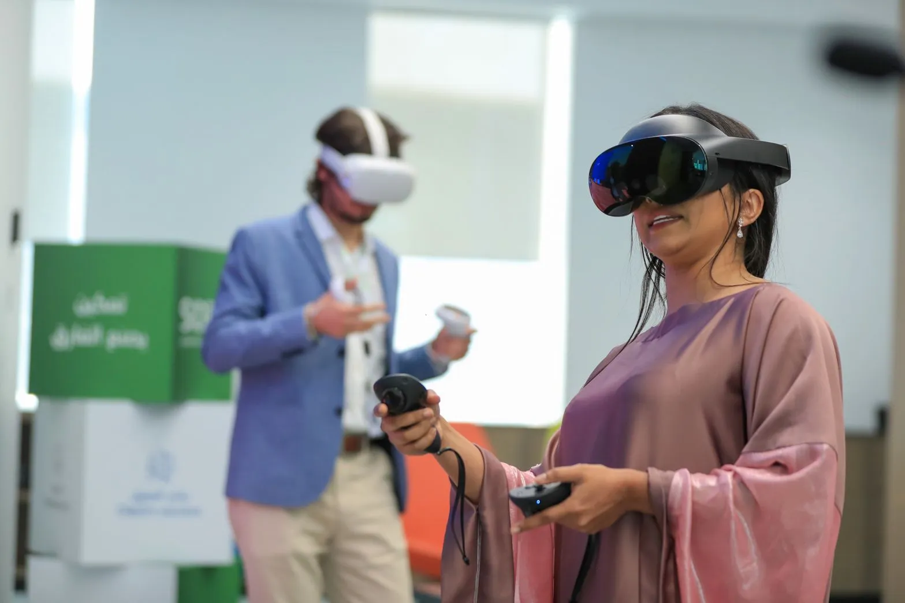

Today, we're chatting with [Nairah Thaha](https://www.linkedin.com/in/nairah-thaha-0a37269a/), a skilled Immersive Technologies Engineer at Monstarlab. Nairah joined the Monstarlab team back in March 2023, bringing with her over 7 years of expertise as a Unity developer with a focus on Immersive Technologies (AR, VR and Metaverse).

Born and raised in Dubai, she indulges in a variety of activities that reflect her dynamic personality. From practicing calisthenics and aerial dance to enjoying video games, paddle boarding, and tackling escape rooms, Nairah loves to challenge herself. And when it comes to food, she will never say no to a delicious bowl of ramen.

<figcaption>In the photo: Ennis Elmudir and Nairah Thaha</figcaption>

_**Nairah, could you tell us about your experience developing immersive technology apps that use generative AI? Could you share a cool prototype you have worked on recently?**_

I’ve started incorporating generative AI into my projects as early as March 2023. When the trend took off, I immediately saw its value and got started on ideating and developing new experiences. The latest one I developed was to help train customer facing employees to deal with difficult client cases. In this scenario, the “customer” was a generative AI human that had a specific banking challenge that you needed to converse with to help solve. The conversation would be recorded and at the end you get an evaluation of how well you handled the situation – what you could have done better, statistics on the conversation as a rating from 1-10, etc. Because the “customers” in the prototype are generative AI, it’s very easy to change out their prompt to handle different situations or even industries.

_**What have been some of the most significant challenges you've faced when creating immersive tech experiences using generative AI? Could you share an example where you had to innovate or think creatively to overcome these challenges?**_

When I had started off back in March, the generative AI scene in Unity was still quite fresh and there weren’t any helpful tools yet. My earliest prototypes had a pretty dissociative issue which was a long delay between you speaking to a generative AI avatar and it responding back to you. This was due to the processes of speech to text, analyzing the question and generating an answer, and then transforming this text back to speech using generative AI to sound more human. As a workaround, I started processing smaller chunks of text at a time, in order to reduce this delay. Eventually, many helpful tools came to market, such as Inworld, that make this process easier to implement and without the speech delay I was facing.

_**In a field as rapidly evolving as immersive tech and generative AI, how do you keep your skills and knowledge up to date?**_

With new challenges and brief timeframes, I’m compelled to find the most efficient and latest technologies to help me develop them. It’s been very helpful to have the freedom to explore new creative solutions and develop them. The constant practice of doing this over the last year has really helped me stay up to date with the latest technology.

_**Looking forward, where do you see the integration of generative AI and immersive technologies heading? What are some advancements you anticipate in creating more engaging or realistic experiences?**_

I feel generative AI is already in a very good state and I trust it to continue to get better over time. Where I anticipate more improvement would be in the realm of more realistic human characters to work with. While the avatars look great, there are nuances in real-time facial experiences and mouth movements that I’d be excited to see improve in order to create better immersion.

_**How has your experience been working at Monstarlab? Could you share some highlights or key moments that have shaped your journey here?**_

I think it would be difficult to highlight only one particular moment. As a whole, the environment I’m in is set up nicely to foster innovation and push the boundaries of what is possible. I also have a great team I can depend on and I cross collaborate regularly with other departments. This helps us come up with some really great solutions.

> As an immersive tech engineer, it’s always important to be up to date with the latest in technological innovation and Monstarlab gives me the platform to do so.

_**If you had the chance to choose one programming superpower, what would that be and why?**_

Read documentation once and remember it forever 😊. However, I am super happy to see tools such as Unity Muse come out, which keeps all its documentation alive in a generative AI chat, similar to ChatGPT. It’s very handy and has made programming a lot more efficient.

_**What's on your current tech wish list? Any specific gadgets or software tools?**_

Definitely the Meta Quest 3 for its mixed reality capabilities. I’m also looking forward to trying the Apple Vision Pro soon!
