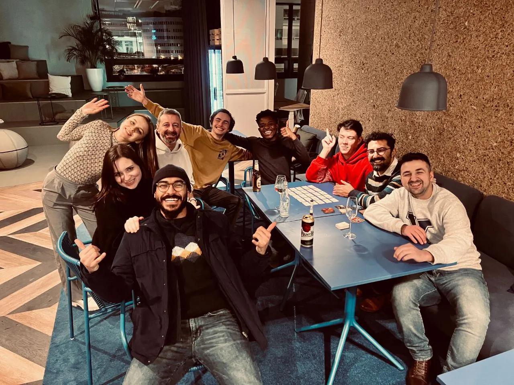

Today, we're chatting with [Nikita Sirovskiy](https://www.linkedin.com/in/nivisi), Lead Mobile Engineer who on top of working on client projects, plays an important role in enhancing Monstarlab's Flutter Service Offering by driving meetings, creating & managing tasks and helping with people’s allocation.

Nikita is, in his own words, a "healthy perfectionist, stoic and a creative person". In his free time, he likes to play guitar, sing, write stories, poems and books. Nothing is published yet, but hopefully one day we'll get to read his work.

<figcaption>In the photo: Prague team (Omar Bekier, Ekaterina Surovtseva, Eleonora Perevozchikova, Juraj Longauer, Nikita Sirovskiy, Pedro Massango, Oleksandr Mochalov, Esmaeil Abedi, Muhittin Kaya)</figcaption>

_**Nikita, can you describe your journey of transitioning from a developer to a project lead? What were the most significant changes you had to adapt to?**_

“Extreme Ownership”, that’s what sums it up best. I've always been proactive and tried to enhance things on all the projects I was a part of. Questioning decisions made outside of my direct responsibility zone was and is very important to me. I work not only on mobile apps, I work on products. A right question at the right time might turn the tide. I know people say ‘I’m not getting paid for this or that.’, but I never understood this. Of course you must not do things for others, yet, if you see a room for improvement, why not just improve it?

One of the most significant changes is that now, most of the time, I am the person who answers questions, not the one who asks them. Deadlines, scopes, code reviews and all this. After all this, there’s not much time to code myself. While being a lead gives me a bird-eye view on the entire project, which is very interesting, sometimes I miss these days where all I had to do was just to code. Coffee, good music, quietness, flow state… Yes, sometimes I definitely miss this.

_**Q: During your first project as a lead, what were some of the biggest challenges you faced? Could you share a story where you had to overcome a difficult obstacle, and how you managed to do it?**_

Self-doubt. That’s the biggest thing for sure. It was hard to accept that now it’s me who is responsible for making decisions and saying yes or no to other’s decisions. Sometimes the pressure was high, sometimes I was not confident in my own solutions and decisions, sometimes the deadlines were really tight. Although people around me — my family, my line manager, my project manager and my teammates — supported me a lot. Not only with valuable advice, but also by saying that the result is fantastic so far. Another day, when looking at the result myself, I realized that we’ve built the best mobile app I ever worked on. It’s stable, developer experience is great, the code is clean, and the UI/UX is amazing. That gave me a lot of confidence and the game changed.

> “Don’t pull yourself backwards” — that’s what one of my friends told me.

_**Q: Given your experience with remote work, how do you handle the dynamics of leading a team remotely, especially when occasionally there is a need to visit client offices as well?**_

I worked remotely since the beginning of my career, and I still do. Although Monstarlab’s borderless approach took it to another level. Even people who work from office usually sit in different offices all around the world! This is amazing. You can meet so many different people. This is how we work on the current project as well.

We try to be more autonomous and contextualized. Less meetings, more documentation: in-code, Confluence, Google docs, or whatever is more convenient for a specific topic. Less direct messages in messengers, more communication in corresponding tools (GitHub, Figma, etc). Different time zones is a challenge itself. I want us to reach the point when, if someone needs something, they will be able to find it in the docs. So we won’t need to disturb or wait for each other in Slack or in a meeting room.

But working remotely means that colleagues are more disconnected from each other. Sometimes it’s hard to understand the needs or mood of your teammates, so periodic catch ups are very important. I have 1-on-1 calls where I sincerely ask my teammates about what is going on. Is there something to change, a problem that must be fixed or just a question that needs an answer. We find it very beneficial. I was given a lot of suggestions on these calls. It also allows you to discuss off-topic things which leads to better connection with a person. Although it is important not to turn these calls into rituals that you blindly follow just “because”.

Work trips are also very beneficial. All my visits were filled with productive and interesting time. Brainstorming sessions, lunches, morning coffees, debug sessions. This for sure enriches your connection with people. As someone who works remotely most of the time, I value it a lot. Perhaps one day I decide to relocate to be with the team all the time. I’m very curious how it would be.

_**Q: What advice would you give to developers who are about to take on their first leadership role? Are there any key lessons you wish you had known when you started?**_

Well, don’t pull yourself backwards, that’s for sure. You are where you are for a reason. Your skills and commitment have led you to this role, so just keep it up and do your best.

For more specific things, learn how to organize yourself. Self-organization helps to keep track of things: questions raised on calls or chats, project goals, tech debt, ideas etc. Proper tracking allows you to plan better, oversee everything and move faster. I started using Apple Notes extensively. I have folders for interviews, TODOs, suggestions, conversations, and basically anything that is important in any way. One thing I love is the new (maybe not that new anymore) feature with the quick note in the corner of your screen. I keep my TODO list there. If I need to note something, I just move my cursor to the right-bottom corner and start noting.

I write a lot of documentation. This is an extremely beneficial tool for time saving and optimization. We don’t need to re-explain rules and there’s less need to sync. If in doubt, one can open the documentation to learn how certain things are done.

Another thing is talking to people. This will sound classic, but everyone is very different, and everyone requires a different approach. You will need to provide constructive feedback, be a mentor for your colleagues, raise problems and concerns to managers and the business, suggest ideas and say no. The latter is a skill itself, a very important one. I like this phrase that I heard somewhere, «If it’s not a 100% yes, then it’s a no». Of course it’s not really applicable here (otherwise we would’ve been blocked most of the time!), but this idea is still a good foundation for making decisions. Remember, you’re in charge now, and raising concerns, whatever those are, is a must. I failed to do this a few times. Those problems came back at a later stage of the project. Nothing big, fortunately, yet still… I learned this very well.

_**Q: How has your experience been working at Monstarlab? Could you share some highlights or key moments that have shaped your journey here?**_

It’s been fantastic so far! Working here has been a journey of growth and challenges. What I can highlight is the level of trust that you have here. On my very first project, I quickly shifted to conducting demos, enhancing code practices, and doing code reviews. On my second project, when the lead relocated to a different time zone, I stepped up to handle most of the code reviews, demos and crucial feature finalizations. On my third project I was mostly solo, which made me the one who talks with designers, backend developers, clients and PMs.

> The atmosphere on every project was amazing. Ask anyone, and everyone will tell you that people in Monstarlab are special. They are always eager to chat, to laugh, to help and support.

Someone even invited me to their home, and we spent evenings talking about life. Someone drives me to and from the office every time I’m on a work trip, and we have these short morning and evening conversations.

_**Q: Reflecting back to the beginning of your career, what initially inspired you to start programming? Have there been any specific role models in the tech industry who have influenced or guided your path?**_

I have a very vivid memory of asking my father “Who creates computer games?” and him answering “programmers”. That was the initial inspiration. I wanted to be either a programmer or a taxi driver. Don’t ask me why. Today I don’t even have any clue about cars. Anyways.

It became serious when my father discovered that you can create custom game maps, or modes, for my favorite computer game, Warcraft 3. This involved coding, designing characters, and crafting stories and worlds – a mix of technical skills and creativity. I think I was 7 years old when he showed me that program, World Editor. I spent countless hours, days and nights, in trying to craft things. My mother also played a crucial role. She forced me to learn more and take additional classes, even when I didn’t want to. But in a soft way. I always had full freedom in experimenting what I want from this life and in learning whatever I think is needed.

But I didn’t become a game developer! Maybe one day, maybe one day. I was lucky to have that map-creating period in my life. It has built a solid foundation for problem-solving and creative skills that I use today.

_**Q: Every profession has its lighter side, and programming is no exception. Do you have a favorite programming joke or a meme that resonates with you or brings a smile to your face?**_

Yes! I wanted to find the picture, but I couldn’t. There's this meme comparing users enjoying a new feature to developers tangled in a mess of code trying to figure out how to develop a new feature without breaking the app.

While humorous, it shows the real challenges in coding. I've seen poorly organized codebases that looked like spaghetti. It's a reminder that we should never trade-off maintainability for delivering something new. Organization, requirements, documentation and optimal processes make development cycles efficient and apps cost-effective.

It improves another thing that is often ignored, developer experience. The happier the devs, the more interesting it is to work on a project, the better the project will be. I hope that that meme is not applicable for us. Hope that in our case both of the sides of the picture represent happy people.
