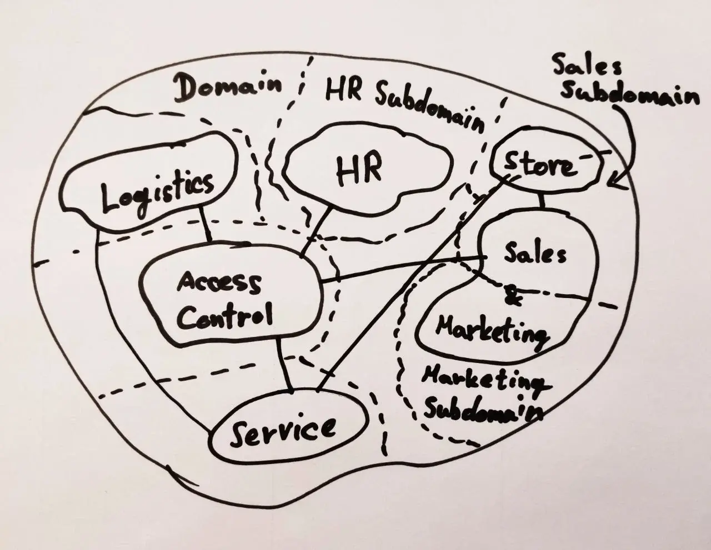

Domain-Driven Design (DDD) has been around for well over a decade, and its popularity keeps on growing. Eric Evans coined the term in his book: ["Domain-Driven Design: Tackling Complexity in the Heart of Software."](http://dddcommunity.org/book/evans_2003/) A lot of recent interest probably correlates with the rise of microservices, since it provides many practices and patterns for building them effectively. But as useful as it can be to use them together, nothing is compelling you to do so. You can reap the benefits of DDD with a wide variety of system and software architectures.

To paraphrase [DDD Comunity](https://dddcommunity.org/learning-ddd/what_is_ddd/), DDD is an approach to software development, aiming to produce an implementation deeply reflecting the core business concepts. The main parts of the code should resemble the language used by domain experts, and be easily explainable to non-technical staff. This level of clarity makes rigorous documentation unnecessary. As the business evolves, this code should too. While it's not particularly suitable for simple applications, DDD shines in complex domains.

DDD is not a methodology nor a strict set of rules. The whole team should practice it - the technical staff will fail if other project members don't get involved. Some parts of it are intentionally open to interpretation, while others are more thoroughly defined. That makes DDD applicable in many domains and allows its further evolution.

The target audience for this article are people usually involved in software projects, such as domain experts, project managers, product owners, clients, UX/UI designers, QA specialists, developers, architects, etc. You will be given some ideas on how to share knowledge and reason about the business domain. You will see how to partition projects for an implementation that's understandable, testable, maintainable, and adjustable to new requirements. I will provide some examples along the way to make the introduced concepts easier to digest. In the end, we will take a quick look at some of DDD's technical aspects, so developers and architects can start experimenting for themselves.

## The basics

We will begin with DDD's less technical, strategic side. It is instrumental in shaping your project, affecting how the implementation is organized and even how the code is written. It also affects team communication, making sure it's effective with a minimal chance of misinterpretation. That brings us to the first of the two most significant concepts in DDD - ubiquitous language.

## Ubiquitous language

Domain experts often have their jargon or a distinct vocabulary. When they work together with the technical team to establish a common, rigorous language, one that is unambiguous and effortlessly used, that becomes the ubiquitous language. It should be clear, thoroughly defined, well understood, and nurtured by involved parties. There is also no point at which a ubiquitous language becomes final. It continually evolves as the understanding of the domain changes.

The technical team should pay close attention to how domain experts communicate about the business. Developers should make sure to accurately translate that to code and avoid introducing any new terminology that would be hard to accustom to by others.

While documenting ubiquitous language might be useful in some cases, you should generally avoid doing that. The team's already familiar with it anyway, and documentation only requires additional work and continuous maintenance.

Also, be careful. The term "ubiquitous" might mislead you into thinking the language extends over the whole domain. I have initially thought so myself. I will explain why this is not the case as we look into the second essential DDD concept - bounded contexts.

## Bounded contexts

If you take any company and observe communication within different departments, it will quickly become clear each one uses a different language. They are covering distinct aspects of the business, after all. You might also notice some shared terminology, yet the meaning of each shared term may vary between departments. The same word might have completely different meanings - an "account" can be both a system user account for IT and a bank account for finance.

Let's imagine a chain of domestic appliance stores. Consider the meaning of a particular washing machine model (note: this example will be used throughout the article).

- Marketing needs consumer-oriented information about the machine for the online catalog, such as the manufacturer name, model number, price, water consumption, energy efficiency, capacity, load type, a photo, etc.
- Service keeps track of warranty information, manufacturer contacts, list of replacement parts, service manual, etc.
- At checkout, salespeople need the manufacturer name, the model number, and the price of the washing machine multiplied by the number of units sold.
- Logistics tracks the number of washing machines stored in warehouses, their locations, orders, supplier information, etc.
- HR doesn't need any data about the washing machines or any other product sold.

Marketing obviously has no use for a list of replacement parts. Salespeople similarly don't need the washing machine supplier information. Service doesn't care about the number of new washing machines in warehouses. You get the point. Other departments equally don't need most data managed by HR, such as employee retirement plans, etc.

The main thing to note here is that we're referring to different notions of the washing machine across several contexts. Every context gives it a distinct meaning and attributes.

We will usually find multiple such contexts in a particular business. If we constrain a ubiquitous language inside one and form a domain model based on it, this becomes a _bounded context_. There will be multiple bounded contexts in a business domain, each having its distinct ubiquitous language and domain model. They impose lingual and logical, but not technical constraints.

Bounded contexts are associated with another important concept: **subdomains**. They represent different segments of the business domain. Business aspects of competitive advantage belong within the _core domain_. _Supporting subdomains_ are related to non-core business segments. _Generic subdomains_ are needed by the other two to function but don't provide any competitive advantage, such as bookkeeping, for example.

But what is the difference between subdomains and bounded contexts? Many people have a hard time drawing a clear line between the two. Subdomains describe different responsibilities of the business domain, while bounded contexts model the current state of the system. In his book, ["Implementing Domain-Driven Design,"](https://www.informit.com/store/implementing-domain-driven-design-9780321834577) Vaughn Vernon places subdomains in the problem space and bounded contexts in the solution space. In an ideal scenario, they would align. In the real world, however, there is often something like a legacy system whose bounded context spans across two or more subdomains.

Note that, although I've used business departments as examples of general context, they're not always going to match your subdomains and bounded contexts. As an example, a bounded context for user access control doesn't reflect any department, yet most software products depend on it. Its ubiquitous language with terms for logging in, signing up, resetting the password, etc. will be used across the business.

## The planning

Now that we've grasped the main ideas, let's see how to put them to practice.

## Context maps

Many of you are probably working on an existing project where you might want to apply DDD. Context maps help either layout your existing domain and bounded contexts or plan a completely new software product. Let's try to make one for our imaginary appliance store domain.



The very first thing you'll notice is my horrible handwriting, for which I'm very sorry. However, there is a good reason for not using modeling software and making beautiful diagrams: this is not the final iteration of the context map, and you'll throw (erase) these away often as the team's understanding of the domain improves. Papers and whiteboards are your friends. The same rule about formally documenting ubiquitous languages also applies here - create such documentation only if you genuinely need it, and then make sure you maintain it. The code should still be the primary source of truth.

In the context map given above, we see a giant bubble representing the domain. The smaller bubbles in full lines represent bounded contexts. The segments separated with dashed lines represent subdomains. In this theoretical scenario, most of the bounded contexts align with their subdomains.

However, ignoring _Store_, there is also one outlier - _Sales & Marketing_. The departments are different enough to be found in two domains, but the current implementation still places them in the same bounded context. Splitting it up would probably be recommended based on the outline of the subdomains. But maybe they're lingually so unified that we should merge the domains and leave the bounded context as-is? That is something the project team needs to settle upon and represent in the future iterations of the context map.

Although we should make sure to keep bounded contexts properly decoupled, they won't make much sense if they don't communicate. We use connecting lines to indicate their relations. We could probably draw some more in our example, but, as we already mentioned - this is not the final context map of our domain. You can see that most of the bounded contexts link to _Access Control_. As we want to simplify user management by having a central place for that, it is reasonable to have such relations.

There are multiple types of relational patterns. Although knowing them is essential, they're also out of the scope of this post. Similarly, there is more to be said about context maps. If you'd like more information, please refer to the references at the end.

## One bounded context per team?

You might read or hear that there should be a team allocated to each bounded context. That is a very appealing scenario, but very often, it's simply not realistic. So should a team working in multiple bounded contexts develop a shared language for all of them?

**NO!** Instead, the team should learn multiple ubiquitous languages. They should exclusively use the language of the bounded context in which they're currently working. [This SO answer](https://softwareengineering.stackexchange.com/a/308973) has a great way of putting it - the team should become _multi-lingual_.

## A constant state of flux

Once more, I'd like to point out that all of the mentioned concepts don't assume a final state. Your business domain will continuously change, and your software needs to adapt. Your bounded contexts and ubiquitous languages will evolve with the business, new learnings, and people. You will correct and redraw context maps to accommodate these changes, and you'll accordingly adjust your implementation.

## The implementation

So far, we've covered a lot of ground without any technical detail. That's for a good reason, as having a solid grasp of the _strategic_ basics is crucial to success with DDD.

On the other hand, there is also a lot on the _tactical_ side of DDD. You'll have a substantial amount of flexibility in building your solution, but there are still multiple commonly used patterns, practices, and architectures you should know.

## Coding in the ubiquitous language

Now it's time to see how ubiquitous languages and code come together. Remember, we said it's critical to listen to domain experts. Let's hear a seller in our appliance store speak about their process:

> I need to check out every product either by scanning the barcode on the packaging or entering the product code manually. After I complete the sale, I need to print out the receipt for the buyer.

Now let's see some code implementing this scenario. For simplicity, we won't cover the "unhappy path" like error cases or customers canceling the purchase. Some elements, like barcode scanning, will be asynchronous or found in places different from the rest. We won't concern ourselves with this, but rather focus on the important - the lingual and logical aspects.

```java
// Checkout using barcode obtained from a scanner device or camera
seller.checkOutUsingBarcode(barcode, receipt);
```

```java
// Alternative checkout method in case barcode scanning fails
seller.checkOutUsingProductCode(productCode, receipt);
```

```java
seller.completeSale(receipt);
seller.printOutReceipt(receipt);
```

These examples are trivial, but they should be enough for a first impression. Compare them against the seller's description of the process and notice the similarities.

There are some other questions to consider here:

1. Is the seller a `User` type or a `Seller` type?
2. What is the correct bounded context?
3. How are the barcodes and the product codes validated?

One sensible answer to the first two questions would be `Seller` in the _Sales & Marketing_ context. You might find this confusing since we also need to have access control for sellers. After all, they need to have the ability to sign in and reset passwords like everybody else. Let's reconsider - do we pick `User` or `Seller`? Well, both. Your `User` from _Access Control_ will map to the `Seller` in _Sales & Marketing_. They'll have some common properties that identify the represented employee, but they will also differ in others. Note that, implementation-wise, one is not the other, i.e., there is no inheritance relationship between the types.

Let's quickly look at a counter-example. Imagine a system where the `User` type holds all employee information. There is no `Seller` or any other employee type. Each salesperson, marketer, warehouse worker, bookkeeper, etc. would be a `User`, and the class would end up being massive to support all the required properties. It becomes even worse when you start persisting it in databases or adding methods like the above `checkoutUsingProductCode`. Such code is hard to test, change, and maintain. Yet, this is very often seen in software systems when developers start taking [DRY](https://en.wikipedia.org/wiki/Don%27t_repeat_yourself) to the extreme.

Regarding the last question about validating bar- and product codes, the most important thing is to make sure your method's callers don't have to do any validation themselves. Instead of passing an integer or a string, it would be better to introduce new types (e.g., `Barcode` and `ProductCode`), even if they only have a single field and a few simple methods. The big benefit is that methods accepting such types as parameters can use them straight away, as their validity is always assured. That also prevents validation implementation detail from leaking into these methods.

```java
public final class Barcode {
    private final String barcode;

    public Barcode(String barcode) {
        if (isInvalidBarcode(barcode)) {
            throw new IllegalArgumentException("The provided barcode is not valid");
        }

        this.barcode = barcode;
    }

    ...

    private boolean isInvalidBarcode(String barcode) {
        // Check the validity of the barcode according to standards used in the store
        ...
    }
}
```

Our `Seller` class would then look something like this:

```java
public final class Seller {
    ...

    public void checkOutUsingBarcode(Barcode barcode, Receipt receipt) { ... }

    public void checkOutUsingProductCode(ProductCode productCode, Receipt receipt) { ... }

    public void completeSale(Receipt receipt) { ... }

    public void printOutReceipt(Receipt receipt) { ... }
}
```

## Decoupling bounded contexts

With `User` and `Seller`, we explained how objects "cross" context boundaries by mapping to another type.

You can keep the boundaries conceptual and not impose them anywhere in the project configuration. You might split contexts by package (or namespace) and let developers know they shouldn't use a class belonging to a particular package outside of it. It might work for your team or in smaller projects, but in general, this often leads to cutting corners and a [smellier](https://en.wikipedia.org/wiki/Code_smell) codebase once the deadlines start nearing.

You'll probably be better off with imposing some stricter boundaries. For this, you can use modules or similar features in your build system or programming language, making only select classes from one module available to the other. When the project scales up, you can split these modules up into (micro)services.

DDD doesn't impose any particular architecture as long as your domain logic is in focus, although the [hexagonal architecture](<https://en.wikipedia.org/wiki/Hexagonal_architecture_(software)>) is quite popular among practitioners. [Clean architecture](https://blog.cleancoder.com/uncle-bob/2012/08/13/the-clean-architecture.html) is another strong candidate, but you can also adapt architectures such as [SOA](https://en.wikipedia.org/wiki/Service-oriented_architecture) and others to fit the purpose.

## Final word

You won't be surprised to hear there's much more ground to cover. I haven't even mentioned aggregates, event storming, entity and value objects, event sourcing, CQRS, and many other topics. My goal was to give you the gist and pique your interest.

If you decide DDD is the right choice for your project, Vaughn Vernon's excellent book goes into a lot of detail on both strategic and tactical patterns (link in references). Before you start wondering why I also haven't mentioned Eric Evans' famous "blue book" here, the only reason is I still haven't gotten to read it at the time of writing. Rest assured, it's already on the list. :)

I hope the article motivated you to learn more and that it will stimulate DDD in more projects, both existing and new.

## References

- [DDD Comunity - What is Domain-Driven Design?](https://dddcommunity.org/learning-ddd/what_is_ddd/)
- [Dino Esposito & Andrea Saltarello - Discovering the Domain Architecture](https://www.microsoftpressstore.com/articles/article.aspx?p=2248811)
- [Eric Evans - "Domain-Driven Design: Tackling Complexity in the Heart of Software" (book)](https://www.amazon.com/Domain-Driven-Design-Tackling-Complexity-Software/dp/0321125215/ref=sr_1_1?ie=UTF8&s=books&qid=1238687848&sr=8-1)
- [Eric Evans - Domain-Driven Design Reference](https://domainlanguage.com/wp-content/uploads/2016/05/DDD_Reference_2015-03.pdf)
- [Jonathan Oliver - DDD: Strategic Design: Core, Supporting, and Generic Subdomains](https://blog.jonathanoliver.com/ddd-strategic-design-core-supporting-and-generic-subdomains/)
- [Martin Fowler - Ubiquitous Language](https://www.martinfowler.com/bliki/UbiquitousLanguage.html)
- [Methods & Tools - An Introduction to Domain-Driven Design](http://www.methodsandtools.com/archive/archive.php?id=97)
- [Vadim Samokhin - How to define bounded contexts](https://codeburst.io/ddd-strategic-patterns-how-to-define-bounded-contexts-2dc70927976e)
- [Vaughn Vernon - "Implementing Domain-Driven Design" (book)](https://www.informit.com/store/implementing-domain-driven-design-9780321834577)

---

Title photo by [Ari Spada](https://unsplash.com/@ari_spada?utm_source=unsplash&utm_medium=referral&utm_content=creditCopyText) on [Unsplash](https://unsplash.com/photos/wVoMvN5NsU0?utm_source=unsplash&utm_medium=referral&utm_content=creditCopyText)
