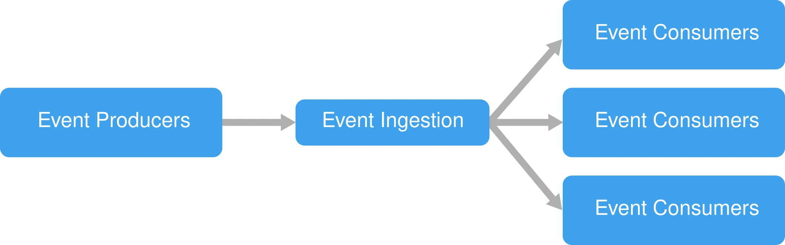
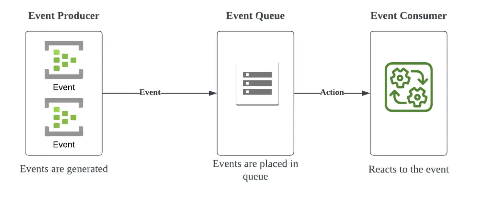
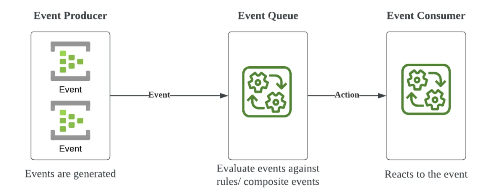
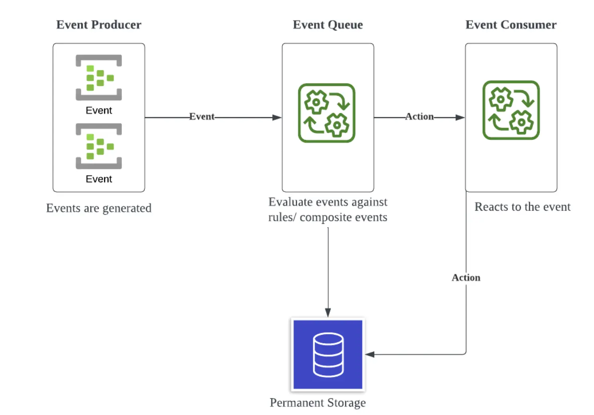
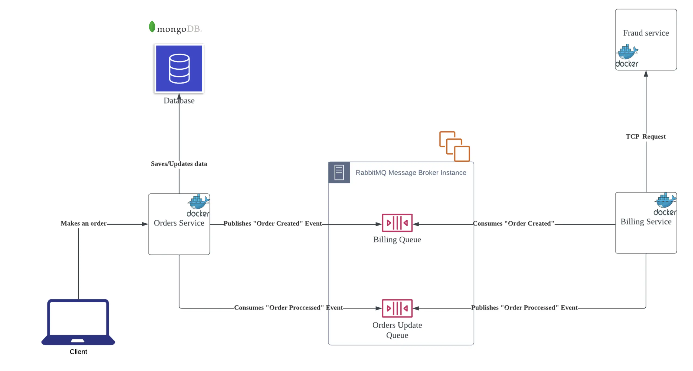

With the growing need to build scalable, performing and maintainable enterprise services, microservices and event-driven architectures are often brought up as solutions to the problem, but what should you keep in mind when building services with such architectures?

## Introduction

This article explains the motivations for using Event-Driven Architecture, the core concepts, and its main challenges.
It also explains how to implement Event-Driven Architecture with NestJS as the backend and RabbitMQ as the communication tool to handle events and messaging.

## Microservices and their shortcomings

With the growing need for scalable, modular and maintainable systems, microservices architecture is becoming the de facto architecture for building complex enterprise systems.
With a microservices architecture, the system is broken down into smaller fault-tolerant modules that can be scaled, deployed, and maintained separately; individual services can even use different technologies stacks that might be more suitable to the domain or the task that the service is responsible for. For instance, a system where most services are mostly written in Java could be using Python for the service responsible for the Machine-Learning model.

One of the big advantages of going for a microservices architecture is having loosely coupled services so that a failure in one service does not cause failures in other services as a single point of failure. But that advantage can be lost if a blocking communication between services is causing it to become a single point of failure. This problem is very common when two services are communicating over HTTP/TCP in the request/response style.

We may also face latency problems as our service might be waiting for the other service to complete a long process to produce the response, causing slow waiting times that could be felt by the end user.

## Event-Driven Architecture

To solve this problem a non-blocking method of communication is needed, and that is where Event-Driven Architecture can solve those problems. With Event-Driven Architecture, instead of services communicating through a request/response method, **Event Producers** will post events to an **Event Queue** in the form of messages that will be consumed by **Event Consumers**. Different technologies will use different protocols to deliver their message and some will have support for streaming real-time data, but the basic architecture is as follows:



Whenever an Event Producer produces an event, the event is registered in the Event Queue, the Event Producer then can start doing whatever other task it needs to do, as the Producer no longer cares about the response of that event. The event is now stored in the Queue and it can be consumed by the Event consumers that in turn will read the event message and do whatever processing is needed. When the necessary process is successfully finished, the message is deleted from the queue.

We can also have multiple instances of the Event Queue running, so we can guarantee that our Event Queue is fault-tolerable and that our services are now truly loose-coupled. Even in the event of one of our Consumers becoming unavailable, our Producers will still run as they should and the events will be stacked in our Queue, which can be picked up as soon as the needed Consumers are back up. This will also massively help with problems regarding data loss, as our Event Queue can have our messages saved for as long as we need, for as many retries as we need for the Consumer to process the event message.

## Event-Driven Architecture's main concepts

Here I would like to discuss some of the main concepts regarding Event-Driven Architecture:

- **Event**: A change in the status of an object or a resource. Eg: _A new order was made._
- **Event Producer**: A service that produces events to the Event Queue.
- **Event Queue/Broker**: A queue that holds event messages sent by Event Producers to be consumed by Event Consumers.
- **Event Consumer**: Consume events in the Event Queue and performs the necessary processing.
- **Dead Letter Queue**: A parallel queue to the main Event Queue where messages that for some reason could not be processed are moved to, so they can be analyzed and reprocessed if necessary at a later time. For instance, a message with some sort of corrupted information reaches that max number of retries and then is moved to the DLQ.
- **Ack**: Stands for acknowledgment; it acknowledges that an Event was successfully processed and that it can be safely removed from the queue.

## Event-Driven Architecture's challenges

Despite addressing many of the microservices architecture's problems, Event-Driven Architecture introduces its challenges.

### Complexity

To become able to develop well designed Event-Driven Architecture based enterprise system has a steep learning curve in both designing and implementing the architecture.

### Compatibility

Deciding if event-based communication is ideal for a pair or group of web services can be difficult. In some cases, there is no clear need for one service to be hanging waiting for another service to finish its processing. In other cases, the response from the consuming service process is utterly necessary to proceed with the task.

But sometimes it is not as clear if an event-based communication is the best answer for the services in question, and the trade-offs of different communication patterns must be weighed to decide which better suits the specific case.

### Event Duplication and Event Order

With queues running on multiple instances due to the fault-tolerant and horizontal-scaling nature of microservices, Event duplication is not a matter of if, but when. Dealing with event duplication is one of the big challenges of microservices, and it can be very dangerous depending on the kind of system you are developing. Eg: Billing your client twice, or adding funds to their wallet twice. Some message brokers will provide solutions to this out of the box, _with their own trade-offs_, and some will prefer to implement the deduplication logic themselves using event ids and other techniques.

On the same note, when event ordering matters it is important to implement a logic that guarantees that events are processed in the intended order. In systems where internet connection is rarer, a large number of events might be stacked before going to the server (Eg: IoT systems) and that could cause events to be all out of order if the logic to prevent it is not implemented.

### Error Handling

With more moving parts, different situations, different communication methods, etc. introduced by the Event-Driven Architecture, error handling becomes a lot more complex, but it is also a key part of fine-tuning your services.

## Event-Driven Architecture patterns

### Simple event processing



### Complex Event Processing



### Streaming Event Processing



## When you SHOULD use Event-Driven Architecture

- When there is asynchronous processing between services or the current synchronous services can be remodeled to asynchronous with no major drawbacks.
- When the response from another service is not needed right away and the processing result can be managed by state/status transition. (Eg: Processing, Billing, Completed, Fail, etc).
- When process retries are needed and/or the failures need to avoid data loss.

## When you SHOULD NOT use Event-Driven Architecture

- The response from the service is integral for the process to continue. (Eg. Fraud detection)
- When the system is not complex enough for the benefits of an Event-Driven Architecture to outweigh the operational cost and complex implementation.
- The team is not used to Event-Driven Architecture and not enough time is available for the team to transition to the new architecture.

## Message Brokers and related technologies

- **RabbitMQ**: Works as a queue, pub/sub message broker using the AMQP protocol. Popular due to its simplicity and reliability.
- **Apache Kafka**: Distributed event store and streaming processing platform. One of the more popular options due to its performance and implementation possibilities.
- **AWS SQS/SNS, GCP Pub/sub**: Cloud-based message queue services that are ideal for those who want less operational overhead while working in the cloud.
- **AWS Kinesis**: A managed data streaming platform for AWS. Similar to Kafka, but with less operational overhead.

_Managed versions of RabbitMQ and Kafka can also be found in some cloud providers._

## Architecture example

A simple example of an ordering app using Event-Driven architecture:



With this architecture the Orders Service is decoupled from the Billing service, helping us achieve low latency to the end user, fault tolerance with the loosely coupled services that are able to perform retries on failure, and no data duplication since the Billing service does not need to have its own database.

On the other hand, the billing service is tightly coupled with the Fraud service, since any indication of fraud should cancel the Order right away. But even in the case of a failure in the Fraud service process, the billing service will only **Ack** the event message after the process is finished, so retries are also possible here thanks to the Event-Driven Architecture and Rabbit MQ.

## Code example

Here are a few code snippets of the main components of this architecture using the **NestJS** backend framework for **NodeJS** and **RabbitMQ**.

### Event Producer

`orders.controller.ts`:

```typescript
@Controller("orders")
export class OrdersController {
  constructor(private readonly ordersService: OrdersService) {}

  @Post()
  async createOrder(@Body() createOrderRequest: CreateOrderRequest) {
    return await this.ordersService.createOrder(createOrderRequest);
  }
}
```

`orders.service.ts`:

```typescript
@Injectable()
export class OrdersService {
  constructor(
    @InjectModel(Order.name) private orderModel: Model<OrderDocument>,
    @Inject(BILLING_SERVICE) private billingClient: ClientProxy
  ) {}

  async createOrder(
    createOrderRequest: CreateOrderRequest
  ): Promise<OrderInterface> {
    try {
      const order = new this.orderModel({
        ...createOrderRequest,
        status: "PENDING",
      });

      await order.save();
      const orderPayload: OrderInterface = {
        orderId: order._id.toString(),
        productName: order.productName,
        price: order.price,
        buyer: order.buyer,
        status: order.status,
      };

      await lastValueFrom(
        this.billingClient.emit("order_created", {
          orderPayload,
        })
      );

      return orderPayload;
    } catch (error) {
      throw error;
    }
  }
}
```

Our entry point is on our **controller** which will send the Order data to the **service** layer that will save the Order as **PENDING** and **emit** an **order_created** event to the **BILLING** queue with a payload, the queue is registered under the **BILLING_SERVICE** const variable. ( `export const BILLING_SERVICE = 'BILLING';`)

### Event Consumer

`billing.controller.ts`

```typescript
@Controller()
export class BillingController {
  constructor(
    private readonly billingService: BillingService,
    private readonly rmqService: RmqService,
    @Inject(ORDERS_SERVICE) private ordersClient: ClientProxy
  ) {}

  @EventPattern("order_created")
  async handleOrderCreated(
    @Payload("orderPayload") order: Order,
    @Ctx() context: RmqContext
  ) {
    //check for fraud
    if (await this.billingService.isFraud(order)) {
      order.status = "CANCELED_FRAUD";
    } else {
      this.billingService.bill(order);
      order.status = "PROCESSED";
    }

    // emit and event to update the order status
    await lastValueFrom(
      this.ordersClient.emit("order_procesed", {
        order,
      })
    );

    // if no errors happened, acknowledge the order_created process is over and remove it from the queue
    this.rmqService.ack(context);
  }
}
```

The Billing service now will be watching for the **Event Pattern** **_order_created_**, it will check for fraud and then try to bill the order. If no error occurs, it will then **emit** an **_order_processed_** event with the new order status. And if no errors happen it will then **Ack** the **_order_created_** event message.

The Order service will then update the database with the new status and proceed to **ack** the **order_processed** event message to end the whole process.

### Event Broker

`rmq.module.ts` (Configuration needed for services using RabbitMQ as Producers)

```typescript
@Module({
  providers: [RmqService],
  exports: [RmqService],
})
export class RmqModule {
  static register({ serviceName, serviceEnvVar }: RmqModuleOptions): DynamicModule {
    return {
      module: RmqModule,
      imports: [
        /*
          Creates a dynamic module based on the serviceName
          This module creates/connects to a queue as an event producer
        */
        ClientsModule.registerAsync([
          {
            name: serviceName,
            useFactory: (configService: ConfigService) => ({
              transport: Transport.RMQ,
              options: {
                urls: [configService.get<string>('RABBIT_MQ_URI')],
                queue: configService.get<string>(serviceEnvVar),
              },
            }),
            inject: [ConfigService],
          },
        ]),
      ],
      exports: [ClientsModule],
    };
}
```

The **register** method will be used by services that need to use RabbitMQ as **Producers**. The service will need to provide a **_serviceName_**, the **_URI for RabbitMQ_** (eg. running container), and **_serviceEnvVar_** as the environment variable holding the **_queue name_**.
For instance, you could have an environment variable `RABBIT_MQ_BILLING_QUEUE=BILLING`, so you would call the **_register_** method like `RmqModule.register({ serviceName: 'BILLING', serviceEnvVar: 'RABBIT_MQ_BILLING_QUEUE'}),`.

`rmq.service.ts`:

```typescript
@Injectable()
export class RmqService {
  constructor(private readonly configService: ConfigService) {}

  // return the config options to subscribe to a queue as an event consumer
  getOptions(queue: string, noAck = false): RmqOptions {
    return {
      transport: Transport.RMQ,
      options: {
        urls: [this.configService.get<string>("RABBIT_MQ_URI")],
        queue: this.configService.get<string>(queue),
        noAck,
        persistent: true,
      },
    };
  }
}
```

Returns the configuration needed for a service to consume from a RabbitMQ queue. (The queue variable is the env variable name).

### Event Message Ack

`rmq.service.ts`:

```typescript
@Injectable()
export class RmqService {
  constructor(private readonly configService: ConfigService) {}

  ack(context: RmqContext): void {
    const channel = context.getChannelRef();
    const originalMessage = context.getMessage();
    channel.ack(originalMessage);
  }
}
```

The method needed to **Ack** event messages from a queue when they are no longer needed.

## References

- The complete code for the above architecture can be found in the [following Github repository](https://github.com/FelipeCO14/nest-event-driven-app)
- [NestJS + RabbitMQ integration](https://docs.nestjs.com/microservices/rabbitmq)
- [IBM Event-Driven Architecture article](https://www.ibm.com/topics/event-driven-architecture)

_Article Photo by [Krusche & Company](https://kruschecompany.com/)_
