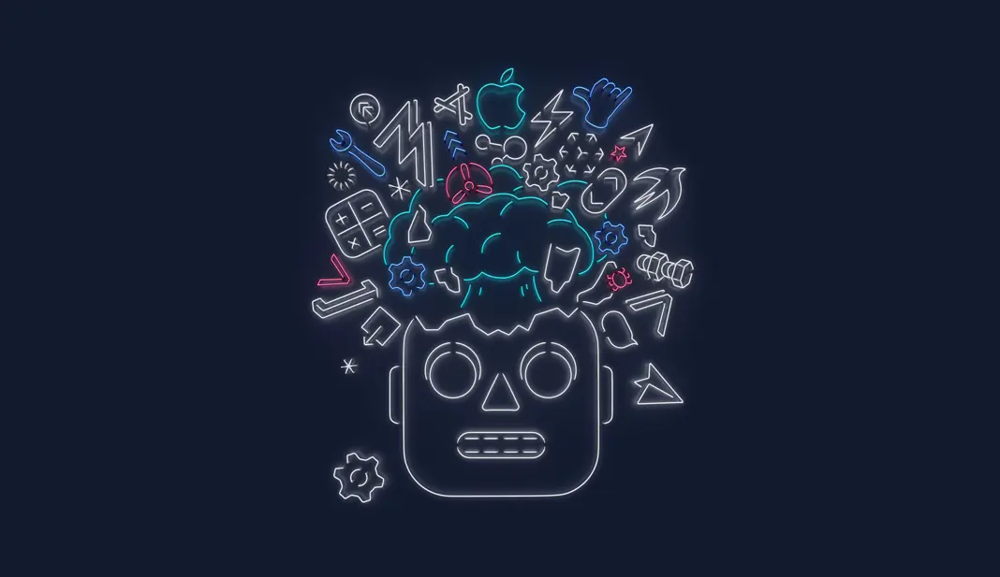
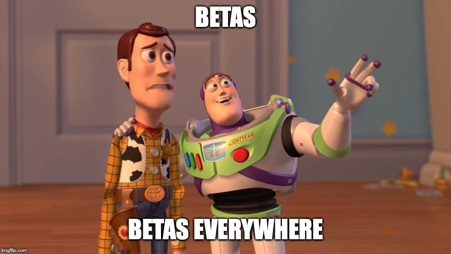
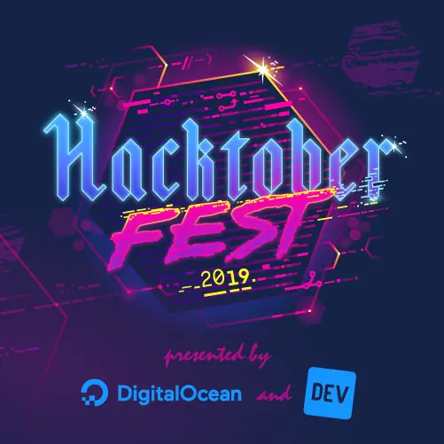

Apple recently posted their [annual announcement](https://developer.apple.com/news/?id=11292019a) that App Store is shutting down over the holidays. At the same time Stack Overflow has announced that [Winter Bash 2019](https://stackoverflow.blog/2019/12/09/tis-the-season-for-hats-join-us-for-winter-bash-2019/) is here, giving you a chance to add a funny hat to your Stack Overflow profile because why not?

All of that can only mean one thing: 2019 is coming to an end and what a year for the Swift community!

And so, as the snow falls quietly over Denmark (actually...its 5 degrees and raining outside!) and we are all in hygge-mode, roasting our chestnuts on an open fire (we're not really! That heat came from running `carthage bootstrap --platform iOS`!). We - the iOS developers here at Nodes - thought it would be fun to have a lighthearted look back at some of the events that took place in the iOS community throughout the year of 2019.

So...Please join us for a walk down memory lane.

## Winter/Spring

Winter and early spring is usually the quiet period in Apple developer land. The number of beta versions of iOS, macOS etc. is low, compared to the fall frenzy at least.

This year was a bit atypical as Swift 5 was released in March.

### Swift 5

Swift 5 gave us, amongst many other things:

- a standard `Result` type, so we didn't have to add that to each and every project ourselves.
- raw strings which allows you to write: `#"Look at this! I can finally put things in "airquotes" without those ugly backspaces"#`

For a refresher of what was included in Swift 5, have a look at this [fine post](https://www.hackingwithswift.com/articles/126/whats-new-in-swift-5-0) from Paul Hudson

### Revoking of Enterprise Certificates

Apart from that, there was the "[Enterprise Certificate-gate](https://techcrunch.com/2019/01/29/facebook-project-atlas/)" (no year without a gate right?) where Apple revoked Facebooks Enterprise certificate after discovering that Facebook was using their Enterprise certificate to install "spyware" disguised as a research app on users devices (with the users consent though). Many [articles](https://www.theverge.com/2019/1/31/18206027/apple-facebook-research-app-enterprise-certificate-google) and tweets were written but now, almost a year later we had almost forgot about this, until we started researching for this post.

### Realm acquired by MongoDB

Another tidbit from the spring of 2019 was that MongoDB announced that they had acquired [Realm](https://realm.io/blog/mongodb-to-acquire-realm-the-future-is-bright/). We have used Realm in more than one project - plus these stories of acquisition are always interesting to follow from the sideline.

Since the initial post, things have been awfully quiet until October where the future [roadmap](https://realm.io/blog/sharing-the-mongodb-realm-roadmap/) was announced.

It will be interesting to follow the continued adventures of Realm in 2020.

### Marzipan

However, the thing we spent the most of our time discussing in the spring of 2019 in Apple land was Marzipan.

Marzipan was the codename Apple gave their new tool/framework which allowed us to run iOS apps on macOS and it was demonstrated at WWDC 2018 so we knew it was coming, but not the scope of it.

This led to countless blogposts, tweets, speculations and discussions in the community (a polite word for bitter arguments) about whether Marzipan was the future of macOS apps?

These are just _a few_ of the _many_ posts that were written in the spring related to Marzipan

- [https://blog.curtisherbert.com/pacing-ourselves-in-the-marzipan-marathon/](https://blog.curtisherbert.com/pacing-ourselves-in-the-marzipan-marathon/)
- [https://9to5mac.com/2019/02/20/marzipan-mac/](https://9to5mac.com/2019/02/20/marzipan-mac/)
- [https://www.theverge.com/2019/5/29/18643448/apple-wwdc-preview-mac-ipad-apps-marzipan](https://www.theverge.com/2019/5/29/18643448/apple-wwdc-preview-mac-ipad-apps-marzipan)

And so, as we spent our time discussing Marzipan and taking advantage of the new `Result` the seasons changed outside our windows, winter became spring and Apple announced the dates and poster for this years WWDC event, leaving us to wonder what all those symbols meant.

_Source [Apple](https://developer.apple.com)_

Little did we know at the time that we were actually about to get our minds blown at this years WWDC!

## Summer - WWDC

Summer to an Apple developer means one thing: WWDC!

If you are not one of the fortunate few who get to spend your hard earned money going to the conference, you still get a lot of value from WWDC with all the conference videos you have to watch, the new betas you have to play with and all the new frameworks you have to get acquainted with.

It is at the same time - to quote a famous book opening - the best of times and the worst of times. Everything is new, shiny and exiting and at the same time everything is new, broken and confusing.

This year, leading into WWDC, we of course knew about Marzipan and we had heard rumurs about [Dark Mode](https://www.cultofmac.com/627088/what-to-expect-from-wwdc-2019/) but apart from that, Apple had managed to mostly keep the leaks under control so we didn't really know what to expect.

Boy were we in for a surprise!

### WWDC

Lets just get it out of the way now. WWDC 2019 was one of the best WWDCs for an Apple developer in many years! 2014 was crazy with the introduction of Swift of course, but 2019 is up there.

Ironically there weren't that many new features in neither iOS 13, macOS Catalina, tvOS or watchOS for that matter. We got our Dark Mode and iTunes was split into separate apps, but apart from that it was the reveal of the new _insane_ [MacPro](https://www.apple.com/mac-pro/) (insane also covers the price ;)) that initially got the most applause and excitement.

The [keynote](https://www.youtube.com/watch?v=psL_5RIBqnY) followed a familiar path for the first couple of hours. Nearing the end it was revealed that project Marzipan was to be known as [Catalyst](https://developer.apple.com/mac-catalyst/) and we started thinking "well...that was that, lets start downloading the betas"

But then Craig Federighi came back to stage in a "One more thing" kind of moment (timecode: 2.06.33 in the keynote if you want to rewatch) to introduce [Swift UI](https://developer.apple.com/xcode/swiftui/) which left most of us buzzing with equal parts of joy, excitement, confusion and bewilderment.

Tons and tons of questions and new content to look into!

All of a sudden that WWDC 2019 logo with the exploding head made perfect sense.

Sitting here now in December of 2019 with the knowledge we have now about Swift UI and its current state, it is easy to be cynical and snarky but back in early June it really felt like something fundamental had shifted from under our feet. Brent Simmons sums it up really really well in this great [blog post](https://inessential.com/2019/06/07/the_next_era_ends_the_swift_era_begins) where he writes:

> I’m surely not the only person to think, all week long, that this WWDC marks the end of Apple’s NeXT era and the beginning of the Swift era.

> The NeXT era began, of course, when Apple acquired NeXT, with its Unix-based operating system, amazing developer tools and frameworks, and its CEO, Steve Jobs.

...

> Before WWDC there was plenty of talk about Catalyst (which we had been calling Marzipan) which is a way of bringing UIKit (iOS) apps to the Mac. And this was indeed part of the news of the week.

> But the future was never about UIKit being a better version of what we already had for Macs. In some respects UIKit is better, in other ways not. It’s just that there are so many more iOS apps than Mac apps.

> Though I don’t discount Catalyst’s usefulness — we will get lots of apps new to the Mac — the real news this week was about SwiftUI and the Combine framework. This, finally, is a new way of writing apps, and it’s based on Swift and not on Objective-C. It’s very much not from NeXT.

Think about it! With SwiftUI we are starting the journey away from frameworks designed in the early 90es! Thats how slow these fundamental technologies, these tectonic plates if you will, move from time to time, but now things have been set in motion and we are starting the transition to a new architecture.

As the dust settled and we got to play with the betas, watch the presentations and read the documentation of course other hidden gems started to appear. Here are just a few honorable mentions:

- a new [design](https://medium.com/flawless-app-stories/ios-13-uisegmentedcontrol-3-important-changes-d3a94fdd6763) on the `UISegmentedControl`
- `UITableViewDiffableDataSource` [Described here](https://wwdcbysundell.com/2019/diffable-data-sources-first-look/), and WWDC talk is [here](https://developer.apple.com/videos/play/wwdc2019/220/)
- Compositional layouts in `UICollectionView`, WWDC talk [here](https://developer.apple.com/videos/play/wwdc2019/215/)
- [Combine](https://developer.apple.com/documentation/combine), Apple's attempt of an reactive framework which works great with SwiftUI but also works wonders on its own.

### Post WWDC

After WWDC the summer was spent trying to keep up with the torrent of blog posts, tweets and videos that hit us.

The engineers here at Nodes even contributed to this torrent with some - if we may say so ourselves - mighty fine blog posts about new features such as:

- [Swift Package Manager - part 1]({{ baseurl }}2019-06-21-Add-A-Swift-Package-to-Your-iOS-Application)
- [Swift Package Manager - part 2]({{ baseurl }}2019-06-21-Create-Your-Own-Swift-Package)
- [ARKit 3]({{ baseurl }}2019-06-26-ARKit-3-brings-more-power-to-Apples-Augmented-Reality)
- [Dark Mode]({{ baseurl }}2019-07-03-Dark-Mode)

Of course the community also had the usual discussions about the quality of the betas and how things deteriorated quickly over the pace of those betas.

Only! This year the bugs seemed a bit more serious ([iCloud content](https://mjtsai.com/blog/2019/07/11/icloud-data-loss-with-macos-10-15-and-ios-13-betas/) being lost for instance) and we got awfully close to the GM versions before things started to look fairly stable.

Also, as SwiftUI was exposed to "real users" and use cases things started changing fast. Classes and functions got renamed or deprecated and tutorials went out of sync with the real world at a frantic pace. For a brush up, have a look at [this blog post](https://medium.com/better-programming/swiftui-will-it-be-ready-with-only-a-month-to-go-128cc9187028) from early August for instance.

Apart from that, we started looking forward to the GM of Xcode so we could start reclaiming precious disk space by not having to have both the beta and the normal Xcode installed.

...little did we know! (cue: dramatic music! Narrator: "_After the break! Join us to find out how little the iOS developers at Nodes did know_")

## Fall

Fall to an Apple developer means new versions of iOS and macOS and also new iPhones, something you anticipate with equal parts excitement for the smell of new hardware and dread for how much rushed work you have to do to adapt your app to new hardware and new features.

Well, we got our [iPhones](https://www.apple.com/iphone/) and they were pretty (albeit expensive).

### iOS 13

What we also got this year was betas and updates

iOS 13 was followed by 13.1 which was followed by 13.1.1, which was followed by 13.1.2 which was...OK lets cut to the chase. As of early December the current iOS version is 13.3 and there are still features and things which are not working as expected.

One example was the horror stories of HomePods being [bricked by installing iOS 13.2](https://www.cultofmac.com/661814/bricked-homepod-ios-13-2/) which led to Apple pulling that update!

All this led to Apple overhauling their release and test process for iOS 14 - according to [this article](https://www.bloomberg.com/news/articles/2019-11-21/apple-ios-14-features-changes-testing-after-ios-13-bugs) in Bloomberg which has these quoteworthy sections for instance:

> By August, realizing that the initial iOS 13.0 set to ship with new iPhones a few weeks later wouldn’t hit quality standards, Apple engineers decided to mostly abandon that work and focus on improving iOS 13.1, the first update. Apple privately considered iOS 13.1 the “actual public release” with a quality level matching iOS 12. The company expected only die-hard Apple fans to load iOS 13.0 onto their phones.

> The timing of the iOS 13.1 update was moved up by a week to Sept. 24, compressing the time that iOS 13.0 was Apple’s flagship OS release. New iPhones are so tightly integrated with Apple software that it would have been technically impossible to launch the iPhone 11 with iOS 12, and since 13.1 wasn’t ready in time, Apple’s only choice was to ship with 13.0 and update everyone to 13.1 as quickly as it could.

Ouch!

### SwiftUI

We also spent the fall of 2019 discussing SwiftUI and its state, was it ready for production? Should you rewrite your entire app and so on.

Brent Simmons (who we mentioned just after WWDC, remember?) wrote [this blog post](https://inessential.com/2019/10/21/swiftui_is_still_the_future) in October where he mentioned that they had rewritten SwiftUI code as classic UIKit code due to limitations.

It is still very early days for SwiftUI and there _will_ be flaws and limitations (think back to Swift 1.0 for comparison!). We are however certain that Apple are working hard to improve SwiftUI and we can't wait to see what will be announced in 2020.

### Catalyst

But what about Catalyst? The thing we talked so much about in the spring? Well...oddly enough, as SwiftUI was introduced it seemed all the hype around Catalyst faded out. Looking here in December 2019 you'll have a hard time finding many apps taking advantage of Catalyst.

### Conferences

Fall also means conferences. This year developers from Nodes went to both iOS conferences like NSSpain, but also conferences related to Android, Vapor and JavaScript

Here are some of our reports, just to rub it in!

- [NSSpain]({{ baseurl }}2019-11-07-NSSpain-2019)
- [DroidCon Berlin]({{ baseurl }}2019-10-08-Droidcon-Berlin)
- [DroidCon London]({{ baseurl }}2019-11-06-Droidcon-London)
- [ServerSide Swift]({{ baseurl }}2019-11-06-ServerSide-swift)
- [Nordic js]({{ baseurl }}2019-12-03-NordicJS-2019)

### Hacktoberfest

October = [Hacktoberfest](https://hacktoberfest.digitalocean.com), the annual celebration of Open Source and contribution. For the first time, Nodes chose to get involved in this event by organizing [events]() at various offices.

This lead to many great PRs to our [iOS repositories](http://github.com/nodes-ios). Thank you to all who contributed!

## End of the year

Over these past few weeks Apple has released their new [MacBook Pro 16-inch](https://www.apple.com/macbook-pro-16/) model, their new [Airpods Pro](https://www.apple.com/airpods-pro/) and the new [MacPro](https://www.apple.com/mac-pro/), just in case you were wondering what all we want for Christmas is (no you don't get to sing Mariah!)

And so we conclude our tour back here in mid December after a whirlwind tour of the year 2019 as an iOS developer. A crazy year for Swift which gave us SwiftUI and Combine which - probably - will shape our work for many years to come.

At the same time not the best year for iOS with a bug ridden release in the fall.

Looking towards 2020 there are a couple of things to keep an eye on:

- what will happen with SwiftUI?
- what will Apples stance on [privacy](https://www.apple.com/privacy/) mean to their relationship with some of the other large tech companies?
- what will happen with AppleTV+?

We will know a great deal more at the end of 2020 :)

Thank you for reading along and from all of us here at Nodes to all of you on the good earth, we wish you happy holidays, may your bugs be easy to fix and may your builds compile fast.

See you in 2020.

_Article Photo by [NordWood Themes](https://unsplash.com/photos/C0sW3yscQXc)_
