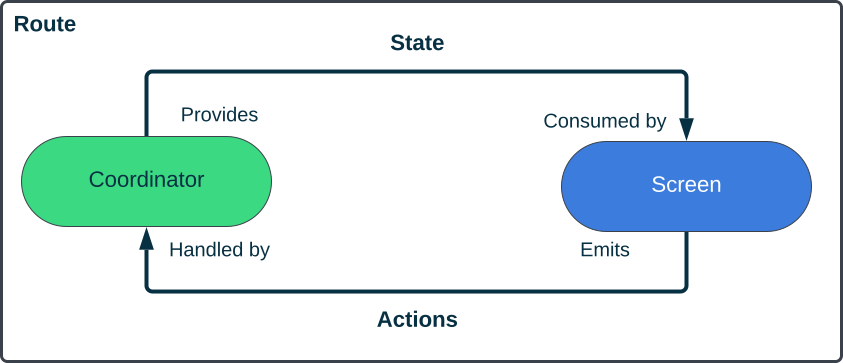

## Introduction

Jetpack Compose is by far the most exciting thing that has happened in my developer career. It has changed how I work and how I think about problems. It has introduced many exciting tools that are both easy to use and flexible, allowing you to do almost anything with ease.

I adopted Jetpack Compose early on for a project that was already in production, and I was immediately hooked. Even though I already had experience creating UI with Compose at that point, organizing and architecting my new and shiny Jetpack Compose-powered features introduced a lot of back and forth.

The goal of this article is to share the results of those findings, present an architecture that is scalable, easy to use and operate in, and, of course, collect feedback to make it even better.

> Disclaimer ⚠️:
This article will only deal with the UI side. The way the rest of the application is built will be left out, but you can assume it follows the classic Clean Architecture approach. I also assume that you are familiar with Jetpack Compose, as I will not dive deep into the specifics of UI implementation.

## Example
To provide a concrete example, let me introduce the guinea pig for this article going forward. The application, we are going to build allows the user to cycle through different Landmarks  and navigate to them. Here is a basic description of the flow:

1. Users can swipe through Place Cards and view different information about the Place, such as the Place's picture, name, and rating.
2. Users can mark/unmark the Place as a favorite.
3. Users can navigate and plan a route to the selected Place from their location. To do that, we will need the user's permission to collect their location.
4. If there is an error, we would like to show a toast.
5. The permission is only asked if the user chooses to plan the route. If the user declines the permission, we navigate to a different screen (Location Rationale Screen).
6. We also want to track user interactions with the Analytics service.

## Basics

The very first thing I remember learning about Jetpack Compose is this equation: `UI = f(state)`. This means that the UI is a result of a function applied to a certain state. Let's do a quick catch-up on the important aspects of Compose and Reactive UI in general, specifically regarding state handling: State Hoisting and Uni-Directional Data Flow.

### State Hoisting

State hoisting is a technique used in software development, particularly in UI programming, where the responsibility for managing and manipulating the state of a component is moved to a higher-level component or a more centralized location. The purpose of state hoisting is to improve code organization, reusability, and maintainability. You can learn more about state hoisting [here](https://developer.android.com/jetpack/compose/state).

### Uni-directional Data Flow

> A uni-directional data flow (UDF) is a design pattern where the state flows down, and events flow up. By following uni-directional data flow, you can decouple composables that display the state in the UI from the parts of your app that store and change the state.

The gist of it is that we want our UI components to consume the state and emit events. Having our components handle events that originated from outside breaks this rule, introducing multiple sources of truth. The important part is that any "event" we introduce should be based on the state.

## Getting Started
First, let us introduce core components, the bricks that will be the groundwork of our architecture.

### State
Let us start with the obvious thing first, the `State`
The `State` can be whatever makes sense to you and your use case. It can be a data class that has all the properties your UI might need or a sealed interface that represent all the possible scenarios. In any case, the `State` is a "static" representation of your component or entire Screen UI that you can easily manipulate. 

Based on our requirements, we have a list of Places and an optional error so our state could look like this
```kotlin
data class PlacesState(
    val places: List<Place> = emptyList(),
    val error: String? = null
)
```

### Screen
The `Screen` is the `f` function of our equation. To follow the state hoisting pattern, we need to make this component stateless and expose user interactions as callbacks. This will make our Screen testable, previewable, and reusable!

We already have the state, and based on our requirements, we have only two user interactions that we need to handle. So here is how our `Screen` could look like. We are also including other Composable states we might need, so they are hoisted outside of `Screen`.

```kotlin
@Composable
fun PlacesScreen(
    state: PlacesState,
    pagerState: PagerState,
    onFavoritesButtonClick: (Place) -> Unit,
    onNavigateToPlaceButtonClick: (Place) -> Unit
) {
    Scaffold {
        PlacesPager(
          pagerState = pagerState,
          state = state,
          onFavoritesButtonClick = onFavoritesButtonClick,
          onNavigateToPlaceButtonClick = onNavigateToPlaceButtonClick
        )
    }
}
```

### Route
Our last missing piece of the puzzle is the component that would handle these callbacks, provide state to `Screen` and emit it—introducing `Route`. `Route` is an entry point to our flow. Let's see how our version of `Route` would look like

```kotlin
@Composable
fun PlacesRoute(
    navController: NavController,
    viewModel: PlacesViewModel = hiltViewModel(),
) {
    // ... state collection

    LaunchedEffect(state.error) {
        state.error?.let {
            context.showError()
            viewModel.dismissError()
        }
    }

    PlacesScreen(
        state = uiState,
        onFavoritesButtonClick = //..
        onNavigateToPlaceClick = {
            when {
                permissionState.isGranted -> {
                    analyitcs.track("StartRoutePlanner")
                    navController.navigate("RoutePlanner")
                }
                permissionState.shouldShowRationale -> {
                     analytics.track("RationaleShown")
                     navController.navigate("LocationRationale")
                }
                else -> {
                    permissionState.launchPermissionRequest()
                }
            }
        }
    )
}
```

This is a very stripped version of the `PlacesRoute` function, and it is already quite big for what it is. With every new user interaction and state-based effects, this function will grow in size, making it harder to understand and maintain. Another issue is the callbacks. With every new user interaction, we will have to add another callback to the `PlacesScreen` declaration, and it can also become quite big.

On another note, let's think about testing. We can easily test the `Screen`, and the `ViewModel`, but what about the `Route`? It has a lot going on, and not everything can be easily mocked. For one, it is coupled with the `Screen`, so we won't be able to unit-test it properly without referencing it. Replacing other components with stubs will require us to move everything from into the `Route` declaration.


## Making changes
Let's try and address these problems we have identified so far

### Actions
The very first thing that to came to my mind looking at those callbacks is to group them somehow. And the very first thing I did  back in the day was this:
```kotlin
sealed interface PlacesAction {
    data class NavigateToButtonClicked(val place: Place) : ParcelAction
    data class FavoritesButtonClicked(val place: Place) : ParcelAction
}
```
While this allows us to group our actions into a well-defined structure, it brings different issues.

On the `Screen` level, we will have to instantiate the classes and invoke our `onAction` callback. If you are familiar with how Re-composition works when it comes down to lambdas, you might also have the urge to also surround it with `remember` to avoid unnecessary UI re-rendering
```kotlin
@Composable
fun PlacesScreen(
    state: PlacesState,
    onAction: (PlacesAction) -> Unit
) {
    PlacesPager(
        onFavoritesButtonClicked = { onAction(PlacesAction.FavoritesButtonClicked(it))}
    )
}
```
On the other side, the `Route` also introduces another thing that I didn't like that much—possibly giant `when` statements.

```kotlin
PlacesScreen(
        state = uiState,
        onAction = { when(it) {
        FavoritesButtonClick = //..
        NavigateToPlaceClicked = {
            when {
                permissionState.isGranted -> {
                    analyitcs.track("StartRoutePlanner")
                    navController.navigate("RoutePlanner")
                }
                permissionState.shouldShowRationale -> {
                     analytics.track("RationaleShown")
                     navController.navigate("LocationRationale")
                }
                else -> {
                    permissionState.launchPermissionRequest()
                }
            }
        }
    )
```

All this lead me to the solution which works way better, and it is a simple data class

```kotlin
data class ParcelActions(
    val onFavoritesClicked: (Place) -> Unit = {},
    val onNavigateToButtonClicked: (Place) -> Unit = {},
)
```
This allows us to introduce the same level and ease of grouping our `Actions` related to our `Screen` and a more simple way to pass these actions to the relevant components.

```kotlin
@Composable
fun PlacesScreen(
    state: PlacesState,
    actions: PlacesActions
) {
    PlacesPager(
        onFavoritesButtonClicked = actions.onFavoritesButtonClicked,
        onNavigateToPlaceButtonClicked = actions.onNavigateToPlaceButtonClicked
    )
}
```
Now, on the `Route` side, we can also avoid the `when` statements and introduce the following utility to not recreate the `Actions` class every re-composition, leaving the `Route` much more concise. 


```kotlin
@Composable
fun PlacesRoute(
    viewModel: PlacesViewModel,
    navController: NavController,
) {

    val uiState by viewModel.stateFlow.collectAsState()
   
    val actions = rememberPlacesActions(navController)


    LaunchedEffect(state.error) {
        state.error?.let {
            context.showError()
            viewModel.dismissError()
        }
    }

    PlacesScreen(
        state = uiState,
        actions = actions
    )

}

@Composable
fun rememberPlacesActions(
    navController: NavController,
    analytics: Analytics = LocalAnalytics.current,
    permissionState: PermissionState = rememberPermissionState(),
) : PlacesActions {
    return remember(permissionState, navController, analytics) {
        PlacesActsions(
            onNavigateToPlaceClick = {
            when {
                permissionState.isGranted -> {
                    analyitcs.track("RoutePlannerClicked")
                    navController.navigate("RoutePlanner")
                }
                permissionState.shouldShowRationale -> {
                     analytics.track("RationaleShown")
                     navController.navigate("LocationRationale")
                }
                else -> {
                    permissionState.launchPermissionRequest()
                }
            }
        }
        )
    }   
}
```

While the `PlacesRoute` is now more straightforward, all we did is moved all its Actions logic to another function, and it didn't improve either readability or scalability. Moreover, our second issue is still intact - state-based effects. Our UI logic is now also split, introducing inconsistencies, and we didn't make it any more testable. It is time we introduce one last component. 

### Coordinator
At its core, the `Coordinator,` as you might have guessed from its name, is here to coordinate different action handlers and state providers. The `Coordinator` observes and reacts to the state changes and handles user actions. You can think of it as Compose state of our flow. In our stripped example, the Coordinator would look like this.

Notice that since our `Coordinator` now is not inside a composable scope, we can everything in a more straightforward way, without the need for `LaunchedEffect`, just like we would normally do in our `ViewModel` except here our business logic here - is UI logic.

```kotlin
class PlacesCoordinator(
    val viewModel: PlacesViewModel,
    val navController: NavController,
    val context: Context,
    private val permissionState: PermissionState,
    private val scope: CoroutineScope
) {

    val stateFlow = viewModel.stateFlow

    init {
        // now we can observe our state and react to it
        stateFlow.errorFlow
            .onEach { error ->
                context.toast(error.message)
                viewModel.dismissError()
            }.launchIn(scope)
    }

    // and handle actions
    fun navigateToRoutePlanner() {
        when {
            permissionState.isGranted -> {
                viewModel.trackRoutePlannerEvent()
                navController.navigate("RoutePlanner")
            }
            permissionState.shouldShowRationale -> {
                viewModel.trackRationaleEvent()
                navController.navigate("LocationRationale")
            }
            else -> permissionState.launchPermissionRequest()
        }
    }

}
```

This allows us to modify our Actions utility
```kotlin
@Composable
fun rememberPlacesActions(
   coordinator: PlacesCoordinator
) : PlacesActions {
    return remember(coordinator: PlacesCoordinator) {
        PlacesActsions(
            onFavoritesButtonClicked = coordinator.viewModel::toggleFavorites,
            onNavigateToPlaceButtonClicked = coordinator::navigateToRoutePlanner
        )
}
```

And our `Route`

```kotlin
@Composable
fun PlacesRoute(
    coordinator: PlacesCoordinator = rememberPlacesCoordinator()
) {

    val uiState by coordinator.stateFlow.collectAsState()
   
    val actions = rememberPlacesActions(coordinator)

    PlacesScreen(
        state = uiState,
        actions = actions
    )

}
```

In our example, the `PlacesCoordinator` is now responsible for UI Logic happening in our feature flow. Since it knows about different states, we can easily react to state changes and build conditional logic for every user interaction. In case the interaction is straightforward, we can easily delegate it to the relevant component, such as `ViewModel`.


Another thing that we can do by having the Coordinator is to control which state is exposed to the Screen. In case we have multiple `ViewModels` or `ViewModel` state that is too big for the `Screen` that we are dealing with, we can either combine these states or expose a partial state.

```kotlin
    val screenStateFlow = viewModel.stateFlow.map { PartialScreenState() }
    // or
    val screenStateFlow = combine(vm1.stateFlow, vm2.stateFlow) { ScreenStateFlow() }
```

Another bonus, the entire flow UI logic is now decoupled from the `Route`, meaning we can use our `Coordinator` as part of another Route without duplicating the important stuff and keeping the `Screen` part state-less. 

```kotlin
@Composable
fun TwoPanePlacesRoute(
    detailsCoordinator: PlacesDetailsCoordinator,
    placesCoordinator: PlacesCoordinator
) {
    
    TwoPane(
        first = {
            PlacesScreen(
                state = placesCoordinator.state,
                actions = rememberPlacesActions(placesCoordinator)
            )
        },
        second = {
            PlaceDetailsScreen(
                state = detailsCoordinator. state,
                actions = rememberDetailsActions(detailsCoordinator)
            )
        }
    )
}
```

And finally, now we can test our UI logic by testing the component that implements it. Let us see how we can test our Coordinator by using our navigate to Rationale Screen when permission was denied as the example.

> ⚠️ This part assumes that you have some knowledge of how to test Composable components. 

```kotlin
/**
 * GIVEN
 * - Permission was denied previously
 * WHEN
 * - Navigate Button Clicked
 * THEN
 * - Current destination is "locationRationale"
 */
fun test_NavigateToRatinoleIfPermissionWasDeniedBefore() {
     composeRule.setContent {
            // 1
            ComposableUnderTest(
                coordinator = rememberPlacesCoordinator(
                    navController = testNavController,
                    viewModel = NearbyPlacesViewModel()
                )
            )
        }
        
        // 2
        composeRule.onNode(hasText("Navigate")).performClick()

        // 3
        Assert.assertEquals(
            "locationRationale",
            navController.currentBackStackEntry?.destination?.route
        )
}
```

Let's quickly walk through this test.

1. First, we emit the Composable UI that we use as our test subject. This  UI has a simple structure and directly calls our `Coordinator`.
```kotlin
 @Composable
private fun ComposableUnderTest(coordinator: NearbyPlacesCoordinator) {
    NavHost(
        navController = coordinator.navController,
        startDestination = "home"
    ) {
        composable("home") {
            Button(onClick = { coordinator.navigateToPlace(Place.Mock) }) {
                Text(text = "Navigate")                
            }
         }
        composable("locationRationale") {
            Text(text = "No permission")
        }
    }
}
 ```
2. Then, we programmatically click the "Navigate" button to trigger the action and let the `Coordinator` handle it.
3. Finally, we check that our assumption is valid and our implementation is working by checking that the current destination in our `NavHostController` is the one we expect

And that's it. Let us summarize the things we refactored and what we achieved.

1. Our `Screen` remains completely state-less. It only relies on whatever is being passed as the function parameter. All the user interactions are exposed via `Actions` for the other components to handle.
2. The `Route` now serves as a simple entry point in our Navigation Graph. It collects the state, remembers our Actions across re-compositions
3. The `Coordinator` is now doing most of the heavy lifting: reacting to state changes and delegating user interactions to other relevant components. It is completely decoupled from our `Screen` and `Route` and can be reused in another `Route` and tested separately

The following diagram demonstrates the flow of data we now have




## Questions and answers
This section contains some questions I've been asked a lot when presenting this approach. So I might as well give some answers right here in case you have been wondering the same thing while reading this article.

### Does every Composable Screen needs a Coordinator?
The short answer: it depends! For a very simple flow, let's say a Dialog with two Actions. It might be an overkill. And you might as well drop the `Actions` data class altogether and handle these actions in your `Route`. For a screen that can grow in complexity over time, I would say it is worth investing in having it from the start or starting refactoring when you see that your `Route` grows. 

### Is `LaunchedEffect` "Deprecated"?
Of course, it is not! Again, a simple screen without `Coordinator` might as well use the `LaunchedEffect` to react to state changes, and it is completely fine. And you still can use `LaunchedEffect` in your `Screen` when the UI logic lives and dies in the `Screen` layer, for example, animations.

### The `Route` doesn't do much
Yes, in our example, the `Route` is pretty lightweight in terms of responsibilities. But having it as a navigation entry point means much more. A lot of effects that are not state-based belong to the `Route` to handle. For example, we can use `SideEffect` to adjust the color or put a `BackHandler` to intercept back button presses which would not always makes sense inside the `Screen`.

### Won't the `Coordinator` grow over time in the same way the `Route` would?
Most probably, yes. And that's probably a sign that it is doing too much, and some of the things can be extracted into another stateful component or even another coordinator. In the same way, you extract different UI components from your Screen that encapsulate some piece of UI; you can build other components or coordinators that would encapsulate UI logic.


## Additional Resources

### IDE Plugin
If you think that there are a lot of files in this approach, I've got you covered! Please check [Jetpack Compose UI Architecture IDE Plugin](https://plugins.jetbrains.com/plugin/19034-jetpack-compose-ui-architecture-templates)

This plugin has been published a while back, and there is a chance you are using it already. If you are, I thank you, and I hope now you have more context about how each component works. If not, it will be a nice place to get started. Either way, I hope both this article and the plugin will help you in your dev routine.

### Documentation and Best Practices
I was not able to cover everything in this article, so there are also [GitHub Pages](https://levinzonr.github.io/compose-ui-arch-docs/) available where you can learn more about the presented approach. I'm planning to update these alongside the IDE plugin to accommodate any feedback that will come my way.


## Afterword
Thank you for reading this article, and I hope it has sparked your interest in the proposed solution. As I shared my thought process that started a few years ago, it was an enjoyable experience to recreate and reflect upon the journey.


_ Article Photo by [Pierre Châtel-Innocenti](https://unsplash.com/@chatelp?utm_source=unsplash&utm_medium=referral&utm_content=creditCopyText) on [Unsplash](https://unsplash.com/photos/3JASCX85G_w?utm_source=unsplash&utm_medium=referral&utm_content=creditCopyText)
