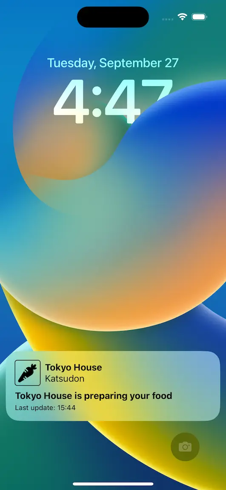
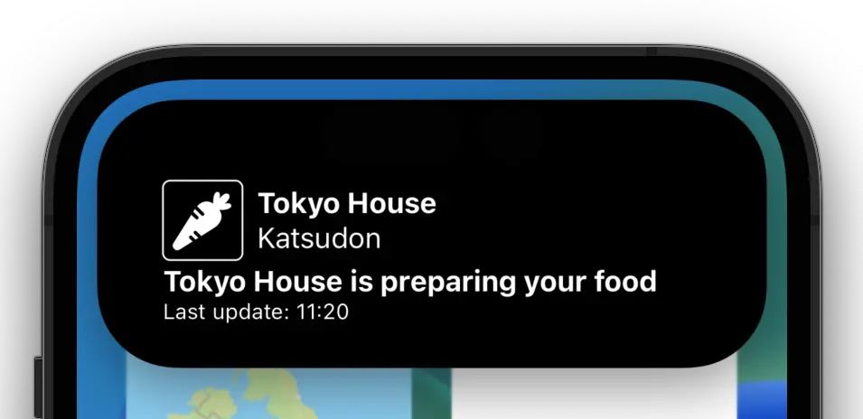
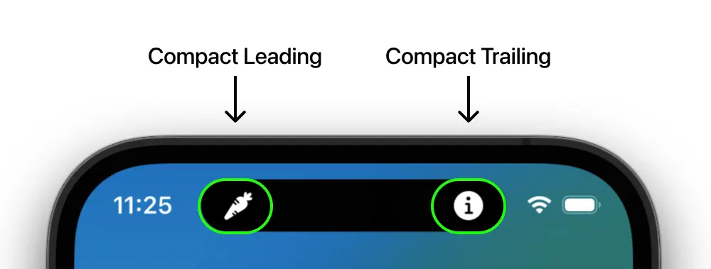
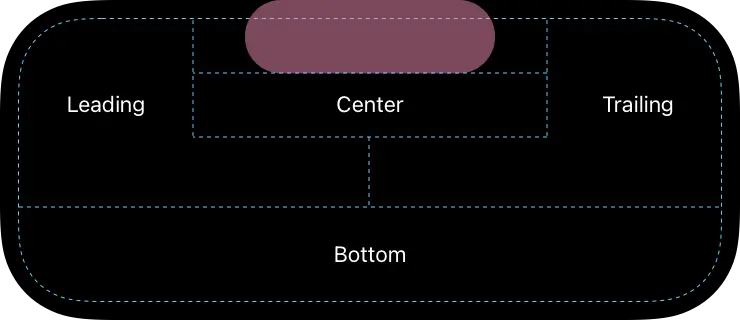

Live Activities were introduced in iOS 16.1 as a way to display up-to-date information on the iPhone Lock screen and in the Dynamic Island. In this article, we're going to explore the Live Activity API by implementing a fake Delivery App where the user will receive updates of their order right on their phone's Lock Screen. This feature is still in beta at the time of writing this article. For more details check out the [Official Documentation](https://developer.apple.com/documentation/activitykit/displaying-live-data-with-live-activities).

So, let's get started!

## Step 1: Add Live Activities support

In the Info.plist of the main target add the following key **`NSSupportsLiveActivities`** with its value set to **`YES`**.

## Step 2: Implement Activity Attributes

We first need to create the model that will be used to update the interface of the Live Activity and Dynamic Island.

```swift
enum FoodDeliveryState: String, Codable {
    case processing
    case prepping
    case delivering
    case completed
}

struct FoodDeliveryAttributes: ActivityAttributes {
    typealias DeliveryState = ContentState

    public struct ContentState: Codable, Hashable {
        public var timestamp: TimeInterval
        public var message: String?
        public var courier: String
        public var deliveryState: FoodDeliveryState
    }

    public var orderName: String
    public var restaurant: String
}
```

All fields declared in **`FoodDeliveryAttributes`** are static, which means they'll remain the same once we start the Live Activity. In contrast, the fields in **`FoodDeliveryAttributes.ContentState`** may be updated while the Activity is running.

**`ContentState`** must conform to _Codable_ as Activities can be updated using remote push notifications where the content state is passed as JSON. More on that later.

## Step 3: Create the UI

Live activities use WidgetKit and SwiftUI for their user interface. Our UI will look like this:


Figure: Figure 1. Live Activity UI

```swift
struct FoodDeliveryWidgetView {
    @State var staticData: FoodDeliveryAttributes
    @State var dynamicData: FoodDeliveryAttributes.DeliveryState
    var isCompact: Bool = false

    private var timestampFormatted: String {
        let timestampDate = Date(timeIntervalSince1970: dynamicData.timestamp)
        let formattedDate = Self.hourMinute.string(from: timestampDate)

        return "Last update: \(formattedDate)"
    }

    private var infoText: String? {
        if let message = dynamicData.message {
            let msg = message.replacingOccurrences(
                of: "[COURIER]",
                with: dynamicData.courier)

            return "ⓘ \(msg)"
        } else {
            return nil
        }
    }

    private var deliveryState: String {
        switch dynamicData.deliveryState {
        case .processing:
            return "Processing order"
        case .prepping:
            return "\(staticData.restaurant) is preparing your food"
        case .delivering:
            return "\(dynamicData.courier) is on their way"
        case .completed:
            return "Your food has been delivered"
        }
    }

    private static let hourMinute: DateFormatter = {
        let formatter = DateFormatter()
        formatter.dateFormat = "HH:mm"
        return formatter
    }()
}

extension FoodDeliveryWidgetView: View {
    var body: some View {
        VStack(alignment: .leading, spacing: 0) {
            if let infoText {
                Text(infoText)
                    .textStyle(.body)
                    .frame(maxWidth: .infinity)
                    .padding(.bottom, isCompact ? 0 : 6)
            }

            HStack {
                RoundedRectangle(cornerRadius: 4)
                    .stroke(lineWidth: 1)
                    .frame(width: 44, height: 44, alignment: .center)
                    .overlay {
                        dynamicData.deliveryState.image
                            .resizable()
                            .scaledToFit()
                            .padding(5)
                    }

                VStack(alignment: .leading) {
                    Text(staticData.restaurant)
                        .textStyle(.title)
                    Text(staticData.orderName)
                        .textStyle(.body)
                }

                Spacer()
            }

            Text(deliveryState)
                .textStyle(.title)
                .padding(.top, isCompact ? 2 : 8)

            Text(timestampFormatted)
                .textStyle(.caption)
        }
        .frame(maxWidth: .infinity)
        .padding(.horizontal, 16)
        .padding(.vertical, isCompact ? 8 : 16)
    }
}
```

This is the main UI for our Live Activity and Dynamic Island when expanded. The reason we have the **`isCompact`** flag is to allow us to use the same view for the Live Activity, as well as the Dynamic Island despite Live Activities having more vertical real estate available to them than the Dynamic Island.

## Step 4: Create the Widget

Creating a Widget is pretty straightforward. If we just want to create a Live Activity we only need to do:

```swift
@main
struct FoodDeliveryLiveActivity: Widget {
    let kind: String = "FoodDeliveryWidget"

    var body: some WidgetConfiguration {
        ActivityConfiguration(for: FoodDeliveryAttributes.self) { context in
            // Lock Screen view
        } dynamicIsland: { context in
            DynamicIsland {
                // Dynamic Island Expanded view
            } compactLeading: {
                // Dynamic Island compact leading view
            } compactTrailing: {
                // Dynamic Island compact trailing view
            } minimal: {
                // Dynamic Island minimal view
            }
        }
    }
}

```

However, if we already have a Widget or want to provide one alongside our Live Activity we must create a **WidgetBundle** to _bundle_ our Widget and our LiveActivity together, provided that the user is on iOS 16.1+.

```swift
@main
struct FoodDeliveryWidgetBundle: WidgetBundle {
    var body: some Widget {
        FoodDeliveryWidget()

        if #available(iOS 16.1, *) {
            FoodDeliveryLiveActivity()
        }
    }
}
```

Next, we create the view for the Live Activity and the views for the Dynamic Island. In our example, we've used the same view as our Live Activity for our expanded Dynamic Island bottom view.


Figure: Figure 2. Dynamic Island in expanded mode

```swift
struct FoodDeliveryWidget: Widget {
    var body: some WidgetConfiguration {
        // Here is where you'd implement your Timeline based Widget
        EmptyWidgetConfiguration()
    }
}

struct FoodDeliveryLiveActivity: Widget {
    let kind: String = "FoodDeliveryWidget"

    var body: some WidgetConfiguration {
        ActivityConfiguration(for: FoodDeliveryAttributes.self) { context in
            // 1 - Live Activity View
            FoodDeliveryWidgetView(
                staticData: context.attributes,
                dynamicData: context.state)
        } dynamicIsland: { context in
            // 2 - Dynamic Island view
            DynamicIsland {
                // 2.1 - Expanded view
                DynamicIslandExpandedRegion(.bottom) {
                    FoodDeliveryWidgetView(
                        staticData: context.attributes,
                        dynamicData: context.state,
                        isCompact: true)
                }
            } compactLeading: {
                // 2.2 - Compact leading view
                context.state.deliveryState.image
                    .resizable()
                    .scaledToFit()
                    .foregroundColor(.white)
                    .padding(8)
            } compactTrailing: {
                // 2.3 - Compact trailing view
                if context.state.message != nil {
                    Image(systemName: "info.circle.fill")
                        .resizable()
                        .scaledToFit()
                        .foregroundColor(.white)
                        .padding(8)
                }
            } minimal: {
                // Empty view
            }
        }
    }
}

```

In the compact leading position, we display the state of the delivery and in the compact trailing position, we show ⓘ to alert the user that there's a message.


Figure: Figure 3. Dynamic Island in compact mode

Here is how all possible regions are defined.


Figure: Figure 4. Taken from Apple Developer docs.

## Step 4: Start the Live Activity

Live Activities can only be started when the app is in the foreground but can be updated and terminated in the background using ActivityKit or remote push notifications. First, let's look how we manage the state of Live Activities using ActivityKit. For that intent, let's create a helper class so that we can start, update and end Live Activities.

**Note:** It is possible to have multiple Live Activities of the same type running, but to keep things simple, in our example we will only have 1.

```swift
public enum LiveActivityControllerError: Error {
    case liveActivitiesNotSupported
}

public class LiveActivityController<Attributes: ActivityAttributes>: ObservableObject {
    @Published public private(set) var isRunning: Bool
    public weak var delegate: LiveActivityManagerDelegate?
    public var onPushTokenUpdate: (Data) -> Void = { data in
        print("Push token: \(data.hexFormatted)")
    }

    private var activitySubject = CurrentValueSubject<Activity<Attributes>?, Never>(nil)
    private var tokenUpdatesTask: Task<Void, Error>?
    private var subscriptions = Set<AnyCancellable>()
    private var activity: Activity<Attributes>? {
        get { return activitySubject.value }
        set { activitySubject.value = newValue }
    }

    public init() {
        // Resume running Live Activity if present
        let runningActivity = Activity<Attributes>.activities.first
        isRunning = runningActivity != nil

        // Update isRunning publisher depending on the state of the activity subject
        activitySubject
            .map { $0 != nil }
            .receive(on: DispatchQueue.main)
            .sink { [weak self] isRunning in
                self?.isRunning = isRunning
            }
            .store(in: &subscriptions)

        activity = runningActivity
    }

    public func start(
        staticData: Attributes,
        contentState: Attributes.ContentState
    ) async throws {
        // 1. Check if device supports Live Activities and that they are enabled
        guard ActivityAuthorizationInfo().areActivitiesEnabled else {
            throw LiveActivityControllerError.liveActivitiesNotSupported
        }

        // 2. Cancel running activities of type `Attributes`
        for activity in Activity<Attributes>.activities {
            await activity.end(using: nil, dismissalPolicy: .immediate)
        }

        // 3. Create Activity
        activity = try Activity<Attributes>.request(
            attributes: staticData,
            contentState: contentState,
            pushType: .token)

        // 4. Listen to push token updates
        tokenUpdatesTask?.cancel()
        tokenUpdatesTask = Task.detached {
            for await tokenData in self.activity!.pushTokenUpdates {
                self.onPushTokenUpdate(tokenData)
                self.delegate?.tokenUpdated(tokenData)
            }
        }

        print("Started activity with ID: \(activity!.id)")
    }

    public func update(
        _ contentState: Attributes.ContentState,
        alertConfiguration: AlertConfiguration? = nil
    ) async {
        await activity?.update(using: contentState, alertConfiguration: alertConfiguration)
    }

    public func end(
        _ contentState: Attributes.ContentState,
        dismissalPolicy: ActivityUIDismissalPolicy = .default
    ) async {
        await activity?.end(using: contentState, dismissalPolicy: dismissalPolicy)

        self.activity = nil
    }
}
```

In order to start our Activity, we call **`start`** with its static and initial content state as parameters.

## Step 5: Update the Live Activity with ActivityKit

Updating Live Activities with ActivityKit is easy, just like **`start`**, we call **`update`** with the desired changes.

```swift
let contentState = FoodDeliveryAttributes.DeliveryState(
    timestamp: Date().timeIntervalSince1970,
    message: nil,
    courier: "John",
    deliveryState: .prepping)

await activityController.update(contentState)
```

## Step 6: Update Live Activity with remote Push Notifications

First we need to add `Push Notifications` to our supported capabilities and second we need to register for remote notifications.

```swift
class AppDelegate: NSObject, UIApplicationDelegate {
    func application(
        _ application: UIApplication,
        didFinishLaunchingWithOptions launchOptions: [UIApplication.LaunchOptionsKey : Any]? = nil
    ) -> Bool {
        UIApplication.shared.registerForRemoteNotifications()

        return true
    }
}
```

Once we have push notification set up we can send notifications using APNS (Apple Push Notification Service) API. Here's a modified script taken from [Apple's Documentation](https://developer.apple.com/documentation/usernotifications/sending_push_notifications_using_command-line_tools).

```shellscript
#!/usr/bin/env bash

ENVIRONMENT=dev # (dev|prod)

TEAM_ID="<Team ID>"
TOKEN_KEY_FILE_NAME="<Path to your private AuthKey .p8 file>"
AUTH_KEY_ID="<Auth Key ID>"
TOPIC="<Main Target Bundle ID>.push-type.liveactivity"
DEVICE_TOKEN="<Push token returned from pushTokenUpdates>"

# Set host name
if [ "$ENVIRONMENT" = "dev" ]; then
    APNS_HOST_NAME=api.sandbox.push.apple.com
else
    APNS_HOST_NAME=api.push.apple.com
fi

JWT_ISSUE_TIME=$(date +%s)
JWT_HEADER=$(printf '{ "alg": "ES256", "kid": "%s" }' "${AUTH_KEY_ID}" | openssl base64 -e -A | tr -- '+/' '-_' | tr -d =)
JWT_CLAIMS=$(printf '{ "iss": "%s", "iat": %d }' "${TEAM_ID}" "${JWT_ISSUE_TIME}" | openssl base64 -e -A | tr -- '+/' '-_' | tr -d =)
JWT_HEADER_CLAIMS="${JWT_HEADER}.${JWT_CLAIMS}"
JWT_SIGNED_HEADER_CLAIMS=$(printf "${JWT_HEADER_CLAIMS}" | openssl dgst -binary -sha256 -sign "${TOKEN_KEY_FILE_NAME}" | openssl base64 -e -A | tr -- '+/' '-_' | tr -d =)
AUTHENTICATION_TOKEN="${JWT_HEADER}.${JWT_CLAIMS}.${JWT_SIGNED_HEADER_CLAIMS}"

PAYLOAD=$(cat <<-END
    {
        "aps": {
            "timestamp": ${JWT_ISSUE_TIME},
            "event": "update",
            "content-state": {
                "timestamp": ${JWT_ISSUE_TIME},
                "message": null,
                "courier": "Daniel",
                "deliveryState": "prepping"
            }
        }
    }
END
)

curl -v \
    --header "apns-topic: $TOPIC" \
    --header "apns-push-type: liveactivity" \
    --header "authorization: bearer $AUTHENTICATION_TOKEN" \
    --data "${PAYLOAD}" \
    --http2 https://${APNS_HOST_NAME}/3/device/${DEVICE_TOKEN}
```

The most important part of this script is the payload. You must have an **`event`** field which has 2 possible values, **`update`** and **`end`**. It does exactly what it says on the tin, **`update`** refreshes the state of the Activity with the data passed in **`content-state`** and **`end`** terminates the Activity. The Activity stays on the Lock Screen for about 4 hours.

**Important:** The schema of ContentState must match the one used by the ActivityKit, in this case, **`FoodDeliveryAttributes.ContentState`**.

## Step 7: End the Activity

Activities can be terminated by either calling ActivityKit's `end` method

```swift
let contentState = FoodDeliveryAttributes.DeliveryState(
    timestamp: Date().timeIntervalSince1970,
    message: nil,
    courier: "John",
    deliveryState: .completed)

await activityController.end(contentState)
```

or, as mentioned above, by sending a remote push notification with **`event`** set to **`end`**.

When using ActivityKit, we can specify precisely when we want the Live Activity to be dismissed. We can choose among 3 dismissal policies.

| Dismissal Policy | When is the Activity dismissed from Lock Screen |
| ---------------- | ----------------------------------------------- |
| **.default**     | After up to 4 hours                             |
| **.immediate**   | Immediately removed                             |
| **.after(Date)** | At a specified Date within the next 4 hours     |

## Conclusion

It should now be clear how Live Activities and the Dynamic Island may be used to keep your users
up-to-date. We didn't do it here but, like Widgets, Live Activities also support **`Links`**, which means, we could've added a _Contact The Driver_ **`Link`** to our Live Activity and whenever the user tapped it we'd start a phone call or send an SMS. Another thing to explore in the future is using Background Tasks to update the Activity.

There you have it! We hope you enjoyed our walk-through of Live Activities.

### Related Articles

- [Official Documentation](https://developer.apple.com/documentation/activitykit/displaying-live-data-with-live-activities)
- [Developing with Live Activities API in iOS 16](https://blog.appcircle.io/article/live-activities-in-ios16)
