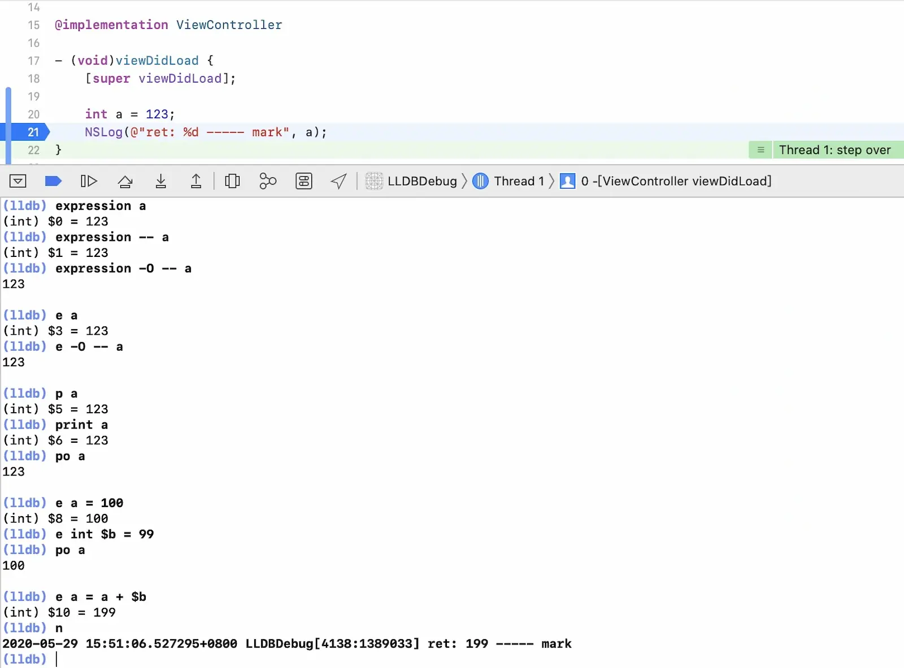
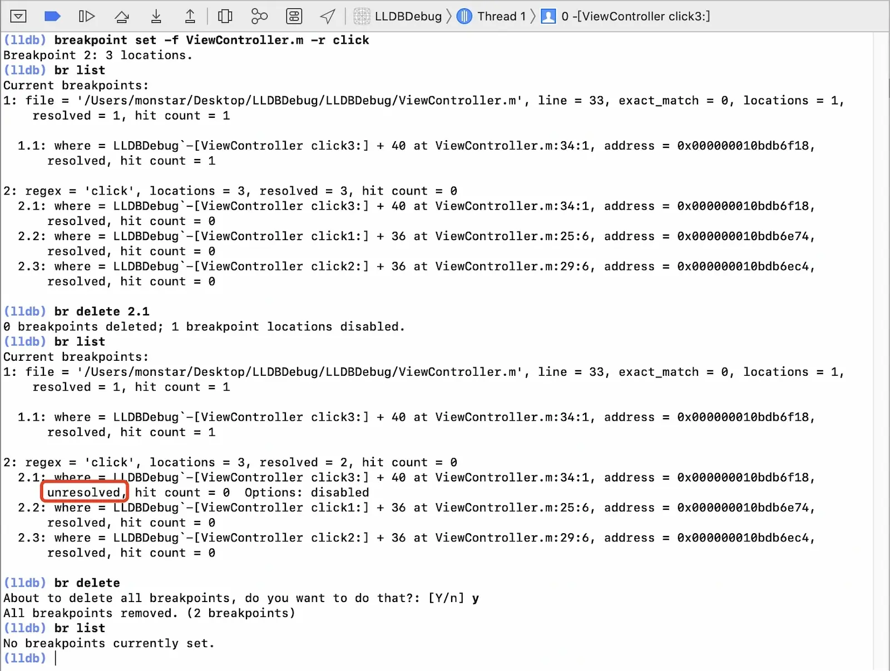
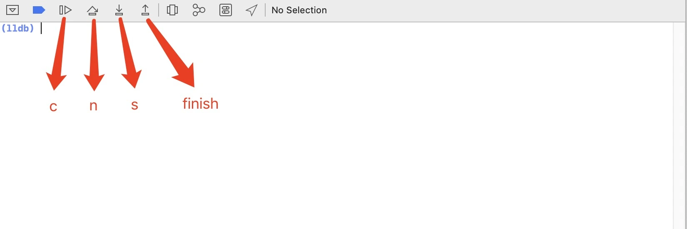
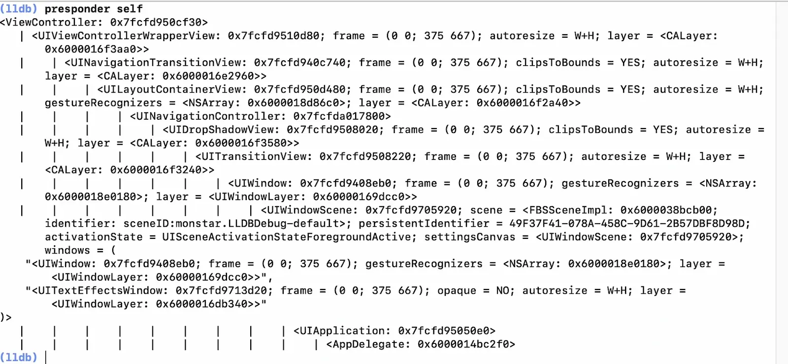

LLDB，Low Level Debugger, is a lightweight, high-performance debugger that is built into Xcode by default. Being able to use it well will make our development more efficient with less effort.

We often use LLDB's `po` / `breakpoint` in development, you can get a lot done with only those two tools. But this is just a small part of LLDB.

This article introduces the basis of LLDB and also shows how we can make it even more powerful by using an extension of LLDB.

## LLDB basis

### `p`, `po`, `print`, `expression`

Let's start by introducing the relationship between these common commands.

`expression` is described as follows:

Evaluate an expression on the current thread. Displays any returned value with LLDB's default formatting.

It can be abbreviated as `e`.



We can see that `expression` has the following main functions:

1. Print information about object.
2. The statement execution, such as: `expression a = 100`, same here, you can try `expression self.view.layer.backgroundColor = [UIColor redColor].cgColor`, also can change the background color(Use `expression -- (void)[CATransaction flush]` to refresh UI).
3. Define and use the LLDB variable through the `$`, such as: `expression int $b = 99`.


Maybe `p` is too easy to associate with `print`, many people will think that `p` is the abbreviation of `print`, and `po` is short for `print object`, but it is not.

`p` and `print` are both short for `expression --`，as can be viewed using the `help` command.


`po` is also not short for `print object` (There are no commands named `print object`), it's an abbreviation for `expression -O --`. `expression -O --` means the description of an object, which print the description of a variable.


Therefore, select the appropriate print command as needed in the actual development.

When printing the value of the variable, we can also use `print/< FMT >` or the simplified `p/< FMT >` to specify the print format, such as printing hexadecimal:


`x` stands for hexadecimal format and `t` for binary format. For other format types, click [here](https://sourceware.org/gdb/onlinedocs/gdb/Output-Formats.html).

### `breakpoint`

The parameters commonly used to set breakpoints and their meanings are as follows:

| Short | Full         | Meaning         |
| ----- | ------------ | --------------- |
| -f    | --file       | The file name   |
| -l    | --line       | Line number     |
| -n    | --name       | The method name |
| -S    | --selector   | SEL             |
| -r    | --func-regex | Methods regular |

For example：

- Set a breakpoint at line 28 of the `ViewController.m`.

  `breakpoint set -f ViewController.m -l 28`

- Set a breakpoint for method `click1:`.

  `breakpoint set -n click1:`

- Set breakpoints for SEL's `click2:`.

  `breakpoint set -S click2:`

- breakpoints where click is included.

  `breakpoint set -r click`

- Set a breakpoint where the click is included in the `ViewController.m`.

  `breakpoint set -f ViewController.m -r click`

  `breakpoint set` can be written as `b`.

- View all current breakpoints

  `breakpoint list // short: br list`

- Set the breakpoint enable/disable/delete

  `br enable 2.1`

  `br disable 2.1`

  `br delete 2.1` (Because of that a single breakpoint in a breakpoint group cannot be deleted separately. Just disable the first breakpoint of the second breakpoint group.)

  `br delete 2` (Delete the second breakpoint group.)



## Other common commands for LLDB

#### `image list`

The word "image" here does not mean a picture.
It can be understood that each MachO is an image, the main program is an image, and each dynamic library linked by the main program is an image.

The image list is to print out all the image information in the App, and the address of each image information is the first address of this image in memory, namely the ASLR of this image.

#### `bt`

To view the function stack.

Example:

```objective-c
- (IBAction)click1:(id)sender {
    [self click2:sender];
}

- (void)click2:(id)sender {
    [self click3:sender];
}

- (void)click3:(id)sender {
    NSLog(@"Set a breakpoint here");
}
```

Enter `bt` to see the call relationship between functions.

Use frame `select [stack number]` to view the details of the stack, including the memory address of the caller, the method called, the memory address of the parameters, and so on.


You can also use the `up` and `down` commands to see information about adjacent call stacks.


#### `c`, `n`, `s`, `finish`



- `c`

Which means continue.

Cancels the suspension of the program, allowing the program to execute normally (either all the way down or at the next breakpoint).

We can also use the `process continue` or `continue` command in LLDB.

- `n`

Which means step over.

Execute a line of code as a black box. If this line of code is a function call, instead of jumping into the function, it will execute the function and continue.

We can also use the `thread step-over` or `next` command.

- `s`

Which means step into.

If we want to jump into a function call to debug or check the program's execution. When the current line is not a function call, the `n` and `s` effects are the same.

We can also use the `thread step-in` or `step` command.

- `finish`

Which means step out.

If we've ever accidentally jumped into a function and you actually want to skip it, the common reaction is to repeatedly run `n` until the function returns. In this case, the step out continues to the next return statement (until a stack frame ends) and then stops again.

We can also use the `thread step-out` command.

## LLDB extension

All of the above are the functions of LLDB that come with Xcode.

Next is the use of plugins to extend LLDB to make it simpler and more powerful.

#### Chisel

Chisel is a collection of LLDB commands to assist in the debugging of iOS apps.

Install Chisel using homebrew:

```
brew update
brew install chisel
```

If `.lldbinit` file doesn't exist you can create it and open it from the terminal.

```
touch .lldbinit
open .lldbinit
```

Then add the following line to your `~/.lldbinit` file.

```
# ~/.lldbinit
...
command script import /usr/local/Cellar/chisel/2.0.0/libexec/fblldb.py
```

Alternatively, download Chisel and add the following line to your `~/.lldbinit` file.

```
# ~/.lldbinit
...
command script import /path/to/fbchisellldb.py
```

The commands will be available the next time `Xcode` starts.

Let's try out some of Chisel's extensions to LLDB.

- **pviews**

Recursively retrieves all view class objects and prints them out according to the view hierarchy.


- **pvc**

Prints all current controller objects and hierarchical relationships.

Let's try to jump to `NextViewController` when we click on the screen blank.

```objective-c
-(void)touchesBegan:(NSSet<UITouch *> *)touches withEvent:(nullable UIEvent *)event {
    NSLog(@"Move to another viewcontroller here");
    NextViewController *nextVC = [[NextViewController alloc] init];
    [self.navigationController pushViewController:nextVC animated:YES];
}
```


- **caflush**

To refresh the UI, we may change the layout of the UI controls during debugging, and then directly use the caflush to refresh.

It is the same as `expression -- (void)[CATransaction flush]`

- **fv** & **fvc**

Find a view/view controller in the hierarchy whose class name matches the provided regex.


- **taplog**

Input taplog, and you'll see that the program is working. Click on any button, and it will print out the information about the button you clicked.


This is very helpful for reverse debugging, locating directly to the memory address of the control you clicked on. With the memory address, you can do a lot of things.

- **presponder**

Print out the responder response chain.



- **pclass**

Prints the inheritance relationship of the class to which the object belongs.


- **pactions**

Find the actions for the button response directly from the memory address of the button.


- **pmethods**

Print the class and instance methods of a class. Similar to `class-dump`.


- **flicker**

Let the control corresponding to the memory address flash on the phone.

- **vs**

Make the memory address corresponding to the control to translucent red, and enter edit mode, use

- w: Navigate to the parent view of the current view.
- s: Navigate to the first subview of the current view.
- a: Navigate to the previous sibling view of the current view.
- d: Navigate to the next sibling of the current view.
- p: Prints the information of the view located.
- q: Quit edit mode.


In addition, more functions can be referred to:

[https://github.com/facebook/chisel](https://github.com/facebook/chisel)
