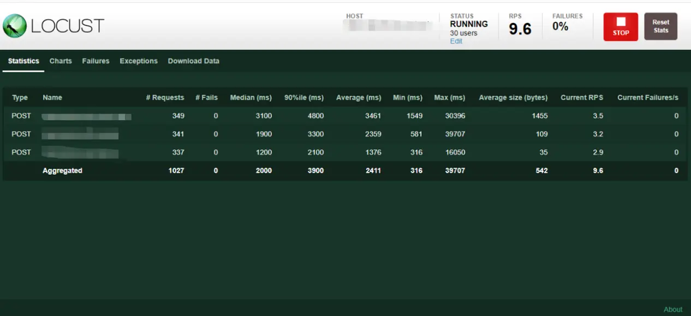
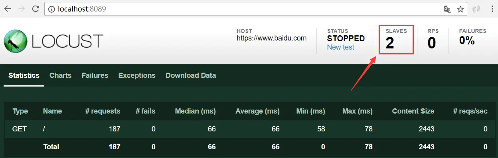

[Locust](https://locust.io/) is an easy-to-use distributed load testing tool that is completely event-based, that is, a locust node can also support thousands of concurrent users in a process, without callbacks, and use a lightweight process through `gevent` (that is, in Run in its own process). And has the following characteristics:

- No need to write cumbersome UI or bloated XML code, based on coroutine instead of callback, script writing is simple and easy to read;
- There is a simple Web UI user interface that can display relevant test results in real time;
- Support distributed testing, the user interface is based on the network, so it has the characteristics of cross-platform and easy to expand;
- All cumbersome I/O and co-programs are entrusted to `gevent` to replace the limitations of other tools;

### Comparison

|                                       | LoadRunner         | JMeter               | Locust                             |
| ------------------------------------- | ------------------ | -------------------- | :--------------------------------- |
| Cost                                  | Commercial charges | Free and open source | Free and open source               |
| Language                              | C/Java             | GUI                  | Python                             |
| Concurrency mechanism                 | Thread / process   | Thread               | Coroutine                          |
| Single machine concurrency capability | Low                | Low                  | High                               |
| Distributed stress test               | Support            | Support              | Support                            |
| Reporting and analysis                | Perfect            | Simple chart         | Simple chart（Inferior to JMeter） |
| Secondary development                 | Not Supported      | Support              | Support                            |

### Script introduction

##### Scripting:

```python
from locust import HttpLocust, TaskSet, task, between
class Test(TaskSet):
    def on_start(self):
        # Construct request body and request header
        signup_data = {'account': 'test@test.com',
                       'password': '123456',
                       'password_confirm': '123456',
                       }
        signup_header = {"Authorization": r"Bearer tester",
                         "Content-Type": "application/x-www-form-urlencoded"}
        # send signup request
        self.client.post('/api/test/testForSignup',
                         data=signup_data,
                         headers=signup_header,
                         catch_response=True)
    @task(1)
    def get_timeline_page(self):
        # Construct request header
        get_header = {"Authorization": r"Bearer tester",
                      "Accept-Language": r"test"}
        # send get request
        timeline_page_response = self.client.get('/api/test/timelinePage',
                                                 headers=get_header)
        # print response
        print(timeline_page_response.status_code)
    @task(2)
    def get_mypage(self):
        get_header = {"Authorization": r"Bearer tester",
                      "Accept-Language": r"test"}
        mypage_response = self.client.get("/api/test/mypage",
                                          headers=get_header)
        print(mypage_response.status_code)
class WebSiteUser(HttpLocust):
    task_set = Test
    wait_time = between(1, 3)
    host = 'https://test.net'
```

As shown in the code above, we simulated three requests for API access. After executing the "sign-up" request first, "my-page" or "get_timeline_page" will be randomly executed at a ratio of 2:1.

**So, how does the above Python script express the above test scenario?**
As can be seen from the script, it mainly contains two classes, one is `WebSiteUser` (inherited from `HttpLocust`, and `HttpLocust` is inherited from `Locust`), and the other is `Test` (inherited from `TaskSet`). In fact, in Locust's test scripts, all business test scenarios are described in the inherited subclasses of `Locust` and `TaskSet`.

##### Script arguments:

- `@task()`: Indicates the proportion of the execution of the API request; for example, the above figure is filled with 2 and 1 respectively; after the request in the `on_start` function is completed; the function will be randomly executed according to the proportion of 2:1. The function must have `@task()` to be executed.
- `wait_time`: Indicates the random interval of each request.
- `task_set`: Point to a `TaskSet` class, `TaskSet` class defines the user's task information, this attribute is required;
- `host`: The host of the system under test, only used when the `--host` parameter is not specified when starting Locust in the terminal.

##### Enter the locust terminal, and start testing:

Start Locust, enter the background management page of Locust to execute the script and set the number of concurrency. You can use the following example command to start Locust:

```
Locust -f file_name.py
```

After successful startup, you can see the following example prompt:

```
DESKTOP-2M3K1VA/INFO/Locust.main: Starting web
monitor at http://*:8089
DESKTOP-2M3K1VA/INFO/Locust.main: Starting Locust  0.14.4
```

Follow the prompt to visit 「locusthost:8089」 to enter the Locust management background and start the test:


After setting the various parameters, start the test. You can see the following information output and you can monitor the resource occupation of the server while increasing the concurrency pressure. You can use locust to complete a simple stress test:



##### About the Distributed stress test:

Once a single machine is not enough to simulate enough users, Locust supports running on multiple machines for stress testing.

To achieve this, you can use the `--master` flag in master mode to enable a Locust instance. This example will run the Locust interactive website you started the test on and view real-time statistics. The machine of the master node does not impersonate any users. Instead, you must use the `--slave` flag to start one or more Locust slave machine nodes, together with the flag `--master-host` (indicating the IP/hostname of the master machine).

The common practice is to run the master in a separate machine, and run a slave instance for each processor core in the slave machine.

The commands for master-slave settings are as follows:
Set Master （The host does not participate in the test, only the results are summarized）:

```
Locust -f file_name.py --master
```

Set Slaves：

```
Locust -f file_name.py --slave --master-host=127.0.0.1
```

After starting the Locust terminal again, you can see the Slaves, so there are two Slaves participating in the test.


