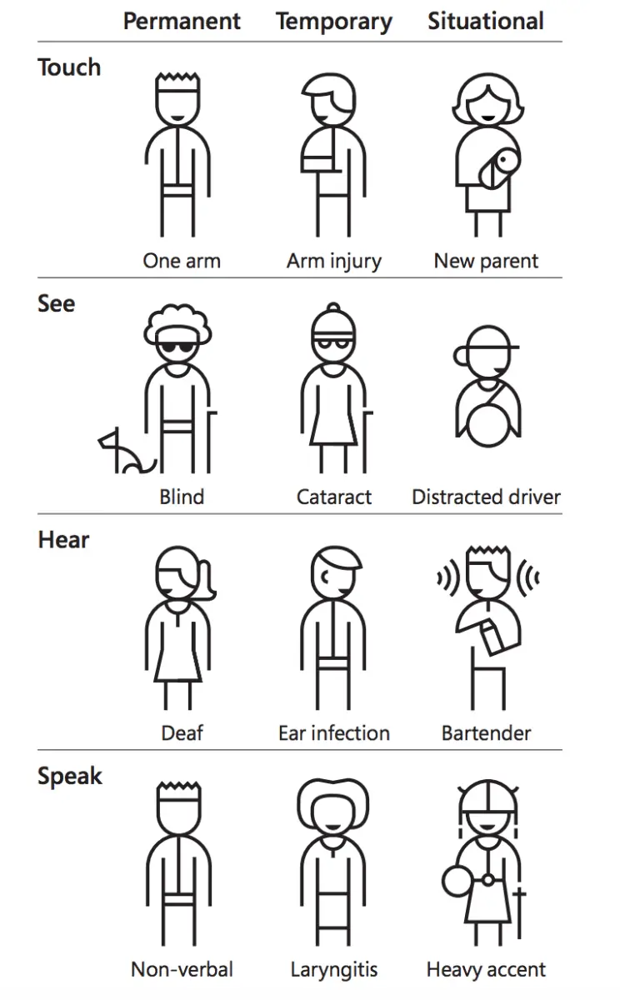

The human brain tends to assume that everybody else thinks and behaves in a similar way to it. So every person tends to think that, based on certain categories, they're part of a majority, that there are many others like them. As software developers, it's very easy to assume that every person who uses the apps or the software we make is the same as us. But people are different. How do we make sure we make apps for everyone? We need to care about accessibility and inclusivity.

## Accessibility

When it comes to mobile apps, I would say that accessibility is something that's closer to UX than to the development phase. That's because accessibility has to start from the design. We have to design and develop apps with accessibility in mind.

Unfortunately, the current state of mobile apps, in general, is that they're not accessible, they're not inclusive, developers don't do accessibility testing, and don't even understand the needs of people with disabilities. How many of you have actually seen how a visually impaired person uses a phone? Fortunately, iOS and Android have made a lot of progress in the accessibility field, and they made it a lot easier for developers to build accessible apps. And that when it comes to mobile apps, some accessibility is better than no accessibility.

## Who needs accessibility?

But who needs accessibility? Earlier this month I gave an internal talk about accessibility. And when I announced it in Slack, one of the first Slack reactions my post got was the wheelchair symbol emoji ♿️ . When hearing the term "accessibility", many iOS developers immediately think of Voice Over, the technology that reads out loud things on the screen so people who are visually impaired can use the phone. But the thing is, all of us need certain accessibility features now and then.

Microsoft's [Inclusive toolkit](https://download.microsoft.com/download/b/0/d/b0d4bf87-09ce-4417-8f28-d60703d672ed/inclusive_toolkit_manual_final.pdf) has great content on accessibility and inclusivity. A disability should be seen as a mismatch between human interactions and society and not as a personal health problem. They also bring into the spotlight the ideas of temporary and situational disability.

<em> © Microsoft </em>

## Why should we care about accessibility?

According to [Apple's Human Interface Guidelines](https://developer.apple.com/design/human-interface-guidelines/accessibility/overview/introduction/), approximately one in seven people worldwide have a disability or impairment that affects the way they interact with the world and their devices. That's 14% of your potential user base, which you may lose from the start unless you make your app for them too.

According to [statistics by PSPDFKit](https://pspdfkit.com/blog/2018/improving-dynamic-type-support/#user-adoption), 27% of the users of their PDF Viewer app used a different text size than the default one. That's more than one in four people who might find the experience of your app nonoptimal. Give them control over the text size by supporting Dynamic Type on iOS. Make your apps for them too.

Not to mention that it's the right thing to do and that we as developers and as human beings should care for other people.

And if that's still not good enough, in the US the Americans with Disabilities Act requires certain technology to be accessible for people with disabilities. And there was also a case where the Supreme Court [ruled in favor of a blind man who sued Domino's because their website wasn't accessible](https://www.cnbc.com/2019/10/07/dominos-supreme-court.html).

## Inclusivity

But making apps for everyone is about more than accessibility. It's also about making everyone feel welcome on your platform or in your app. For example, you've probably all seen sign up forms where the users have to input their gender. In most cases, that's a drop-down or a picker with 2 choices, male or female. But what about persons who don't identify as male or female? Well, the easiest thing to do is to just add an "I'd rather not say" option. But what about the people who don't identify as male or female, but would rather say that? So you probably add an "Other" option, pat yourself on the back and congratulate yourself on the great job you did at being inclusive and caring about others. And yes, that definitely is a better solution than just "Male" or "Female". But is it enough? How would a non-binary person feel when they see that your app will categorise them as "other"?

So what's the best way to handle this situation? It's simple: don't collect gender data on your users. With the exception of a very limited number of apps, I can't think of any good reason why an app would need to know its users' gender.

And what about names? There are so many cases where developers built systems with validation rules that fail too many valid names.

<blockquote class="twitter-tweet" data-lang="en" data-dnt="true" data-theme="light">
My last name isn’t valid because two letters.   The irony of this... is someone who is Asian probably built parts of this app. How did they not catch this..? <a href="https://t.co/zPVzDOsbWN">pic.twitter.com/zPVzDOsbWN</a>
&mdash; Shirley (@shirleyywu) <a href="https://twitter.com/shirleyywu/status/1300628412466298881?ref_src=twsrc%5Etfw">September 1, 2020</a></blockquote> 

There's an old article that is still very much valid about [falsehoods programmers believe about names](https://www.kalzumeus.com/2010/06/17/falsehoods-programmers-believe-about-names/). And one of the most common mistakes with names is assuming that all names your system will ever support are written with the letters of the English alphabet. So no æ, å, ø, ö, ä, ü, ß, ș, ț, ă, â, î, ç, é, etc. How would a person feel when your app tells them their name is not valid?

We need to make apps for everyone. And yes, it's easy to think that if our app is good for us, then it's good for everyone else. But that's not always the case. Here's also where the importance of diversity in the team plays a big role. The more diverse a team is, the more it's likely to build an app that's good for everyone else.

As a conclusion, I'll simply reiterate the title of the article: make apps for everyone.

## Further reading and references:

- [Apps for All: Making Software Accessible](https://www.youtube.com/watch?v=LHHmx5XxIBc)
- [Inclusive - Microsoft Design](https://download.microsoft.com/download/b/0/d/b0d4bf87-09ce-4417-8f28-d60703d672ed/inclusive_toolkit_manual_final.pdf)
- [You Can’t Just Draw Purple People and Call it Diversity](https://ux.shopify.com/you-cant-just-draw-purple-people-and-call-it-diversity-e2aa30f0c0e8)

_Header photo by [Adobe](https://xd.adobe.com/ideas/perspectives/social-impact/inclusion-doesnt-stop-accessibility/)_
