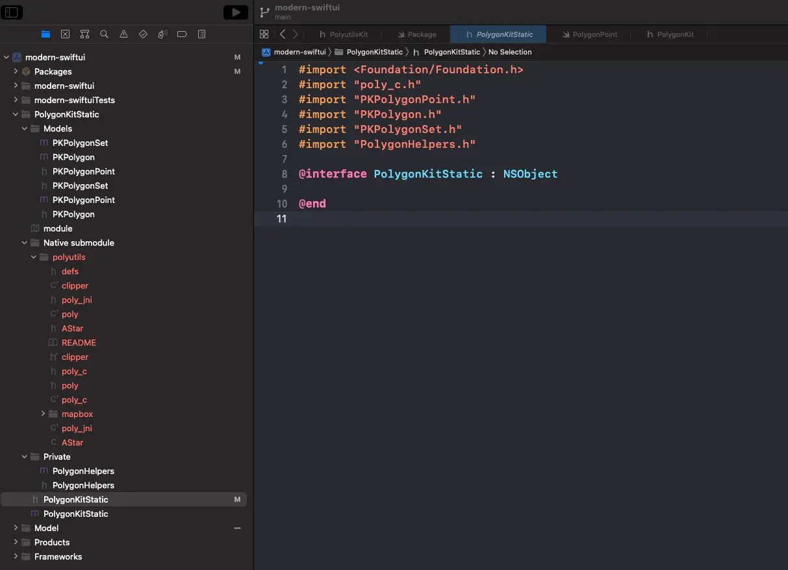
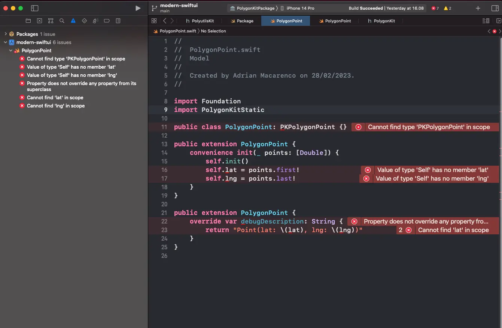

Swift Package Manager(SPM) provides a powerful system of modularizing Swift projects. With SPM, you can create separate modules for different parts of your codebase and manage their dependencies in a clean and efficient way. It could be done using the old way: adding new targets (modules) but that comes with a lot of project configuration which generally increases the project complexity.

SPM's brilliance lies in its simple and transparent Package.swift file that configures all modules, making it easy for developers to understand and manage dependencies, whether at the module-specific or overall level.

If you're working on a project that has been modularized the old way, you might be tasked with migrating previous static or target frameworks to Swift Package Manager (SPM). While SPM modularization is generally straightforward, restructuring your module is necessary in the case of a mixed language codebase, such as Swift/Obj-C/C++. To do this, you'll need to create individual targets for each programming language.

As our example for today, we will use a static framework, namely the PolygonKitStatic module. Its structure is ilustrated in the following figure.


Figure: Figure 1. PolygonKitStatic framework structure

## Step 1: Create the first Model SPM module

Now, let's start with this example where you want to create your first Model module:


Figure: Figure 2. Model target

To start, we'll create a new SPM Model package by adding a library product, and a target creating a new folder under the Sources directory named Model. 

```swift
let package = Package(
    name: "Packages",
    products: [
        .library(
            name: "Model",
            targets: ["Model"]),
    ],
    dependencies: [],
    targets: [
        .target(
            name: "Model"),
        .testTarget(
            name: "ModelTests",
            dependencies: ["Model"])
    ],
)
```

Then, we'll add the first file to our new SPM Model module - `PolygonPoint.swift` - by copying the existing class from the old PolygonPoint in the new Model SPM module.

However, the SPM won't compile just yet because we need the `PolygonKitStatic` library. To resolve this, we'll need to migrate this framework to an SPM module and import it into our new SPM Model.


Figure: Figure 3. Adding PolygonPoint.swift file to SPM Model Package

## Step 2: Design mixed languages modules
Before we proceed, let's analyze the contents of our `PolygonKitStatic` library represented in **Figure 1. PolygonKitStatic framework structure**
 and consider how we can restructure it to fit within our new SPM module(s).

You’ve probably  noticed that our framework contains both Obj-C and C++ codebase, which means we need to restructure our PolygonKit module and separate it into at least two targets with their respective folders, as mixed languages cannot be contained in the same SPM target. 

Adding to the complexity, the `PolygonKitStatic` framework directory also has a git submodule repo - `Polyutils` - which is written in C++ and imported into Obj-C interfaces, bridging its functionality to our `PolygonPoint` and `Polygon` Swift classes. This means that we will need to move our submodule from the PolygonKitStatic path to the new SPM module path. However, for now, let's set this aside and address it later in the post. 

Given this context, it's clear that we'll need to define a separate module for the Polyutils repo, which contains only C++ codebase. We can then import it into our PolygonKit Obj-C target, which provides the interface for the PolygonKit Swift target.

Here is our new structure of SPM modules and their targets:

```swift

|---------Packages
	|------------README
	|------------Package.swift
	|------------Sources
		|------------Model
			…
			…
			…
		|------------PolyutilsPackage
			…
			…
			…
		|------------PolygonKitObjC
			…
			…
			…
		|------------PolygonKitSwift
			…
			…
			…
        |------------Tests
```

## Step 3: Implement SPM modules

Let's begin with the `PolyutilsPackage` module by adding its product, target to `Package.swift`  and folder in the Sources directory.

```swift
let package = Package(
    name: "Packages",
    products: [
        .library(
            name: "Model",
            targets: ["Model"]),
        .library(
            name: "PolyutilsPackage",
            targets: ["PolyutilsPackage"]
        ),
    ],
    dependencies: [],
    targets: [
        .target(
            name: "Model"),
        .target(
            name: "PolyutilsPackage",
            path: "Sources/PolyutilsPackage",
            exclude: [
                "polyutils/poly_jni.cpp",
                "polyutils/poly_jni.h"
            ],
            sources: [
                "polyutils/",
                "include/"
            ],
            publicHeadersPath: "include",
            cxxSettings: [
                .headerSearchPath("polyutils"),
            ]
        )
        .testTarget(
            name: "ModelTests",
            dependencies: ["Model"])
    ],
)
```

Let’s address the git submodule issue now as we need its files for our `PolyutilsPackage` module. For the newer git version( > 1.8.5) there’s a git command (`git mv`) that does everything for you, we just need to specify the old path and the new path. Let’s execute it for our project submodule.

```shellscript
git mv modern-swiftui/PolygonKitStatic/Native\ submodule/polyutils Sources/PolyutilsPackage 
```

After moving our submodule into place, it's apparent that our module is still not compiling. However, there are a couple of things we can do to rectify this. 

Firstly, we need to create an "include" folder where we can add public headers that we want to expose to other modules. We can then create its header and implementation files: `PolyutilsKit.h` and `PolyutilsKit.m`. 

Secondly, we must exclude a couple of unnecessary Java files from the Polyutils repo and set the publicHeadersPath to reference the "include" directory. Additionally, we need to set the C++ HeaderSearchPath to the `Polyutils` directory, as this is required for the `Polyutils` repo to compile. 

It's important to note the significance of the `publicHeadersPath` - it specifies the directory that contains the public interface with the functionality we need to make public.


```swift
.target(
            name: "PolyutilsPackage",
            path: "Sources/PolyutilsPackage",
            exclude: [
                "polyutils/poly_jni.cpp",
                "polyutils/poly_jni.h"
            ],
            sources: [
                "polyutils/",
                "include/"
            ],
            publicHeadersPath: "include",
            cxxSettings: [
                .headerSearchPath("polyutils"),
            ]
        )
```


Voila! Our very first C++ SPM module is now successfully compiled and ready to be imported into other modules.

Next, let's move on to creating the `PolygonKitObjC` and `PolygonKitSwift` modules. Since Obj-C interfaces are only used to bridge C++ to Swift, we can create a single SPM library but with two separate targets - `PolygonKitObjC` and `PolygonKitSwift`.

Firstly, let's focus on `PolygonKitObjC`. Similar to C++, we need to make the interfaces public by creating an "include" directory. We should then specify this directory in the target's configuration by setting the `publicHeadersPath` property.
Additionally, we need to add our PolyutilsPackage as a dependency so that we can use it in the Obj-C implementation. Let's add it to the Package.swift manifest file and include the PolygonKitObjC directory, along with its necessary files, in the Sources directory.

```swift
let package = Package(
    name: "Packages",
    products: [
        .library(
            name: "Model",
            targets: ["Model"]),
        .library(
            name: "PolygonKitPackage",
            targets: ["PolygonKitObjC", "PolygonKitSwift"]),
        .library(
            name: "PolyutilsPackage",
            targets: ["PolyutilsPackage"]
        ),
    ],
    dependencies: [],
    targets: [
        .target(
            name: "Model"),
        .target(
            name: "PolygonKitObjC",
            dependencies: [
                "PolyutilsPackage",
            ],
            path: "Sources/PolygonKitObjC",
            sources: [
                "Models/",
                "Private/",
                "include/"
            ],
            publicHeadersPath: "include"
        ),
        .target(
            name: "PolygonKitSwift",
            dependencies: [
                "PolygonKitObjC",
                "PolyutilsPackage",
            ]
        ),
        .target(
            name: "PolyutilsPackage",
            path: "Sources/PolyutilsPackage",
            exclude: [
                "polyutils/poly_jni.cpp",
                "polyutils/poly_jni.h"
            ],
            sources: [
                "polyutils/",
                "include/"
            ],
            publicHeadersPath: "include",
            cxxSettings: [
                .headerSearchPath("polyutils"),
            ]
        )
        .testTarget(
            name: "ModelTests",
            dependencies: ["Model"])
    ],
)
```


To complete our task, we need to add the last piece of the puzzle: `PolygonKitSwift`. Since it is a Swift-only module, configuring its target is relatively straightforward - we just need to set the target properties for its name and dependencies.


```swift
let package = Package(
    name: "Packages",
    products: [
        .library(
            name: "Model",
            targets: ["Model"]),
        .library(
            name: "PolygonKitPackage",
            targets: ["PolygonKitObjC", "PolygonKitSwift"]),
        .library(
            name: "PolyutilsPackage",
            targets: ["PolyutilsPackage"]
        ),
    ],
    dependencies: [],
    targets: [
        .target(
            name: "Model"),
        .target(
            name: "PolygonKitObjC",
            dependencies: [
                "PolyutilsPackage",
            ],
            path: "Sources/PolygonKitObjC",
            sources: [
                "Models/",
                "Private/",
                "include/"
            ],
            publicHeadersPath: "include"
        ),
        .target(
            name: "PolygonKitSwift",
            dependencies: [
                "PolygonKitObjC",
                "PolyutilsPackage",
            ]
        ),
        .target(
            name: "PolyutilsPackage",
            path: "Sources/PolyutilsPackage",
            exclude: [
                "polyutils/poly_jni.cpp",
                "polyutils/poly_jni.h"
            ],
            sources: [
                "polyutils/",
                "include/"
            ],
            publicHeadersPath: "include",
            cxxSettings: [
                .headerSearchPath("polyutils"),
            ]
        )
        .testTarget(
            name: "ModelTests",
            dependencies: ["Model"])
    ],
)
```

We've completed the setup for all of our SPM modules. The final step is to move the `Polygon.swift` and `PolygonPoint.swift` files to the `PolygonKitSwift` directory, and create the classes where we can import `PolyutilsPackage` and `PolygonKitObjC`. This allows us to use the functionality from both packages in our Swift module. With everything set up correctly, we can now build and run our project to test the new SPM modules.


And there you have it! Say goodbye to hidden configuration files for project modules. With everything set up in the Package.swift manifest file, our libraries can now be easily tested and compiled in isolation.
