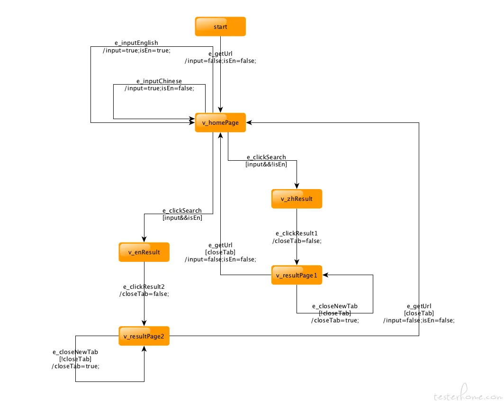
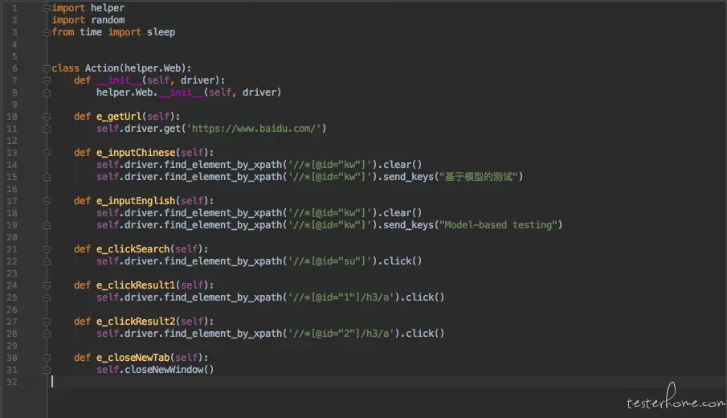

Model-based testing (MBT) is a technology that is sometimes advertised as "automated test design".

You can find the project on Github [here](https://github.com/CXingL/MBT_CX).

## Concept

The MBT tool generates test cases from a test model specified by the user. Without the test model, the tool cannot generate any test cases. Without a good test model, the tool cannot generate good test cases. Therefore, in MBT testing, the task changed from test design to test model design. Rather than designing a single test set, we designed a test model for generating any number of test cases.

#### Take Baidu search as an example

- Make a model diagram [GraphWalker modeling rules](https://github.com/GraphWalker/graphwalker-project/wiki/How-to-create-a-model), and then put the model diagram file in the model folder.

In this model diagram, start is the beginning of the model, enter homePage (www.baidu.com), and then enter English or Chinese to search. After verifying the search results, it will return to homePage and continue to perform the search until the exit condition of the program is reached (for example, the entire path is executed or a certain node is reached or executed to a fixed number of times).

- Execute `python3 run_model.py -t model/example.graphml` in the MBT directory to check whether the model graph is correct and confirm that there are no errors or endless loops;
- Then execute `python3 run_model.py -f model/example.graphml`, a file example_web.py (model graph file name_test platform.py) will be generated in the page_script directory

- Open the py file generated in the previous step and follow the selenium rules to complete the script:

- After the script is completed, execute `pytest` in the MBT directory to start the test, and test the effect:

_You can open the test_main.py file for some simple settings before executing the test. For example, if you want to set the running browser, test execution speed, or more test files, you can choose to skip some tests in test_main, etc._

- After the test is completed, a test report will be generated in the report directory. Open report.html to view the test results.

## Operating environment

#### 1. yEd download (optional)

Software for viewing and editing model diagrams. The model diagram files are all in the model folder, with the file suffix .graphml.

Download address: [https://www.yworks.com/downloads-yEd](https://www.yworks.com/downloads-yEd)

Can also be used online: [https://www.yworks.com/yed-live/](https://www.yworks.com/yed-live/)

#### 2. Install and configure the Java environment (required)

Install and configure [Java](https://www.java.com/en/download/help/index_installing.xml) environment, Java8 is recommended.

#### 3. python3 (required)

Install and configure [Python3](https://www.python.org/download/releases/3.0/) environment

#### 4. jq (required)

Command line json processing tool to filter test cases generated by graphwalker, installation method: `brew install jq` (requires brew to be installed first). For other installation methods, please check the official documentation: [https://stedolan.github.io/jq/](https://stedolan.github.io/jq/)

#### 5. Selenium environment (web-side testing is required, Android and iOS are not required)

Selenium: browser automatic test tool, after installing Python3, enter `pip3 install selenium` in the terminal to install

#### 6. chromedriver (required for testing Chrome on the web)

- Download [https://sites.google.com/a/chromium.org/chromedriver/downloads](https://sites.google.com/a/chromium.org/chromedriver/downloads)
- Move the uncompressed chromedriver to the `/usr/local/bin` directory

#### 7. Appium environment (required for Android and iOS tests)

There are many contents, Android and iOS are different, please check the official Appium documentation for details:
[http://appium.io/docs/en/about-appium/getting-started/](http://appium.io/docs/en/about-appium/getting-started/)

#### 8. Execute `pip3 install -r requirements.txt` in the MBT directory to install the libraries used in the framework

## Usage

#### Web side

1. Modify the content in test_main.py, adjust some test parameters and select the content to be tested, etc. (the test that does not need to be executed can be uncommented by @pytest.mark.skip("nothing"))
2. Execute in the MBT folder: pytest starts the test
3. After the test is completed, the test report will be generated in the report folder

#### Android and iOS

1. Connect Android, iOS device or simulator, Android prepare REVINYL test apk, install iOS REVINYL
2. Start the Appium service
3. Modify the content in test_main.py, adjust some test parameters and select the content to be tested (
   Android puts the test apk into the application folder, and changes the app in test_main.py to the name of the apk)
4. Execute in the MBT folder: pytest starts the test
5. After the test is completed, the test report will be generated in the report folder

#### Other

If an error occurs during iOS use, it is similar to

> E selenium.common.exceptions.WebDriverException: Message: An unknown server-side error occurred while processing the command. Original error: Error Domain=com.facebook.WebDriverAgent Code=1 "The element'"Cancel" Button' is not visible on the screen and thus is not interactable" UserInfo={NSLocalizedDescription=The element'"Cancel" Button' is not visible on the screen and thus is not interactable}  
> Please try to upgrade Appium or iOS version, see:
> [https://github.com/facebook/WebDriverAgent/issues/914](https://github.com/facebook/WebDriverAgent/issues/914)

@pytest.mark.skip("nothing") will skip the test, just comment it out

_Article Photo by [freestocks](https://unsplash.com/photos/L5DxWLmywmM)_
