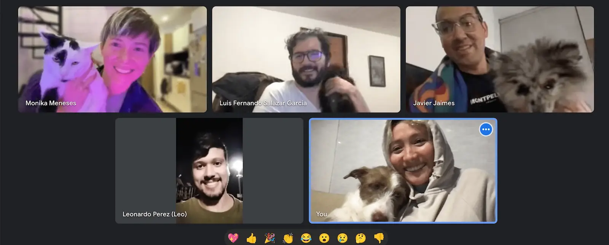
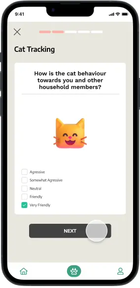
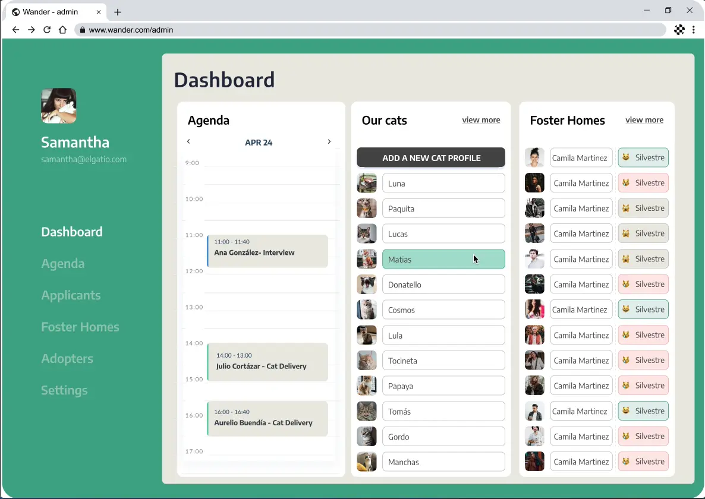

We had a blast participating for the first time in [MonstarHacks](https://www.linkedin.com/showcase/monstarhacks) and even though the pressure can be very high due to the limited amount of time, the resulting ideas can be truly amazing. Here we would like to share a little bit of our discoveries and solution trying to solve the [El Gatio](https://elgatio.org/) NGO challenge.

### The problem

Overpopulation of stray pets is a complex problem that has far-reaching environmental consequences that should not be ignored. Stray pets can disrupt natural food chains, hunt and kill native wildlife, and spread disease to other animals in the area. But yet there's very limited governmental resources being directed to address this problem in a humane way. This is why cat rescue organizations face some big challenges as they are obligated to work with their own resources making it very difficult and time-consuming to find foster homes, match cats with the right families to avoid future relinquishments and perform a continuous follow-up process.

### Insights we found

1. After some investigation we found that the common approach for shelters is to treat foster home applications and adoption application as two different processes, but for us is actually a single one, because people's intention may vary during time and what first started as a fostering can evolve into an adoption.

2. Creating matches for successful adoptions (aka adoption without relinquishment) is much more complex than just measuring compatibility between two profiles. Because this is more like finding the “love of your life” and chemistry resulting from physical interaction plays a substantial role into determining whether you’ll commit to a pet or not.

**Our conclusion**: If we allow people to live with cats for a trial period in a foster home, we can likely focus on converting positive experiences into successful adoptions, and prevent adoptions from happening when people are not ready to commit.

### Our Solution
Transform the shelter's fostering and adoption processes into a unified system by implementing SaaS (Software as a Service) trial best practices, with systematic follow-up checks to encourage adoption, enhance post-adoption retention, and expand the network of foster homes. Therefore:

- People who only want to be foster homes (for their own reasons) could remain in a "trial version" with different cats indefinitely.
- People who wanted to be foster homes and, during the "trial," develop a good relationship with the cat could be led/converted into adopting the cat (aka "upgrading from the trial version").
- People who want to adopt but are inexperienced may start to develop a poor relationship with the cat. In such cases, they could receive priority assistance to allow the shelter to provide guidance and improve the engagement.
- People who want to adopt and, during the "trial," start developing a bad relationship with the cat, despite assistance, could have the option to trial a different cat or decide not to adopt if they realize they aren't prepared.
- People who want to adopt and, during the "trial," develop a good relationship with the cat will likely cement their decision and become the most loyal adopters.

This will enable us to solve the most complex problems of the challenge: increasing the number of available foster homes while at the same time reducing the number of people who would ultimately return an adopted cat. By incorporating systematic follow-ups, the shelters will be able to conserve resources with users who are managing well, while also providing timely guidance to those in need. This approach will also help identify opportunities for fostering to adoption conversion. Most importantly, it will allow us to understand and identify friction points in the cat-owner relationships and improve them for the benefit of people's and pets' well-being and harmony in our society.

### Resources

- [The impact of returning a pet to the shelter on future animal adoptions](https://www.nature.com/articles/s41598-022-05101-5)
- [What Do People Want? Factors People Consider When Acquiring Dogs, the Complexity of the Choices They Make, and Implications for Nonhuman Animal Relocation Programs](https://www.tandfonline.com/doi/abs/10.1080/10888705.2014.943836)
- [El Gatio shelter](https://elgatio.org/)

_Article Photo by [El Gatio](https://elgatio.org/)_
