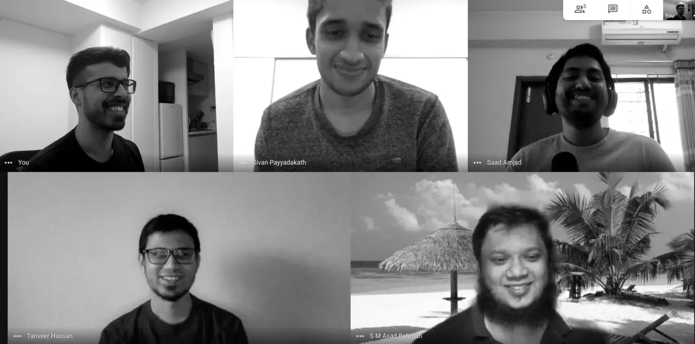
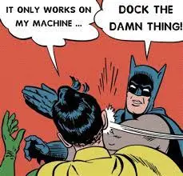

**TL;DR:** We built a Node.js backend starter kit based on [NestJS Framework](https://github.com/nestjs/nest).
It follows a **Monolithic** architecture and implements **REST APIs**.

The starter kit is completely open source and can be found at this [Github Repo](https://github.com/monstar-lab-oss/nestjs-starter-rest-api).

## Introduction

[Monstarlab](https://monstar-lab.com/global/) is a product development and consultation company, which helps other organizations solve their business problems, with the help of the latest technological solutions.

We engineers at Monstarlab tend to work on new customer projects every 4-6 months. We noticed that every time we kickstarted a new project, we spent a considerable amount of time on choosing our technology stack, software architecture, etc.

While we agree that there are no silver bullets, we concluded that some things could be improved in this regard. For instance, we do not need to redesign our logger service, our request validators, JWT authentication middleware, etc. every single time!

**Tada!** Hence this starter kit.

## The Game plan

This wasn't the first time one of us decided something like this needs to be done. Many of us have tried to solve this issue in the past, but unfortunately have failed due to a variety of reasons like time management, motivation, the difference of opinions, etc.

We were worried this time could turn out to be no different, hence we decided to try out a few things differently.

#### Keeping it open source.

In our previous attempts at doing this, we noted we lost motivation halfway due to various reasons. Keeping it open source allowed us to develop a sense of achievement, that we could share this project with others in the community even outside of our organization.

#### Sponsored Hackathons.

Almost all of us contributing to this project could only do so in our free time. Since the weekdays mostly go towards working on the business problems and projects directly with our clients, the time we could spend on this was very limited.

After brainstorming a bit on this issue, we decided to hack away at this starter kit on our weekends.
Monstarlab was kind enough to offer us generous amounts of free food to run these hackathons.
This gave us a chance to keep up with our release timelines for the starter kit project.

#### We need to go left, no right...

What do we put in this starter kit. What do we **NOT** put in this starter kit. These discussions were always difficult and time consuming.

The conclusion was as follows:

- There will be 2 main types of starter kits, one based on monolithic pattern, and the other one based on microservices.
- Within monolithic, we decided to further have REST API based and GraphQL based.
- The starter kits will be very lightweight. To include some advanced features we will also create a [Sample Solutions Repo](https://github.com/monstar-lab-oss/nestjs-sample-solutions) which will showcases some real-life production projects built on top of these starter kits.

## Our features

As pointed above, one of our main principles has been to keep the starter kit as lightweight as possible. With that in mind, here are some of the features that we have added to this starter kit.

#### Authentication:

Authentication is something that almost all of our projects need. We haven’t reinvented the wheel here. We use the popular Node.js library, PassportJS to do most of the heavy lifting for us in our JWT implementation. We use bcrypt library to ensure we are correctly hashing our passwords with salts, etc.
For more enterprise grade projects, we want to encourage everyone to use robust identity management projects like KeyCloak, Okta, etc.
We might be working on such examples in the coming future, so do keep an eye on our [Sample Solutions Repo](https://github.com/monstar-lab-oss/nestjs-sample-solutions). Do feel free to reach out to us for consultation and we can work on this on priority. :)

#### Authorization:

Based on top of authentication, the next thing that most projects require is Authorization. Authorization refers to the process that determines what a user is able to do. We have implemented a basic Role Based Access Control (RBAC) authorization module. To check out how it works and how easy it is for you to use it, refer to this [doc file](https://github.com/monstar-lab-oss/nestjs-starter-rest-api/blob/master/docs/acl.md) within the project repository.

#### ORM Integration

Object–relational mapping (ORM) is a technique that lets you query and manipulate the data from a database using an object-oriented paradigm. TypeORM encapsulates the code needed to manipulate the data, so we don't need to use raw SQL anymore.

#### DB Migrations

Migrations provide a way to incrementally update the database schema to keep it in sync with the application's data model while preserving existing data in the database.
DB Schema migrations have always been a nightmare for many of us when it comes to a relational database. TypeORM allows us to easily generate the migration files.

#### Logging

NestJS comes with its own built-in logger. But it is a text-based logger and does not suit production requirements. Hence we implemented our own custom logger based on Winston, which is a very popular production logging package.
What’s even better is that we pass a request context throughout our call stack, which allows us to do **contextual logging** with additional information like request-id, request-user, etc.

#### Request Validation

It is best practice to validate the correctness of any data sent into a web application. NestJS makes use of the powerful [class-validator package](https://github.com/typestack/class-validator) and its declarative validation decorators.

#### Pagination

No REST API feels complete without having some basic pagination in it. We went ahead and added support for simple pagination parameters like limit and offset.
Our responses also always include a child property called `meta`. This includes information like total resource count, etc which further makes the pagination implementation smoother on the frontend application side.

#### Docker Ready

Need we say more?

#### Auto-generated OpenAPI

This is one of our most loved features in NestJS.
The OpenAPI specification is a language-agnostic definition format used to describe RESTful APIs. Nest provides a dedicated module that allows generating such a specification by leveraging decorators.

#### More features

Apart from these features above, our start-kit comes loaded with a bunch of minor awesomeness like prettier integration, commit-linting husky hooks, package import sorting, SonarCloud github actions, docker-compose for database dependencies, etc. :D

## Conclusion

Recently we released a major version of our starter kit based on Monolithic + REST API.

It was a “work-in-progress” for a long time, but we finally believe it is ready for everyone to try it out and provide us with their invaluable feedback.

## What’s next

#### Auto-generated ChangeLog

This is the last one in our backlog for this starter kit. After this feature, we believe we won’t be touching this particular starter kit for a while.

Next on our roadmap is a starter kit which uses GraphQL.

## Resources

- [Official NestJS Website](https://nestjs.com/)

_Article Photo by [Gaelle Marcel](https://unsplash.com/@gaellemarcel)_  
_Docker Meme Photo by [Meme Generator](https://memegenerator.net/)_
