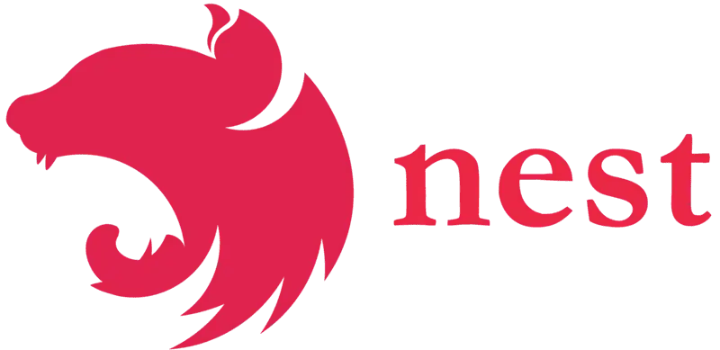
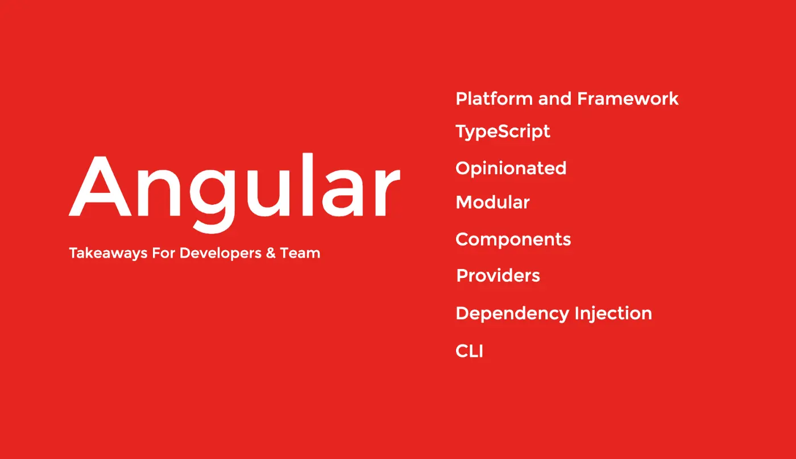

The role of a software developer is getting more open-ended with time. They are more of a “Fire Fighter Developer” if not anything else. Developers need to be constantly vigilant, doing more than what they are asked for, especially when some teams need help, they are required to step in to save the day. We look into a Node.js framework using Angular lens in this article, which will serve as a perfect gateway for frontend developers to dive into the server-side programming with existing knowledge sets.

The framework is not so new given the fast adoption rate of the framework. NestJS is a platform that Angular community is proud to have, and NodeJS community was looking for in terms of highly opinionated architecture.

Node.js, born in 2009, is a runtime environment based on Chrome’s V8 JavaScript engine, and it kept growing in interest in the developer community ever since. There are several Node.js frameworks like Express.js, Meteor, Koa.js, etc. But they somehow lacked a solution to an ever-increasing problem. How can we create backend applications in JS, where large teams can work, build to scale and maintain it with time?

[**Kamil Mysliwiec**](https://twitter.com/kammysliwiec) had an answer when he introduced NestJS, the fastest-growing Node.js framework of 2018.



Before we introduce NestJS, let’s look at the key takeaways of Angular a bit. If you are working in a large team, opinionated frameworks are way to go. The code becomes consistent and easily maintainable. Angular being modular, import and exporting modules allow components to be re-used in other applications, saving much more development time. Furthermore, since Angular has an impressive DI mechanism, almost all of the good programming practices are by default adopted while coding.



**NestJS Takeaways**

Similarly, NestJS have this Angular philosophy out of the box. Let’s run down that same list for Nest:

**Platform and Framework**

NestJS is more than a framework, as it gives developers more options outside the box, like abstractions for Microservices, WebSockets, GraphQL, etc. to name a few.

**Typescript**

Uses Typescript, which as we know is the Javascript that scales. Programming thus can be done just right with any or all of them, Object Oriented Programming, Functional Programming, and Functional Reactive Programming. But if you love vanilla JS, you can still use it.

**Opinionated**

Nest provides a set of guidelines, as to how we should use the framework, but never limits us to work with the underlying APIs like that of Express, or Fastify. Opinionated means the code is much more consistent across large teams but doesn’t necessarily imply that you can’t be creative while working with abstractions.

**Modular**

That means it is domain driven, each module holding a set of their own set of business logic. The modules are singletons by default, but we can still share the same instance of any provider between multiple modules effortlessly in Nest.

**Controllers**

Nest does not have any components like that of Angular. Instead, they have controllers that accept a request and sends a response, the core idea behind Server Side Programming.

**Dependency Injection**

Nest heavily uses decorator functions. Decorator functions provide metadata to the compiler during runtime so to ensure each dependency is resolved while building the application. Decorators ensure that SOLID principles are ensured throughout the application.

**Providers**

Providers can be any values, class or factory that contains certain metadata related to various injection scopes. Dependency Injection is a core part of NestJS, with its own built-in IoC to resolve dependencies.

**CLI**

Life becomes easy when CLI helps you to scaffold, serve, build and bundle the application for you.

We can see that all the goodness of Angular is prevalent in NestJS. So why not we code some “Angular” in the backend? Disclaimer, even if you are not Angular developers, you can still easily pick up Nest as your backend framework, thanks to its well-crafted documentation.

We will be building a few APIs for one entity. Let’s say we want to create a resource called Events, like tech community events. We will make some routes that handle requests, based on the HTTP verb, we then fetch/update data from a database, and return a response.

The full code, can be found [here](https://github.com/Saad-Amjad/ng-bd-demo), but I will still go over few steps and highlight how the code was written.

Install nestjs cli, we need to have [Node.js](https://nodejs.org/) (>= 8.9.0):

```
npm i -g @nestjs/cli
```

Creating a new project, we will name it as `ng-bd-demo`:

```
nest new ng-bd-demo
```

We will see a project got scaffolded, and if you want to run the project:

```
npm run start
```

While development, you want the changes to be reflected, then the command is:

```
npm run start:dev
```

If you explore the folder structure, it will look as a familiar territory like that of Angular. Let’s focus on the `main.ts` file that kicks of the entire application. The bootstrap code looks like this:

```typescript
async function bootstrap() {
  const app = await NestFactory.create(AppModule);
  await app.listen(3000);
}
bootstrap();
```

Let’s create a module called events:

```
nest g module events

```

Create a controller called events:

```
nest g controller events
```

Create a service called events:

```
nest g service events
```

These commands will ensure that `AppModule` contains `EventsModule`, and `EventsModule` contains `EventsController` and `EventsService` declared as controllers and providers respectively.

We will try to create some functions that will enable us to have CRUD APIs for `Events`. For that, we need these decorators from [@nestjs/common](http://twitter.com/nestjs/common "Twitter profile for @nestjs/common").

```typescript
import {
  Controller,
  Get,
  Post,
  Body,
  Param,
  Patch,
  Delete,
} from "@nestjs/common";
```

For start, let’s return a simple string for a `GET index()` method call:

```typescript
@Get()
index(): string {
 return 'Events list';
}
```

If we run the server now, and hit `GET events/` API, it will return ‘Events list’. Before we complete the other routes, let’s first make our application talk to a database. We will be using MySQL, you can choose any since Nest is database agnostic.

Nest provides TypeORM, Object Relational Mapper (ORM) for TypeScript, package out of the box, which can be installed using this command.

```
npm install --save @nestjs/typeorm typeorm mysql
```

After install import the `TypeORM` module’s `forRoot()` method in your `app.module`, and in `events.module` import it with TypeORM module `forFeature()` method.

`forRoot` method accepts configurations of your database connections, and `forFeature()` method defines the repositories for that module which imports it.

Now we create an `Event` entity that we will import in `EventsModule` like this: `TypeOrmModule.forFeature([Event])` .

```typescript
import {
  Entity,
  PrimaryGeneratedColumn,
  Column,
  CreateDateColumn,
  Timestamp,
  UpdateDateColumn,
} from "typeorm";

@Entity()
export class Event {
  @PrimaryGeneratedColumn()
  id: number;

  @Column()
  name: string;

  @Column()
  description: string;

  @CreateDateColumn({ nullable: true })
  created_at: Timestamp;

  @UpdateDateColumn({ nullable: true })
  updated_at: Timestamp;
}
```

We will be using Dependency Injection in our service to use this entity in our repository.

```typescript
@Injectable()
export class EventsService {

constructor(@InjectRepository(Event)
 private readonly eventRepository: Repository<Event>) { }

async findAll(): Promise<Event\[\]> {
 return await this.eventRepository.find();
 }

async find(id: number): Promise<Event> {
 return await this.eventRepository.findOne(id);
 }

}
```

We are injecting the repository in the service class and the `findAll()` method will call the database for all the `events` asynchronously. You might wonder how will this entity be used to migrate a real table in the database.

When we provided configs in `forRoot()`method, we explicitly told `TypeORM` to synchronize the `entities`, i.e. run auto migrations for us, using the array values provided in the `entities` options.

```typescript
TypeOrmModule.forRoot({
 type: 'mysql',
 host: 'localhost',
 port: 3306,
 username: ‘username’,
 password: ‘password’,
 database: ‘database',
 entities: \[Event\],
 synchronize: true,
})
```

The controller `GET` index will finally look like the following. We can now also use `Param()` to retrieve URL query params.

```typescript
constructor(private eventService: EventsService) { }

@Get()
 index(): Promise<Event\[\]> {
 return this.eventService.findAll();
 }

@Get(':id')
 show(@Param('id') id: number): Promise<Event> {
 return this.eventService.find(id);
 }
```

But for POST, instead of query params, we need to get the payload from the body of the request. To ensure the payloads are consistent for a specific API, we will now be creating a Data Transfer Object (DTO).

```typescript
import { IsString, IsNotEmpty } from "class-validator";

export class CreateEventDto {
  @IsString()
  @IsNotEmpty()
  readonly name: string;

  @IsString()
  @IsNotEmpty()
  readonly description: string;
}
```

We installed ‘class-validator’ to give validation rules to the request body.

```
npm i --save class-validator class-transformer
```

`POST store()`would now look like this:

```typescript
@Post()
store(@Body() createEventDto: CreateEventDto): Promise<Event> {
 return this.eventService.create(createEventDto);
}
```

and `PATCH update()` and `DELETE delete()` like this:

```typescript
@Patch(':id')
update(
 @Param('id') id: number,
 @Body() updateEventDto: UpdateEventDto): Promise<Event> {
 return this.eventService.update(id, updateEventDto);
}

@Delete(':id')
delete(@Param() id: number): Promise<DeleteResult> {
 return this.eventService.delete(id);
}
```

The service now should have the methods to implement these API calls to our project, and then send it back to the appropriate client.

```typescript
async create(createPayload: CreateEventDto): Promise<Event> {
 return await this.eventRepository.save(createPayload);
}
```

```typescript
async update(id: number,
 updatePayload: UpdateEventDto): Promise<Event> {
 const event = await this.eventRepository.findOne(id);
 const data = Object.assign(event, updatePayload);
 return await this.eventRepository.save(data);
}

async delete(id: number): Promise<DeleteResult> {
 return await this.eventRepository.delete(id);
}
```

We can either use Postman or Swagger to manipulate the APIs. For Swagger you can run this to install it in the application:

`npm install --save @nestjs/swagger swagger-ui-express`

Then in `main.ts`we bootstrap the Swagger module:

```typescript
async function bootstrap() {
  const app = await NestFactory.create(AppModule);

  app.useGlobalPipes(new ValidationPipe());

  const options = new DocumentBuilder()
    .setTitle("ng-bd-demo")
    .setDescription("Application that showcases backend in Angular")
    .build();

  const document = SwaggerModule.createDocument(app, options);
  SwaggerModule.setup("api", app, document);
  await app.listen(3000);
}
bootstrap();
```

If you run the server and go to `/api`, you can see Swagger documenting the list of APIs for you. We are done making 5 API calls, and pretty much that’s it for this introduction.

You import things you need, you create controllers, services, and try to send back a response to the client application. You can now export this module to any application you want.

I wanted to showcase how short the learning curve is for Angular developers to use NestJS. There are many more to Nest than what I described here, support for GraphQL Microservices, WebSockets, testing utilities are to name a few. Clean code, consistency, and maintenance of NodeJS based applications where you expect scaling and reusability, Nest should be your go-to platform.

Happy coding folks!

_Article Photo by [Gaelle Marcel](https://unsplash.com/@gaellemarcel)_
