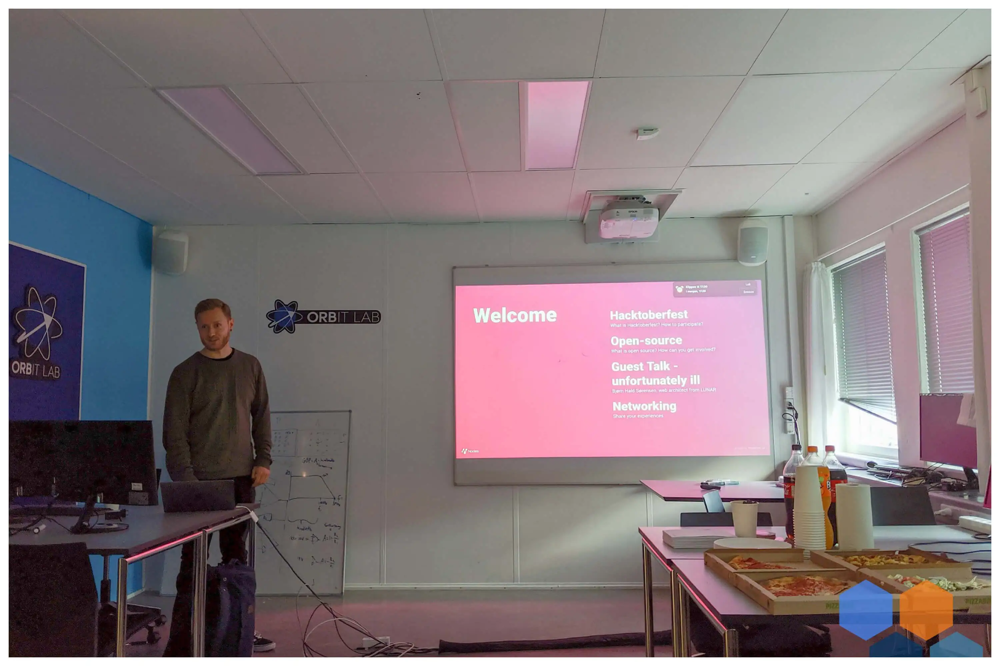
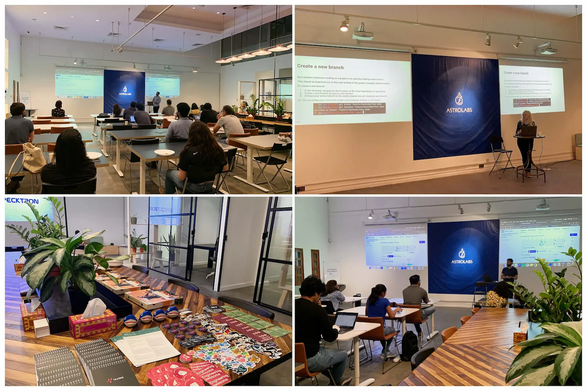
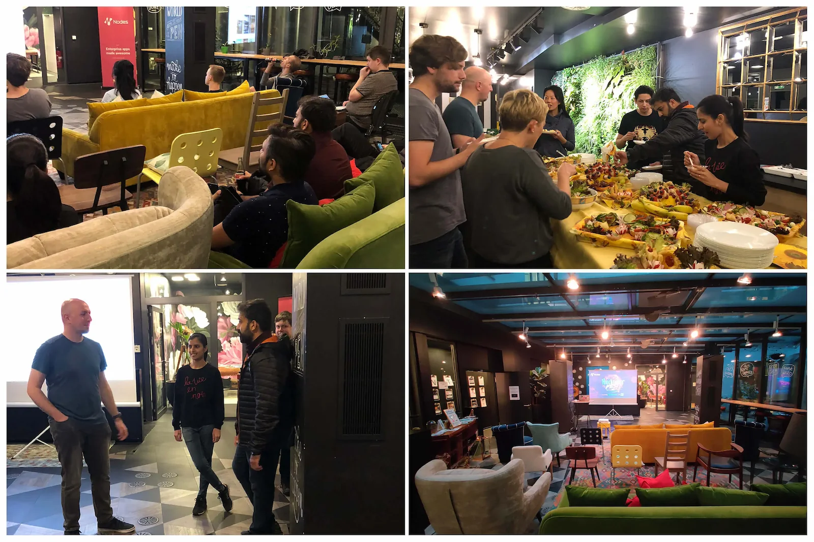
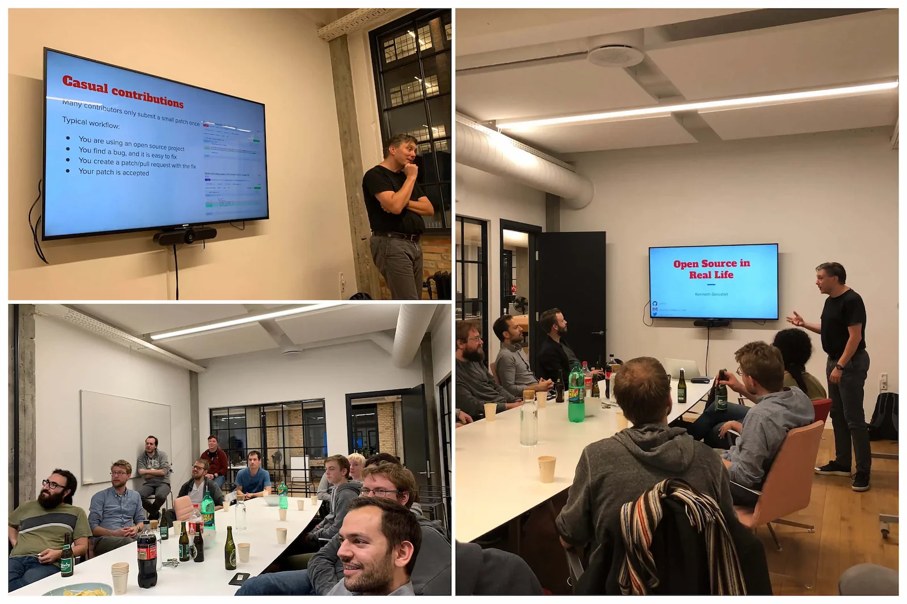
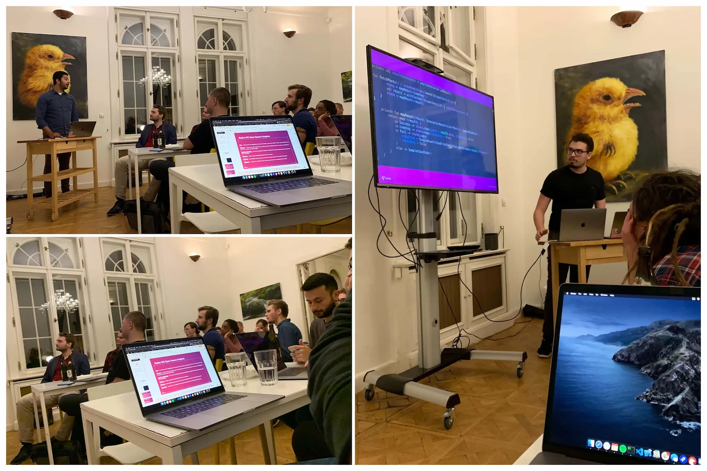

Getting started with Open Source projects can be daunting some times, but we hope that our local [Hacktober Fest](https://hacktoberfest.digitalocean.com/) events inspired people to get more involved in this community. We organised 5 events across 5 different locations, all with their own personal vibes and here is a short recap of what happened.

## Aarhus

The Nodes Aarhus office kickstarted the month with a cozy gathering at the ORBIT Lab space - a local creative and inspirational hub that offers visitors the most recent technologies in ICT to play with. A small dedicated group of people showed up, and we served pizza and cold drinks. People networked, talked about being developers and Open Source in general and after the introduction talk by Nicolai Harbø (iOS and Android Developer at Nodes) the conversation continued.

## Dubai

Many different backgrounds attended the local Hacktober Fest event in Dubai: teachers, students, freelancers and developers working at companies here in Dubai and outside of it. Roxana Jula (Associate Senior Mobile Developer at Nodes) gave a talk about Open Source and how to get involved. Pawel Wilk (Senior Backend Developer at Nodes) talked about his experiences of contributing to Open Source projects with a nice list of projects he helped out like Drupal 6 or CKEditor. Everybody loved the Open Mic idea, where guests could get on the “stage” and present cool projects they own or maintain. Gonçalo Montes Palma (Flutter Developer at Ianum) showed us a very cool project that notifies you about close-by Portuguese wildfires.

## Berlin

We were very happy to host our Berlin Hacktober Fest event in the cosy lounge at rent24. Matko Smoljan (Senior Android Developer at Nodes) introduced the audience to what is Hacktober Fest, Open Source and free (as in freedom) software and how people can make their own contributions. Jonas from the Vapor core team talked about how you can develop a business around an open-source product, using Vapor itself as a great example of doing so. All of this was accompanied by amazing food prepared by Grazyna Lasek.

## Copenhagen

Copenhagen office followed up with a nice event with mostly developers, but there were three middle-school guys and a teacher as well. Steffen Sommer (Technical Director and Solution Architect at Nodes) had the first presentation, talking about Open Source Software, Nodes and how OSS is used and contributed to by Nodes. The external speaker was Kenneth Geisshirt (Senior Engineer at MongoDB). Being in the software industry for a respectful amount of time, Kenneth shared his experience with OSS, how to make meaningful contributions and how to make the best of OSS. Before and in between the presentations, the guests got to know each other a little better and to exchange their experience with OSS, but also to find out more about Nodes.

## Prague

The Prague Hacktober Fest was attended mainly for developers from different backgrounds: mobile, frontends and specially by backend developers. The most important part for sure was the networking, people really enjoyed exchanging experiences and talking about how they work while enjoying some pizza and beers. During the open mic, a 14 year old showed his own project [Interclip](http://uni.hys.cz/): a url shortener with an open API that generated a code instead of a url.

---

[Open source is changing the world – one pull request at a time!](https://opensource.guide/)
[#EngineeringAwesome](https://www.nodesagency.com/)

We hope everybody had a fun Hacktober Fest!
Special thanks to everybody who contributed by organising these events and writing this article!

**Nodes iOS Open Source Projects**

- [Rye](https://github.com/nodes-ios/Rye)
- [Drawer](https://github.com/nodes-ios/Drawer)
- [KeyboardHelper](https://github.com/nodes-ios/KeyboardHelper)
- [Spinner](https://github.com/nodes-ios/Spinner)
- [NStack](https://github.com/nodes-ios/NStackSDK)
- [Serpent](https://github.com/nodes-ios/Serpent)

**Nodes Android Open Source Projects**

- [Nstack](https://github.com/nodes-android/nstack-kotlin)
- [Template](https://github.com/nodes-android/kotlin-template)
- [Filepicker](https://github.com/nodes-android/filepicker)
- [Locksmith](https://github.com/nodes-android/locksmith)
- [Form-Validator](https://github.com/nodes-android/form-validator)

**Nodes Vapor Open Source Projects**

- [Admin Panel](https://github.com/nodes-vapor/admin-panel)
- [JWTKeyChain](https://github.com/nodes-vapor/jwt-keychain)
- [Paginator](https://github.com/nodes-vapor/paginator)
- [Reset](https://github.com/nodes-vapor/reset)
- [Bugsnag](https://github.com/nodes-vapor/bugsnag)

**Other open Source projects mentioned**

- [Vapor](https://github.com/vapor/vapor)
- [Fogosmobile](https://github.com/FogosPT/fogosmobile/)
- [VostPT App](https://github.com/vostpt/mobile-app/)
- [Interclip](https://github.com/aperta-principium/Interclip)

**Thanks for hosting us**

- [Astrolabs](https://astrolabs.com/)
- [OrbitLab](https://orbitlab.au.dk/)
- [Rent24](https://www.rent24.com/)
- [Impact Hub Prague K10](https://www.hubpraha.cz/en/k10/)

**Be the first to hear about our upcoming local events**

- [Dubai Meetup Group](https://www.meetup.com/Nodes-Dubai)
- [Copenhagen Meetup Group](https://www.meetup.com/Nodes-Copenhagen)
- [Aarhus Meetup Group](https://www.meetup.com/meetup-group-WFRQWdmf)
- [Berlin Meetup Group](https://www.meetup.com/nodes-events)
- [Prague Meetup Group](https://www.meetup.com/Nodes-Prague)
