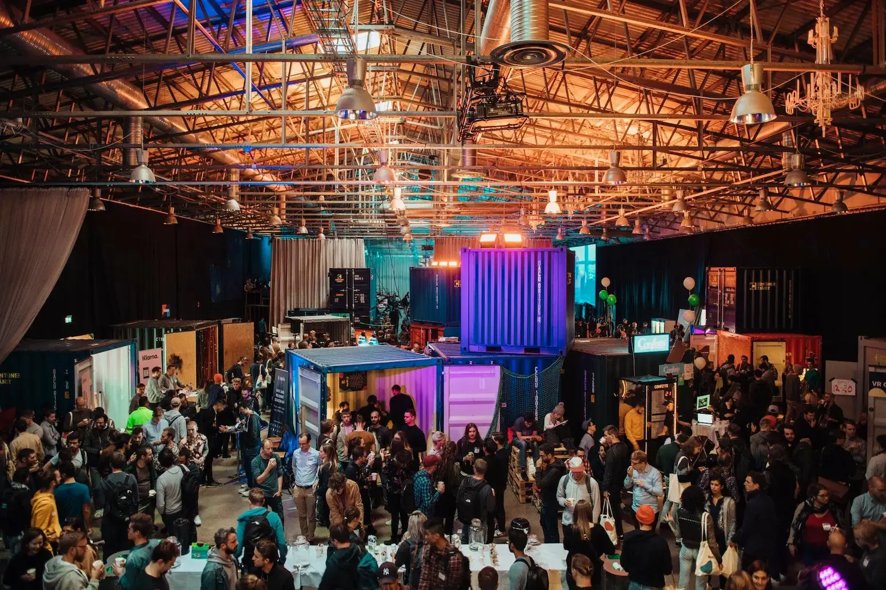
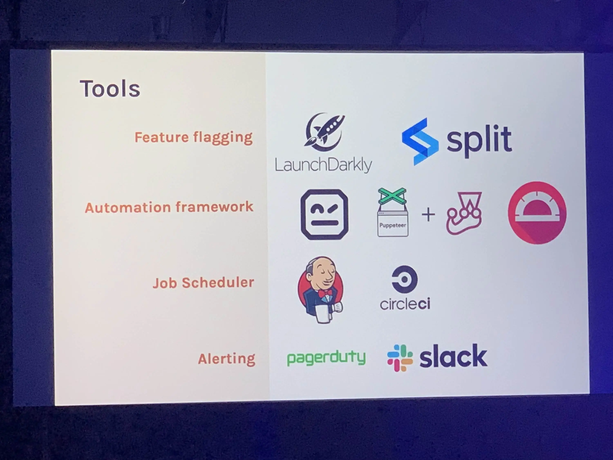
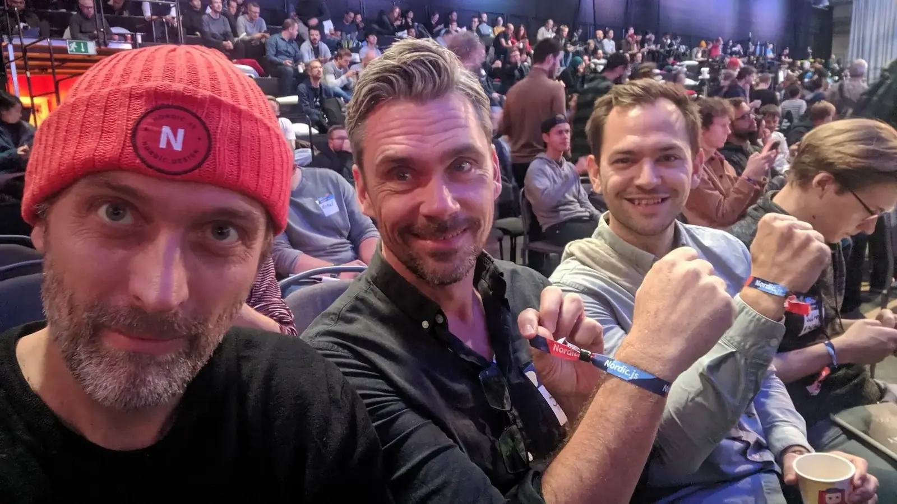

The 9th version of the [Nordic.js](https://nordicjs.com/2019) conference took place at Magasin 9 near the harbor of Stockholm.
The whole frontend team was invited, and three of us were able to attend (Rasmus, Themi and Jonas).
It was our first trip to a conference as a team, and it was nice to spend time with colleagues outside of the office, away from desks and keyboards.

The conference has, as the name indicates, focus on JavaScript. Time has changed and JavaScript isn’t just JavaScript anymore, so it is always interesting to see a schedule with so diverse and broad topics.

The location was very hip, Magasin 9, a huge harbor building, that they had transformed into a large area with lots of activities for the attendants such as saunas, bathtubs, VR, board games, Silent Disco, plenty of interactive experiences, a barber and even free tattoos! They really wanted the conference to be fun and playful, emphasized by the selection of two very colorful hosts.



## Thursday

_First conference day out of two._

### David Khourshid - Mind-Reading with Adaptive and Intelligent User Interfaces

David Khoursid is a software engineer for Microsoft and he did an exciting talk on Adaptive and Intelligent User Interfaces. He used javascript library Guess.js to demonstrate how to integrate elements of machine learning in order to build UI that predicts what the user is about to do.

Based on collecting data over time it’s possible to e.g shortcut actions for the user, and the goal for this could be to give the user a more streamlined and efficient experience with an app or website (or other types of interfaces).

He is advocating the concept of Model Driven Development that works with finite state machines, hierarchical states and state charts that maps out states and events, giving possibilities upon to predict the next state or event in the user flow. He showed how a library of his creation - XState - that can be used for controlling these flows. At the end of the talk we saw a simple code example on how to "train" a form with a feedback button to shortcut the flow and predict what the user is going to do, based on his former actions. He did an interesting and engaging talk - but it was also clear that it takes a lot of work and deep dive analysis to develop like this - to make your applications adaptive to the users behaviour and choices.

### Mark Volkmann - Svelte

A new javascript framework is on the rise! [Svelte](https://svelte.dev/) is the name of the latest approach to build web apps. It has a minified syntax, a Moustache like templating system and built in reactivity (no need to set up complicated state bindings). Each component has its own file that contains all necessary HTML, CSS, JavaScript and special Svelte syntax JavaScript. It all compiles to native JavaScript in bundles that are much smaller than other frameworks.

Seeing it demonstrated was a mixed experience. While it did seem fast and easy to write a component, it also looked a bit like a step backwards with the almost Moustache like templating concept. Sass and TypeScript is not yet supported out of the box, though it seems there’s some hack available for making those tools work.

We like new things and ideas, but even though there are definitely some interesting features, we all felt a little sceptic at Svelte. Mostly because it was difficult to see how this could be a wise choice for building medium to larger corporate size apps and websites with a higher complexity than your average JavaScript demonstration go to example, the To-Do-List!

At the same time Svelte does seem to gain some traction, so we will probably keep an eye on its development.

### Isabela Moreira - Localization

As default we are using localization in our web and mobile apps, but you can always learn something new, so it was interesting to hear a talk about localization and what learnings the speaker had made.

The speaker, Isabela Moreira, made good points about what is important to keep in mind when building apps that needs to work in more languages across the global, for example bidirectional text, unicode, and string concatenation, so having hardcoded strings makes it very difficult to have a dynamic UI. A good point about string concatenation was that trying to do it manually is a bad idea, as language are very different. For example consider the string: "No new messages", here you could be tempted to make the translation string like: "No new {{type}}" and then pass in the type, but in other languages the adjective "new" might change based on the noun, so it is always recommended to translate as a single unit.

She showed us a way to setup the infrastructure in a React App using a localization library called [react-intl](https://github.com/formatjs/react-intl) which will handle the localization and allows you to do more advanced formatting like pluralization, numerical values, currencies, and interpolation.

At Nodes we have been using [react-i18next](https://react.i18next.com/) which is another popular localization tool.

### Godfrey Chan - Thinking in TypeScript

At Nodes we recently took a decision to move into the world of TypeScript, so we were very happy to hear that there were two TypeScript focused presentations. Godfrey Chan gave a very good introduction to TypeScript, with multiple examples that showed how you get better feedback while writing code, but also how it improve documentation, readability and maintainability.

As an example, in JavaScript you are allowed to change a variable to any type you want:

```js
let value = "hello";
value = 2;
value = false;
```

The editor and the browser will not complain about this, so it requires the developers to be super careful as you can’t rely on variables being a certain type. But in TypeScript, you have the opportunity to define that variable has to be a certain type and if it is changed to something else, then you will get an error message before it is compiled, hence prevent errors in the browser.

```js
let value = "hello";
value = 2; // error: Type 'number' is not assignable to type 'string'
```

In relation to documentation, Godfrey made a really good point about how defining types actually makes it easy to understand code that somebody else have written. Let’s look at an example:

```tsx
function greetingsFor(name: string): string {
  return `hello, ${name}!`;
}
```

Here we can easily read from just the first line that the function expects a parameter `name` of the type `string`, and that the function will return a `string`. If that information was not there we would have to go into the function and actually see how the parameter was being used to make some assumption about what type it is, and what the function eventually will return. Potentially a lot of guesswork and crossing fingers, but with TypeScript you will immediately get feedback when calling the function as seen below:

```tsx
greetingsFor(5); // error: Type 'number' is not assignable to type 'string'
```

In conclusion a very good introduction to the basics of TypeScript.

### Robert Zhu - Full Stack Type Safety with React, GraphQL, and TypeScript

Followed right after the introduction to TypeScript, was a more in depth talk by Robert Zhu about how one can build an advanced type-safe web app with React, GraphQL, and TypeScript. In his talk he walked us through an implementation of the classic ToDo list app, but taken to the next level by using GraphQL and TypeScript. A very interesting part was the library [TypeGraphQL](https://typegraphql.ml/) that links TypeScript and GraphQL very nicely together as you only need to define the schema once and then you will get that autocomplete magic.

## Friday

_Second and last conference day._

### Rachel Andrew - Refactoring (the way we talk about) CSS

Rachel Andrew is part of the CSS working group and talked about some of the future parts of CSS, that affects the way CSS is used for building layout systems. We learned that there’s gonna come some changes in the way we have to think about layouts. Where we normally think in vertical and horizontal dimensions or in the flex-box Axis dimensions, we will get a new concept of a Block-dimension and an Inline-dimension, that are independent of Axis, along with different writing modes, that can shake things up.

As an example, a normal block-element (being in a block formatting context) will have a default writing-mode of horizontal and will fill the screen in a horizontal axis (block axis). By changing the writing mode to vertical the box will change to inline formatting context and now fill the screen vertically.

These concepts supplemented with many new CSS properties aim to make it more intuitive as a developer to handle flow of content blocks, distribute space around items and handling appropriate heights and widths of container elements. In short the new specs will describe a more robust and versatile system to build layout with.
Browsers are not yet supporting many of the specs, but in her view, we should all start learning these specs today, and as a sidepoint stop teaching old specs to beginners and let them start fresh with the new specs.

### Piérre Reimertz - Gettin’ into the (Tensor)Flow

Very funny session about machine learning and the use of TensorFlow, an open source machine learning platform. The speaker Piérre Reimertz was quite new to the subject but made a very entertaining speak with a 30 minutes hands-on demo.
With a ukulele in hand he trained his laptop to predict the coming tones based on the tones he was actually playing. It definitely inspired us to not worry too much when you want to try out a new technology. Just trying out new libraries and technologies can broaden your horizons, and maybe one day you will need it for a real project.

### Talia Nassi - Testing in Production

Interesting speak from Talia Nassi, Test Engineer from WeWork. She talked about the fear of testing in production and why we should actually try it out. Her point was that Test Environments usually are not updated with newest content and configurations, which make testing hard to do and make them unreliable.

Her approach was to expose new features and updates only to a selected group of users, hidden by a flag, login or secret URLs. Talia shared an interesting tool called [Split.io](https://www.split.io/) that allows you to do this in your app, so we will definitely check it out.

We all found it very interesting but also hard to maintain in the real world. Especially when you are a large team of developers with a lot of dependent components across the site. However, we have also experienced that different parts did not behave the same way in testing and production environments, so maybe it could be an interesting approach to test out on a project.



### Katie Fenn - Memory: Don't Forget to Take Out the Garbage

It is not very often that you stop up and peak into the memory tab in the browser to investigate how much memory your application is using as we have automatic garbage collection for memory management. But from time to time, we do get memory leaks, which can be caused by several things. Katie Fenn took us on a journey into the deep dark corners of memory management with the talk: "Memory: Don't Forget to Take Out the Garbage". Katie showed some of the common mistakes one might make and how to address the issue. A very good point was made on scoping variables within functions, because creating global variables will not be wiped by the garbage collector.

```js
function repeat() {
  results = []; // ← global
  for (var i = 0; i < 1000; i++) {
    results.push(i);
  }
}
```

Using a scoped variable instead would allow the memory to be reclaimed when the function is done executing:

```js
function repeat() {
  var results = [];
  // OR
  let counts = [];
```

Using `const` is also another way to tell the browser engine that it can do any optimizations it wants as the basic value will not be changed.

Another common pitfall is forgetting to unsubscribe event listeners or clearing intervals, so the browser never frees up the memory and keeps unnecessary data. Finally, Katie demonstrated how the powerful devtools in the browser can easily profile the web app and investigate the memory management.

### Vitaly Friedman - Designing and Building With Privacy In Mind

It was very interesting to see that Vitaly Friedman was on the program of Nordic.js, he is the co-founder and editor-in-chief of Smashing Magazine, and has given many inspiring talks and workshops.

In this talk, Vitaly focused on exploring the importance of privacy, and how we should design and build applications with a different mindset that what we see now. We all see the annoying GDPR cookie banners, push notifications, video autoplays, ads, pop-ups, but does it really have to be that way.

Vitaly shared some interesting points on Terms and Conditions, that we are basically giving away data left and right when ever we are accepting cookies, but there is actually a service that can help us understand what our rights are: [https://tosdr.org/](https://tosdr.org/).

Instead of tricking users into accepting cookies and whatnot, then we should not only be implementing privacy by design, but also allowing the user to better understand what the data is used and allow users to use the core functionality without tracking.


### Code in the Dark

Awesome event! Who can code an HTML page without previewing the result?

The rules are simple

- You have 15 minutes
- Everyone uses the same Code in the Dark editor
- In the beginning of the competition you will get a simple design and the required assets
- No previewing of the result
- The audience can follow your typing on large screens
- When the whistle blows the audience vote for a winner, the best implementation wins

Around 30 Frontend Developers participated for this event. First 2 semi final heats with 10 participants, then the final with 2 winners from each heat. To put the stress levels to a maximum, loud techno-music and smoke machines were blasting out, but the participants were fully focused and typing away.

In the final the participants had to implement the Slack logo – a nice challenge that can be solved in many ways. Finally, the winner was found, he did a good attempt on the Slack logo and he got an enormous trophy and lots of credit from a very excited audience.


## Awesome and fun conference!

We would like to thank [Nordic.js](https://nordicjs.com/2019) for arranging a really good conference! It has been an interesting couple of days with excellent talks, fun new libraries, and some learnings that we can definitely take with us home to improve our daily programming.

We did enjoy the diverse JavaScript conference with more general talks, but we would prefer longer talks as 30 minutes only allowed the speaker to give a brief talk instead of going more in depth and provide even more valuable information.

For next time, we will try to attend a more ReactJS specific conference to see if we can get even more applicable knowledge as well as joining a workshop where we can get hands-on experience with new libraries and technologies.


