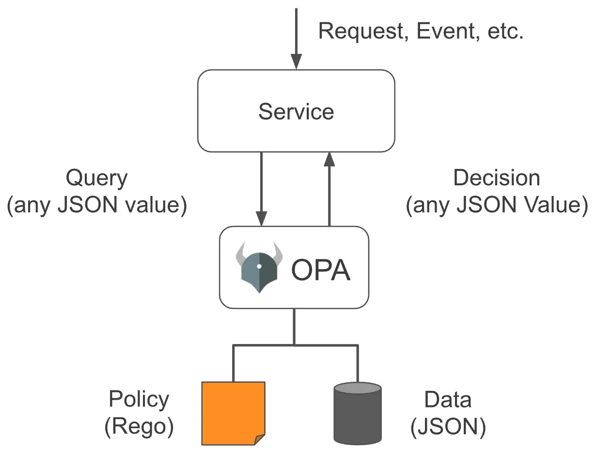
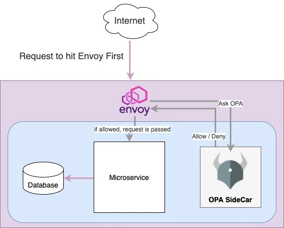

Authorization and Authentication (AuthZ and AuthN) are very critical parts of any system for identity and permissions validation and enforcement, **AuthN** is basically the process to verify who the user is, while **AuthZ** is the process of validating the user’s permissions to access or perform certain functions/actions.

There are plenty of identity providers to handle the AuthN part, however in this blog post, we are going to cover the AuthZ, the permissions validation and enforcement.

In any decent backend (e.g. Rest APIs, Event Processing), we certainly need to verify the identity and permissions, traditionally we will have a code similar to the below somewhere in the implementation to check for AuthZ:

```ts
    if ( !user.hasRole("admin") ) {
        throw Error("Not Authorized").
    }
```

Depending on the permissions model implemented (e.g. RBAC, ABAC), the above code could be slightly different, but in general, the idea is to enforce certain rules to make sure that we don’t over or under expose the data, that is what is called **“Policy Enforcement”**.

With that in mind, policy enforcement is traditionally tightly coupled with the business logic implementation, and any change to the rules, means business logic needs to be updated as well. This is where Open Policy Agent (OPA) comes in handy, it allows developers to manage policies as code and offers the possibility to have centralized policy management.

> The Open Policy Agent (OPA, pronounced “oh-pa”) is an open source,
> general-purpose policy engine that unifies policy enforcement across
> the stack. OPA provides a high-level declarative language that lets
> you specify policy as code and simple APIs to offload policy
> decision-making from your software. You can use OPA to enforce
> policies in microservices, Kubernetes, CI/CD pipelines, API gateways,
> and more.” - [OPA Website](https://www.openpolicyagent.org)

OPA allows us to define policies and rules in a declarative way as code (in REGO language), and use the OPA API or libraries to make a decision based on the previously defined policies.


_Image source: [OPA Website](https://www.openpolicyagent.org/docs/latest/)_

As per the Diagram above, we give OPA a policy and some data (JSON), and whenever a request (e.g. REST API call) or an event (Kafka or RabbitMQ) comes in, OPA will make a decision based on the data and request/event payload, and then we can allow or reject the request based on the outcome.

    allow {
    	input.method = "DELETE"
    	input.path = ["posts", postId]
    	input.user = user.roles['admin']
    }

## Fine-grained permissions on REST API endpoints

When implementing any REST API endpoint or event handler, more often than not, we need to perform two things to check permissions:

1. **Resource Access**: can the user access this endpoint (has a role or access level)? Example: a reader cannot delete a post.
2. **Resource Ownership**: if the user can call this endpoint, we might need to filter by ownership, and allow access to resources he owns only. Example: an author can only edit/delete his own posts (so even if he can access the endpoint `PUT /posts` and `DELETE /posts`, but some ownership filters apply).

Implementing the above inside the endpoint code can make the code look a bit redundant and policies and rules are repeated many times.

We can give OPA the data (e.g. users, roles, permissions) and policies (rules, who can access what and when) and we can solve both problems in an elegant and centralized way.

## OPA Deployment Approaches

There are multiple ways to integrate OPA in a solution, depending on the goal and the case of every solution.

### OPA as Library in projects

OPA offers a Go library that simplifies the integration of policies and queries for Go based projects, there are also other libraries and integrations such OPA WASM (Web Assembly).

The advantages of using a library is simplicity and it offers a quick way to start using OPA right away without having to interact with an external OPA server or REST API.

However, as of now, the only officially supported library is for Go based projects, if your project is based on another stack, then this approach won’t be helpful.

### OPA as an external service

Another approach is to deploy OPA as an external service and use its REST API to query and make authorization requests and decisions.

This is especially useful in a Microservice-based environment, where multiple services need to query OPA for policy and authorization decisions, it allows for a single centralized AuthZ service, and enforces Separation of Concerns principle at this level.

This approach works fine in most cases, but there are two major problems that arise when the scale of the environment grows:

1.  The services need to be aware of OPA server, and they still need to implement certain logic to interact with OPA REST API.
2.  If OPA is down for some reason, this means other services cannot operate properly.

To solve these issues, we can enhance this approach even further by adding a proxy and using the sidecar pattern.

### OPA as a sidecar

> This pattern is named Sidecar because it resembles a sidecar attached
> to a motorcycle. In the pattern, the sidecar is attached to a parent
> application and provides supporting features for the application. The
> sidecar also shares the same lifecycle as the parent application,
> being created and retired alongside the parent -
> [Microsoft Docs](https://docs.microsoft.com/)

The idea is to deploy OPA as an isolated service that lives next to the main services (each Microservice will have its own OPA instance), this will reduce latency problems since both the service and OPA will share the same network.

This pattern eliminates the single point of failure, since every service is now completely independent to make AuthZ decisions, and if one OPA goes down, this will not affect the other services.

But we still have the other issue, the services still need to be aware of OPA, how can this be resolved? - Service Proxy, specifically Envoy Proxy ([https://www.envoyproxy.io/](https://www.envoyproxy.io/)).

Envoy is a service proxy used frequently in Microservices environments, and offers several features such as Service Discovery, Edge Proxy, Health Checks, Load Balancing and more.

Envoy allows us to wrap our service (Microservice + OPA Sidecar in this case), and every request hitting the service will be first received by Envoy, and with the help of the “External Authorization” feature offered by Envoy Proxy, we can separate the AuthZ decision making from service implementation and put it on Envoy Proxy.

We give Envoy the OPA address, and it will ask for a decision every time a request is received.



## Conclusion

Combining Policy as Code engine with Microservices in a Sidecar pattern offers a huge improvement in terms of resiliency and reliability, although that setup is not as straightforward as other classic approaches.

## Resources:

1.  [OPA Documentation](https://www.openpolicyagent.org/docs/latest/)
2.  [Envoy Proxy](https://www.envoyproxy.io/docs/envoy/latest/)

_Article Photo by [Christopher Gower](https://unsplash.com/photos/m_HRfLhgABo)_
