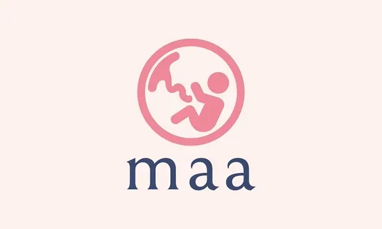

Machine learning (ML) is expected to make the hunt for new health care quicker, cheaper, and more effective. It could be taught to identify concerning trends quickly, while also improving its models over time and potentially proposing courses of action.

> ### Highlights
> * The reduction of child mortality is reflected in several of the United Nations' Sustainable Development Goals and is a key indicator of human progress.
> * The UN expects that by 2030 countries will end preventable deaths of newborns and children under 5 years of age, with all countries aiming to reduce under‑5 mortality to at least as low as 25 per 1,000 live births.
> * Parallel to the notion of child mortality is of course Maternal Mortality, which accounts for 295 000 deaths during and following pregnancy and childbirth (as of 2017). The vast majority of these deaths (94%) occurred in low-resource settings, and most could have been prevented.

ML is a computational field that over the last decades has been constantly showing its potential and gained relevance and importance in multiple disciplines, one being Health Care. There is a large number of scientific studies demonstrating and showing how ML can contribute to significantly improving aspects related to the health and wellbeing of groups and individuals. Ending preventable maternal death still remains at the top of the global agenda. ML can be trained to interpret and learn from real-time data such as fetal heart rate signals, contractions, and vital indicators. Mothers at risk of morbidity during the intrapartum and postpartum periods might be diagnosed by applying predictive analytics using ML.

### Introducing Maa

Figure: Maa Logo

As part of the [MonstarHacks](https://www.linkedin.com/showcase/monstarhacks) 2021, our team decided to tackle the [3rd UN Sustainable Development Goal - Good Health and Well-being](https://sdgs.un.org/goals/goal3). Maa is the One-Stop service for Pregnancy and Childbirth. It is responsible for collecting health records and diagnosis reports from patients using Mobile apps which will then be analyzed using ML to take any preventive measures. In case of any critical health condition, Maa will suggest what necessary steps should be taken and even provide medical support.

<figure>
  {{ youtube-link="FmS3YCkX6qM" }}
  <figcaption style="text-align: center;">
  	Maa iOS App Prototype
  </figcaption>
</figure>

### Overview
Our system is aiming to play a vital role for women to receive health care before, during, and after pregnancy to decrease the risk of pregnancy complications. To maintain the service properly and keep the chain stable we need to monitor the system closely. Hence, the admin portal has been created with some key features such as:

* View the total number of patients, nurses (active and inactive), appointments, ambulances, and whatever else is needed.
* Submit medical reports for the patients.
* View and compare various types of data by date, time, and year.
* Rewarding nurses based on their performances (e.g. nurses of the month).
* Chat option with patients.

It's hard to come up with all the necessary features at the very beginning of the development stage. As of right now, we have implemented the data visualization dashboards and system reports to get a high-level overview.

### Where we are now
We have built a fully functional and deployed a REST API Service of “Fetal Health Predicting” to facilitate Maa app’s Prediction and Assistance features. In the mobile app, an expecting mother will fill the required fields (22 parameters of her cardiotocography result) and a prediction of the fetal health as “Normal”, “Suspicious” or “Pathological” will be returned by the Prediction API with ~95% accuracy.

Our dataset had 22 columns. 21 among those columns were various features of the [Cardiotocography](https://en.wikipedia.org/wiki/Cardiotocography) result. The last one indicates the fetal health for the row values. Fetal health 1.0 means Normal, 2.0 means Suspicious, 3.0 means Pathological.

We did some simple data analysis on the dataset to find the mean, standard deviation, 1st quartile, and fetal health distribution analysis. We then found out the count plot of targets indicates an imbalance in data. This is a case that tends to provide misleading classification accuracy.

Figure: Plot indicating an imbalance in data

In this kind of scenario, the performance measures that would provide better insights are :

* Precision
* F1 Score
* Confusion Matrix
* Recall

Let's evaluate the result of the correlation matrix. Which is as follows:

Figure: Correlation matrix

Considering the results of our data analysis we chose 4 algorithms that might be the best fit to gain higher accuracy to predict fetal health better.
Then we ran these algorithms on our dataset to see which algorithms give us the best accuracy.

The result is as follows:

	Logistic Regression: 0.897170
	Decision Tree: 0.916683
	RandomForest: 0.940205
	SVC: 0.906594

As Random Forest was the clear winner we trained a model using this algorithm.
Then we have converted the ML model into REST API Service using python-based framework [FastAPI](https://fastapi.tiangolo.com/) and deployed it to [Heroku](https://www.heroku.com/).
Finally, we developed an iOS Application that consumes the API and shows results to the end-users.

We used React.js and Typescript with Ant design to build our dashboard. Since Ant Design provides us with a variety of UI components, we can enhance our web applications and keep improving our user experience. To visualize our data with a graph we used React Chart Js. The react components come with [chart.js](https://www.chartjs.org/) and the most popular charting library.
We deployed our react app to [Netlify](https://www.netlify.com/) as it is very convenient and easy to deploy any `create-react-app` with just a single click.

The dashboard shows us how the system works by displaying various metrics. Due to a lack of health workers and data, the dashboard allows us to know whether we are on track to achieve our goal. And it improves monitoring in a resource-constrained environment.

Figure: Maa system design

### Extensible Learnings
Along the way, we went through different challenges and learned numerous new frameworks and tools such as:

* **Deploy API to Heroku**
* **Hands-on Machine Learning**
* **Converting an ML model to Python API**
* **ML model evaluation using Confusion Matrix**
* **Jupyter**
* **FastAPI**
* **CareKit**
* **HealthKit**
* **FHIRModels**

One of the challenges worth mentioning was to train the ML model. It took over nine hours to train the model to work with. But eventually, we did it. We have taken some missteps and hopefully, we learned a lot from those experiences.

### Information is Key
Patients' health data and medical records are invaluable for predicting maternal morbidity. With predictive analytics and ML, you’re able to unlock a new world of possibilities for reducing data rates related to pregnancy, and help better tailor severities and also reduce the treatment cost.

> Today the greatest risk of global catastrophe does not look like nuclear weapons or war. Instead, If anything kills over 10 million people in the next few decades, it is most likely to be a highly infectious virus rather than a war. - Bill Gates

Even in the pinnacle of science and technology we are trembled by pandemics like Covid-19. One of the key reasons is the lack of relevant information. We can overcome this scarcity by utilizing ML based health care systems to simulate different environments. Covid-19 is an early warning, a wake-up call, to get ready. If we do not start now, it will be too late to get ready for the next epidemic.

### Closing Thoughts
ML simplifies the lives of patients, doctors, and hospital administrators by performing tasks that are typically done by humans, but in less time and at a fraction of the cost. ML-based health care can help to improve the universal provision of health services, especially in the most disadvantaged areas, even during pandemics.

_Article Photo by [Eduardo Goody](https://unsplash.com/photos/typEuT_5Tzc)_
