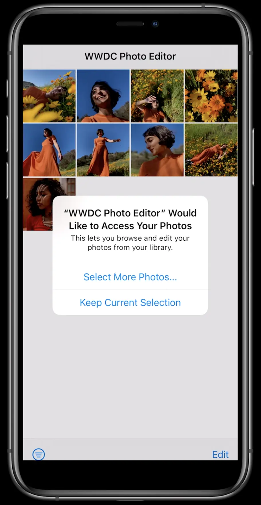
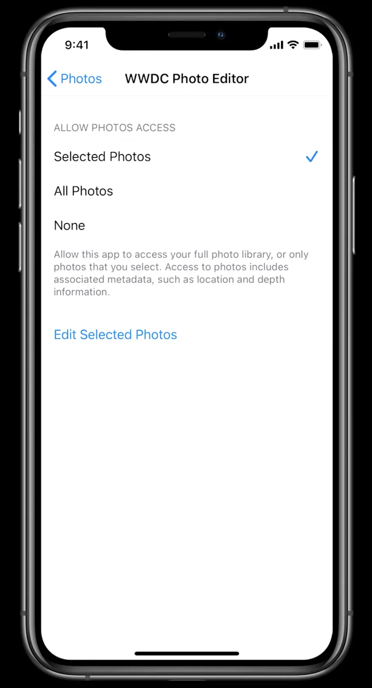

Apple always takes care of Privacy. Prior to iOS 14, for accessing photos, users were prompted with two options **Don't Allow** and **OK**. To use a feature that actually only required limited access, users still had to expose their entire photo library. This year Apple introduced new tools that give users more granular control over the data they share. Let's see what's new in iOS 14 for accessing Photos in detail.

### Photos

Apple introduced the `Limited Photo Library` feature, allowing users to select specific photos rather than giving access to their entire Photo Library. The new prompt for accessing the Photo Library provides 3 options **Select Photos**, **Allow Access to All ‌Photos**‌, or **Don’t Allow**. The **Select Photos** option lets users choose specific photos. This is what the new prompt looks like:


_Image source: [Apple](https://developer.apple.com/videos/play/wwdc2020/10676/)_

There are two ways to modify the photo selection of your app:

1.`From Prompt:` Once per app life cycle, when assets are fetched via PhotoKit, the user will be prompted with two options, **Select More Photos** and **Keep Current Selection**


_Image source: [Apple](https://developer.apple.com/videos/play/wwdc2020/10641/)_

2.`From Settings:` Additionally, app-level photo access can be modified from `Settings` -> `Privacy` -> `Photos` -> Your app, which shows the **Edit Selected Photos** option for updating the selection.


_Image source: [Apple](https://developer.apple.com/videos/play/wwdc2020/10641/)_

### PHPicker

For selecting images/videos without requiring Photo Library access, Apple introduced **PHPicker**. which is a replacement for UIImagePickerController.

_"PHPicker is the system provided Picker which allows you to get access to photos and videos from the users photo library" - Apple_

**Features**

- Improved with search and multi selection
- No direct access to user's Photos Library required
- Supports fluid zooming in the grid
- Provides user-selected photos and videos only
- Runs in a separate process, containing app cannot take screenshots

**Components**

1.`PHPickerConfiguration and PHPickerFilter:` You can specify your photo/video selection limit and apply a filter for selected items by using two optional properties, **selectionLimit** and **filter**.

```swift
var configuration = PHPickerConfiguration()

// Set 0 for unlimited selection, default is 1
configuration.selectionLimit = 0

// Only show images(including Live Photos)
configuration.filter = PHPickerFilter.images

// Only Videos or Live Photos, but no images
configuration.filter = PHPickerFilter.any(of: [.videos, .livePhotos])
```

2.`PHPickerViewController:` Initialize PHPickerViewController with the above configuration and assign a delegate. The client is responsible for presentation and dismissal

```swift
let picker = PHPickerViewController(configuration: configuration)
picker.delegate = self
present(picker, animated: true)
```

3.`PHPickerResult:` For handling results, a **PHPickerViewControllerDelegate** delegate method will be called with an array of PHPickerResults. If the user cancels the selection, the array will be empty.

```swift
func picker(_ picker: PHPickerViewController, didFinishPicking results: [PHPickerResult]) {
   picker.dismiss(animated: true, completion: nil)

   // Get the first item provider from the results
   let itemProvider = results.first?.itemProvider

   // Access the UIImage
   if let itemProvider = itemProvider, itemProvider.canLoadObject(ofClass: UIImage.self) {
       itemProvider.loadObject(ofClass: UIImage.self) { image, error in
           if let image = image {
               //Do something with the UIImage
           }
       }
   }
}
```

## References

- [Build trust through better privacy](https://developer.apple.com/videos/play/wwdc2020/10676/)
- [Handle the Limited Photos Library in your app](https://developer.apple.com/videos/play/wwdc2020/10641/)
- [Meet the new Photos picker](https://developer.apple.com/videos/play/wwdc2020/10652/)

_Article Photo by [Apple](https://www.apple.com/newsroom/2020/06/apple-reveals-lineup-for-its-biggest-ever-worldwide-developers-conference/)_
