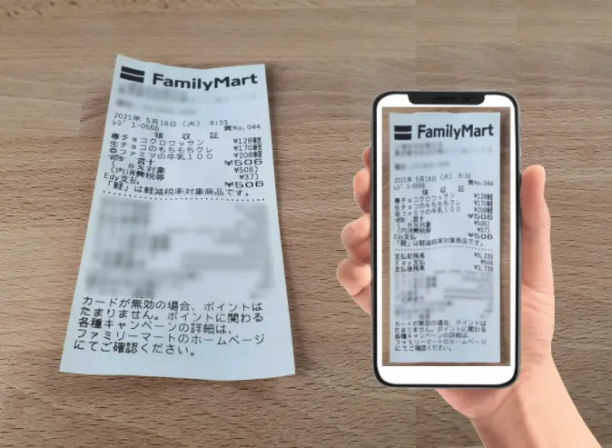
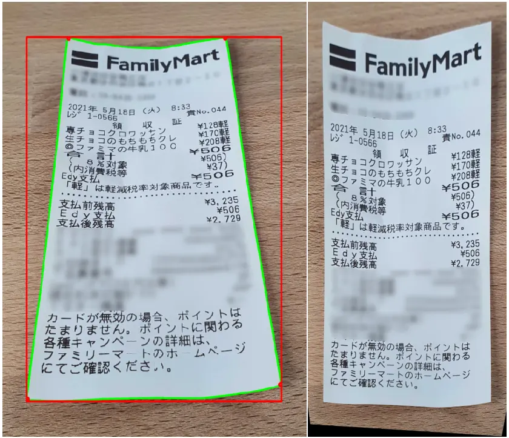
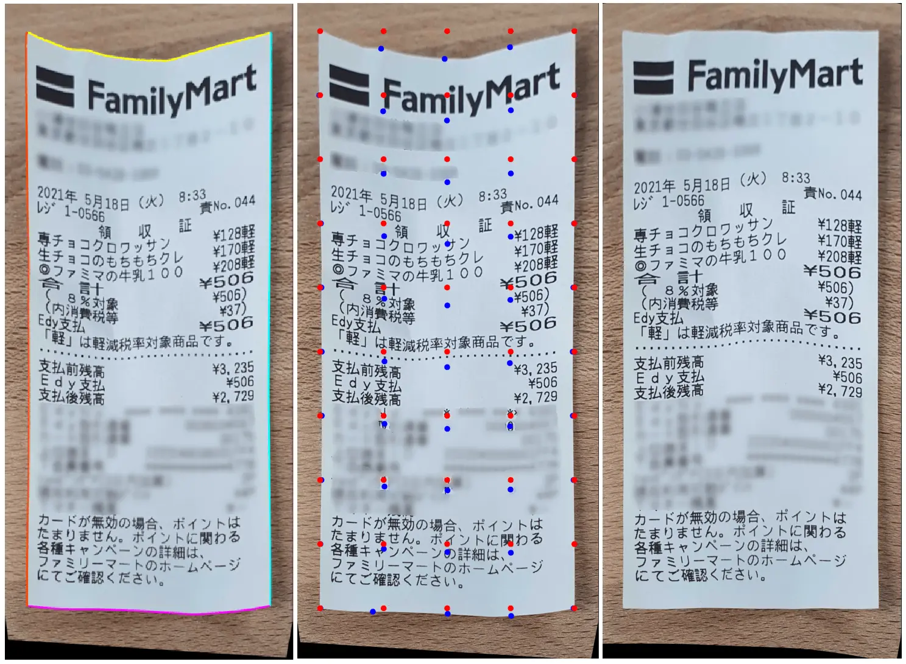
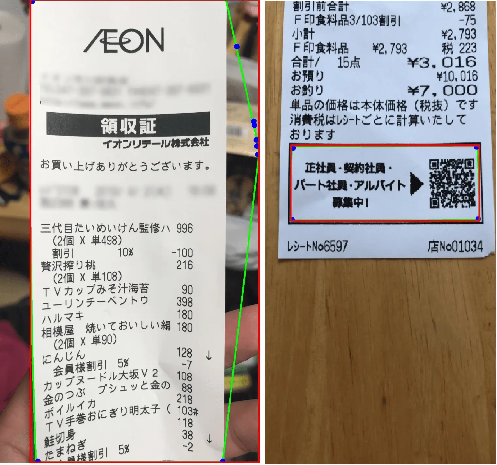
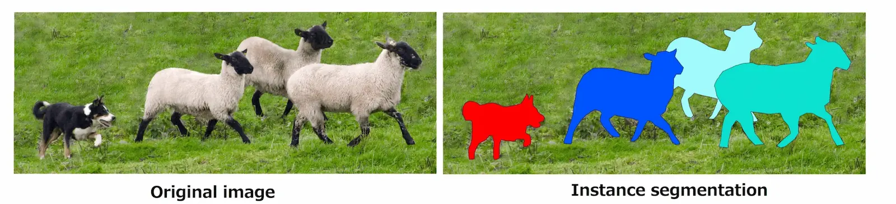
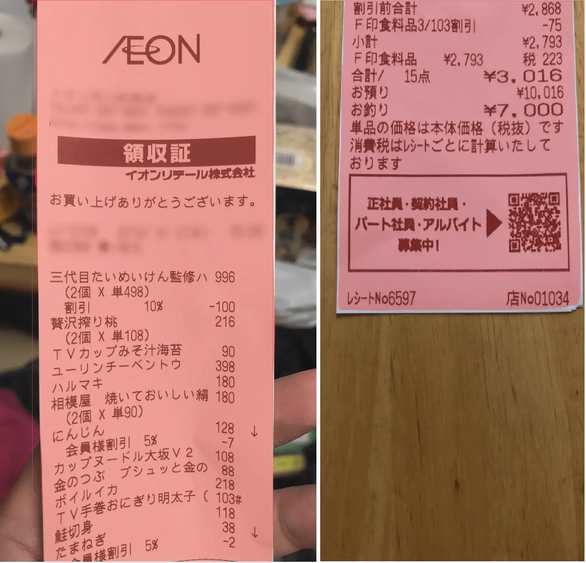

In this article, we will demonstrate how computer vision and deep learning can achieve receipt recognition and enhancement of its observation. Moreover, we will present how training data was created in a semi-automated way using computer vision.

You should read this if you are interested in:

- Deep learning
- Computer vision
- Semi-automatic data generation

## What's this about?

Improvement of the usability and accessibility of AI-related technologies steadily increase their spread in our daily life tasks.
Thus, receipt recognition and understanding of its content has various applications such as human resource invoice check, accounting or document parsing and analysis.

In order to democratize its use, it is often easier to perform it using pictures from a smartphone. Unlike scanned receipts, which require a scanner machine, pictures taken from smartphones do have a lot of sources of noise (picture background) that makes the task of accurate receipt recognition harder.

To achieve the goal of receipt recognition, two approaches are considered:

- **Computer vision**, referred to as **CV** in this article: apply various transformations to the input image in order to retrieve receipt location in the image and enhance its observation.
- **Deep learning**, referred to as **DL** in this blog: retrieve receipt location in the image using a trained model to be able to enhance its observation.

DL is sometimes overkill as CV can solve a problem much more efficiently and in fewer lines of code. However, CV does not work in every situation and use of DL can make the recognition of receipt more robust.

We will investigate both approaches in this blog to see their outcomes and conclude on how to achieve performant receipt recognition.

## Procedures

The different steps of receipt recognition and enhancement of its observation are (technical terms are explained in the following section):

1. Find the **contour** of the receipt in the image.
2. Apply **affine transformation** to vertically rotate the receipt.
3. Retrieve the corners of the receipt.
4. Apply **homography transformation** using corners and enclosing **bounding box** corners.
5. Compute the grid mapping of the receipt between its contour and the corresponding bounding box.
6. Apply **thin plate spline transformation** to undistort the receipt.

Among the operations described above, step 1 is the most crucial as the contouring operation controls the success of the following operations.

Thus, step 1 will be achieved by using both CV and DL, while the following steps will be done using CV, only.

## Computer vision operations

In the above section, the different steps for achieving receipt understanding and enhancement was shown. In this section, the technical explanation of each step is proposed.

**Contouring** is a boundary detection operation around a shape that has edges. A contouring algorithm can calculate the gradient of surrounding pixel values to detect a closed shape. This is a well-known problem in both CV and DL. Using the contour of the receipt and enclosing bounding box, we will vertically rotate the receipt using affine transformation.
A **bounding box** is the smallest rectangle with vertical and horizontal edges that surrounds an object (a receipt in our use case).
An **affine transformation** in CV is a set of linear transformations such a translation or a rotation of an image.

Figure: Figure 1. Original image, contouring & bounding boxes estimation, rotated receipt sentences.

**Homography operation**, also referred as planar homography operation, is a transformation that maps points in one image so you can observe this image in a different point of view. This is used in this case to rectify the image and modify its yaw/pitch/roll angles, simply speaking, so you can observe it from the top.

Figure: Figure 2. Original image and its modification of observation using homography.

**Thin plate spline operation** is an operation that can be used to rectify image distortion by applying a spatial mapping from two sets of grids, while interpolating the values in these grids.

Figure: Figure 3. Contour parsing analysis, source (blue dots) and destination (red dots) grids retrieval, and thin plate spline transformation to undistort the receipt.

Regarding the images above, it seems that CV could be sufficient to achieve ticket recognition and enhancement of its observation. However, Contouring depends on image background, receipt condition (crumple receipt) or bright spot of the image, among others.

Here is an example of missed contouring operations that leads to failure.

Figure: Figure 4. Failed contouring operation (green) and bounding box estimation (red).

To overcome this issue, DL is considered as it can handle complex recognition tasks that CV could not perform.

## Deep learning operation

### Instance segmentation

Deep learning is a subset of artificial intelligence that aims to map input data through layered models to estimate variables as a classification or a regression problem. Input data can take the form of images, text, tabular data or time series signals. Output data can take any form we like it to take (segmentation mask, binary variable, vector, ...).

Instance segmentation is a subset of deep learning that consists in detecting distinct objects of interest appearing in an image. It treats multiple objects of the same class as distinct individual instances as it produces distinct per-pixel segmentation masks for each instance.

Its advantage in our case is that it gives a segmentation mask that can be used as a receipt contour even though we have multiple receipts in one image.

Figure: Figure 5. Instance segmentation concept illustrated using COCO dataset samples.

Unlike CV, DL need training data to learn from, which we will discuss in the following section.

### Semi automated data generation

The amount of data required to train a deep learning model widely varies depending on the task you aim to achieve. As receipts have a simple shape and are often contrasting with the background, we expect to get good results with a few hundred samples.

However, since there is no available online dataset for receipt segmentation, we should create these data from scratch. Labelling from scratch is a hassling task that most AI engineers prefer to delegate as it can be repetitive and time consuming.
In our situation, we could estimate the contour of a receipt in an image using CV so creation of segmentation masks will be based on this approach.

In case the CV contouring operation would not perform well, the segmentation mask would be edited using a polygon data labelling software.

Thus, creating training data still takes time (review data creation to ensure its quality) but making it semi-automatic alleviates most of the burden.

## Contouring via deep learning

After training an instance segmentation model, problematic receipt images were tested.

Figure: Figure 6. Instance segmentation results on problematic images.

Thanks to previously created training data that was used to train an instance segmentation model, receipt segmentation masks could be estimated where CV fails to do so. As the contouring step could be performed correctly, the following CV steps were applied successfully.

## Summary

We demonstrated in this article how computer vision and deep learning could be combined or used separately to enhance recognition of a receipt from a picture taken from a smartphone.

Advantages of computer vision (straight forward use) could be used to remedy drawbacks of deep learning (need of training data) to create a robust receipt recognition solution.

From receipt recognition onward, computer vision steps were applied to enhance the observation of the receipt.

In order to improve the accuracy and robustness of our solution, the following tasks are considered for the deep learning approach:

-   Add more data in our training dataset.
-   Benchmark different backbones for the instance segmentation model.
-   Refine the deep learning results with computer vision.

_[Image source Figure 5: COCO dataset](https://cocodataset.org/)_

_[Article Photo by Karolina Grabowska from Pexels](https://www.pexels.com/photo/person-using-a-computer-and-holding-a-credit-card-and-receipts-4968390/)_
