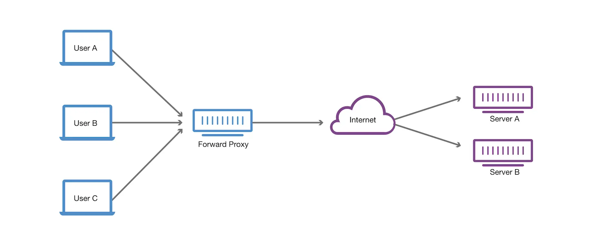
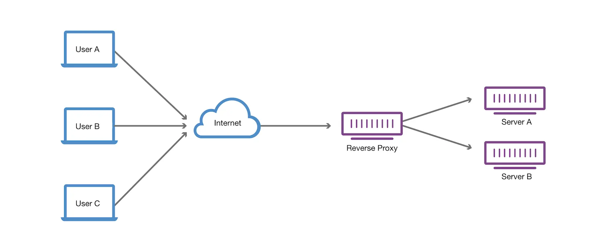
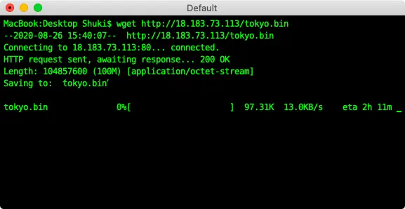
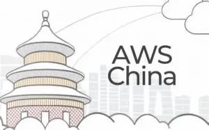
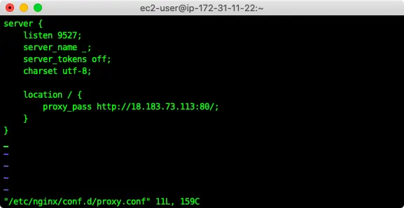
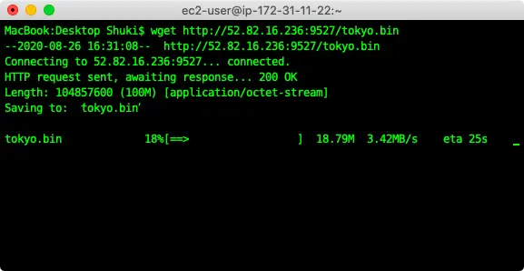

In computer networking, a forward proxy server, often called a proxy server, is a server application or appliance that acts as an intermediary for requests from clients seeking resources from servers that provide those resources. A proxy server thus functions on behalf of the client when requesting service, potentially masking the true origin of the request to the resource server.

## What Is a Reverse Proxy Server?

A proxy server is a go‑between or intermediary server that forwards requests for content from multiple clients to different servers across the Internet. A reverse proxy server is a type of proxy server that typically sits behind the firewall in a private network and directs client requests to the appropriate backend server. A reverse proxy provides an additional level of abstraction and control to ensure the smooth flow of network traffic between clients and servers.

### Common use cases of Reverse Proxy scenarios:

There is a multitude of scenarios and use cases in which having a reverse proxy can make all the difference to the speed and security of your corporate network. By providing you with a point at which you can inspect traffic and route it to the appropriate server, or even transform the request, a reverse proxy can be used to achieve a variety of different goals.

#### Load balancing

A reverse proxy server can act as a traffic cop that sits in front of your backend servers and distributes client requests across a group of servers in a manner that maximizes speed and capacity utilization while ensuring no server is overloaded, which can degrade performance. If a server goes down, the load balancer redirects traffic to the remaining online servers.

#### Web acceleration

Reverse proxies can compress inbound and outbound data, as well as cache commonly requested content, both of which speed up the flow of traffic between clients and servers. They can also perform additional tasks such as SSL encryption to take load off of your web servers, thereby boosting their performance.

#### Security and anonymity

By intercepting requests headed for your backend servers, a reverse proxy server protects their identities and acts as an additional defense against security attacks. It also ensures that multiple servers can be accessed from a single record locator or URL regardless of the structure of your local area network.

## Let's do an experiment

I'm in Chengdu, China and I want to get a file which is placed on a server in AWS Tokyo, Japan. Due to the existence of the Great Firewall, it is very slow to access AWS Tokyo's resources in China. If I download the file directly, it would cost me about two hours.

Fortunately, the AWS company has three data centers located in Beijing, Ningxia, and Hong Kong. It's fast to connect any other AWS regions in the world with AWS China regions.

I already have an AWS Beijing EC2 instance and I will build a simple nginx reverse proxy server to accelerate the connections. I add the configs below in `/etc/nginx/conf.d/proxy.conf` which creates a virtual server with reverse proxy.

After saving the config file and restarting the nginx server, I can now download the file in AWS Tokyo via reverse proxy server at very high speed.

## Summary

The primary function of a reverse proxy is load balancing, ensuring that no individual backend server becomes inundated with more traffic or requests than it can handle. However, there are a number of other scenarios in which a reverse proxy can potentially offer enormous benefits. I hope you can use reverse proxy flexibly in daily work.

Article photo by [Anton Balazh](https://www.zdnet.com/article/nbn-fibre-to-the-world/)
