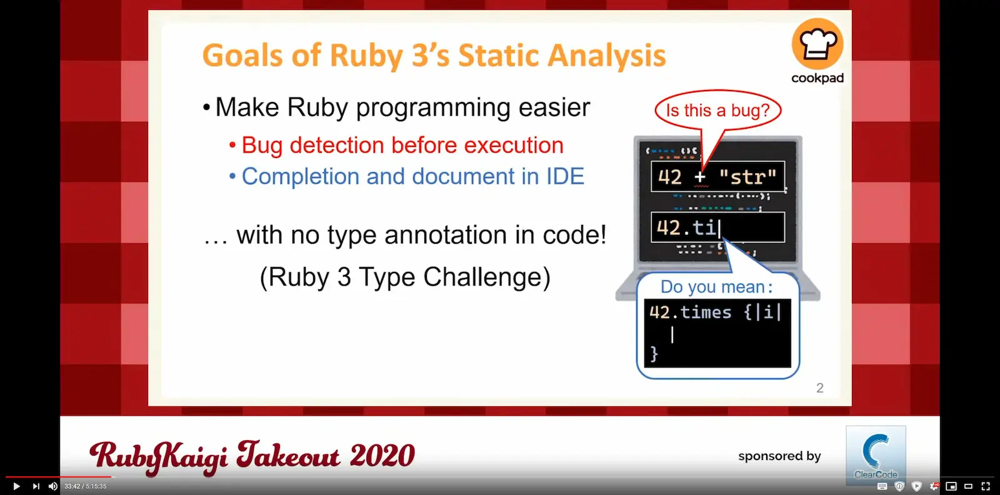
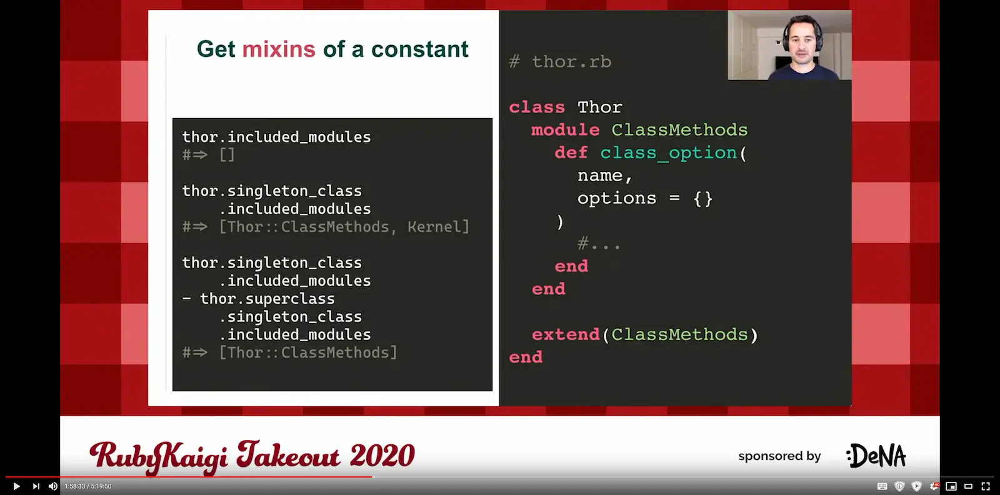
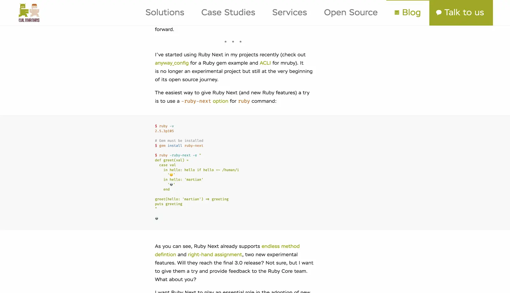
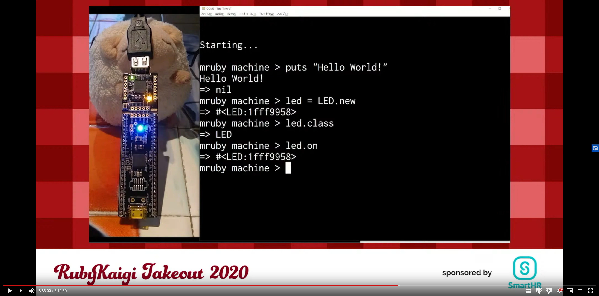

Today, I participated in the RubyKaigi Takeout 2020 online conference. It was the first large-scale developer conference
that I ever took part in and I am very excited to share my experience with you.

## What is RubyKaigi?

RubyKaigi is the largest conference for Ruby programmers held annually in Japan since 2006. Due to the nature of the
Ruby ecosystem, a significant portion of the presentations and discussions are done in Japanese, but since the
conference organizers understand the importance and size of the international community, all talks presented in Japanese
are also available with an English interpretation.

This year, RubyKaigi was originally postponed, then cancelled, and finally converted into an online conference. That
way, truly anyone could join the event.

## Sessions available

This year, there were two “tracks” available: `#rubykaigiA` with mostly Japanese speakers, and `#rubykaigiB` with all
talks being done in English. After looking at the first day’s
[schedule page](https://rubykaigi.org/2020-takeout/schedule/#day1) and reading through the descriptions of each talks,
I mostly decided to follow the `#rubykaigiA` track from the start and switch to the `#rubykaigiB` track just before
lunch; though I definitely want to catch up on some of the talks that I had to skip – there was just way too much good
content available there (which, I suppose, is a very good problem to have 😅)!

## Ractor Report by Koichi Sasada

The conference kicked off (after just a little bit of technical issues because as beloved Murphy would say, “everything
that could go wrong, will go wrong”) with a status report by Sasada-san on Ractor (previously known as Guild). Ractor
will provide Ruby with a parallelism model that provides many benefits compared to the thread-based model seen in many
other programming languages.

Compared to thread-based concurrency, Ractors are thread-safe (meaning you should not be running into dreaded issues
such race condition) and don’t share most objects – in fact, the only objects that are shareable are immutable objects,
class/module objects and some special shareable objects. To send any other data between two Ractors, either a
push-based (where target Ractor is known) or pull-based (where sender Ractor is known) must be used.

Each Ractor can use one or more threads, and in the demonstration showed by Sasada-san, it seemed that Ractors can
utilize available hardware resources quite a bit better than traditional threads.

## Type Profiler: a Progress Report of a Ruby 3 Type Analyzer by Yusuke Endoh

Endoh-san showed everyone the impressive work he’s done on Type Profiler (tentative name), a Ruby interpreter that
executes Ruby programs at the type level and tries to determine type information. This information is then stored in
`rbs` files, which are Ruby 3’s rough equivalent to TypeScript’s `d.ts` type information files.

As someone who comes to the world of Ruby from the land of statically-typed languages, I can’t wait to get my hands on
Ruby 3 (and RubyMine once it supports RBS type definitions).

## On sending methods by Urabe, Shyouhei

In this talk, viewers were taken on a magical journey that resembled a detective story: it all started with an unusual
profiler’s output that didn’t make much sense. After digging deeper and deeper into the mystery, a culprit in Rails’
ActiveRecord library was found, causing Ruby’s method cache to evict entries that shouldn’t be evicted. After fixing the
issue in Ruby 2.7, the performance of Ruby and Rails apps increased!

## Reflecting on Ruby Reflection for Rendering RBIs by Ufuk Kayserilioglu

After switching to the `#rubykaigiB` track, I was shown Ruby’s powerful capabilities when it comes to reflection and
the many intricacies that one must be aware of when trying to automatically analyze the source code of third-party
dependencies. The work done by Ufuk is used in the [Tapioca](https://github.com/Shopify/tapioca) project, which can
automatically generate type information for your project’s Gem dependencies.

I only wish that the resulting type information were generated in the RBS format as opposed to Sorbet’s RBI format, but
one can dream, right?

## The whys and hows of transpiling Ruby by Vladimir Dementyev

Transpiling is a technique of transforming source code of one programming language into an equivalent source code in the
same or different programming language. While that’s a daily practice for nearly all front-end web developers (hello
Babel), I was at first unsure as to why that would be necessary in the world of Ruby where we don’t have to worry about
obsolete web browsers that don’t support the latest and greatest versions of JavaScript.

Turns out that my world-view was quite limited, as transpiling doesn’t have to be a process born out of necessity, but
rather out of convenience! When transpiling code written in the Ruby 2.8 syntax into, let’s say, Ruby 2.5 syntax, we
can enjoy the luxury of using new language constructs while still ensuring that the code can be used as a dependency in
projects that are still running an old version of Ruby. Better yet, new or experimental features can be tested and
triaged before the Ruby team decides to add them to the standard language. If you want to learn more about this topic,
I really recommend reading through
[this excellent article](https://evilmartians.com/chronicles/ruby-next-make-all-rubies-quack-alike).

## mruby machine: An Operating System for Microcontoller by Hasumi Hitoshi

Finally, a personal highlight of the day – our own MonstarLab’s Hasumi-san was showing that Ruby is not a language
viable only for computers and servers, but also microcontrollers. That might seem obvious to you, dear reader, but I
have to admit that I would have never imagined that an interpreted language can ever be capable of running on such a
limited hardware – though I’m someone whose microcontroller experience ends with a bit of tinkering with Arduino, so I
really have close to zero idea as to what’s possible in this field.

## Running Rack and Rails Faster with TruffleRuby by Benoit Daloze

Finally, in this talk, Benolt demonstrated the world that while Ruby 3 might be 3&times; faster than Ruby 2.0,
TruffleRuby still has much more to offer in terms of speed. I’ve personally toyed with TruffleRuby on GraalVM in the
past a bit and was absolutely blown away by the ability to compile the code into a native binary with no dependencies,
and by being able to combine Java, Ruby, Python and R programming languages in a single project.

## Closing words

The first day of RubyKaigi Takeout 2020 finished with a 30-minute long session where Ruby committers shared their
contributions, favourite features of Ruby 3 and answered a couple of questions from the audience. I really appreciated
being able to see “behind the scenes”, to “meet” the people responsible for creating the beautiful language of Ruby.

The first day of the conference had me excited, yet still managed to overcome my expectations. I adored the quality of
the English interpretation service and I appreciated the fact that all talks were pre-recorded, which both avoided any
possible audio/video/connection issues as well as allowed the speakers to interact with the audience in the chat as
their speech was broadcasted.

I can’t wait to see what the second day of RubyKaigi Takeout 2020 will bring us!
