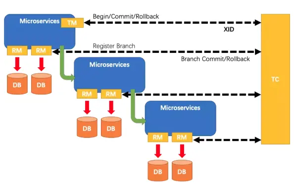
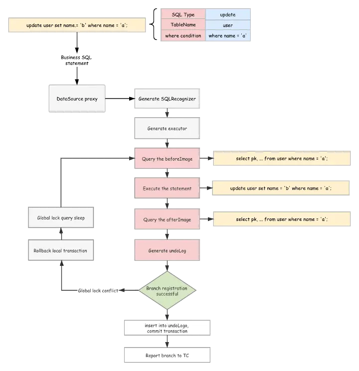
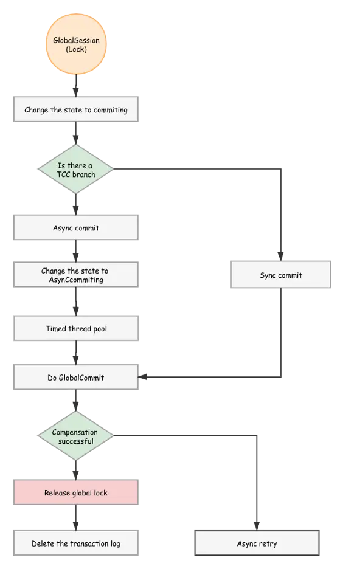
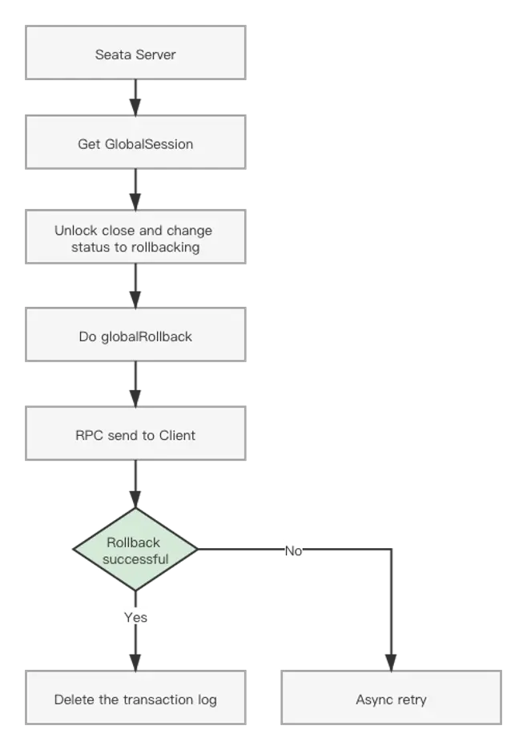
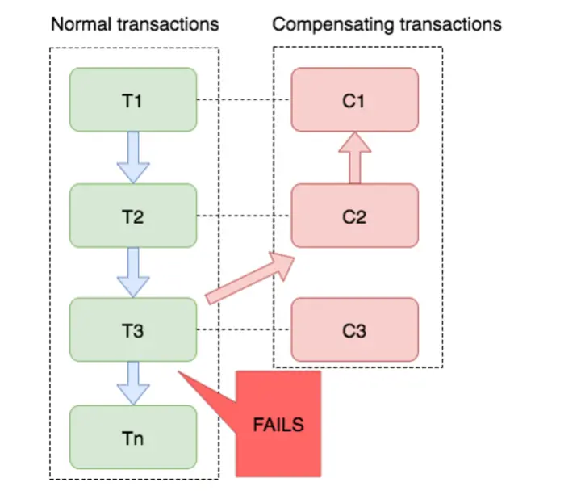
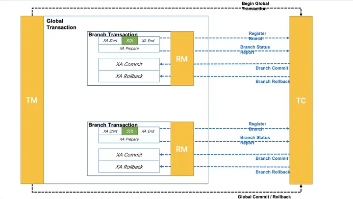

Seata is an open source distributed transaction solution that delivers high performance and easy to use distributed transaction services under a microservices architecture.

## 1.Overview

A distributed transaction solution with high performance and ease of use for microservices architecture.

## 2.Transaction

A transaction is a unit of operations in which all operations eventually behave in a consistent manner, either all succeed or all are undone. In short, transactions provide a "do nothing or do it all" mechanism.

#### 2.1 Local transaction

- A local transaction can be thought of as a transaction mechanism provided by a database. When it comes to database transactions, there are four features of database transactions:
  - A：Atomicity，All operations in a transaction either successful all or fall all.
  - C：Consistency，The database must be in a consistent state before and after a transaction executes.
  - I：Isolation，In a concurrent environment, when different transactions operate on the same data at the same time, the transactions do not affect each other.
  - D：Durability，This means that any updates to the database made by the transaction must be saved permanently as soon as the transaction completes successfull
- A database transaction is implemented in such a way that all the operations involved in a transaction are grouped into an indivisible unit of execution in which all operations either succeed or fail, and any failure of either operation results in a rollback of the entire transaction

#### 2.2 Distributed transaction

Distributed transactions mean that the participants of a transaction, the server supporting the transaction, the resource server, and the transaction manager are located on different nodes in different distributed systems.
_Simply put, a large operation consists of small operations that are distributed on different servers and belong to different applications, and distributed transactions need to ensure that these small operations either all succeed or all fail._
_In essence, distributed transactions are to ensure the consistency of data between different databases._

## 3.The introduction of Seata

Seata was designed to be non-intrusive, so it started with the business-non-intrusive 2PC solution and evolved from the traditional 2PC. It understands a distributed transaction as a global transaction consisting of several branch transactions. The responsibility of a global transaction is to coordinate the branch transactions under its jurisdiction to reach an agreement that either commits successfully together or fails to roll back together. In addition, usually a branch transaction is itself a local transaction of a relational database.

Seata consists mainly of three important components:

- TC：Transaction Coordinator. Transaction coordinator, which manages the state of global branch transactions and is used for commit and rollback of global transactions.
- TM：Transaction Manager. Transaction manager, used to start, commit, or roll back global transactions.
- RM：Resource Manager. Resource manager, used for resource management on branch transactions, registers branch transactions with TC, reports the status of branch transactions, and accepts TC's command to commit or rollback branch transactions.
  

_TM notifies the TC to start a new global transaction. TC generates an XID that represents the global transaction._

_XID is propagated down the chain of invocation of the microservice._

_The RM registers the local transaction as a branch of the corresponding global transaction from XID to TC._

_TM notifies TC to commit or roll back the global transaction corresponding to the XID_

_The TC drives all branch transactions under the corresponding global transaction of the XID to complete branch commit or rollback._

### AT mode:

The AT pattern is designed based on the two-phase commit pattern to solve the distributed transaction problem in the microservice scenario in an efficient and non-invasive way. It enables application code to use distributed transactions as if they were local transactions, completely masking the underlying details

In the AT mode, each database is called a "Resource", but in Seata it is called a "DataSource Resource". When a business accesses database resources through the JDBC standard interface, the Seata framework intercepts all requests and does something. When each local Transaction commits, Seata RM (Resource Manager) registers a branch Transaction with the TC (Transaction Coordinator). When the request link call is complete, the initiator notifies the TC to commit or roll back the distributed transaction, entering the two-phase invocation process. At this point, the TC will call back to the corresponding actor to execute the second phase of the corresponding resource based on the previously registered branch transaction. How does TC find the relationship between a branch transaction and a resource? Each resource has a globally unique resource ID and registers the resource with TC at initialization time. At run time, each branch transaction is registered with its resource ID. This will enable the TC to find the right resource during the two-phase invocation. Each branch transaction is registered with its resource ID. This will enable the TC to find the right resource during the two-phase invocation.

**One stage process**

In one stage, Seata will intercept business SQL. First, SQL semantics will be parsed to find the business data to be updated by business SQL. Before the business data is updated, it will be saved as before image. All of the above operations are done within a database transaction, thus ensuring atomicity of the one-phase operation.

The specific work of the branch transaction in the first phase includes:

1.Generate the corresponding SQLizer based on the SQL (UPDATE, INSERT, DELETE) type that needs to be executed

2.Generate the corresponding SqlExecutor

3.Enter the before and after snapshots of the core logic query data, such as the red part of the figure, take the before and after snapshots of the modified data row, integrate the two to generate UndoLog, and try to commit them in the same transaction as the business changes.

**The two-phase Commit process**

The second phase of the AT pattern determines whether a global commit or a global rollback operation will occur based on the first phase. For the service side, wait until a stage do not throw exceptions, global transaction sponsors will be submitted to the server application this global transaction, the server according to the xid query out the global transaction after the lock and close the global transaction, the purpose is to prevent the transaction follow-up and branch continued to register, and amend the state from the Begin to Committing.

Next, determine whether all the branch types under the global transaction are AT types. If so, the server will commit asynchronously, because the data completed in the next phase of AT mode has been landed. Server only modify global transaction status to AsyncCommitting, then there will be a regular thread pool to query in the storage medium (File or Database) to be submitted by the global transaction log to commit, if a global transaction submitted successfully will release global lock and remove the transaction log. The whole process is shown in the following figure:

If all Branch RMS execute successfully, then global Commit is performed. Since we don't have to roll back, and each Branch local database operation is done, the main thing we do is delete the local Undolog.

The client receives a Branch Commit request from the server, finds the appropriate ResourceManager according to resourceId, and then encapsulates the branch commit request into a Phase2Context and inserts the ASYNC_COMMIT_BUFFER into the memory queue. The client has a timed thread pool to query the queue for asynchronous deletion of UndoLog.

Once the client commit fails or the RPC timeout occurs, the server sets the global transaction state to the CommitRetrying position and another timed thread pool is used to retry the transactions until they succeed.

**Two-stage Rollback process**

If the second phase is rolled back, Seata needs to roll back the business SQL that has been executed in the first phase to restore the business data. The rollback method is to restore business data with before image. However, the dirty write should be verified before restoration. Compare the current business data of the database with after image. If the two data are completely consistent, it means that there is no dirty write, and the business data can be restored.

If the initiator throws an exception in one phase and requests the server to roll back the global transaction, the server queries the global transaction based on the XID, locks the transaction so that no more branches are registered, changes its state to Begin as Rollbacking, and then synchronously rolls back to ensure data consistency. With the exception of the synchronous rollback point, the process is similar to commit time, freeing the global lock and deleting the transaction log if the synchronous rollback is successful, and asynchronously retrying if it fails.

The client receives A Branch Rollback request from the server and is resourceId the corresponding data source agent. After querying the UndoLog record against xID and branchId, the rollback field is deserialized and given A before and after snapshot of the data. We call the global transaction A.

According to specific SQL type to generate corresponding UndoExecutor, check whether the data before and after snapshots of UndoLog consistent or front-facing snapshots and current data whether, if don't need to do a rollback operation, consistent if inconsistent reverse SQL generated for the compensation, before submitting a local transaction will detect local access database lock the success and failure is that there are other global transaction (if called B) of one phase is to modify the same line, But because of the bank's primary key on the server has been A global transaction is currently executing two phase rollback A lock, so the transaction B A stage in front of the local submission to attempt to obtain the global lock must be failed, wait to get the global lock timeout after A global transaction B will release the local lock, so that A global affairs can continue local transaction submission, delete local UndoLog records after success.

**TCC mode:**

Try：Detection and reservation of resources;

Confirm：Commits the business operation performed; If "Try" succeed and "Confirm" must succeed;

Cancel：Reserve resource release.

TCC mode requires users to implement Try, Confirm, and Cancel based on their own business scenario. The transaction initiator performs a Try mode in one phase, commits the Confirm method in the second, and rolls back the Cancel method in the second phase.

The most important thing for users accessing the TCC schema is to consider how to break down the business model into two phases, implement the three methods of TCC, and ensure that Try success Confirm success. Compared with AT mode, TCC mode is somewhat invasive to business code, but TCC mode has much higher performance than AT mode without global row lock of AT mode.

**Saga mode:**

In Saga mode, there are multiple participants in distributed transactions, and each participant is a Rectification compensation service, requiring users to implement forward operation and reverse rollback operation according to business scenarios.

During the execution of a distributed transaction, the forward operations of each participant are executed in turn. If all forward operations are successfully executed, then the distributed transaction commits. If any forward operation fails, the distributed transaction will roll back the previous actor's backward rollback and roll back the committed actor, bringing the distributed transaction back to its original state.

**XA mode**:

XA schema is another non-invasive distributed transaction solution. Any database that implements XA protocol can participate in distributed transactions as a resource. Currently, mainstream databases such as MySql, Oracle, DB2, Oceanbase and others all support XA protocol.

**One stage process**

In one phase of XA mode, Seata intercepts Business SQL, starts XA Transactions (" XA Start ") before Business SQL, then executes Business SQL to end XA Transactions (" XA End "), and finally precommits XA transactions (" XA Prepare ") to complete the preparation of Business SQL.

**Two-stage submission:**

Execute the "XA Commit" directive to commit the XA transaction, at which point the "business SQL" is actually committed to the database.

**Two-stage rollback:**

Execute the "xa rollback" instruction, rollback xa transactions, complete the "business SQL" rollback, and release database lock resources.

In XA mode, users focus only on "business SQL," and Seata automatically generates phase 1, phase 2 commits and phase 2 rollbacks. The XA pattern, like the AT pattern, is a business-neutral solution; But unlike the AT mode, the XA mode delegates things like snapshot data and row locks to the database via XA instructions, making the XA mode implementation more lightweight.

More in [http://seata.io ](http://seata.io) [https://github.com/seata/seata](https://github.com/seata/seata)
