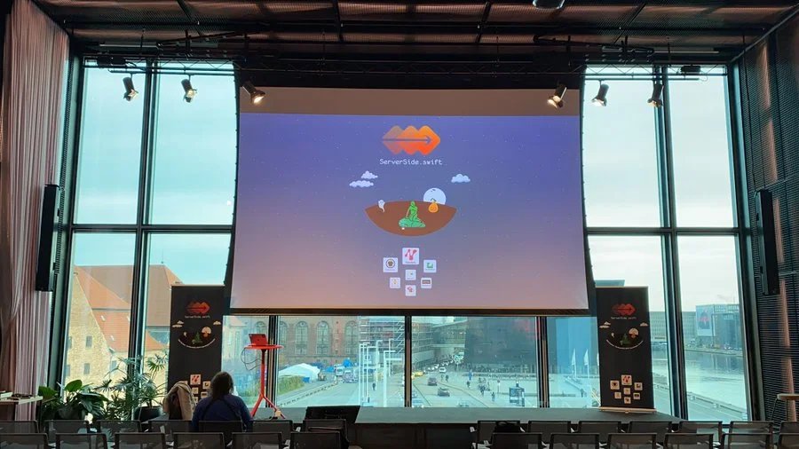
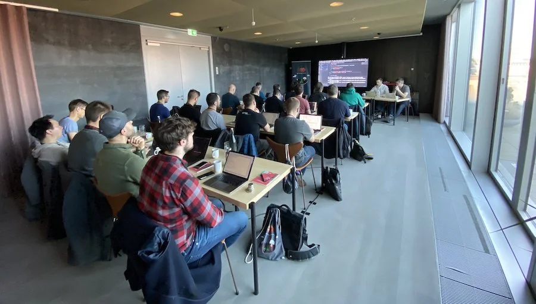
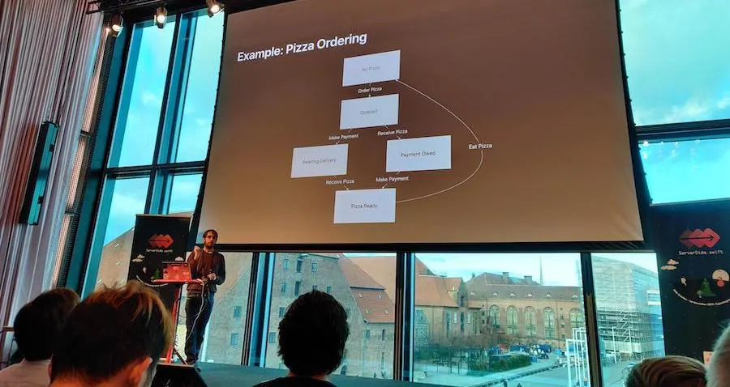

## What it's all about

As stated on their website, ServerSide.swift is aiming to be a non-profit, framework-independent conference "solely run for the love of server-side Swift". This was the second year of the conference, this time organized in Copenhagen, Denmark from Oct 30 to Nov 1.

Since becoming open-source, Swift's qualities have been gaining more recognition in the backend space. The head count has increased by about 40% this year, totalling in 112 attendees. While a major part of the audience still seems to stem from the Apple ecosystem, there have been a few of us coming from other areas, e.g. PHP or the Android side of the mobile fence. In the coming years I really wish for the server-side Swift community to open up even further and hope this will bring many new benefits to the platform.

## The venue

The conference was hosted in the BLOX building housing the Danish Architectural Center (DAC) and the BLOXHUB innovation network. The workshops were held on the top floor with a beautiful view of the harbor, and the stage for the talks was backed by a massive glass window with a view of the Christian IV's brewery and the Royal Library.

Needless to say the location choice was excellent! The conference pass also allowed visitors to freely explore the DAC exhibition with building models by the world-renowned design studio Bjarke Ingels Group.

## Workshop Day

As I'm still fairly new to Vapor and Swift, I signed up for the intrudoctory **"Getting Started with Vapor"** workshop by **Tanner Nelson** and **Jonas Schwartz** from the Vapor core team. During sign-up I wasn't aware we'll already be working with the upcoming Vapor 4, so besides brushing up on the basics it was also quite useful to get acquainted with the new features we can expect using in production soon. The workshop quickly covered the basics of HTTP, REST and what Vapor is good at, followed by a hands-on session where we built a simple API and deployed it to Vapor Cloud 2 (soon reaching beta).

After becoming a Vapor pro in a single morning, it was time to start **"Building Microservices"** with **Ralph Küpper**. After a short introduction to microservices, an e-commerce example project was used to present one way of how they could be implemented using a mixed Vapor 3 and 4 setup. There has also been discussion on how microservices can be mixed (e.g. using different languages and frameworks), scaled and made reusable. The workshop was concluded by setting up AWS and deploying the solution.

The laws of physics prevented me from attending the other two workshops. However, I've spoken to several people attending **"Contributing to SwiftNIO and SSWG"** by **Cory Benfield** and **Johannes Weiss** and they seemed pretty excited about where their code ended up. :)

The other afternoon slot was reserved for **"Build a cloud-native app with Kitura"** by **Ian Partridge** where the attendees built a safety notification system for disaster cases. Seems quite interesting!

## The talks

Most of the talks over the next two days have been great and they left a lot of impressions to take home. It would be hard to cover all of them so I'll select some of my personal highlights. However, please keep in mind the list is subjective and even omits some of the other talks I enjoyed a lot.

## "Static site generation in Swift" by John Sundell

I probably heard and forgot about static site generators multiple times by now. While I'm still pondering on if I should rebuild or shut down my immensely outdated personal website, it was very interesting to see John's approach and self-developed tools in a cheerful presentation style.

Short story: write your markdown, run some Swift and get that blog up-and-running with no backend whatsoever!

The whole solution will soon be open-sourced as three tools. _Ink_ is a markdown formatter, _Plot_ is an HTML DSL and _Publish_ is the static site generator.

## "Breaking into tech" by Heidi Hermann

Okay this one's a bit biased since Heidi's sitting right across the desk as I'm writing this. Does it mean her talk was any less good? Heck, no!

Her speech about us all being mentors and helping others enter the tech industry was so inspiring I'm even willing to forget she used my LEGO contraption as an example for the most depressive phase of a project, career or a relationship.

Let's make our interview processes fair and welcoming so all candidates can show us what they can really do.

## "Building State Machines in Swift" by Cory Benfield

This brought up some nostalgia (and a few bitter memories) from my university days. The talk was anything but bitter, however. It served as a good refresher and inspired some thoughts on utilizing state machines more often in future projects.

## "Swift development on Linux" by Jonas Schwartz

Not only does Jonas deserve a place among the highlights for his talk, but he also deserves a medal for bravery since he was probably the only person with a non-Apple laptop there. :)

As a Linux user wanting to jump more into backend development myself, discovering that one of the Vapor core team's members is using Linux full-time gave me a lot of confidence in picking Vapor as my next framework.

Jonas gave a great overview of the available tools and what you should expect by choosing Linux as your primary development platform.

Btw, he uses Arch.

## "How we Vapor-ised our Mac app" by Matias Piipari

Matias explained how they migrated a Mac app for scientific writing to a server-based solution. It's always interesting to see how legacy code is tackled and transitioned to something new.

What makes it even more interesting is that this isn't a storry with a clear happy-end. Due to AppKit and some other remaining dependencies, the solution currently has to run on macOS, meaning a transition to Linux is still not entirely possible. Hence the team had to stay pragmatic and build servers from Macs instead.

## "Supercharging your Web APIs with gRPC" by Daniel Alm

Maybe I've been living under a rock but I haven't heard of gRPC before. Daniel gave a great overview of the benefits backed by code examples. It's definitely something I'm going to look more into.

## "Building high-tech robots with Swift" by Gerwin de Haan, Mathieu Barnachon

How unexpected - they had me at "robots". Gerwin and Mathieu explained how StyleShoots got started and how they built multiple machines for taking professional fashion photography without a professional fashion photographer.

## Conclusion

The conference was educative, a lot of fun and very well organized. Kudos to the whole team for the good food, great location selection and interesting content!

As mentioned, there have been a lot more great talks than I've been able to cover. Also worth mentioning was the panel discussion moderated by **Tim Condon** with **Kaitlin Mahar**, **Siemen Sikkema**, **Tanner Nelson** and **Ian Partridge**, followed by a boat ride through the Copenhagen canals and tacos at the Condesa Bar.

---

Special thanks to [Siemen Sikkema](/authors/siemen-sikkema) for sharing his notes!

Image sources:

- Group photo (cover): [Martin Lasek / ServerSide.swift](https://twitter.com/MartinLasek?ref_src=twsrc%5Egoogle%7Ctwcamp%5Eserp%7Ctwgr%5Eauthor)
- Conference hall: [ServerSide.swift Twitter](https://twitter.com/SwiftServerConf/status/1190172067691401222)
- "Getting started with Vapor": [ServerSide.swift Twitter](https://twitter.com/SwiftServerConf/status/1189496185435951117/photo/2)
