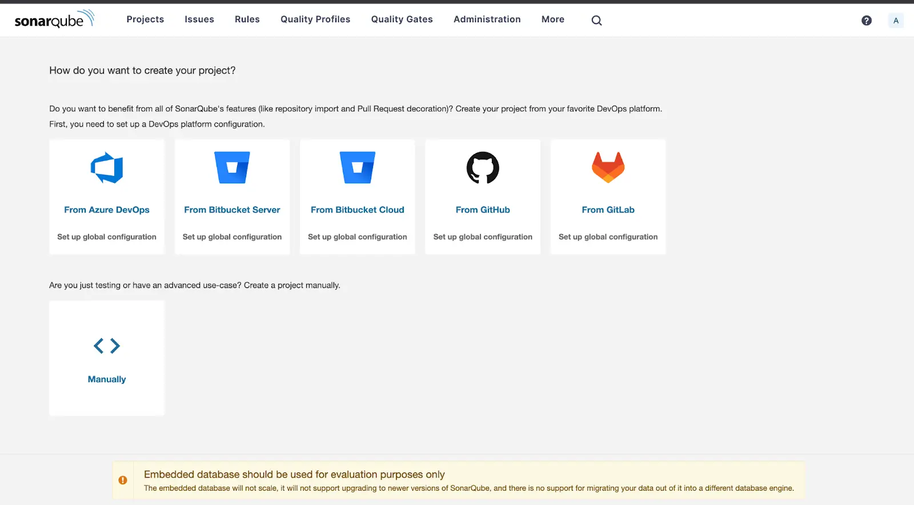
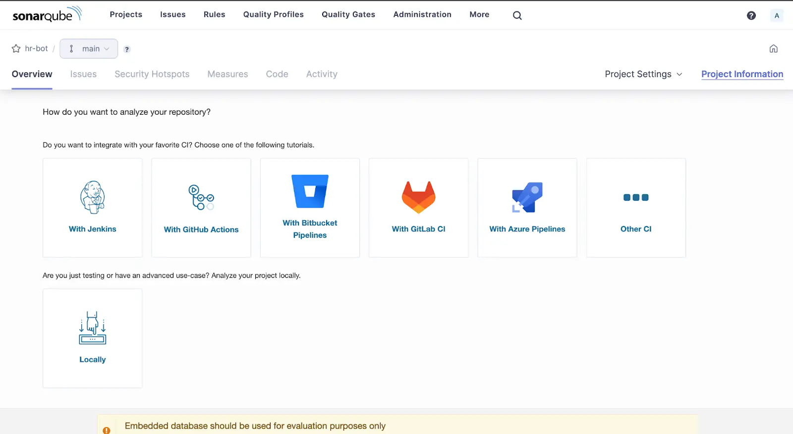
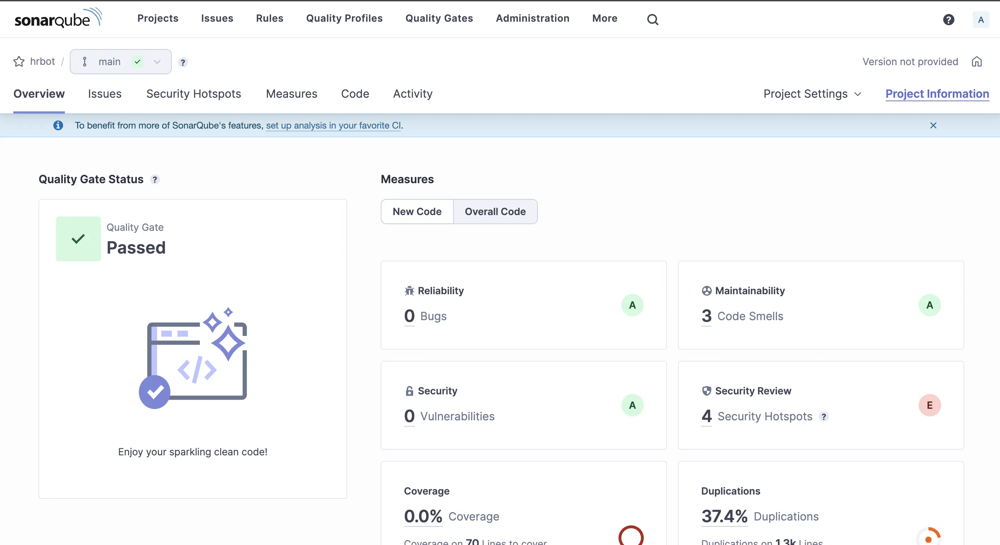

In this article, we will discuss how to set up SonarQube with Docker and produce reports on the code quality of your projects.

## Install Docker on your system

Install Docker into your system using any of the guides online for your preferred system.

Run the following command in your terminal to verify docker has been installed.
```sh
docker -v
```

## Installing SonarQube on Docker

To run SonarQube on your machine using docker, first open a new terminal tab and then pull the image from docker hub using the command below.
```sh
docker pull sonarqube
```

Once the image has been pulled, start the container by running:
```sh
docker run -d --name sonarqube -e SONAR_ES_BOOTSTRAP_CHECKS_DISABLE=true -p 9000:9000 sonarqube:latest
```

Once your instance is up, log in to the Sonarqube dashboard by navigating to [http://127.0.0.1:9000](http://127.0.0.1:9000) and using System Administrator credentials:
  * login: admin
  * password: admin

## Create a new project on Sonarqube

After logging in, you should see this screen.


  * Let's select manually.
  * Enter your project display name and main branch name.
  * Select a baseline for new code for your project
  * Your project should now be successfully created in Sonarqube

## Analyze your project on Sonarqube

After creating your project, you should be seeing this screen.



Since we are going to analyze our project locally, click on Locally. Then generate your project token. Select the appropriate options under Run analysis on your project.

Let's also run SonarScanner via docker, no need to download and install it.

First create a file in your project in the root directory called
**sonar-project.properties**

```
# must be unique in a given SonarQube instance
sonar.projectKey={projectKey}

# --- optional properties ---

# Encoding of the source code
sonar.sourceEncoding=UTF-8

# Here, you can exclude all the directories that you don't want to analyze.
# As an example, I'm excluding the node_module and .next directories
sonar.exclusions=node_modules/**, .next/**
```

Then, to run the SonarScanner and scan your code, navigate to your project in a new terminal tab and execute the following command:

```sh
docker run \
    --rm \
    --network=host \
    -e SONAR_HOST_URL="http://127.0.0.1:9000" \
    -e SONAR_SCANNER_OPTS="-Dsonar.projectKey={Project key}" \
    -e SONAR_TOKEN="{authenticationToken}" \
    -v "$(pwd):/usr/src" \
    sonarsource/sonar-scanner-cli
```

Eg:
```sh
docker run \
    --rm \
    --network=host \
    -e SONAR_HOST_URL="http://127.0.0.1:9000" \
    -e SONAR_SCANNER_OPTS="-Dsonar.projectKey=hrbot" \
    -e SONAR_TOKEN="sqp_9f5ff08eba566ab37afe5f36104fcxxxxxxxx" \
    -v "$(pwd):/usr/src" \
    sonarsource/sonar-scanner-cli
```

After the scanning is complete, go back to the dashboard and you should see the following screen:


You have now completed the scanning of your code for the first time. You can now go ahead and solve any issues and smells that are reported by Sonarqube on your path to a sparkling clean code!

To turn off the Sonarqube container afterwards you can run the command:
```sh
docker stop sonarqube
```

To turn it on again for later use, you can run the command:
```sh
docker start sonarqube
```

_Article Photo by [Milad Fakurian](https://unsplash.com/photos/PpgY7sjpf_0)_
