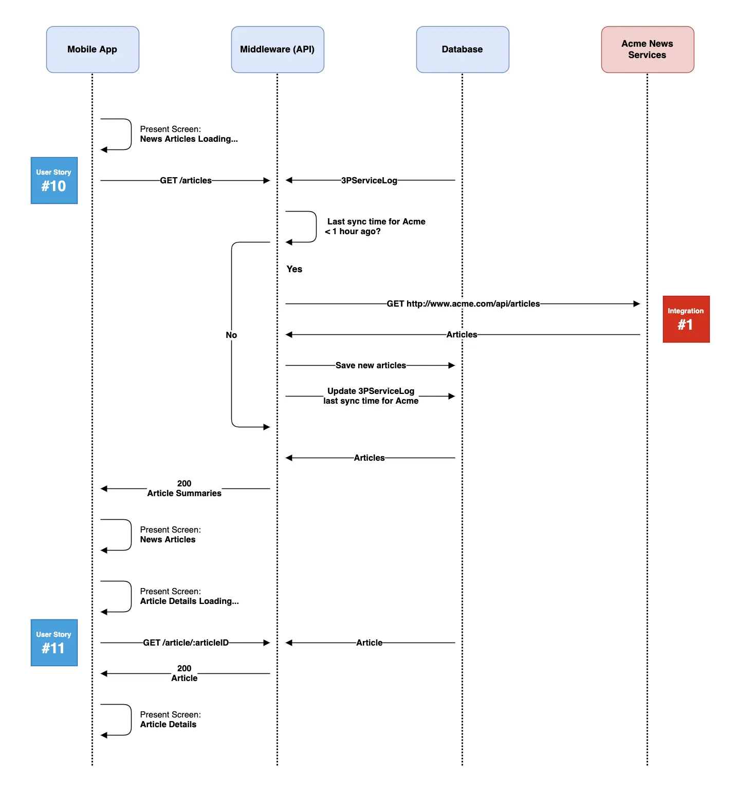
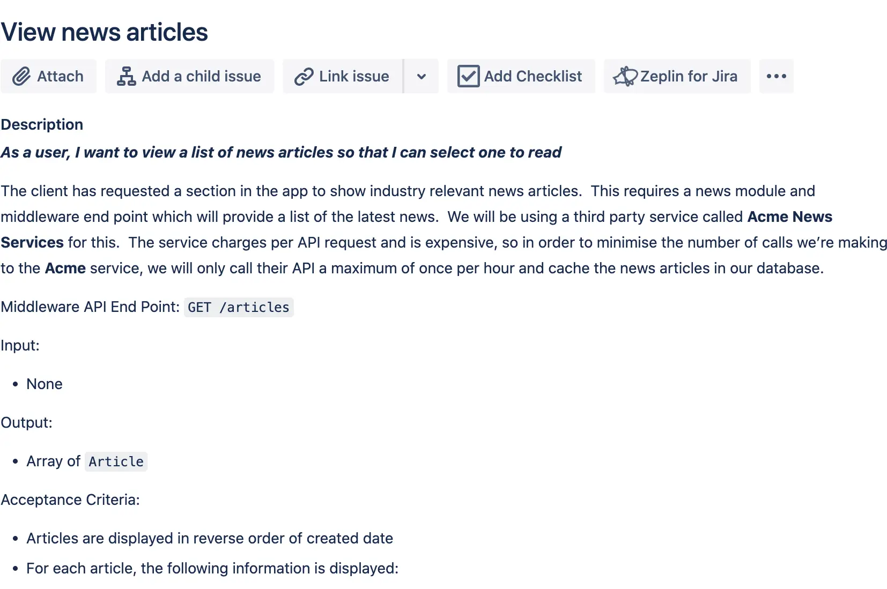
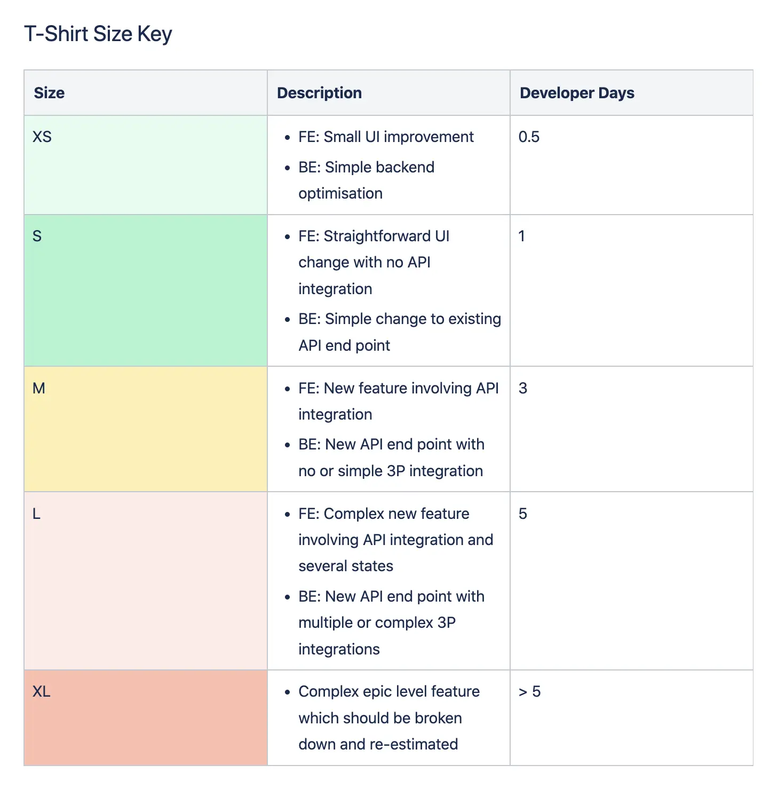

At Monstarlab, the role of Solution Architect (SA) provides one career path for developers to progress towards, should they wish to pursue a less hands-on role over time. Many of the most common problems faced by a rookie SA are around the communication of their solution designs. It can be tempting - as an ex-developer - to involve yourself in every detail of the system you’re working with. Tasks often end up defined so meticulously that every decision is already made by the time they’re picked up by the devs. As ex-coders, many SAs create documentation as if the intended audience is a machine. Diagrams are overly detailed, formal and unintuitive. Written instruction is almost pseudo-code.

There’s a danger that devs working with a fastidious SA become deskilled - turned into automatons, churning out code with no understanding of context, according to a detailed spec that allows no room for interpretation or creativity. And spoon-feeding developers with every detail of the designs we want them to implement is not the best way to help them make the transition from coder to SA, should they choose this path. The SA also becomes a single point that every decision has to pass through.

Here I share five tips to help you ensure your solution design communications are optimised for free range, free-thinking, motivated developers who will be aligned with your technical vision.

## 1. Involve developers in the key technical decisions

Nothing frustrates a developer more than being presented with a technical decision which they disagree with, at a time when it’s too late to change it. When I am doing technical discovery on a feature set, I make a point during our daily stand up of providing a short summary of the key technical decisions I’m working towards. This gives the developers a chance to express a preference, make suggestions, or provide valuable insight as someone closer to the codebase. It is a good way of ensuring that developers are part of the decision-making process, and reduces the chance of pushback when you present your technical solution further down the line.

## 2. Get involved in user story creation

Who writes the user stories for a project will vary from organisation to organisation and will depend on the roles defined. In many organisations, it’ll be the product owner who takes the lead, with detail or tasks added by others in the team such as the scrum master (or delivery lead at Monstarlab), QA engineers, SAs or the developers themselves.

The SA will generally provide the initial detail for the backend elements of user stories, as these may involve third-party integrations or entail interaction with the data layer. Contributing to user stories is an opportunity for you to retain visibility over the solution you’ve designed as it is implemented. What you include will be critical to the relationship between you and your developers. Try to bring a consistent approach to a user story’s structure. Learn over time what works and what doesn’t and discuss this at sprint reviews.

And remember to leave the coding to the devs. The level of detail provided in user stories should strike a careful balance between enough guidance to ensure your broad solution design is met, and so much instruction that you leave no room for the kind of creative problem solving that inspired your developers to get into coding in the first place.

## 3. Give developers context

It’s perfectly possible to spec a task in a way that a developer is able to implement it without having any understanding of the wider context. However, making the effort to provide an understanding of how a feature fits into the overall solution will be empowering and motivating for the development team. Your devs will be better able to suggest efficiencies if they can see the bigger picture.

One of the key elements in my solution designs is the sequence diagram, which is a great way to provide context for a user story. Avoid going into too much detail on these. Ask yourself, “What is the purpose of my drawing?” before you start. Does your team really need a diagram showing every call made between a solution’s classes before they can start coding?

I tend to highlight only the main calls between a solution’s front end application and the middleware, and between the middleware and any third parties. This can provide a useful discussion tool during collaboration sessions with your developers or client and third party stakeholders, as you go through the process of figuring out a key data flow or integration. I use a less formal version of the sequence diagram which is more readable without learning the official UML notation.
<kbd>

</kbd>

## 4. Explain the reasons behind your decisions

Hopefully, your developers will have been involved in the key technical decisions (see point 1) but it’s still possible the developer picking up a user story may not understand the broader context of every element of the task in question. The reasons behind some of a story’s details or acceptance criteria may not be obvious. A short paragraph at the top of a user story’s description goes a long way to giving developers the “why?” and not just the “what?”.

## 5. Be collaborative with estimation

Solution design should also not be seen as a top-down exercise, where the SA dictates to the team what’s to be done and how long it should take. Involve your developers early in the estimation process. At Monstarlab, this can be as early as the pre-sale stage where we try to give t-shirt size estimations on features. Involve your development team in the process. Decide roughly how much time a small, medium and large corresponds to and then get the team to estimate each feature.

Once in production, involve the developers in the process of creating the more detailed estimations for user stories. Our estimation sessions involve a two-stage process, ahead of sprint planning. First, the delivery lead and SA present each of the next batch of user stories to the developers and QA engineers. This provides an opportunity for the team to ask questions, interrogate the stories, suggest improvements or highlight considerations that haven’t been thought of. We edit the stories as necessary during the session and only once everyone is happy does the team play Planning Poker - www.planningpokeronline.com - to estimate their story points.

## Conclusion

As a new solution architect, it can be hard to relinquish control over every detail of the systems we design. But the more we can, the more we help developers we work with stay motivated and engaged. We also help ourselves by avoiding becoming a decision-making bottleneck for the team. And don’t feel like you need to be the one with all the answers. If you involve the devs in your process, they’ll be more on board with your design when they come to implement it.

_Article Photo by [iStock by Getty Images](https://www.istockphoto.com/vector/set-of-vector-office-elements-with-people-isometric-coworking-or-open-space-gm1205496033-347286760)_
