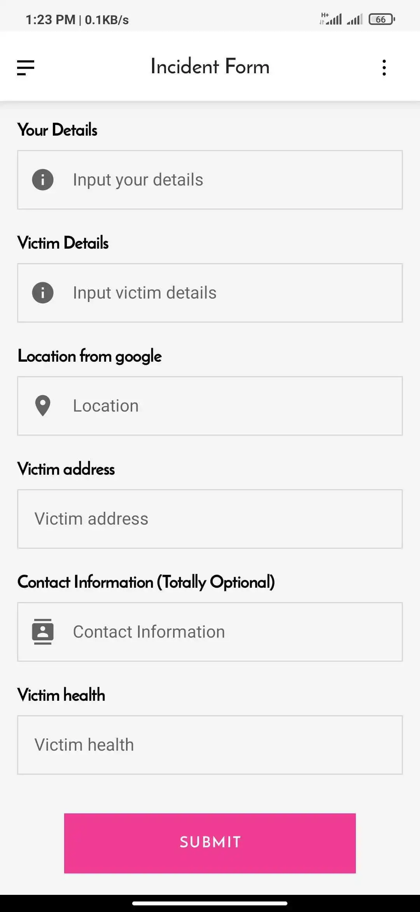

At the end of 2021, we attended Monstarlab's internal hackathon [MonstarHacks](https://www.linkedin.com/showcase/monstarhacks), where each team built a project on the theme of 3 of the [17 UN Sustainable Development Goals](https://sdgs.un.org/goals).
1. Gender equality
2. Good Health and Well-being
3. Quality education

Each of the goal is quite diverse, and there are lot things yet to be done under each of the goal. After hours of team discussions, we picked gender equality as our main focus, which is a very sensitive topic.

### Female Feticide ###

It's shocking that, when most of the people hear this word, it seems like a third world problem, but surprisingly it's not a problem only in third world.

##### Problem study

In our study we found that:
1. Female feticide is a very diverse and complex topic.
2. From place to place and time to time the cause changes drastically.
3. In some places it's becoming a problem, where historically we don’t have any data.
4. The whole internet seems to be a read-only platform for this particular issue.
5. It seems like a taboo topic inside some societies.
6. In some cases where `Right to have abortion` seems to be a symbol of gender-equality, then particular topic is somewhat conflicting.
7. Whereas this practice is not a disgrace to females, but also a threat to humanity, and collective initiatives are totally absent.

#### The proposed solution

In the modern society from the nation election process to household oven everything is designed and improved based on data. In our proposed solution we want to gather as much as data possible. And in the whole process three major components are involved:
1. Collection of data
2. Process of the data
3. Actionable to-dos

#### Step 1: Collection of data
In the collection phase we will focus on in these key areas:
- From whom we will collect this data?
- Is there a priority that should be set on the data?
- How can we ensure data privacy and not reveal or expose the identities of the parties involved?
- In what frequency we will collect data?

#### Step 2: Process of data
In the data processing part we decided to make the outputs in the form of:
- Geological hotspot.
- Clustering based on root causes.
- Organisations that are currently working inside each of the locations (or if they even exists or not).
- Historical time periods.

That will help us to understand:
- External factors/events that can hugely affect this problem.
- Historical patterns.

#### Step 3: Actions
So the actions should be derived from data analysis. These valuable outputs should be passed to the government organisations, NGOs and other social welfare organisations.

### Proposed Project Title: Womb Equality (WE)

#### Backend Data Sources ####
- Doctors (Share their experiences and raise alarm of a possible of forced abortion)
- Victims (Can share mental conditions and reasons)
- Witnesses (Someone who witnessed an forced abortion)
- General Public (With their perception of this problem)

The backend system architecture would look like this:

Figure: Backend System Architecture

### Frontend design idea ###

We built a sample Android app and demonstrated how data will be collected.

Figure: 1. App opening splash screen

Figure: 2. Role selection

Figure: 3. Recent posts and campaign news

Figure: 4. Data input Section

Figure: 5. Post submit screen

Figure: 6. Submit Confirmation

### Conclusion

And finally let's be honest. Female foeticide is a century old problem, and it’s not going anywhere anytime soon. In the aftermath of Covid 19, history tells us that it will make a strong comeback. If we are not prepared, then It will struck us hard and wipe all the achievements that world has made in the last several decades.

No single platform or initiative can prevent and eradicate female feticide from this world, we need collective initiatives, fund and cooperation among all the countries.

Until this is done, the Gender Equality will always remain as a chapter inside the book and the dream will never be a reality.

Without any doubt, technology and data driven approach can greatly help us to achieve this goal.

_[Article Photo](https://crealet.com/2021/06/we-invest-in-the-future/)_
