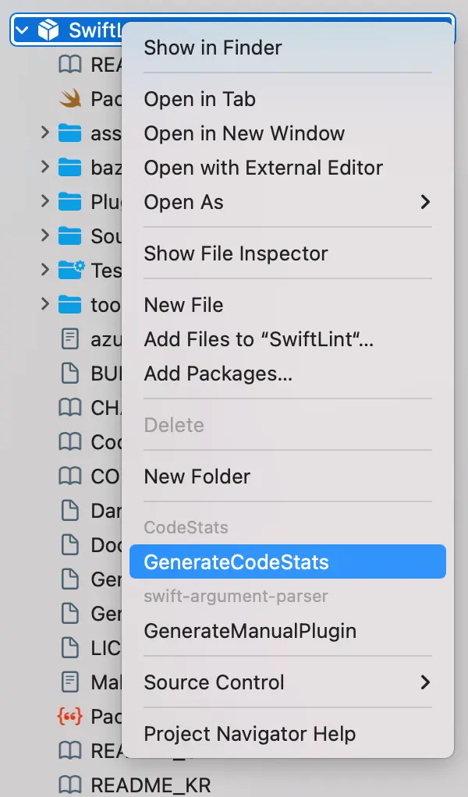
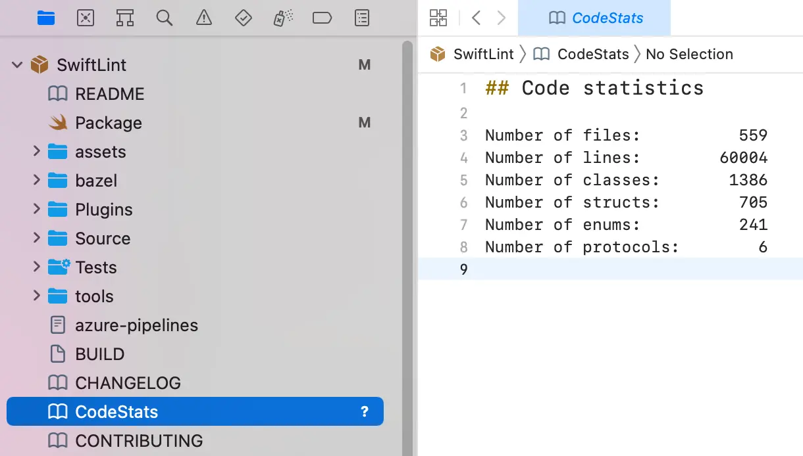
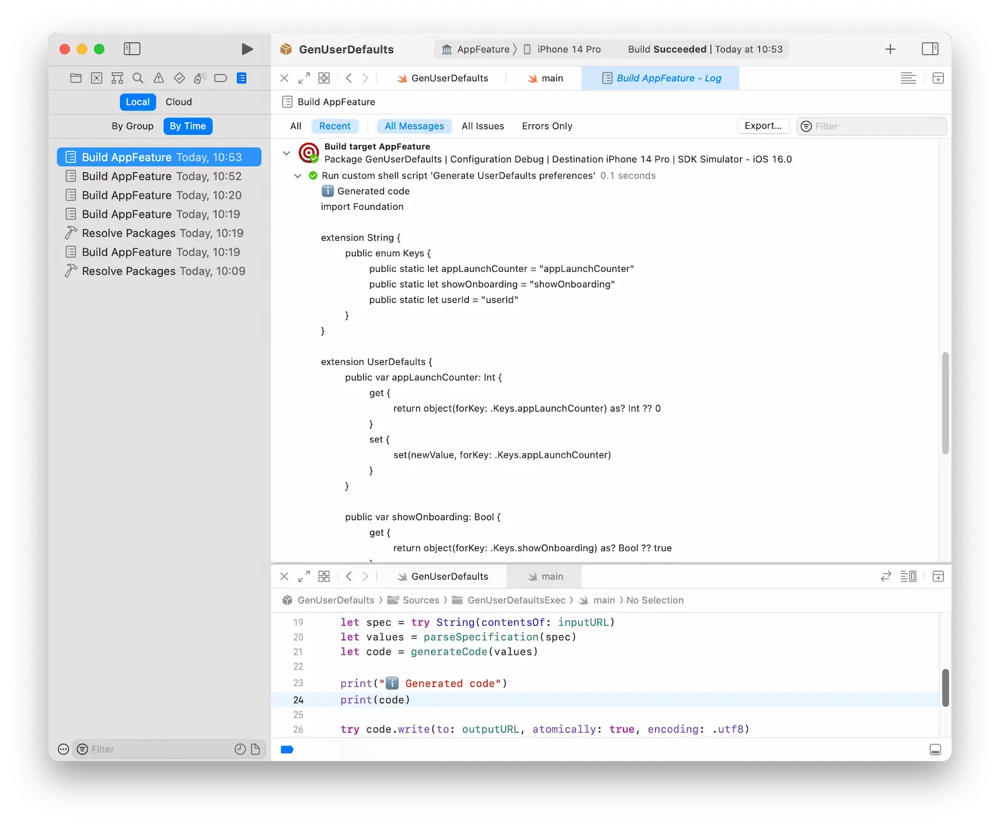
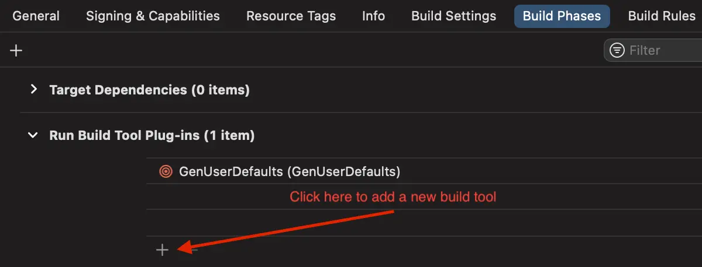

Swift Package Manager plugins are a great way of automating tasks, like, enforcing code conventions and style.

In this tutorial we're going to learn what are package plugins and implement 2 plugins; one that outputs code statistics and another that generates type-safe UserDefaults preferences. Plugins require swift tools version 5.6 and up.

There are 2 types of plugins, Command plugins and Build Tool plugins. Let's start with command plugins.

## Command Plugins

Command Plugins are tasks that are manually triggered by the developer.
As an example, we're going to create a plugin
to generate code statistics, such as, how many source code files and lines of code your package has.

First, let's create a package.

```shellscript
$ mkdir CodeStats && cd CodeStats
$ swift package init
$ mkdir -p Plugins/GenerateCodeStats && touch Plugins/GenerateCodeStats/GenerateCodeStats.swift
$ open Package.swift
```

**Note:** Plugins go into the **`Plugins`** folder, as opposed to **`Source`**.


In the manifest file let's create a target and a product.

```swift
let package = Package(
    name: "CodeStats",
    products: [
        .plugin(
            name: "GenerateCodeStats",
            targets: ["GenerateCodeStats"]
        )
    ],
    targets: [
        .plugin(
            name: "GenerateCodeStats",
            capability: .command(
                intent: .custom(
                    verb: "code-stats", // Verb used from the command line
                    description: "Generates code statistics"),
                permissions: [
                    .writeToPackageDirectory(reason: "Generate code statistics file at root level")
                ])
        ),
    ]
)
```

We define our plugin as a command-type plugin with a custom intent and writing permissions. We can use **`code-stats`** verb to invoke this plugin from the command line (more on than later).

Now let's implement our simple plugin.

```swift
// GenerateCodeStats.swift
import Foundation
import PackagePlugin

@main // Plugin's entry point
struct GenerateCodeStats: CommandPlugin {
    func performCommand(context: PluginContext, arguments: [String]) async throws {
        // 1 - Parse all targets from the arguments. These are the targets
        // that the developer has manually chosen
        let targets = try parseTargets(context: context, arguments: arguments)
        let processor = FileStatsProcessor()
        let fm = FileManager.default
        let dirs = targets.isEmpty ? [context.package.directory] : targets.map(\.directory)

        // 2 - Loop through all targets' files
        for dir in dirs {
            guard let files = fm.enumerator(atPath: dir.string) else { continue }

            // 2.1 - Process only swift files
            for case let path as String in files {
                let fullpath = dir.appending([path])
                var isDirectory: ObjCBool = false

                guard
                    fullpath.extension == "swift",
                    fm.fileExists(atPath: fullpath.string, isDirectory: &isDirectory),
                    !isDirectory.boolValue
                else { continue }

                try processor.processFile(at: fullpath)
            }
        }

        let output = context.package.directory.appending(["CodeStats.md"])

        print(processor.stats.description)

        // 3 - Write the stats to a file in the root directory of the package
        try processor.stats.description.write(
            to: URL(fileURLWithPath: output.string),
            atomically: true,
            encoding: .utf8)
    }

    private func parseTargets(
        context: PluginContext,
        arguments: [String]
    ) throws -> [Target] {
        return arguments
            .enumerated()
            .filter { $0.element == "--target" }
            .map { arguments[$0.offset + 1] }
            .compactMap { try? context.package.targets(named: [$0]) }
            .flatMap { $0 }
    }
}

struct CodeStats: CustomStringConvertible {
    var numberOfFiles: Int = 0
    var numberOfLines: Int = 0
    var numberOfClasses: Int = 0
    var numberOfStructs: Int = 0
    var numberOfEnums: Int = 0
    var numberOfProtocols: Int = 0

    var description: String {
        return [
            "## Code statistics\n",
            "Number of files:     \(fmt(numberOfFiles))",
            "Number of lines:     \(fmt(numberOfLines))",
            "Number of classes:   \(fmt(numberOfClasses))",
            "Number of structs:   \(fmt(numberOfStructs))",
            "Number of enums:     \(fmt(numberOfEnums))",
            "Number of protocols: \(fmt(numberOfProtocols))",
        ].joined(separator: "\n")
    }

    private func fmt(_ i: Int) -> String {
        return String(format: "%8d", i)
    }
}

class FileStatsProcessor {
    private(set) var stats = CodeStats()
    private let definitionsRegex: NSRegularExpression = {
        let pattern = #"\b(?<name>protocol|class|struct|enum)\b"#
        return try! NSRegularExpression(pattern: pattern)
    }()
    private let newlinesRegex: NSRegularExpression = {
        return try! NSRegularExpression(pattern: #"$"#, options: [.anchorsMatchLines])
    }()

    func processFile(at path: Path) throws {
        let text = try String(contentsOfFile: path.string)
        let textRange = NSRange(text.startIndex..<text.endIndex, in: text)

        stats.numberOfFiles += 1
        stats.numberOfLines += newlinesRegex.matches(in: text, range: textRange).count

        definitionsRegex.enumerateMatches(in: text, range: textRange) { match, _, _ in
            guard let nsRange = match?.range(withName: "name"),
                  let range = Range(nsRange, in: text)
            else { return }

            switch text[range.lowerBound] {
            case "p": stats.numberOfProtocols += 1
            case "c": stats.numberOfClasses += 1
            case "s": stats.numberOfStructs += 1
            case "e": stats.numberOfEnums += 1
            default: break
            }
        }
    }
}
```

Essentially, this walks through all the swift files in the package or selected targets and outputs various statistics.

To run it, we must first add it to a package as a dependency. Let's clone [SwiftLint](https://www.google.com/url?sa=t&rct=j&q=&esrc=s&source=web&cd=&ved=2ahUKEwiywL_Fzvv6AhVShFwKHdvXDzMQFnoECA0QAQ&url=https%3A%2F%2Fgithub.com%2Frealm%2FSwiftLint&usg=AOvVaw2wYDH76Z7-QFiV30y4Mvro) and use it as an example.

Add **`CodeStats`** to its dependencies.

**Note:** **`CodeStats`** and **`SwiftLint`** packages are in the same directory.

```swift
    ...
    dependencies: [
        ...,
        .package(path: "../CodeStats")
    ],
    ...
```

Make sure it shows up under dependencies.


Then, right-click on the package and select **`GenerateCodeStats`**.



You should now be able to see a new file named **`CodeStats.md`** in the root directory.



It's also possible to run it from the command line using the verb that we've defined earlier.

```shellscript
$ swift package code-stats
## Code statistics

Number of files:         1224
Number of lines:       318508
Number of classes:       2116
Number of structs:       2431
Number of enums:          889
Number of protocols:      452
```

If you want to run these kinds of plugins on Xcode projects you just have to import **`XcodeProjectPlugin`** and make your plugin conform to **`XcodeCommandPlugin`**.

## Build Tool Plugins

Build tool plugins are plugins that run whenever a target is built.
There are 2 different types of build tool commands, pre-build and in-build.
The main difference is that in-build commands have a pre-defined set of outputs.

These plugins are specially useful for generating and formatting code.

### In-Build Tool Example

Let's build a plugin that auto-generates **`UserDefaults`** preferences based on a simple specification file.

Plugins can only depend on binary and executable targets, so let's create an executable target that will implement the code generation logic and then create a plugin that will call this executable.

```swift
// Package.swift
    ...
    targets: [
        .executableTarget(
            name: "GenUserDefaultsExec",
            dependencies: []),
    ]
```

Here's the code generation.

```swift
// Sources/GenUserDefaultsExec/Utilities.swift
import Foundation

struct DefaultValue {
    var name: String
    var type: String
    var value: String?
}

extension String {
    subscript(range: NSRange) -> String {
        return String(self[Range(range, in: self)!])
    }
}

func parseSpecification(_ text: String) -> [DefaultValue] {
    let regex = try! NSRegularExpression(
        pattern: #"^\s*([_\w]+[_\d\w]+)\s+(\w[\d\w]*)\s*(.*)"#)

    return text.components(separatedBy: .newlines).compactMap { line in
        let range = NSRange(location: 0, length: line.utf16.count)

        guard let match = regex.firstMatch(in: line, range: range) else {
            return nil
        }

        let value = line[match.range(at: 3)]

        return DefaultValue(
            name: line[match.range(at: 1)],
            type: line[match.range(at: 2)],
            value: value.isEmpty ? nil : value)
    }
}

func generateCode(_ defaultValues: [DefaultValue]) -> String {
    let keys = defaultValues
        .map { "\t\tpublic static let \($0.name) = \"\($0.name)\"" }
        .joined(separator: "\n")
    let values = defaultValues.map { v in
        let defValue = v.value != nil ? " ?? \(v.value!)" : ""

        return """
        \tpublic var \(v.name): \(v.type)\(v.value == nil ? "?" : "") {
        \t\tget {
        \t\t\treturn object(forKey: .Keys.\(v.name)) as? \(v.type)\(defValue)
        \t\t}
        \t\tset {
        \t\t\tset(newValue, forKey: .Keys.\(v.name))
        \t\t}
        \t}
        """
    }.joined(separator: "\n\n")

    return """
    import Foundation\n
    extension String {\n\tpublic enum Keys {\n\(keys)\n\t}\n}\n
    extension UserDefaults {\n\(values)\n}
    """
}
```

And here's the main script.

```swift
// Sources/GenUserDefaultsExec/main.swift
import Foundation

func abortProgram(_ errorCode: Int32) -> Never {
    print("Usage: GenUserDefaultsExec <input spec> <output>")
    exit(errorCode)
}

let arguments = ProcessInfo().arguments

guard arguments.count > 2 else {
    abortProgram(1)
}

let (input, output) = (arguments[1], arguments[2])
let inputURL = URL(fileURLWithPath: input)
let outputURL = URL(fileURLWithPath: output)

do {
    let spec = try String(contentsOf: inputURL)
    let values = parseSpecification(spec)
    let code = generateCode(values)

    try code.write(to: outputURL, atomically: true, encoding: .utf8)
} catch {
    print(error)
    abortProgram(2)
}
```

The only thing left is implementing the plugin.

```swift
// Package.swift
    ...
    targets: [
        .plugin(
            name: "GenUserDefaults",
            capability: .buildTool(),
            dependencies: ["GenUserDefaultsExec"]
        ),
        ...
    ]
```

Build tool plugins need to conform to **`BuildToolPlugin`**.

```swift
// Plugins/GenUserDefaults/GenUserDefaults.swift
import Foundation
import PackagePlugin

@main
struct GenUserDefaults: BuildToolPlugin {
    func createBuildCommands(context: PluginContext, target: Target) async throws -> [Command] {
        let tool = try context.tool(named: "GenUserDefaultsExec")
        let input = target.directory.appending(["defaults"])
        let output = context.pluginWorkDirectory
            .appending(["UserDefaultsPreferences.swift"])

        return [
            .buildCommand(
                displayName: "Generating UserDefaults Fields",
                executable: tool.path,
                arguments: [input.string, output.string],
                inputFiles: [input],
                outputFiles: [output])
        ]
    }
}
```

To test it, let's create a target called **`AppFeature`** that implements a simple SwiftUI view.

```swift
// Package.swift
    ...
    targets: [
        .target(
            name: "AppFeature",
            plugins: ["GenUserDefaults"]
        ),
        ...
    ]
```

This plugin looks for a specification file called **`defaults`** in the root directory of the target. So let's create that file with the contents bellow.

```shellscript
appLaunchCounter Int 0
showOnboarding Bool true
userId String
```

Each line declares a preference separated by whitespace where the 3rd value is an optional default value.

Whenever we build this target, it will auto generate a file called **`UserDefaultsPreferences`** in the build directory, if needed.

We can now use UserDefaults preferences in a type-safe way.

```swift
// Sources/AppFeature/AppFeature.swift
import Foundation
import SwiftUI

struct AppFeatureView: View {
    @AppStorage(.Keys.showOnboarding) var showOnboarding: Bool = false

    var body: some View {
        if showOnboarding {
            Text("Onboarding")
        } else {
            Button {
                print("UserId: \(UserDefaults.standard.userId ?? "")")
            } label: {
                Text("AppFeature")
            }
        }
    }
}
```

You can check the output of the plugin by going to the Report Navigator which it's very useful for debugging issues.



### Xcode Build tool plugins

So far all plugins we've implemented only run on Packages. In order to make them run on Xcode targets you just need to conform to
**`XcodeCommandPlugin`** for Command type plugins and **`XcodeBuildToolPlugin`** for Build tool type plugins.
Let's add **`XcodeBuildToolPlugin`** support to our previous example.

```swift
@main
struct GenUserDefaults: BuildToolPlugin, XcodeBuildToolPlugin {
    ...

    func createBuildCommands(
        context: XcodeProjectPlugin.XcodePluginContext,
        target: XcodeProjectPlugin.XcodeTarget
    ) throws -> [PackagePlugin.Command] {
        let tool = try context.tool(named: "GenUserDefaultsExec")

        guard let input = context.xcodeProject.filePaths
            .first(where: { $0.stem == "defaults" && $0.extension == nil })
        else {
            throw GenUserDefaultsError.specificationFileNotFound
        }

        let output = context.pluginWorkDirectory.appending(["UserDefaultsPreferences.swift"])

        print("ℹ️ Input: \(input)")
        print("ℹ️ Output: \(output)")

        return [
            .buildCommand(
                displayName: "Generate UserDefaults preferences",
                executable: tool.path,
                arguments: [input.string, output.string],
                inputFiles: [input],
                outputFiles: [output])
        ]
    }
}
```

Add the specification file to your project.


And lastly go to build phases and add a new build tool plugin.



Ta-da! Now whenever your xcode project gets compiled, your UserDefaults fields will be automatically generated, if needed.

### Conclusion

Package Plugins is a tool that every iOS and macOS developer should familiarize themselves with. It can be used to generate type-safe representations of assets,
localized strings, OpenAPI models, documentation, linting and more.

However, plugins are not without their faults. Implementing plugins can be frustrating at times. Not being able to depend on normal targets tripped me up at first.
I found myself closing Xcode 14 frequently because sometimes Xcode wouldn't clear compilation errors, so you didn't know whether they were actual errors or just Xcode acting up. Debugging is also cumbersome, you have to use the good old print. Xcode could be more stable too. Having said that, the benefits outweighs its quirks.

There you go, I hoped this tutorial was useful and that you give plugins a try.

### Related Articles
- [Meet Swift Package plugins](https://developer.apple.com/videos/play/wwdc2022/110359/)
- [Create Swift Package plugins](https://developer.apple.com/videos/play/wwdc2022/110401)
