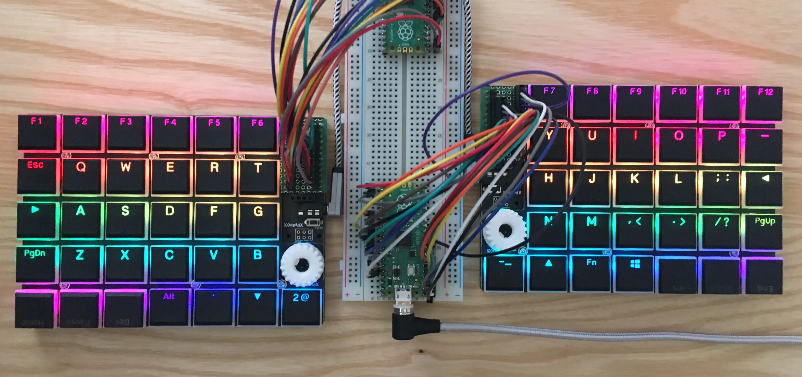

The static type system ensures correspondence of the "type" among arguments, parameters, and return values.
The point is that you can notice some kinds of bugs in advance of execution.

Static typing languages like TypeScript, Go, and Swift are mainstream in programming nowadays.
Because the IT industry has grown and the division of labor has been promoted, the benefit of static typing is quite remarkable.

So, how are dynamic typing languages like PHP, Python, and Ruby catching up the tide?

## Gradual typing and annotations

PHP offers "Type declarations" from version 5 and the possibility of declaration is getting broader.

```php
function sayhello(string $name): string
{
  return print('Hello ' . $name);
}
sayhello("Monstar");
=> Hello Monstar
```

Python 3 has introduced "Type hints" which allows you to annotate a type of variables and functions.

```python
def sayhello(name: str) -> str:
  return print('Hello ' + name)
sayhello('Monstar')
=> Hello Monstar
```

Both PHP and Python support gradual static typing by their languages themselves.
In other words, they deal with the types in syntax parsing.

## Not the syntax, but a library

Matz says that Ruby will not introduce any syntax-level type annotations. I agree with his philosophy since once a language has introduced a static type system in its syntax, it should be maintained to keep backward compatibility. It will possibly be a negative legacy.

Instead, the Ruby ecosystem introduced "RBS" as an exclusive language that describes the structure of a Ruby program.
And you can check the types of your Ruby values described in RBS with "Steep" which is a gradual static type checker.
The point is that both RBS and Steep aren't supported by the syntax of Ruby.

Because CRuby thus offers static type checking as libraries instead of its syntax parsing, unlike PHP and Python, other Ruby language implementations like JRuby and mruby can gracefully take advantage of it, too.

**This is, indeed, a hidden innovation!**

## Static type checking in firmware programming

I wrote about PicoRuby and PRK Firmware in [my previous article "PicoRuby"](/2021/04/13/PicoRuby) the other day.
In short, PicoRuby is a Ruby implementation for microcontrollers.
PRK Firmware is a framework of keyboard firmware in PicoRuby.

One thing troublesome to develop firmware for microcontrollers is debugging on actual devices.
You need to build an executable from your application program, detach the USB cable from your dev board (because you must have connected it just before, right? :), reconnect the cable while pushing a boot button on the device, then flash the executable to the device's ROM with a flashing script.

You have to do a messy procedure like this every time you amend the program.
That's why you really need to find trivial mistakes such as assigning a String to a variable that should accept only a Symbol while building an executable.

On the other hand, when you write a Rails application, you can easily fix your TYPO without rebooting Rails server.

You now understand why RBS and Steep are good news for PicoRuby in particular.

## How RBS and Steep work together in PicoRuby

If you want to know about RBS and Steep, there is nothing better than the official documentation listed at the bottom of this article.
However, there is still worth showing how RBS and Steep bring a benefit.

### Types in parameters and arguments

(All the example code below is abbreviated for explanation)

Let's say Keyboard class has `add_layer` method to let you be able to configure your keymap.

```ruby
# in keyboard.rb
class Keyboard
  def add_layer(name, map)
    new_map = Array.new(map.size)
    map.each_with_index do |row, row_index|
      new_map[row_index] = Array.new(row.size)
      row.each_with_index do |key, col_index|
        keycode_index = KEYCODE.index(key)
        new_map[row_index][col_index] = if keycode_index
          keycode_index * -1 # Integer
        else
          key                # Symbol
        end
      end
    end
    @layers[name] = new_map  # Array[Array[Integer | Symbol]]
  end
end

# in keyboard.rbs which describes the structure of Keyboard class
class Keyboard
  def add_layer: (Symbol name, Array[Array[Symbol]] map) -> void
end
```

`keyboard.rbs` tells that `add_layer` method accepts two arguments.
The first one is `name` and should be a Symbol.
The latter is `map` and should be an Array of Array of Symbol.

You can call `Keyboard#add_layer` and `steep check` successfully passes like this:

```ruby
keyboard.add_layer :default, [
  %i(KC_ESCAPE KC_Q KC_W KC_E KC_R KC_T KC_Y KC_U KC_I KC_O KC_P KC_BSPASE),
  # The Array of Symbol goes on...
]

$ steep check
# Type checking files:
...............
No type error detected. 🍵
```

You will be warned if you mistakenly wrote like this:

```ruby
keyboard.add_layer "default", [
  %i(KC_ESCAPE KC_Q KC_W KC_E KC_R KC_T KC_Y KC_U KC_I KC_O KC_P KC_BSPASE),
  # The Array of Symbol goes on...
]

$ steep check
# Type checking files:
.............F.
keymap.rb:22:19: [error] Cannot pass a value of type `::String` as an argument of type `::Symbol`
│   ::String <: ::Symbol
│     ::Object <: ::Symbol
│       ::BasicObject <: ::Symbol
│
│ Diagnostic ID: Ruby::ArgumentTypeMismatch
│
└ keyboard.add_layer "default", [
                     ~~~~~~~~~
Detected 1 problem from 1 file
```

### Types in instance variables

As a result of `add_layer` method, the instance variable `@layers` should be a Hash with Symbol as a key and Array of Array of "Integer or Symbol" as its value.
The RBS code below ensures it (and has a type definition of `@special_procs` mentioned later):

```ruby
# keyboard.rbs
class Keyboard
  @layers: Hash[Symbol, Array[Array[Integer | Symbol]]]
  @special_procs: Hash[Symbol, Proc]
end
```

Steep understands you are handling the variable as a specific type by a comment form annotation `# @type var key: Symbol`.

```ruby
layer = @layers[:default]
layer.each do |rows|
  rows.each do |cols|
    cols.each do |key| # at this point, `key` should be an Integer or a Symbol
      next if key.is_a?(Integer)
      # @type var key: Symbol
      @special_procs[key].call
    end
  end
end
```

Because a comment form annotation is just a comment in terms of Ruby syntax, there is no compatibility issue if Ruby's type system is basically changed in the future.
There are also no worries that type annotation syntax will be an obstruction against a new syntax.
This is what Matz says, I think.

Lastly, Steep sharply makes you notice if you mistakenly call `each` method for `key` that should be an Integer or a Symbol before you are going to flash your executable into the device which will crash for sure 💥

```ruby
      case key.class
        ...
      else
        key.each { do_something }
      end

$ steep check
[error] Type `(::Symbol | ::Integer)` does not have method `each`
│ Diagnostic ID: Ruby::NoMethod
│
└      key.each { do_something }
           ~~~~
```

## Conclusion

- RBS is an independent language that describes the type information of a Ruby program
- Steep is a library that statically checks types in Ruby program using RBS formed annotations
- CRuby syntax itself doesn't suport static type checking
- Therefore, other implementations of Ruby can use RBS and Steep. Even PicoRuby can do it❗
- Static type checking in firmware programming is truly helpful

## Resources

- [Matz's keynote in RubyConf 2016](https://www.youtube.com/watch?v=1l3U1X3z0CE&t=1516s) describing his opinion about type checking
- RBS [https://github.com/ruby/rbs#readme](https://github.com/ruby/rbs#readme)
- Steep [https://github.com/soutaro/steep#readme](https://github.com/soutaro/steep#readme)
- Although this article didn't mention, you may also want to check [TypeProf](https://github.com/ruby/typeprof#readme)
- Find how PRK Firmware actually handles RBS and Steep in practice here: [https://github.com/picoruby/prk_firmware/tree/master/src/ruby](https://github.com/picoruby/prk_firmware/tree/master/src/ruby)



_Article Photo by [hasumikin](https://twitter.com/hasumikin)_
