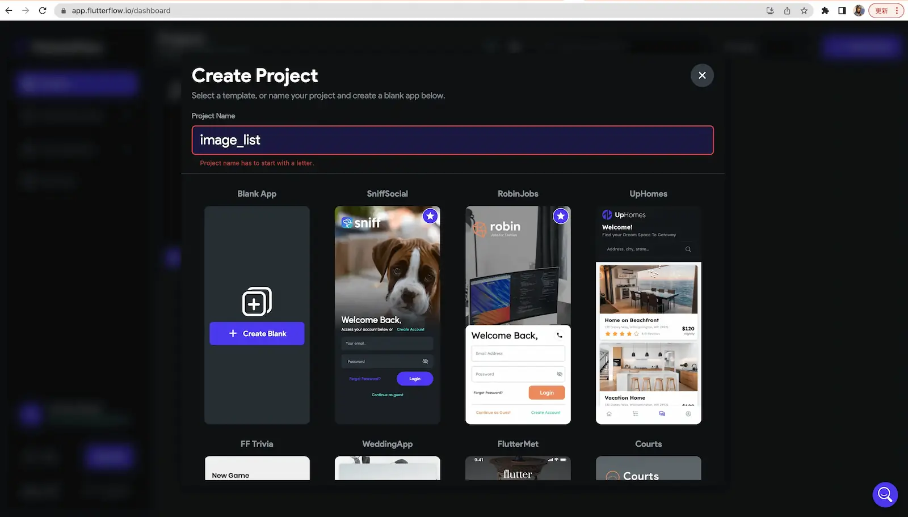
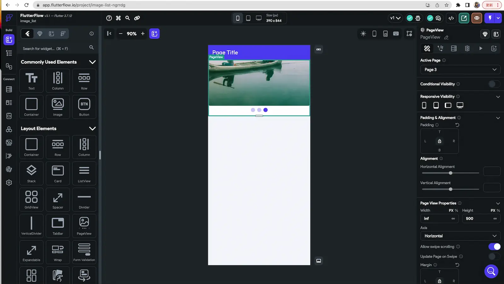
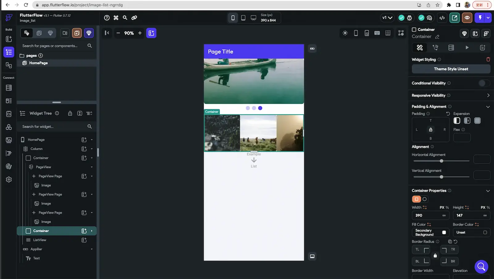
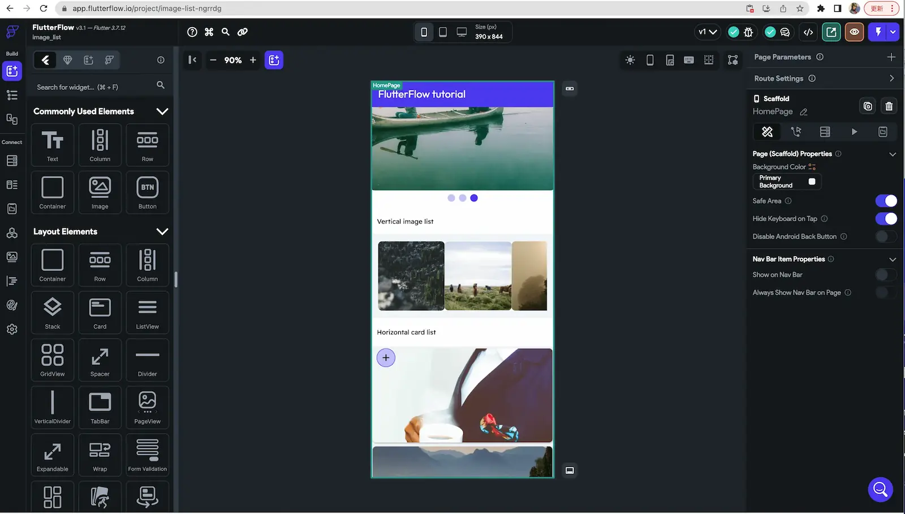
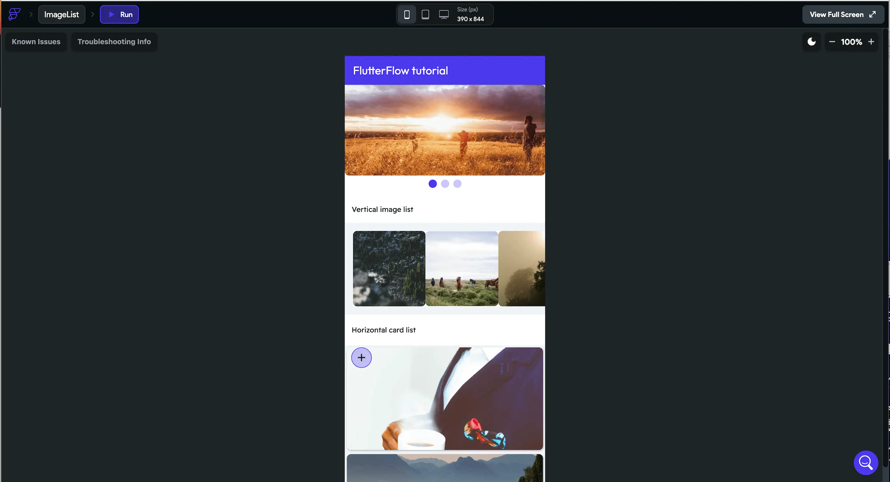

In today's fast-paced world, creating robust and user-friendly mobile applications is essential for businesses and developers alike. However, the process of building an app can be complex and time-consuming. That's where FlutterFlow comes in. FlutterFlow is a powerful visual development platform that simplifies the app development process using Google's Flutter framework. In this article, we'll explore the features and benefits of FlutterFlow and how it can revolutionize your app development workflow.

### What is FlutterFlow?
FlutterFlow is an intuitive and powerful visual development platform that allows developers to design, prototype, and build mobile applications using a visual interface. It leverages the power of Google's Flutter framework, a cross-platform UI toolkit, to create high-quality native apps for iOS and Android.

### Amazing Visual Interface
One of the standout features of FlutterFlow is its visual interface, which enables developers to design app screens and create interactive prototypes without writing a single line of code. With its drag-and-drop functionality, you can quickly build UI layouts, add components, and define interactions between screens. This visual approach makes it easy to iterate and refine your app's design, saving time and effort in the development process.

### Easy Code Generation
While FlutterFlow simplifies the visual design aspect of app development, it doesn't limit you to visual-only workflows. FlutterFlow generates clean, production-ready Flutter code based on your designs, giving you the flexibility to customize and extend your app's functionality using traditional coding practices. This allows developers to seamlessly transition from the visual interface to writing code, providing the best of both worlds.

### Element Library
FlutterFlow comes with an extensive library of pre-built UI components that you can use to create stunning app interfaces. From buttons and input fields to complex elements like lists and grids, FlutterFlow offers a wide range of ready-to-use components. This saves developers from reinventing the wheel and accelerates the development process.

### Real-Time Collaboration
Collaboration is key when working on app development projects, and FlutterFlow offers real-time collaboration features that streamline teamwork. Multiple team members can work simultaneously on the same project, making it easy to share ideas, gather feedback, and track progress. With FlutterFlow's collaboration capabilities, you can ensure efficient communication and maximize productivity.

### Integration with Backend Services
Building a complete app often involves backend integration, and FlutterFlow offers seamless integration with popular backend services. This allows developers to easily connect their apps to databases, authenticate users, and fetch data from APIs. These built-in integrations simplify the process of incorporating backend functionality, such as working with services like Firebase, GraphQL, and REST APIs, and enable robust functionality in your app. However, it's worth noting that there are scenarios where an app can be considered complete and fully functional without the need for complex backend code or integration.

## To use FlutterFlow, follow these steps

1. Sign up and Create a Project:
    * Go to the [FlutterFlow website](https://flutterflow.io/) and sign up for an account.
    * Once you're signed in, create a new project by clicking on the "Create Project" button.

2. Design Your App:
    * After creating a project, you'll be directed to the FlutterFlow visual editor.
    * Start designing your app's screens by dragging and dropping UI components from the sidebar onto the canvas.
    * Customize the appearance of the components, define layouts, and add interactions between screens using the visual interface.
    
3. Configure Data Sources:
    * If your app requires data from a backend service or API, you can configure data sources in FlutterFlow.
    * Connect your app to external services like Firebase, REST APIs, or GraphQL by setting up the necessary configurations within FlutterFlow.

4. Add Logic and Functionality:
    * While FlutterFlow simplifies visual design, you can also add logic and functionality to your app using code blocks.
    * Utilize FlutterFlow's built-in functionality blocks or create custom logic using Dart code snippets.

5. Preview and Test:
    * Use the Preview mode in FlutterFlow to test your app's design and interactions within the visual editor.
    * Preview your app on different device sizes and orientations to ensure responsiveness.

6. Generate Flutter Code:
    * Once you're satisfied with your app's design and functionality, you can generate the Flutter code.
    * Click on the "Export Code" button to generate clean and structured Flutter code based on your FlutterFlow project.

7. Import to Flutter:
    * Open your preferred Flutter development environment (such as Android Studio or Visual Studio Code) and create a new Flutter project or open an existing one.
    * Copy the generated Flutter code from FlutterFlow and replace the default code in your Flutter project with the generated code.

8. Build and Launch Your App:
    * Build and run your Flutter app using the Flutter CLI commands (`flutter run`) or through your integrated development environment.
    * Test your app on different devices or emulators to ensure it functions as intended.

## Let's build a simple screen using FlutterFlow

Go to the FlutterFlow website (https://flutterflow.io/) and sign up for an account.
Image

A prompt to enter the project details along with firebase integration will be displayed, for this blog post I will not integrate Firebase.

### The tools
FlutterFlow provides a set of tools and panels on the left and right sides of the interface to assist with the visual development process. Let's take a closer look at each side and their respective tools:

The tools on the left panel:

* Screen Selection: At the top left corner, you'll find a dropdown menu that allows you to select and switch between different screens in your app. This is where you can manage and access various screens within your project.

* Component Tree: Below the screen selection dropdown, you'll find the Component Tree panel. It provides a hierarchical view of all the UI components present on the currently selected screen. You can expand and collapse the tree to navigate and select specific components for editing.

* Properties Panel: The Properties panel, located on the left side, displays the properties and attributes of the selected UI component. You can modify these properties to customize the appearance, behavior, and styling of the selected component.

* Data Sources: The Data Sources panel allows you to manage and connect data sources to your app. You can define data models, integrate APIs, and create dynamic content for your app using this panel. It provides a visual interface for managing data and API connections.

* Actions: The Actions panel enables you to define and manage interactive behaviors within your app. You can create events and actions that respond to user interactions, such as button clicks or form submissions. This panel allows you to add logic and interactivity to your app without writing code.

The tools on the right panel:

* Widget Library: The Widget Library panel, located on the right side, provides a comprehensive collection of pre-built UI components that you can drag and drop onto your app screens. It includes various categories of widgets, such as buttons, text fields, images, lists, and more. You can customize these widgets to fit your design requirements.

* Styles: The Styles panel allows you to manage and apply styles to your UI components. It provides options for defining and customizing text styles, colors, spacing, and other visual properties. You can create reusable styles to maintain consistency across your app.

* Asset Manager: The Asset Manager panel lets you upload and manage the assets (images, icons, fonts, etc.) used in your app. You can upload assets, organize them into folders, and easily access and use them within your app screens.

* Component Structure: The Component Structure panel shows a hierarchical overview of your app's components and screens. It provides a visual representation of the entire structure of your app and allows you to navigate between screens and components easily.

* Preview and Simulator: At the top right corner, you'll find buttons to preview your app's design and functionality. You can view your app's appearance on different device sizes and orientations, and even interact with the previewed app using the built-in simulator.

In the below image, I have dragged and dropped a Column as a parent Widget and the pageView component and when you click the component, you will have options to position the elements and design them accordingly.

Next, I added a Container Widget with Row and three more Container with image Components

Then, I added a ListView component below and added Cards with Images. The listView is Expanded by selecting the option on the right and making a horizontal scroll.

Finally, when you are satisfied with the look of the screen select on the run option to preview the app. This is how it would look like

## Limitations and areas where FlutterFlow may fall short

While FlutterFlow offers many benefits, it's important to consider its limitations and areas where it may fall short. Here are some downsides and considerations:
* Limited Customization: FlutterFlow provides a visual interface for building UI components, but it may have limitations when it comes to fine-grained customization. Advanced design elements or complex animations may require manual coding or customization outside of the visual builder.

* Learning Curve: While FlutterFlow simplifies the app development process, there is still a learning curve associated with using the tool. It may take time to familiarize yourself with its interface, components, and workflows.

* Less Control and Flexibility: Since FlutterFlow is a low-code tool, it abstracts certain aspects of app development. This can limit the level of control and flexibility you have over your app's code and architecture. Custom or complex requirements may require direct coding in Flutter instead of relying solely on FlutterFlow.

* Production Readiness: While FlutterFlow has improved over time, it may still have some limitations when it comes to production-level app development. It's important to thoroughly test and validate your app's behavior, performance, and scalability when using FlutterFlow.

* Complex Scenarios: While FlutterFlow can handle many common app scenarios, it may struggle with more complicated use cases that require access to device sensors, camera functionality, Bluetooth connectivity, or advanced platform-specific features. In such cases, manual coding or integrating additional Flutter packages may be necessary.

* Accessibility Support: FlutterFlow provides basic accessibility features, but it may not cover all the requirements for building fully accessible apps. Additional manual coding and testing may be needed to ensure proper accessibility support.

* Unit Testing: FlutterFlow's visual builder approach may make it challenging to write comprehensive unit tests. Extensive testing and validation may require writing custom code and utilizing Flutter's testing framework directly.

* Time Savings: The amount of time saved using FlutterFlow versus building from scratch depends on various factors such as the complexity of the app, your familiarity with FlutterFlow, and the level of customization required. While FlutterFlow can accelerate the development process by generating code and providing visual editing capabilities, it may still require additional manual coding for specific requirements, resulting in varying time savings.

## Conclusion:

FlutterFlow is a game-changer for mobile app development. Its visual interface, code generation capabilities, extensive component library, and seamless backend integrations make it a go-to platform for developers looking to build high-quality native apps efficiently. By simplifying the development process and fostering collaboration, FlutterFlow empowers developers to bring their app ideas to life quickly and effectively. Whether you're a beginner or an experienced developer, FlutterFlow is a tool worth exploring to unlock your app development potential.
Mind you, FlutterFlow is a powerful visual development tool that simplifies the app development process, but it's important to have a basic understanding of Flutter and Dart programming concepts to fully leverage its capabilities. FlutterFlow complements your development workflow by providing a visual interface and code generation, but you may need to customize and extend your app's functionality through manual coding.
However, it's important to evaluate its suitability for your specific project's requirements, complexity, and customization needs. Careful consideration should be given to its limitations, production readiness, support for advanced scenarios, accessibility, unit testing, and the trade-offs between time saved and flexibility.

Refer to FlutterFlow's documentation, tutorials, and community resources to explore its features in-depth and make the most of this powerful app development platform.

Remember, the best way to truly experience the power of FlutterFlow is to try it out for yourself. So, dive in.

