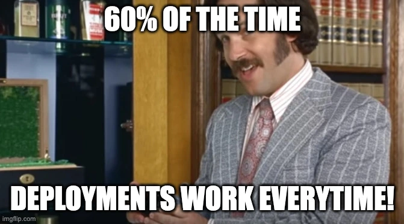
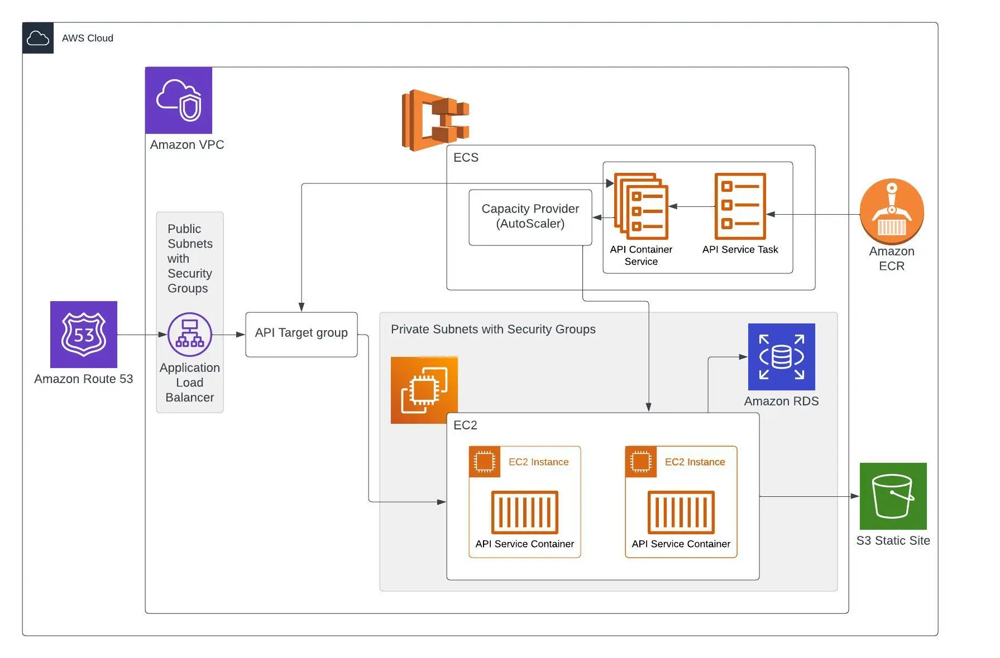
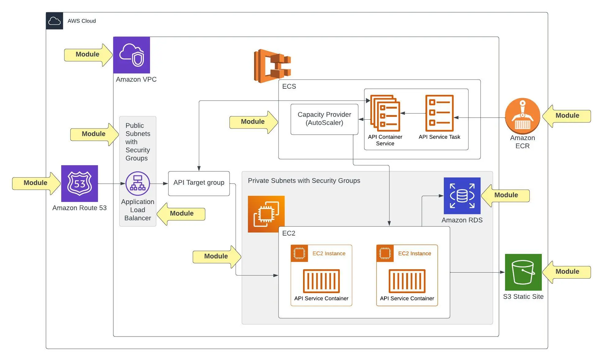

When cloud infrastructure is created using IaC with Terraform, how can you know it’s working as intended?



I can recall many times when I deployed services with Terraform only to find out it didn’t work as intended. I would then sometimes spend hours pecking through the cloud UI looking for a missing configuration or what could possibly cause the issue. Sometimes it would even be the same missing configuration for a previous Terraform deployment. You know, like those elusive Security Group's egress/ingress rules. Only if I had an automated way to test for configurations that should be set or services that should be active. Let me introduce unit and integration tests using [Terratest from Gruntwork](https://terratest.gruntwork.io/).

## Unit Tests

Unit tests are automated tests to ensure that a section of an application (known as the "unit") meets its design and functions as intended. With Terraform this can really only be done by deploying to a real environment. When deploying infrastructure, it is very rarely just a single unit, however more an integration test of a few to many services. For that reason, there is no true unit testing with IaC.

So how can this be done? How can we test our infrastructure in the smallest unit possible? Let’s take this simple infrastructure example.



Testing this entire infrastructure would take too long and would have a high risk of failure. This is why relying on [end to end testing for infrastructure is not advised](https://testing.googleblog.com/2015/04/just-say-no-to-more-end-to-end-tests.html), and should be broken up into smaller unit and integration tests. In this example, we can do this by making sure each service is broken up into modules.



By testing each module we can deploy our infrastructure, validate it works, and then destroy it. Here is a snippet of code on performing this test on an AWS VPC with Terratest.

```
  defer terraform.Destroy(t, terraformOptions)
  terraform.InitAndApply(t, terraformOptions)
  outputs, err := TerraformOutputAll(t, terraformOptions)
  CheckIfError(err)
  validateVPC(t, outputs)
```

Let's walk through each line. Most of these lines have a `terraformOptions` these are options that are passed. These include the Terraform directory, and environment variables, or any Terraform variables to pass. They also may have a `t`, which is the [testing](https://pkg.go.dev/testing) package in Go.

1. In Golang, the defer keyword is used to delay the execution of a function or a statement until the nearby functions return. Meaning that the Terraform will destroy the deployed infrastructure once the deployment and validation is completed, successfully, or not.
2. The Terraform `init` and `apply` commands are run, which will deploy the infrastructure.
3. Outputs are injected into a variable to be used to validate our tests. Some examples are VPC ID, public subnets, and private subnets.
4. A wrapper to check for any errors.
5. Run Go tests to validate that the VPC is working as intended.

Here is an example of two tests. One that will verify that the public subnets are indeed public, and the other verifying that the privates are in fact private. Don't focus too much on the code, what I want to point out is that we can take the Terraform outputs, and assert that they are public, or private by using the `assert.True` or `assert.False`. Meaning if a private subnet that was created was public, it would fail the test.

```
  // Verify if the network that is supposed to be public is really public
  for _, v := range outputs.AWSVPCPublicSubnets {
    assert.True(
      t,
      aws.IsPublicSubnet(
        t,
        string(v),
        awsRegion,
      ),
    )
  }

  // Verify if the network that is supposed to be private is really private
  for _, v := range outputs.AWSVPCPrivateSubnets {
    assert.False(
      t,
      aws.IsPublicSubnet(
        t,
        string(v),
        awsRegion,
      ),
    )
  }
```

When I run the tests on the VPC and they all pass, I would get the results like so.

```
=== RUN   TestVPC/Subnets
--- PASS: TestVPC (7.11s)
    --- PASS: TestVPC/Subnets (0.93s)
PASS
ok      example 7.474s
```

The above example is testing the subnets within a VPC. Which, I would call an integration test. since our VPC module includes an option to create subnets, the unit in question is the module itself. Before we go into what integration tests would look like, let's go over the stages in Terratest.

## Terratest Stages

Terratest has a helper function `RunTestStage`. This help function is used as a variable as `stage`. The quoted text is the name of the stage, which we can now skip by passing an environment variable. If we wanted to deploy this VPC, however, didn't want to destroy it after the run is completed, we can export the env var `SKIP_destroy_vpc`. This is important to include in the integration tests to avoid destroying infrastructure that was created in a separate module and needed for other services.

```
	stage := test_structure.RunTestStage

	defer stage(t, "destroy_vpc", func() {
		DestroyTerraform(t, terraformOptions)
	})

	stage(t, "apply_vpc", func() {
		outputs = ApplyTerraform(t, terraformOptions)
	})

	stage(t, "validate_vpc", func() {
		validateVPC(t, outputs)
	})
```

The output now shows that the `destroy_vpc` was skipped:

```
The 'SKIP_apply_vpc' environment variable is not set, so executing stage 'apply_vpc'.
applying...
The 'SKIP_validate_vpc' environment variable is not set, so executing stage 'validate_vpc'.
=== RUN   TestVPC/Subnets
The 'SKIP_destroy_vpc' environment variable is set, so skipping stage 'destroy_vpc'.
--- PASS: TestVPC (7.59s)
    --- PASS: TestVPC/Subnets (0.96s)
PASS
ok      example 7.925s
```

## Integrations Tests

Here is a real-world example of how integration tests would work. We want to deploy an ECS cluster, and we want to make sure that the container on the service is running, and that the ingress/egress security group rules for the ALB and ECS are set correctly. We already deployed other modules needed and left them deployed by using the `SKIP_destroy_foo` environment variables. Now running the tests will skip any stage name that matches the environment variables, in this example `SKIP_destroy_ecs`.

```
	stage := test_structure.RunTestStage

	var outputs TerraformOutputs

	defer stage(t, "destroy_ecs", func() {
		DestroyTerraform(t, terraformOptions)
	})

	stage(t, "apply_ecs", func() {
		outputs = ApplyTerraform(t, terraformOptions)
	})

	stage(t, "validate_ecs", func() {
		validateECS(t, outputs)
	})

	stage(t, "integration_ecs", func() {
		integrationECS(t, outputs)
	})
```

Within the `integration_ecs` we will be testing:

* VPC and subnets
* Security group ingress/egress rules
* ECS service running

```
The 'SKIP_apply_ecs' environment variable is not set, so executing stage 'apply_ecs'.
apply...
The 'SKIP_validate_ecs' environment variable is set, so skipping stage 'validate_ecs'.
The 'SKIP_integration_ecs' environment variable is not set, so executing stage 'integration_ecs'.
=== RUN   TestECS/ECS_Cluster
=== RUN   TestECS/VPC
=== RUN   TestECS/Security_Groups
The 'SKIP_destroy_ecs' environment variable is set, so skipping stage 'destroy_ecs'.
--- PASS: TestECS (12.30s)
    --- PASS: TestECS/ECS_Cluster (0.28s)
    --- PASS: TestECS/VPC (0.99s)
    --- PASS: TestECS/Security_Groups (0.21s)
PASS
ok      example 12.718s
```

## Conclusion

I can now with confidence test deployed infrastructure using Terraform by using Terratest. I can have Terratest deploy in a separate sandbox environment, validate it works with set checks, and finally destroy the created infrastructure once done. A few takeaways I have from testing IaC with automation are to avoid end-to-end testing, make sure to set a bigger time out on the Go test command with `-timeout`, and spend time thinking of checks that you want to include in your tests.

**Note**

HashiCorp has switched from [MPL v2 license](https://www.mozilla.org/en-US/MPL/2.0/FAQ/) to a “Business Source License” (BSL). This will have an impact on Terratest going forward past Terraform version 1.5.5, so just make sure for the time being not to upgrade past that version if using Terratest. If interested, look into the [OpenTofu Linux Project](https://opentofu.org/), which has a forked Terraform, and is dedicated to open source.


_Article Photo by James von Hagel_
