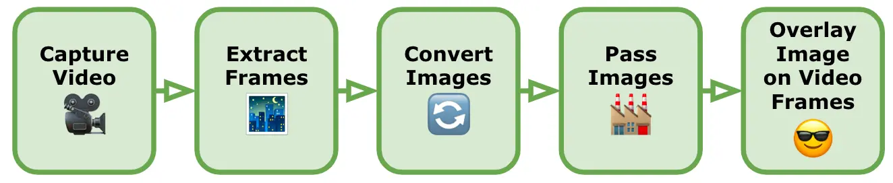
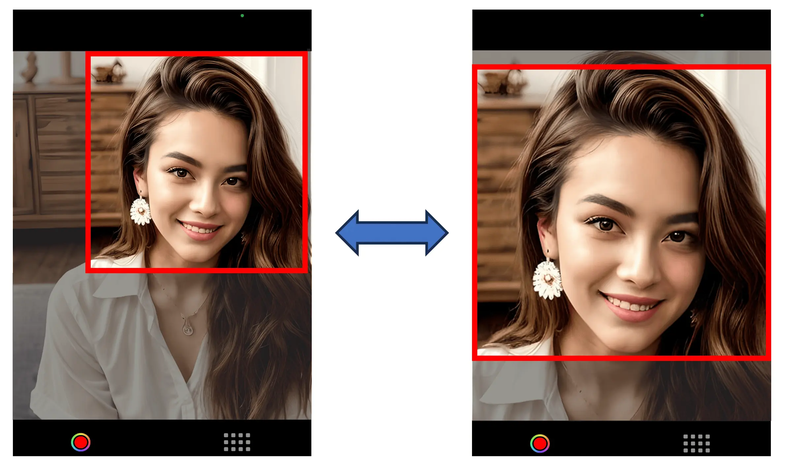
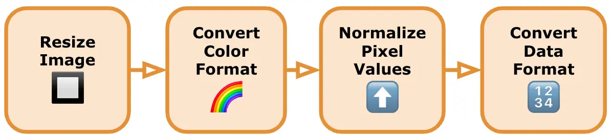
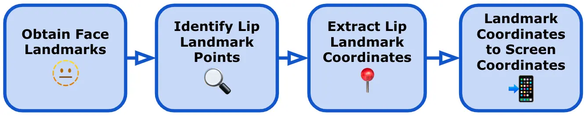
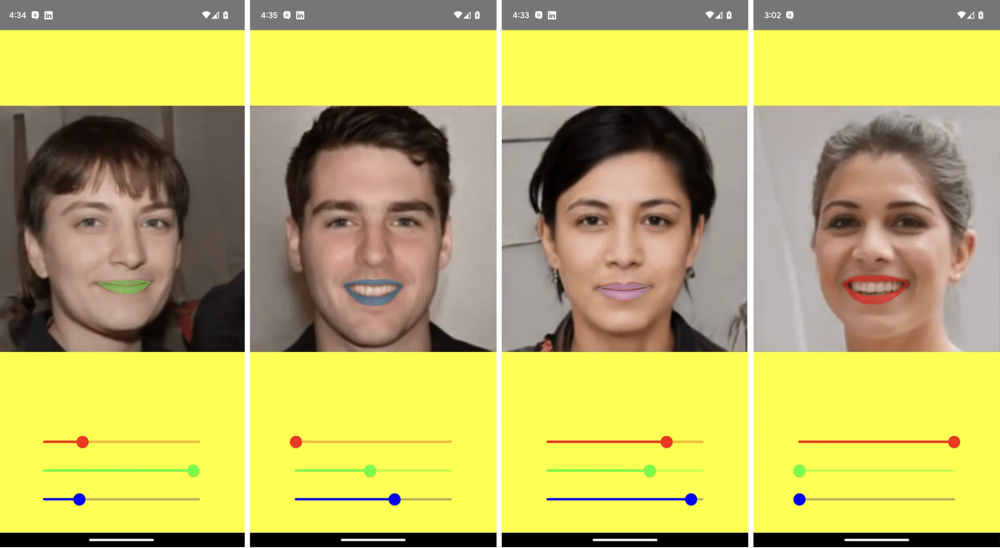
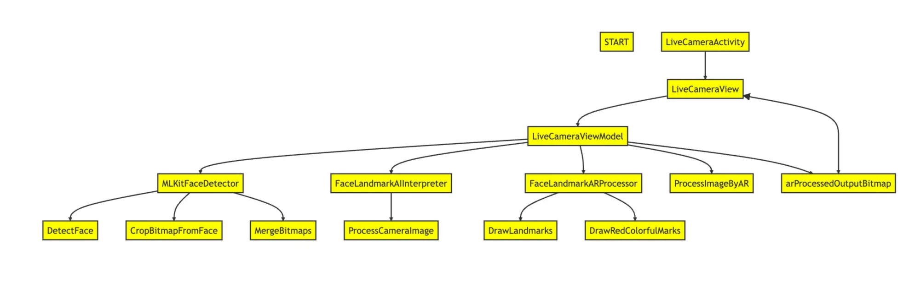
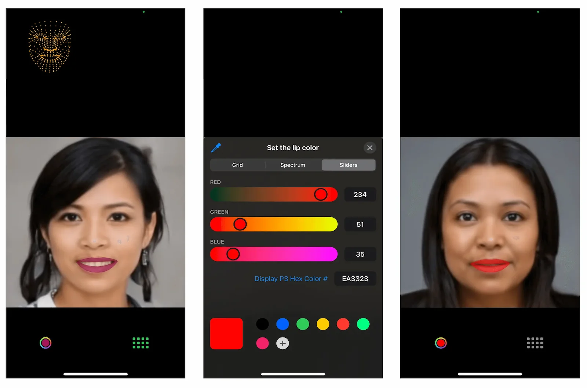

In today's digital age, mobile applications have become an integral part of our daily lives. From ordering food to managing finances, there seems to be an app for every need. Behind the scenes, these apps are powered by a technology that has revolutionized the way we interact with our smartphones: artificial intelligence (AI). AI has not only transformed the capabilities of mobile apps but has also opened up a world of possibilities for developers and users alike.

We (the MLJP mobile team members) wanted to catch up with AI and be ready to make better proposals for our clients. Therefore, we created a team to research this technology applied to mobile development and come up with an easy idea to get a nurturing experience.

# What is Artificial Intelligence?

AI is a field of computer science that aims to create intelligent machines capable of performing tasks that typically require human intelligence. AI algorithms are generally based on models trained using specific data sets.

The goal of AI modelling is to generalize instructed knowledge during the inference phase, using data sets provided during the training phase. Training data sets generally consist of pairs of data points and their corresponding ground truth values, enabling the model to learn the relationship between the two and attempt to reproduce it.

Various types of data, such as images, text, or tabular data, can be used in this regard. The input/output data do not necessarily have to be the same. For instance, you can ask a model to classify an image into a specific category (e.g., whether an image contains a cat).

With the project developed in this article, we aim to detect face landmarks in an image. Thus, we feed the model an image and receive tabular data representing the coordinates of these landmarks as an output. The technical details are as follows:

- **Data to be analyzed**: An _RGB_ image.
- **Model Input data**: A **192 x 192** pixel image, framed and resized around the face.
- **Model Output data**: **468** face landmarks, each having **X, Y, and Z** coordinates.
- **Model type**: A deep learning model that uses artificial neural networks based on the TensorFlow Lite framework.

# Choose your lipstick

The app developed is a face makeup, starting with the lipstick color. This application aims to provide users with the ability to change the color of their lips in real-time using advanced pose estimation technology. Here is a basic overview of how this functionality works:

- **Real-time Lip Detection**: Using a pre-trained pose estimation model from the AI team, we track the position and shape of the user's lips in real-time. The model analyzes the facial landmarks and provides accurate coordinates of the lip contour.

- **Color Palette Selection**: To offer a diverse range of lip colors and shades, we provide users with RGB sliders. Users can interact with the sliders and select any desired lip color.

- **Real-time Color Application**: Once the user selects a lip color from the palette, the application applies the chosen color to the detected lip region in real-time. This is achieved by mapping the color to the specific lip contour coordinates obtained from the AI model.

We picked up this idea, after a long brainstorming, basically because it required low resources (developer’s face and a smartphone frontal camera) and an easy scenario to work with (one existing AI model). In addition, face makeup applications have gained significant popularity in recent years due to the rise of social media platforms and the desire for users to enhance their appearance in a fun and creative way.

In the following sections, we are going to explain the detailed process we followed to achieve the idea proposed and what challenges and issues we found along the way.

# Image Processing Flow Overview

First of all, to take a video image from a mobile device camera and get some face landmarks, we needed to follow a series of steps. Here's a high-level overview of the main processes involved:



1. **Capture the Video**: We use the device’s built-in camera functionality to capture the video. We make sure the video includes the face we want to detect and extract landmarks from whilst being careful to ensure that the face is neither too close nor too far away. We should note that most face detection models also have difficulty matching a face that is looking too far (left, right, up or down), or tilting too far (either side).

2. **Extract Frames from the Video**: We convert the video into individual frames, as a video is essentially a sequence of images. We use the native frameworks in both Android and iOS to extract frames from the video, iterate through each frame from the video and perform the subsequent steps on each frame as a static image.

3. **Convert Images to TensorFlow Lite Input**: Before using these images in TensorFlow Lite, we need to preprocess them to match the input requirements of our face landmark detection model. This typically involves resizing the images to the model's expected input size and normalizing pixel values. Each model will have its own specific requirements for the images we pass to it, and failing to correctly preprocess our images will either give wildly inaccurate results or be unable to match a face. A more detailed explanation of this step is explained in the following sections (Cropping the Images and Image Processing Techniques).

4. **Pass Images to TensorFlow Lite Model**: We load the preprocessed images into our TensorFlow Lite face landmark detection model and run inference on each image. The model will output the predicted landmarks for the face detected in the frame. TensorFlow Lite provides APIs for loading the model and running inferences.

5. **Overlay Images on the Video Frames**: Once we have the face landmarks for each frame, we overlay an image or add visual effects using the landmarks as reference points. We use Android and iOS advanced graphic frameworks to do so.

Now that we have a good overview of the steps involved in detecting face landmarks in an image, let’s look at some of the image processing techniques we use to convert our images.

# Cropping the Images

To improve the accuracy of the face landmark model, we avoid using the entire frame image when we only need the face. Thus, one of the first image-processing tasks we need is to crop the face, so that we are only processing the area we need to send to the model.

It's important to note that face landmark models are typically trained on datasets where the faces are already cropped or centered. Therefore, using cropped face images during inference helps align the input with the data distribution the model was trained on, resulting in better performance.

However, when cropping a face from an image to use in a face landmark model, there are several challenges and issues that need to be addressed. Here are some of the key considerations:

- **Face Detection Accuracy**: The accuracy of the face landmark model heavily relies on the quality and correctness of the cropped face. If the cropping process is not performed accurately, it can result in incomplete or inaccurate face regions, leading to degraded detection performance. Ensuring precise and comprehensive cropping is crucial to obtain reliable results.

- **Face Localization**: The face landmark model expects the face to be properly centered and aligned. However, variations in pose, scale, rotation, and occlusions in the original image can make face localization challenging. Addressing these factors and implementing robust techniques for face localization is essential to obtain accurate and properly cropped faces.

- **Correct Aspect Ratio**: Maintaining the correct aspect ratio of the face during cropping is important to avoid distortion or stretching. Faces in images can have different orientations and aspect ratios. It's necessary to handle these variations appropriately, ensuring that the cropped face maintains its correct proportions for effective face detection.

- **Background and Context**: Removing the background and irrelevant context from the cropped face will improve the performance of the face landmark model. Eliminating distractions, such as cluttered scenes or irrelevant patterns, that may interfere with the face landmark process, will help improve the model's accuracy.

- **Head Cropping**: Although we talk about face landmarks most models will require the whole head. Just cropping the face area will result in inaccurate results so the crop area should aim to contain the whole head, including the chin, ears and top of the head.

- **Image and Lighting Quality**: The quality of the camera photo image, including factors like resolution, noise, blur, and lighting conditions, can impact the performance of the face detection model. Noise or blur can obscure facial features, while poor lighting conditions may affect the visibility of the face. Properly handling image enhancement techniques, such as de-noising, sharpening, or adjusting brightness/contrast, can help improve the quality of the cropped face for more accurate detection.

- **Occlusions and Partial Faces**: Addressing occlusions, such as hair, glasses, or hands covering parts of the face, is a significant challenge when either trying to crop a face from an image or detect face landmarks. Detecting and accounting for these occlusions is crucial to ensure the cropped face includes the complete facial features required for accurate detection. Advanced techniques like occlusion detection and additional preprocessing steps can assist in handling these situations but it is usually more efficient to simply ensure that the user is aware of the face detection limitations and should avoid covering their face when possible.

With the above in mind, we tried two ways of cropping.

1. **Center Cropping**: This is the easiest to implement. We simply crop the largest possible square from the center of the image with its height equal to its width (when the images are in portrait orientation). To prevent the user from accidentally moving their face outside of this area we can overlay guidelines on the video image to indicate to the user the ideal position for their face. This method relies on the user to accurately position their face in the optimal location at the correct distance. If the user has difficulty with this, then we can change to **Center Padding**. This method adds a buffer area to the left and right of the image to turn the rectangle into a square. In this way, the user’s face will never be accidentally cropped but, by increasing the size of the image we will be reducing its accuracy.


Figure: Center Padding (left) vs Center Cropping (right): Padding will always contain the face but increases the size of the image with unnecessary space. Cropping is more space efficient but has the risk of losing part of face. Devices with very tall and thin screens will also have much more padding.

2. **Face Detection Cropping**: This uses a face detection model to determine the precise position of the whole face (without individual face landmarks) and will return a bounding rectangle with an origin: (**x, y**) and a size: (**width, height**). This will usually result in a rectangle that will probably need to be padded out on the right and left sides to make a square. We should avoid cropping the top and bottom of the rectangle to get a square, as this will remove the chin, etc, that may confuse the face landmark model. The advantage of this method is that the cropped area will only contain the face area giving the face landmark model the most accurate image possible.


Figure: Face Detection Cropping: Face detection will only use the face, regardless of size, which significantly increases face landmark detection accuracy but increases CPU computation load considerably.

In our project, we decided to use the face detection model. After face cropping, the image is resized smaller for the model. As the images we input to the model are only a few hundred pixels wide, having the face fill as much of the image as possible will give a wider range for the landmark positions to be assigned to. For example, the lips alone can have over 50 landmarks. Another advantage of using a face detection model is that the user is free to move around, and the model will still accurately locate their face. Even when the user is far away from the camera the app will still find and expand the image appropriately. On the other hand, adding another layer of intensive image processing will increase CPU usage resulting in faster battery depletion and an increase in temperature for mobile devices.

### Examples of Center Padding vs Center Cropping vs Face Detection Cropping

In deciding which cropping method is most suitable for your use case, please look at the below examples. They show exactly how the images will appear depending on how far the person is away from the camera. Note that center cropping can be effective only if the user actively positions themselves within the center cropping area, otherwise the cropped image may be unusable.

The top line shows **Center Padding**, the middle line shows **Center Cropping** and the bottom line shows **Face Detection Cropping**. ✅ is for images suitable for face landmark detection. ⚠️ is for images that may not be usable for face landmark detection (very small or partially cropped faces etc). ❌ is for images that are not usable for face landmark detection (faces that are badly cropped or obscured etc).


Figure: Cropping Comparison (Far): The difference in face size is obvious. The face in the Center Padding image is so small compared to the Face Detection image that it may result in the face landmark model not being able to recognize it. The Center Cropped image has accidentally cropped the face rendering it completely unusable by the face landmark model.


Figure: Cropping Comparison (Middle): The difference in face size is not so large. The face in the Center Padding image is about one-fourth the size of the Face Detection image which will result in low-accuracy face landmark results. The Center Cropped image has slightly cropped the head which may render it unusable by the face landmark model or produce incorrect results.


Figure: Cropping Comparison (Close): There is almost no difference in face size. The face in the Center Padding image is the same size as the Face Detection image and will produce accurate results with no additional computational overhead. The Center Cropped image has cropped the top and bottom of the face which will render it unusable by the face landmark model.

# Image Processing Techniques

Even with the face cropped from the image, we will still need to perform some image processing to ensure the image is appropriately prepared for the model to be recognized. Here is a general guide on how to process the cropped image for a TensorFlow Lite face detection model:



1. **Resize the Image**: TensorFlow face detection models usually have specific input size requirements, such as a fixed width and height. Resizing the image to these dimensions ensures compatibility with the model. We can use resizing functions provided by the chosen library or process the images with the graphics frameworks provided by our mobile OS. We need to trim the image to the correct shape (usually from a rectangle to a square) and then scale the image down to the correct size.

2. **Convert Image to the Required Color Format**: Verify if the model expects the image in a specific color format, such as RGB or BGR. We should convert the image to the appropriate color format if necessary. Model Libraries will usually provide such conversion functions to convert the color format of an image for us. If not, then we would need to find an alternative library or write the necessary color format conversion code ourselves.

3. **Normalize Pixel Values**: We normalize the pixel values of the image to a specific range suitable for the model. Commonly used normalization techniques include scaling the pixel values to [**0, 1**]. Normalizing the image is done using mathematical operations or built-in library functions.

4. **Convert Image to the Required Data Format**: TensorFlow models typically expect input data in the form of tensors. We convert the preprocessed image to the appropriate data format using functions provided by the library we're using.

We should note that some (if not most) models usually don’t tell you that they have been unable to locate a face, and instead return their default face landmarks. This is when the model gives us a collection of face landmarks, but they usually do not match the user’s face and will not change over time. This can be a cause of confusion and is another good reason to preprocess the video frame image with a face detection model before anything else. This way, it is possible to parse the results and filter out images that have no faces. Also, we can discard faces that are positioned or orientated in ways that we know the face landmark model will be unable to use.

# Face Landmark Position Conversion

After successfully obtaining the predicted face landmarks from our model, we now have to take the landmark coordinate values that we need, in this case, the positions of the lips, and use these to draw an image on the detected face. To draw the lips on top of the original face, we did the following steps:


Figure: 

1. **Obtain Face Landmarks**: After running the face landmark detection model with TensorFlow Lite, we obtain the predicted face landmarks. These landmarks represent specific facial features, such as the corners of the eyes, nose, and lips.

2. **Identify Lip Landmark Points**: Determine the specific landmark points that correspond to the lips. The exact landmarks can vary depending on the face landmark model we use, but typically, they include the points representing the outer edges of the lips, such as the corners or key points along the lip contours. Note that both the upper lip and lower lip are separate, so we have edge and corner points for both the top and bottom of the upper and lower lips.

3. **Extract Lip Landmark Coordinates**: Retrieve the coordinates of the lip landmark points from the face landmarks output. These coordinates typically consist of an array of (**x, y**) pairs representing the position of each lip landmark point on the image. Some models can predict 3D landmarks as a (**x, y, z**) coordinate but in this case, we are only overlaying a simple image onto a video so we will ignore the depth value (z).

4. **Convert the Landmark Coordinates to Screen Coordinates**: After obtaining the results of a TensorFlow Lite face landmark detection model, the coordinates for each landmark still need to be reverted to the correct size and scale of the original image. The reason for this is that if we pass an image to the model that is, for example, **192 x 192** then all of our landmark coordinates are also going to be from **1 to 192**. The model has no knowledge of the size of the video frame image or screen size, so we must revert these values to the correct size with the following steps:

- Retrieve the width and height of the original image. These dimensions represent the size of the image before any resizing or preprocessing steps are applied.
- Compute the scaling factors for both the width and height by dividing the dimensions of the output from the TensorFlow Lite model by the dimensions of the original image. This step helps determine how much the coordinates need to be scaled to match the original image's size.
- Multiply each coordinate (**x, y**) obtained from the TensorFlow Lite model by the corresponding scaling factor calculated in the previous step. This scaling operation reverts the coordinates to the correct size and scale of the original image.

5. **Overlay Lips on the Original Video Image**: Once we have the lip landmark coordinates, we draw and overlay the lips on the image with the following steps:

- Create a new empty image view to use for drawing the lips.
- Iterate over the lip landmark coordinates and connect them to form the lip contours for the top and bottom lips. We use standard line **draw** functions to draw the outlines of the lips on our new image.
- Fill the lips using the contour points. We use standard **shape-fill** functions to fill the area enclosed by the lip contours.
- Adjust the color and opacity of the drawn lips to achieve the desired visual effect.
- Once we have drawn the lips on the image view, we overlay it over the video as necessary.

Although specific implementation details will vary based on the library you are using and the format of the face landmarks provided by your TensorFlow Lite model by following these general steps, you can utilize the face landmarks obtained from TensorFlow Lite to draw lips on the original image.

# Technological background: Android

This is the development explanation of our Android app.


Figure: Screenshots of the Android app

### Implementation


Figure: Android app implementation modules

- **LiveCameraView**: This composable function is responsible for displaying the live camera preview and UI components for adjusting the lip's color using RGB sliders. It uses Jetpack Compose, a modern UI toolkit, to build the UI. It receives data from the LiveCameraViewModel and updates the UI accordingly.

- **LiveCameraViewModel**: This class is responsible for managing the camera preview and applying AR makeup effects. It follows the ViewModel pattern and interacts with the Model to retrieve data and update the UI. It uses the MLKitFaceDetector for face detection and the FaceLandmarkAIInterpreter for face landmark detection.

  - **processCameraImage(fullImageBitmap: Bitmap)**: Processes the camera image by detecting faces, extracting the face image, performing face landmark detection, and applying AR makeup effects. It takes the full camera image as a parameter.
  - **arProcessedOutputBitmap: StateFlow<Bitmap?>**: Represents the AR processed output bitmap, which can be observed by the UI.

- **MLKitFaceDetector**: This package contains functions related to face detection using the ML Kit Face Detection API.

  - **detectFace(fullImageBitmap: Bitmap, faces: (result: List<Face>) -> Unit)**: Detects faces in the given **fullImageBitmap** using the ML Kit Face Detection API. It takes the full image bitmap and a callback function **faces** that will be invoked with the list of detected **Face** objects.
  - **cropBitmapFromFace(fullImageBitmap: Bitmap, face: Face): Bitmap**: Crops the **fullImageBitmap** based on the bounding box of the provided **face** object. It returns a new bitmap that contains the cropped face image.
  - **mergeBitmaps(fullImageBitmap: Bitmap, croppedFaceImageBitmap: Bitmap, face: Face)**: **Bitmap**: Merges the **croppedFaceImageBitmap** into the **fullImageBitmap** at the bounding box of the provided **face**

- **FaceLandmarkAIInterpreter**: This class provides the functionality to process face images and detect facial landmarks using an AI model. It encapsulates the logic for interpreting the AI model's output and extracting the facial landmark positions.
  Load the FaceLandmark AI model by specifying the model file (**face_landmark_model.tflite**):

  ```kotlin
  faceLandmarkInterpreter.loadModel("face_landmark_model.tflite")
  ```

  An Interpreter object is created to handle model inference. The input tensor's shape is retrieved, and a Bitmap with dimensions 192x192 pixels is created to match the input size required by the model. The output tensor's shape is retrieved, and a TensorBuffer is created to store the model's output predictions.
  Make sure the model file is placed in the assets directory of your Android project.

  - **processFaceImage(faceImage: Bitmap): List<PointF>**: Processes the face image and returns a list of facial landmark positions. It takes the face image as a parameter and returns a list of PointF objects representing the positions of the facial landmarks. Process an input image using the loaded model:

  ```kotlin
  val inputBitmap: Bitmap = // Load or create a 192x192 size bitmap
  val landmarks: List<PointF> = faceLandmarkInterpreter.processImage(inputBitmap)
  ```

- **FaceLandmarkARProcessor**: This package contains functions related to processing face landmarks and applying AR makeup effects to the lips in the input bitmap image.
  - **processImageByAR(bitmap: Bitmap, facePos: List<PointF>, color: Int = Color.RED, radius: Float = 10f, isDrawLandmarks: Boolean = false): Bitmap**: Processes the input bitmap image by detecting facial landmarks, applying AR makeup effects to the lips, and optionally drawing facial landmarks. It takes the bitmap image, a list of face landmark positions (**facePos**), the desired color for the AR makeup effects (**color**), the radius for drawing facial landmarks (**radius**), and a flag indicating whether to draw facial landmarks (**isDrawLandmarks**). Returns the processed bitmap image.
  - **drawLandmarks(bitmap: Bitmap, landmarks: List<PointF>, radius: Float, isDrawLandmarks: Boolean): Bitmap**: Draws facial landmarks on the input bitmap image. It takes the bitmap image, a list of facial landmark positions (**landmarks**), the radius for drawing facial landmarks (**radius**), and a flag indicating whether to draw facial landmarks (**isDrawLandmarks**). Returns the bitmap image with facial landmarks drawn.
  - **drawRedColorfulMarks(bitmap: Bitmap, facePos: List<PointF>, color: Int)**: Applies a red colorful mark effect to the lips in the input bitmap image. It takes the bitmap image, a list of face landmark positions (**facePos**), and the desired color for the effect (**color**). This function draws polygons on the lip region with the specified color.

### Libraries

- [TensorFlow Lite](https://mvnrepository.com/artifact/org.tensorflow/tensorflow-lite/2.12.0): A library for running machine learning models on mobile devices. It enables the app to perform real-time inference using the AI model for face landmark detection.

- [TensorFlow Lite Task Vision](https://mvnrepository.com/artifact/org.tensorflow/tensorflow-lite-task-vision/0.4.0): A library for performing vision-related tasks with TensorFlow Lite. It provides the necessary tools and utilities for working with vision models.

- [ML Kit Face Detection](https://mvnrepository.com/artifact/com.google.mlkit/face-detection/16.1.5): A library provided by Google for face detection. It offers pre-trained models and APIs for detecting faces in images and videos.

- CameraX: A Jetpack library that simplifies the camera development process on Android. It provides a consistent API across different Android devices and versions. CameraX consists of multiple modules, including:
  - [Camera2 API](https://mvnrepository.com/artifact/androidx.camera/camera-camera2/1.0.1): A lower-level camera API introduced in Android 5.0 (API level 21) that provides more advanced features and greater control over camera hardware.
    - [CameraX CameraView](https://mvnrepository.com/artifact/androidx.camera/camera-view/1.0.0-alpha27): A pre-built UI component for displaying a camera preview and capturing images or videos. It is built on top of the Camera2 API and provides a higher-level and consistent API.
    - [CameraX Lifecycle](https://mvnrepository.com/artifact/androidx.camera/camera-lifecycle/1.0.1): A module that provides integration with the Android lifecycle components, allowing for easy management of camera operations during different lifecycle states.

# Technological background: iOS

This is the development explanation of our iOS app.


Figure: Debug Mode (left)shows additional face landmark points to check detection accuracy. Color Picker (center) allows color selection with RGB sliders. Normal Mode (right) shows your face with a lipstick overlay in your chosen color.

### Implementation

1. **Set Up the Camera for Video Capture**:

   1. Create a capture session to manage video input from the front camera using **AVCaptureSession**.
   2. Set up the input device by creating an instance of **AVCaptureDeviceInput** using the camera device and add the input device to the capture session.
   3. Using **AVCaptureVideoDataOutput**, configure the capture session to receive video frames from the capture session.

2. **Set Up Preview Layer**:

   1. Create an instance of **AVCaptureVideoPreviewLayer** to display the camera feed on the screen.
   2. Start the capture session to begin receiving video frames.

3. **Set Up Face Detection with Vision Framework**:

   1. Adopt the **AVCaptureVideoDataOutputSampleBufferDelegate** protocol in your view controller.
   2. Implement the **captureOutput(\_:didOutput:from:)** function to receive and process video frames.
   3. Inside **captureOutput** create a face detection request with an instance of **VNDetectFaceRectanglesRequest** to detect the face in the captured video frames.
   4. Create a **VNImageRequestHandler** to handle the captured video frames and perform the face detection request.
   5. Within the completion handler of the face detection request, process the detected face rectangle results to obtain a bounding box (**CGRect**) that matches the face area.
   6. Implement a **cropFace(from:boundingBox:)** function to extract the face region from the captured video frame.

4. **Set Up TensorFlow Lite To Obtain Face Landmarks**:

   1. Prepare a machine learning model that is specifically designed for face landmark detection. This model should be compatible with TensorFlow Lite and trained to detect landmarks on cropped face images.
   2. Load the TensorFlow Lite model (with a **.tflite** extension) into your Xcode project and ensure it is included in the app target.
   3. Create an instance of **Interpreter** from TensorFlow Lite using the loaded model file.
   4. Before feeding the cropped face image into the TensorFlow Lite model, you need to preprocess it. This typically involves resizing, normalizing, and converting the image to a suitable format expected by the model. The specific implementation details will depend on the image settings (size, orientation etc) and the input tensor specifications.
   5. Pass the preprocessed cropped face image to the TensorFlow Lite model for inference using the interpreter.
   6. Extract the face landmarks from the output tensor obtained from the TensorFlow Lite model. The specific implementation will depend on the structure of your model and the format of the output tensor.

5. **Identify Facial Features and Add Images to Their Positions**:

   1. Identify the specific facial features that you want to draw on by using the face landmarks. In this case, the lips.
   2. The face landmarks obtained from the TensorFlow Lite interpreter are typically in normalized coordinates [0, 1] and relative to the cropped face image. To draw the facial features on the video preview layer, convert these landmarks to screen coordinates by using the dimensions of the video preview layer and the position of the cropped face within the video frame to perform the coordinate transformation.
   3. Determine the appropriate visual representation for the lips image (e.g., border lines and filled shapes) by using **path.addLine** etc and create a corresponding overlay view. Configure the appearance of this image, such as color, line thickness, and transparency, as required.
   4. Add the overlay view as a subview of the video preview layer and adjust the position and size of the view to align with the specific facial features accordingly.

### Libraries

- [Vision Library Framework](https://developer.apple.com/documentation/vision/): Apply computer vision algorithms to perform a variety of tasks on input images and video.

  - **iOS 11.0+, iPadOS 11.0+,macOS 10.13+, Mac Catalyst 13.0+, tvOS 11.0+, visionOS 1.0+ Beta**.
  - The Vision framework performs face detection, face landmark detection, text detection, barcode recognition, image registration, and general feature tracking. Vision also allows the use of custom Core ML models for tasks like classification or object detection.

- [AVCaptureVideoDataOutput (AVFoundation Framework)](https://developer.apple.com/documentation/avfoundation/avcapturevideodataoutput): A capture output that records video and provides access to video frames for processing.

  - **iOS 4.0+, iPadOS 4.0+, macOS 10.7+, Mac Catalyst 14.0+, tvOS 17.0+ Beta**.
  - **class AVCaptureVideoDataOutput : AVCaptureOutput**

- [TensorFlow Lite Framework](https://www.tensorflow.org/lite/guide/build_ios): TensorFlow Lite is a mobile library for deploying machine learning models on mobile, microcontrollers and other edge devices.
  - **pod 'TensorFlowLiteSwift', '~> 0.0.1-nightly', :subspecs => ['Metal']**

# Wrapping up

The integration of AI undoubtedly brings a novel dimension to the capabilities of mobile apps. However, our experiences with this current project, particularly in the domain of image processing, underscore the complexity that can be involved. The power of AI is apparent, yet the challenges it poses require meticulous handling, involving extensive pre-processing and post-processing to attain the desired outcomes.

Truth be told, we embarked on this venture with the choice of a Flutter app development. However, we encountered several impediments with the TensorFlow library's compatibility with Flutter, therefore it led us to pivot towards more established platforms: iOS and Android. While this transition may have led us away from Flutter at this moment, we hold firm in the belief that the rapid advancement of cross-platform capabilities will soon catch up in this field as well.

Looking ahead, our project's trajectory points towards embracing augmented reality (AR) libraries to introduce more complicated elements into the implementation. Specifically, we are currently working on overlaying sunglasses onto the detected faces. As we move forward, the challenges encountered and lessons learned have undoubtedly fueled our determination to strengthen our AI knowledge in mobile app development, propelling us to craft even more captivating and innovative experiences for our clients.
