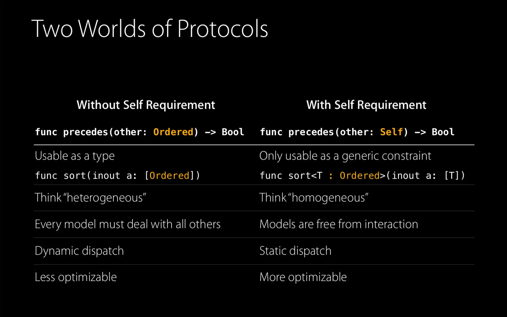
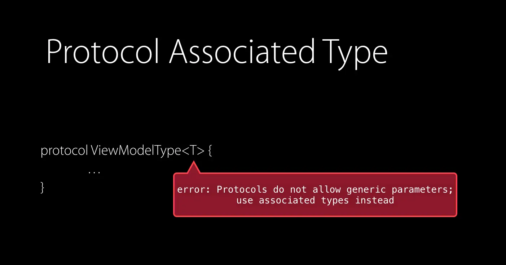
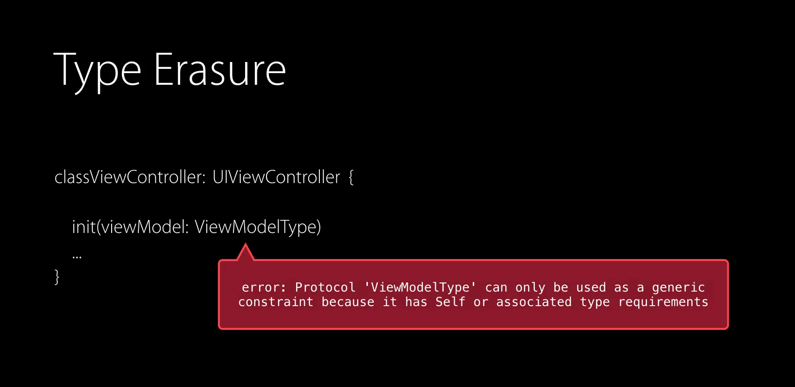

When Swift was made, it had been the first protocol-oriented programming language. Though Swift is great for object-oriented programming, but from the way _for-loops_ and _String_ _literals_ work to the emphasis in the standard library on _generics_, at its heart, Swift is protocol-oriented.

## Motivation

We use classes to represent a symmetric operation, like Comparison, for example, if we want to write a generalized sort or binary search where we need to compare two elements, we end up this something as below:

```swift
class Ordered {
	func precedes(other: Ordered) -> Bool {
		/// To ensure this method is implemented by subclass
		/// we added an error and that is nothing but a trap.
		fatalError("implement me!")
	}
}
```
```swift
func binarySearch(sortedKeys: [Ordered], forKey k: Ordered) -> Int {
  var low = 0, high = sortedKeys.count
  while high > low {
  	let mid = low + (high - low) / 2
  	if sortedKeys[mid].precedes(k) { low = mid + 1 }
  	else { high = mid }
  }
  return low
}
```
We don’t know anything about an arbitrary instance of `Ordered` yet. So if the method is not implemented by a subclass, well, there is nothing we can do other than the trap. Now, this is the first sign that we are fighting the type system. And if we fail to recognize that, it is also where we start lying to ourselves. Because we brush the issue aside, telling ourselves as long as each subclass of Order implements precedes, we will be okay. Making it the subclass’s problem. So we go ahead and implement an example of `Ordered` as below.

```swift
class Number: Ordered {
    let value: Double
    init(_ value: Double) {
        self.value = value
    }
    /// We down-cast other to Number to get to the right type to compare.
    /// It is a static type safety hole. Classes don't let us express this
    /// crucial type-relationship between the type of self and type of other.
    /// It is a code smell.
    override func precedes(other: Ordered) -> Bool {
        return self.value < (other as! Number).value
    }
}
```
It got `double` value and we override `precedes` to do the comparison. `other` is just arbitrary Ordered and not a number. So we don’t know that `other` has a value property. We down-cast `Other` to `Number` to get to the right type to compare. It is a static type safety hole. Classes don’t let us express this crucial type relationship between the type of `self` and type of `Other`. It is a code smell. So any time we see a force down-cast in our code, it’s a good sign that some important type-relationship has been lost, and often that’s due to classes for abstraction. Clearly, what we need is a better abstraction mechanism.

## Better Abstraction Mechanism

An abstraction mechanism must have the following properties:

* Doesn’t force to accept implicit sharing or lost type relationships
* Force to choose just one abstraction and do it at the time types are defined
* Doesn’t force to accept unwanted instance data or the associated initialization complexity
* Doesn’t leave ambiguity about what needs to override.

**And yes…!!! Protocol has all of these properties.**

> Don’t start with a class. Start with a protocol…!!!

<figure>
 <p style="margin:30"></p>
 <div style="width:100%;height:0;padding-bottom:100%;position:relative;">
 	<iframe src="https://giphy.com/embed/a5auAyjyCOf1S" width="100%" height="100%" 		style="position:absolute" frameBorder="0" class="giphy-embed" allowFullScreen>
 	</iframe>
 </div>
 <figcaption style="text-align: center;">
  	Time for POP, no more OOP
  	<a href="https://giphy.com/gifs/princess-leia-a5auAyjyCOf1S">via GIPHY</a>
 </figcaption>
</figure>

## Protocol-Oriented Programming in Swift

There is a saying in Swift: “Don't start with a class, start with protocol”. So let’s redo the binary search example with protocol

```swift
/// Protocol does not have a method body.
/// We are trading dynamic runtime check for the static check.
/// Self in a protocol is a placeholder for the type that is going
/// to conform to that protocol. It is called "Self" requirement.
protocol Ordered {
    func precedes(other: Self)  -> Bool
}

/// sortedKeys is now a homogeneous array of any single Ordered type T.
/// Original signature, heterogeneous array of Ordered was a lie.
/// We never really handled the heterogeneous case other than by trapping.
func binarySearch<T: Ordered>(sortedKeys: [T], forKey k: T) -> Int {
    var low = 0
    var high = sortedKeys.count

    while high > low {
        let mid = low + (high - low) / 2
        if sortedKeys[mid].precedes(other: k) {
            low = mid + 1
        } else {
            high = mid
        }
    }
    return low
}

/// As Ordered is not class anymore,
/// we are not subclassing Ordered, instead confirming.
/// So, no more override keyword in preceds method.
extension Int: Ordered {
    func precedes(other: Int) -> Bool {
        return self < other
    }
}

let position = binarySearch(sortedKeys: [2, 3, 5, 7], forKey: 5)
```
<figure>
 <div style="width:100%;height:0;padding-bottom:108%;position:relative;">
	<iframe src="https://giphy.com/embed/h2MLtoOjxtkGY" width="100%" height="100%" style="position:absolute" 	frameBorder="0" class="giphy-embed" allowFullScreen>
	</iframe>
</div>
 <figcaption style="text-align: center;">
  	Wow…!!! “Protocol” rocks…!!!
  	<a href="https://giphy.com/gifs/impressed-bfd-h2MLtoOjxtkGY">via GIPHY</a>
  </figcaption>
</figure>

## Protocol Self Requirement

Once we have a Self-requirement to a protocol, it moves the protocol into a very different world, where the capabilities have a lot less overlap with classes.

* It stops being usable as a type
* Collections become homogeneous instead of heterogeneous
* An interaction between instances no longer implies an interaction between all model types.
* We trade dynamic polymorphism for static polymorphism, but, in return for that extra type-information we are giving the compiler, it is more optimizable


Figure: Protocol Oriented Programming in Swift, session 408, #WWDC2015

## Protocol Extension

In our current implementation, we need to implement `precedes` method for each type. e.g:

```swift
extension Int: Ordered {
    func precedes(other: Int) -> Bool {
        return self < other
    }
}

extension Double: Ordered {
    func precedes(other: Double) -> Bool {
        return self < other
    }
}
```
Here comes the power of protocol. One implementation to rule them all by using a constrained extension on Ordered.

```swift
/// It says that, type that is Comparable
/// and also is declared to be Ordered will automatically
/// be able to satisfy the precedes requirement
extension Ordered where Self: Comparable {
    func precedes(other: Self) -> Bool {
        return self < other
    }
}
/// No more precedes method implementation
extension Int: Ordered {}
extension Double: Ordered {}
```
Let’s take constrained extension a step further

```swift
protocol Ordered {
    func precedes(other: Self)  -> Bool
}

extension Collection where Self.Index == Int, Element: Ordered {
    func binarySearch(forKey k: Element) -> Int {
        var low = 0
        var high = self.count

        while high > low {
            let mid = low + (high - low) / 2
            if self[mid].precedes(other: k) {
                low = mid + 1
            } else {
                high = mid
            }
        }
        return low
    }
}

extension Ordered where Self: Comparable {
    func precedes(other: Self) -> Bool {
        return self < other
    }
}

extension Int: Ordered { }

/// Call binarySearch just like the regular method.
/// No more angle-bracket blindness.
let index = [1, 2, 3, 4, 5, 6, 7].binarySearch(forKey: 3) // 2
```

## Protocol Associated Types:

By now we know what is Protocol Oriented Programming (POP). But POP without Protocol Associated Types (PAT) will never be completed.

`associatedtype` is a protocol generic placeholder for an unknown `Concrete Type` that requires concretization on adoption at **Compile** time.

> Protocol Associated Types (PAT)= Type Alias + Generics

\
&nbsp;
\
&nbsp;

At one stage of programming in Swift, many of us might have came across the below error:


Figure: Error while trying to use Generic in Protocol

Swift does not allow us to use `Generic` parameters in `Protocol`. To bypass this limitation, Swift introduced `Protocol Associated Type`. The below example shows how to use `associatedType` in `Protocol`

```swift
protocol ViewModelType {
    associatedtype myType
    var anyProperty: myType { get set }
}

class ViewModel: ViewModelType {
    typealias myType = String
    var anyProperty: myType = "Hello, Protocol Associated Type"
}
```

## Type Erasure

Though `associatedType` solved one problem, it also introduced another problem. In Swift, we can not use `Protocol` with `associatedType` as a Type. What it means is, if we set a variable type to `ViewModelType,` `Swift` compiler will show the following error:


Figure: Error while using Protocol with AssociatedType as Type

`Type Erasure` is the only savior here to this error. There are three patterns that we can apply to solve the problem of generic constraints requirement.

* `Constrained Type Erasure:` erases a type but keeps a constrain on it.
* `Unconstrained Type Erasure:` erases a type without a constrain on it
* `Shadow Type Erasure:` erases a type by camouflaging the type

**Example**

The below code snippet shows how to implement multi-sectioned heterogeneous TableViewCell using `Unconstrained Type Erasure`

```swift
/// Cell `Interface`
protocol CellModel {
    /// PAT Placeholder for unknown Concrete Type `Model`
    associatedtype Cell: UITableViewCell
    /// Recieves a parameter of Concrete Type `Model`
    func tableViewCell(_ tableView: UITableView) -> Cell
}

/// Wrapper `AnyCell` erased the Type requirement
struct AnyCell {
    private let _tableViewCell: (_ tableView: UITableView) -> UITableViewCell

    init<Model: CellModel>(_ model: Model)  {
        self._tableViewCell = model.tableViewCell
    }

    /// Conforming to `AnyCell` protocol
    func tableViewCell(_ tableView: UITableView) -> UITableViewCell {
        return _tableViewCell(tableView)
    }
}

/// `Concrete Type` of `CellModel`
struct ImageCellModel: CellModel {
    internal let name: String

    init(_ name: String) {
        self.name = name
    }

    func tableViewCell(_ tableView: UITableView) -> ImageTableViewCell {
        guard let cell = tableView.dequeueReusableCell(withIdentifier: Cell.id)
        as? Cell else { fatalError() }
        cell.titleLabel.text = self.name.capitalized
        cell.thumbImageView.image = UIImage(named: self.name)
        return cell
    }
}

/// `Concrete Type` of `CellModel`
struct TextCellModel: CellModel {
    internal let quote: String
    private let author: String

    init(_ quote: String, author: String) {
        self.quote = quote
        self.author = author
    }

    func tableViewCell(_ tableView: UITableView) -> TextTableViewCell {
        guard let cell = tableView.dequeueReusableCell(withIdentifier: Cell.id)
        as? Cell else { fatalError() }
        cell.titleLabel?.text = self.quote
        cell.subtitleLabel?.text = self.author
        return cell
    }
}
```
If you download the project shared below and run the app, you will see the app has two models `TextCellModel` and `ImageCellModel` displayed using two table cells `TextTableViewCell` and `ImageTableViewCell` respectively. As the app has different models and cells under a single TableView section, without `TypeErasure` we would face the following problems:

* Self or Associated Type Requirement

```swift
let items: [CellModel] = [<a text model>,<a image mode>]
/// Error explained above
```
`CellModel` has an associated type requirement to avoid spaghetti code while dequeuing TableCell. Without associated type requirement our code would be as:

```swift
func tableView(_ tableView: UITableView, cellForRowAt indexPath: IndexPath) -> UITableViewCell {  
   let items = sections[indexPath.section].items  
   let item = items[indexPath.row]
   /// More the model types, more the if-else  
   if item is TextCellModel {  
   /// load TextTableViewCell  
   } else {  
   /// load ImageTableViewCell  
   }  
}
```

* Heterogeneous Array

As TableView has different models and cells under same section, without `TypeErasure` we had to populate different array for different model which will lead to lots of if-else. Instead let's do eligently:

```swift
let imageCell = AnyCell(ImageCellModel("cyclamen"))  
let quoteCell = AnyCell(TextCellModel("Hello World.", author: "-"))  
let anyCells = [imageCell, quoteCell]
```

If we had just directly instantiated our `ImageCellModel` instance using the `ImageCellModel` initializer, it would be of type `ImageCellModel`. But because we have instantiated using this `AnyCell` wrapper class, `ImageCellModel` is now instantiated as type `AnyCell`. We have just erased type information (_this is what type erasure means_)

Wrapper classes are conventionally prefixed with the word `Any`, in order to guarantee that you will instantiate an object that implements our protocol and fills the generic type, without necessarily having the implementation on hand.

🎉 Using `AnyCell` wrapper we’ve erased the `Type` requirement when conforming to `CellModel` protocol. The `init` function is without clause and we now have a heterogeneous collection `Type` and dynamic dispatch at our disposition. 👍🏼

## Conclusion

We often end up writing spaghetti code while implementing TableView or CollectionView with different types of cells and models. `TypeErasure` is the right choice to avoid spaghetti code, makes code much more organized, and increases readability. I hope that you have enjoyed this article.

####
[👑 KEEP CALM AND HERE IS MY CODE](https://github.com/rokon-mlbd/SwiftTypeErasure)

## Related Articles:

* [Swift Associated Type Design Patterns](https://medium.com/dunnhumby-data-science-engineering/swift-associated-type-design-patterns-6c56c5b0a73a)
* [Protocol-Oriented Programming in Swift](https://developer.apple.com/videos/play/wwdc2015/408/)
* [Swift: Attempting to Understand Type Erasure](https://www.natashatherobot.com/swift-type-erasure/)
