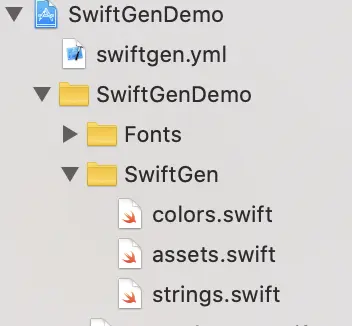

SwiftGen is a tool to auto-generate Swift code for resources of your projects, to make them type-safe. You can organize and manage your resources by using auto-generated swift code.

You can use SwiftGen for assets, colors, core data, fonts, interface builder files, JSON & YAML files, plists and localizable strings.

## Installation

There are many ways of installing SwiftGen with project. I'll use CocoaPods.

1. Open terminal, navigate to your project and run **pod init**.
2. Add **pod 'SwiftGen'** to your pod file.
3. Run **pod install**.
4. To invoke SwiftGen, go to Build Phases -> Add New Run Script Phase and add

   ```shellscript
   ${PODS_ROOT}/SwiftGen/bin/swiftgen[]()
   ```

   Everytime we build, SwiftGen is going to run and update all resources.

## Configuration file

- Create **swiftgen.yml** configuration file.


- You can write inputs and outputs for the resources for which you want to generate swift code. Each action (xcassets, colors, fonts) in configuration file will generate constants for that type of input file. Inside output option templateName, define the Stencil template to use [See more info here](https://github.com/SwiftGen/SwiftGen/tree/master/Documentation/templates) to generate the output.

  Let's see example for images, colors and fonts. Add the below lines of code in swiftgen.yml file.

  ```yaml
  **Images**

  	xcassets:
  	    inputs: Path/Assets.xcassets
  	    outputs:
  	        - templateName: swift4
  	          output: Path/SwiftGen/assets.swift

  **Colors**

  	colors:
  	    inputs: Path/CustomAppColors.txt
  	    outputs:
  	        - templateName: swift4
  	          output: Path/SwiftGen/colors.swift

  **Fonts**

  	fonts:
  	    inputs: Path/Fonts
  	    outputs:
  	        - templateName: swift4
  	          output: Path/SwiftGen/fonts.swift
  ```

## Usage

1.  Add some resources to input files so we can test it.

    **Images**

    Add some Images to Assets.xcassets. For eg: I've added image named with header.png.

    **Colors**

    I've created CustomAppColors.txt file and added hex color

    ```shellscript
    lightPurple         : #EBEEFF
    ```

    **Fonts**

    Create fonts folder and add font files `.ttf/.otf.`
    For eg: I've added font

        Roboto-Regular.ttf

2.  Create new group and name it **SwiftGen**. The generated output files will go inside this folder.

3.  After building project, Click SwiftGen Folder -> Show in Finder, drag and drop auto-genetrated assets.swift, colors.swift and fonts.swift files.

    

4.  You can use generated code for images, colors and fonts like

    ```swift
    **Images**

    	let myImage = Asset.header.image
    	or
    	let myImage =  UIImage(named: Asset.header.name)

    **Colors**

    	let myColor = ColorName.lightPurple.color
    	or
    	let myColor = UIColor(named: .lightPurple)

    **Fonts**

    	let myFont = FontFamily.Roboto.regular.font(size: 20.0)
    	or
    	let myFont = UIFont(font: FontFamily.Roboto.regular, size: 20.0)
    ```

## Advantages

- Avoid typos thanks to type safety.

- Free auto-completion.

- Avoid the risk of using an non-existing asset name.

- All this will be ensured by the compiler.

## References

[https://github.com/SwiftGen/SwiftGen](https://github.com/SwiftGen/SwiftGen)
