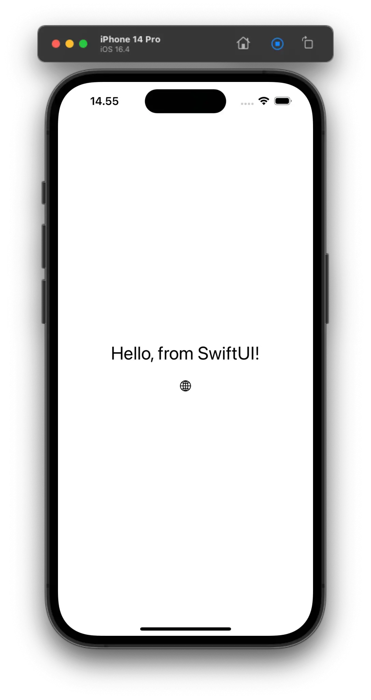
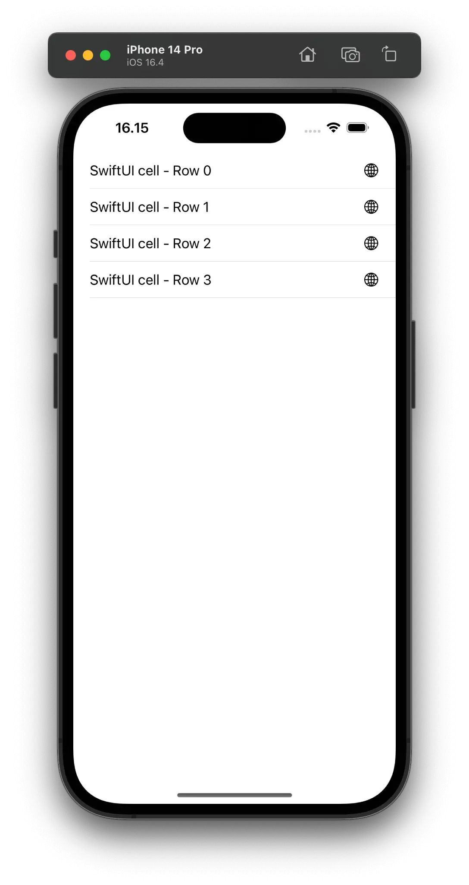

SwiftUI was initially announced 4 years ago, and last year Apple said clearly that the best way to build an app is with Swift and SwiftUI. However, some of us are still working on codebases that were started in UIKit more than 4-5 years ago and that is possibly holding us back from adopting SwiftUI. But as long as you target iOS 13 or above, there are ways to use SwiftUI even if you have a UIKit project. The way to do it depends on what exactly you want to build in SwiftUI: is it a full screen? A view to be shown inside a UIKit screen? Or do you have a table or collection view cell that you want to build in SwiftUI?


_Capture from WWDC 2022 Session 102 Platforms State of the Union, 29:20_

## Whole SwiftUI screen

Let's say you have an existing app, where you need to build a new feature that is its own separate screen. That's a perfect candidate to do it using SwiftUI. For that, we use a `UIHostingController`. So first, we build the new screen in SwiftUI. Here's a very simple example of a static screen:

```swift
import SwiftUI

struct SwiftUIScreen: View {
    var body: some View {
        VStack(spacing: 24) {
            Text("Hello, from SwiftUI!")
            Image(systemName: "globe")
        }
    }
}
```

This gives the following view when shown on the whole screen:


Then we need to push or present or show in whatever way the SwiftUI screen that we just built, from UIKit, using a `UIHostingController`. In our case, I have a very simple `UIViewController`, in which I have added a `UIButton` which presents this screen modally.

```swift
import UIKit
import SwiftUI

class ViewController: UIViewController {

    override func viewDidLoad() {
        super.viewDidLoad()
        // Do any additional setup after loading the view.
    }

    @IBAction func openSwiftUIScreen(_ sender: Any) {
        let vc = UIHostingController(rootView: SwiftUIScreen())
        present(vc, animated: true)
    }
}
```

That was one simple way to integrate a SwiftUI screen in a UIKit app. 

Of course, in a real-life project, things are not as simple as here, we normally have more dependencies that we need to inject, possibly a ViewModel depending on the choice of architecture. However, the basics are the same: in your UIKit code, instantiate your SwiftUI screen, embed it into a `UIHostsingController` (which inherits from `UIViewController`) and then present or push or do what needs to be done with that hosting controller.

## Smaller SwiftUI view

But what if we want to only build a small view in SwiftUI and integrate it in a `UIViewController`, as opposed to a whole SwiftUI screen? We can use the same technique, with `UIHostingController`, because a `UIViewController` doesn't have to cover the whole screen. So what we're doing basically is adding a child view controller to host the SwiftUI view. Here's how we can do that.

Here I have `MixedViewController` which is a `UIViewController`, in which I add a `UIStackView` that covers the whole screen. In the stack view, I add 2 arranged subviews: a `UILabel`, and the same SwiftUI View that we used above (`SwiftUIScreen`).

```swift
import UIKit
import SwiftUI

class MixedViewController: UIViewController {
    
    private let stackView = UIStackView()
    private let label = UILabel()
    
    override func viewDidLoad() {
        super.viewDidLoad()

        view.backgroundColor = .systemBackground
        setupStackView()

        label.text = "This is a UILabel"
        label.textAlignment = .center
        stackView.addArrangedSubview(label)
        
        let swiftUIController = UIHostingController(rootView: SwiftUIScreen())
        addChild(swiftUIController)
        stackView.addArrangedSubview(swiftUIController.view)
        swiftUIController.didMove(toParent: self)
    }
    
    private func setupStackView() {
        stackView.axis = .vertical
        stackView.distribution = .fillEqually
        
        stackView.translatesAutoresizingMaskIntoConstraints = false
        view.addSubview(stackView)
        NSLayoutConstraint.activate([
            stackView.topAnchor.constraint(equalTo: view.topAnchor),
            stackView.leadingAnchor.constraint(equalTo: view.leadingAnchor),
            stackView.bottomAnchor.constraint(equalTo: view.bottomAnchor),
            stackView.rightAnchor.constraint(equalTo: view.rightAnchor),
        ])
    }
}
```

As you can see in the code above, the way to embed a SwiftUI view in a `UIViewController` is very similar to embedding a child view controller in a `UIViewController`. In fact, it's exactly the same, because we embed the SwiftUI view in a `UIHostingController`, which inherits from `UIViewController`. 
Here's what our `MixedViewController` looks like when running the app.


## SwiftUI in table or collection cells

If you target iOS 16 or above, there's also another way of adding SwiftUI in a UITableViewCell or UICollectionViewCell.
Apple introduced `UIHostingConfiguration`, which allows developers to declare the contents of a UITableViewCell or UICollectionViewCell inline, using SwiftUI. Here's a simple example to show this:

```swift
import UIKit
import SwiftUI

class TableViewController: UITableViewController {

    override func viewDidLoad() {
        super.viewDidLoad()

        tableView.register(UITableViewCell.self, forCellReuseIdentifier: "reuseIdentifier")
    }

    // MARK: - Table view data source

    override func numberOfSections(in tableView: UITableView) -> Int {
        return 1
    }

    override func tableView(_ tableView: UITableView, numberOfRowsInSection section: Int) -> Int {
        return 4
    }
    
    override func tableView(_ tableView: UITableView, cellForRowAt indexPath: IndexPath) -> UITableViewCell {
        let cell = tableView.dequeueReusableCell(withIdentifier: "reuseIdentifier", for: indexPath)

        cell.contentConfiguration = UIHostingConfiguration {
            HStack {
                Text("SwiftUI cell - Row \(indexPath.row)")
                Spacer()
                Image(systemName: "globe")
            }
        }

        return cell
    }
    
}
```

And here's the screen with a `UITableView` with SwiftUI content in the `UITableViewCell`s if we run it:



And those are three ways to use SwiftUI in UIKit: either use a `UIHostingController` initialised with a SwiftUI root view and show that full screen or as a child view controller, or if you can target iOS 16 or above, use a `UIHostingConfiguration` to add collection view or table view cells content inline using SwiftUI.

Please note that all the code examples in this blog post are meant to be as concise and to the point as possible, illustrating how to embed SwiftUI content in UIKit. Don't use it as best practice guidelines for anything else because the main and only point they have was to show how to use SwiftUI in UIKit.

And just because I'm showing how to use SwiftUI in a UIKit project doesn't mean UIKit is obsolete. For example, it's [still a thing in visionOS](https://developer.apple.com/videos/play/wwdc2023/111215/).

_Article photo by <a href="https://unsplash.com/@varpap">Vardan Papikyan</a> on <a href="https://unsplash.com/photos/JzE1dHEaAew">Unsplash</a>_
   
