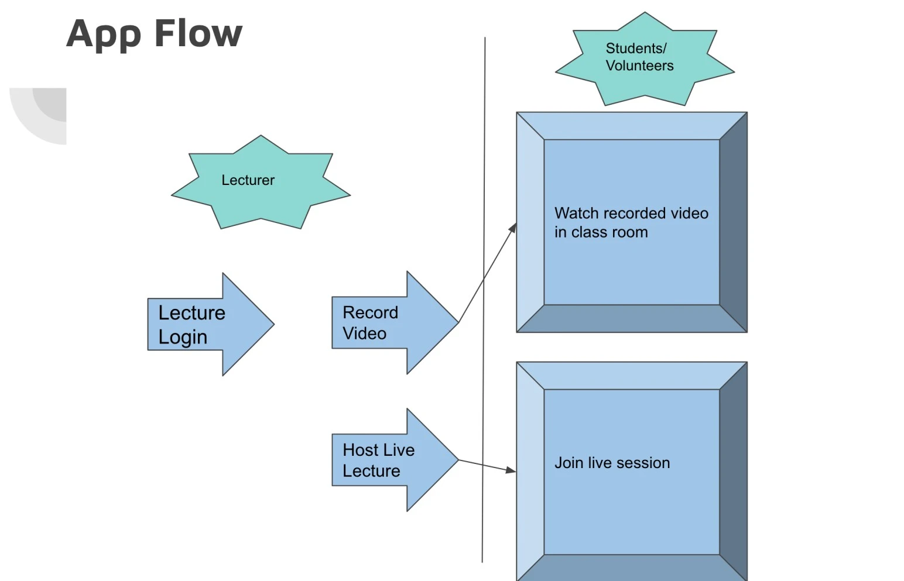
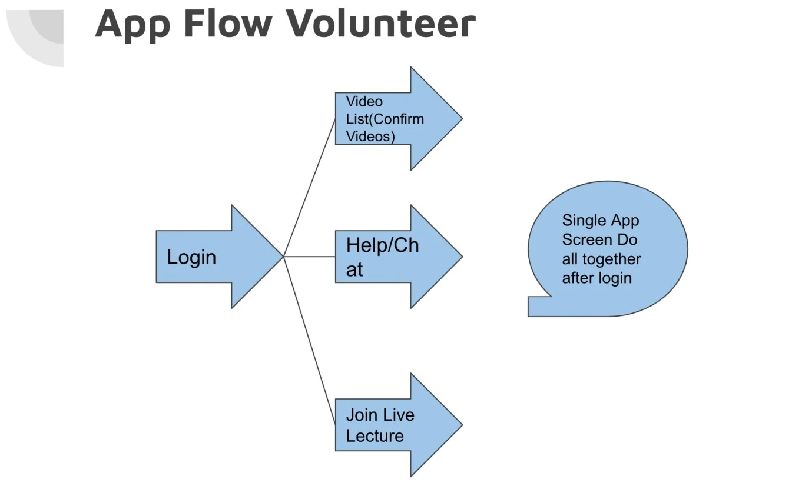
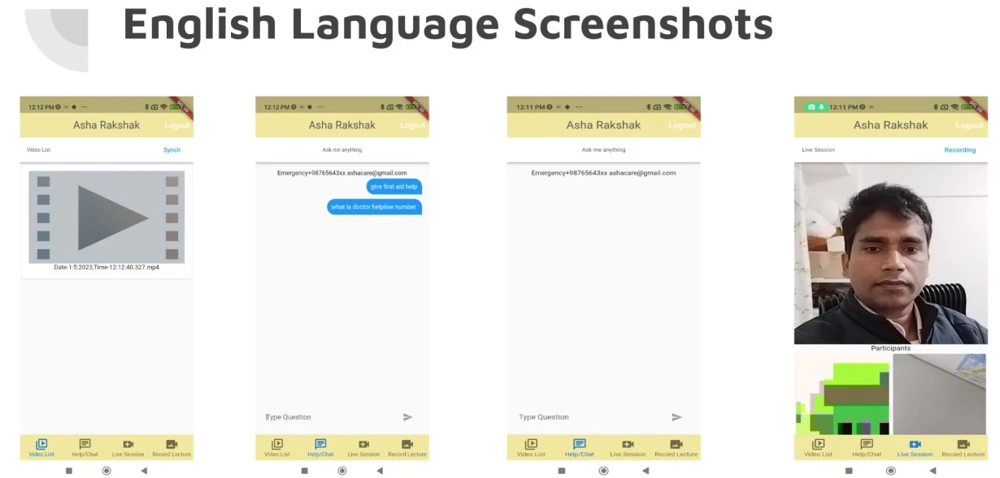
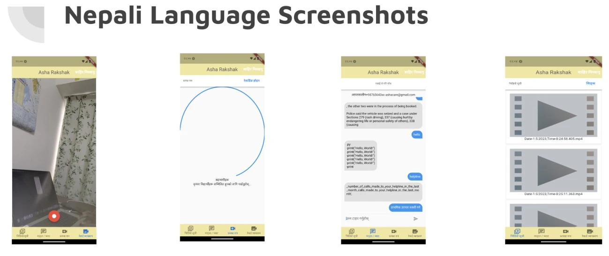

Participating in [MonstarHacks](https://www.linkedin.com/showcase/monstarhacks), Monstarlab's yearly internal hackathon, for the first time was an experience outside our everyday project routine. Below, we share our experience and provide insight into the product we aimed to create.

## Why was this challenge interesting to us?

NGOs play an important role in addressing social and environmental challenges around the world. They often work with limited resources and staff, and technology can help them to increase their impact and reach more people in need. As engineers, our role in society is to utilize our technical skills and knowledge for its betterment.

## Our team, Team Rakshak:

- Shaikh Huma: Flutter developer from the Monstarlab Tokyo office
- Dinakar Maurya: Lead developer from the Monstarlab Tokyo office

## Deciding on the topic

On Day 1 of the hackathon, we opted for a morning call to decide on the NGO with which we would collaborate and to brainstorm ideas. We chose to proceed with [Asha](https://www.asha-np.org/en), an NGO based in Japan. Given that both team members were from the Tokyo office, we were eager to take up this challenge. Upon reading the problem statement and brainstorming a few ideas, we came across several challenges. We addressed these in discussions with our mentor. Subsequently, we decided to have a conversation with the NGO representative, thus scheduling a meeting with him on Day 2. After getting more insights on the problem statement, we moved forward with our product prototyping.

## Working on the product

The hackathon spanned across 3 days, coinciding with Japan's Golden Week, which is typically a vacation period. Though we were in a holiday mood, we still went forward with all enthusiasm to build our product. Since we had no designers on the team, we sketched out a basic app structure with our features and began working on the app, which was coded in Flutter. With Dinakar leading the team, tasks were allocated, and we commenced work, holding meetings throughout the three days.

## The problem statement

- **How do we deliver practical training sessions (Injury Assessment, First-Aid Kit)?**
  Digital Solution - We can deliver smooth and fast video lectures using the Agora SDK.
- **How do we overcome the human resources barrier (limited lecturers) to provide lectures in each school?**
  We solve this issue by offering live lecture sessions and using auto-recording for future repeated lectures.
- **How do we make it attractive to local people?**
  We have an easy-to-use app with a single screen. The app includes a feature powered by Chat GPT, which can answer all kinds of questions in the local language.
- **How do we overcome the financial resource barrier?**
  We use a single codebase Flutter app that runs on all platforms, including iOS and Android.
- **How do we overcome the language barrier when using the system (laptop, mobile phones, iPad)?**
  We provide solutions in four languages. We can offer support for multiple languages.
- **Can the app be used offline if there is no internet?**
Yes, the app can be used both online and offline for the convenience of the users.

## Participating for the first time in MonstarHacks

We participated in a hackathon for the first time, which was both a thrilling and challenging experience. It gave us a unique opportunity to collaborate with individuals from diverse backgrounds and work on a problem or project within a specific timeframe. As someone who has never been a part of a hackathon before, the experience was daunting, yet exhilarating.

At first, we felt overwhelmed by the fast-paced environment of a hackathon and the number of teams taking part from other offices. Other participants were bustling around, working on their projects with intense focus, which made us wonder if we could keep up and make a meaningful contribution.

As we started to work on the project, we felt a mix of emotions. On one hand, there was a sense of excitement and enthusiasm about the project and the opportunity to learn and collaborate with others. On the other hand, there was a feeling of anxiety or pressure to perform well and deliver a successful project within the time limit.

While working on our project, we encountered challenges and roadblocks. Despite these obstacles, there was a sense of camaraderie within the team. We were able to bounce ideas off each other, share knowledge and expertise, and work towards a common goal.

As the hackathon came to a close, we felt a sense of pride in what we had accomplished, yet were nervous about presenting our project to the judges and other participants. Regardless, the experience was incredibly rewarding, providing valuable lessons and insights. Whether we won or lost, we gained invaluable experience and skills that can be applied to future projects and endeavors.

## The proposed solution

- Our solution is a Flutter based app.
- **Volunteer Login** - To be used in middle schools with the following features:
  - Login
  - Video list
  - See the past lectures list
  - Play lecture from the list
  - Chat/ Help
  - Join a live session
- **Lecturer Login** - To be used for recording lectures with the following features:
  - Login
  - Video list
  - Chat/ Help
  - Host a live session
  - Record a lecture
  - Record a lecture using video screen
  - Preview and save lecture

## App flow

## App UI

## Future scope proposed

- Voice support through AI Chat GPT
- Capability to find local professionals
- Addition of FAQ, Contact Us, and other informative pages
- Tutorial screens that appear immediately after login
- Ability to answer custom NGO questions
- Features related to education and teaching methods
- A reference blog for additional information
- Synchronization of local videos with remote videos
- Chat feature during video calls for a more interactive live session

*Please note that these features are not yet available and may be implemented at a later time.*

## Costs

- Expense related to the necessary hardware such as mobile phones, Android phones, Android tablets, iPhones, and iPads.
- Cost involved in local video recording such as server storage, local mobile phone storage, and free Google Cloud Hosting for backend server/cloud hosting.
- Charges for using Agora video calls, with a pricing model of the first 10,000 minutes free every month, equivalent to approximately 166 hours. For further details, refer to their website https://www.agora.io/en/pricing/.

## Our tech stack

- **ChatGPT**, available at https://openai.com/, offers an advanced chat engine that uses AI to enhance work and creativity.
- **Agora Video Call**, accessible at https://videocall.agora.io/welcome, provides free HD video and voice calls that can be made anytime and anywhere.
- **Flutter**, a framework created by Google and accessible at https://docs.flutter.dev/get-started/install, is an open-source tool that enables building multi-platform, natively compiled, and visually stunning applications from a single codebase.
- **Dart**, programming language available at https://dart.dev/, is a language optimized for clients that enables fast app development on multiple platforms.

## Conclusion

In summary, we crafted a small and functioning prototype to enhance health literacy for Asha NGO as part of MonstarHacks.

## Related Articles

- [ChatGPT meets Flutter: A step by step integration guide - English](https://engineering.monstar-lab.com/en/post/2023/05/13/ChatGPT-meets-Flutter-A-step-by-step-integration-guide/)
- [FlutterでのChatGPTの統合 - Japanese](https://engineering.monstar-lab.com/jp/post/2023/05/08/Integration-of-ChatGPT-in-Flutter/)

## References

- [MonstarLab Flutter Template - OSS Repository](https://github.com/monstar-lab-oss/flutter-template-riverpod)
