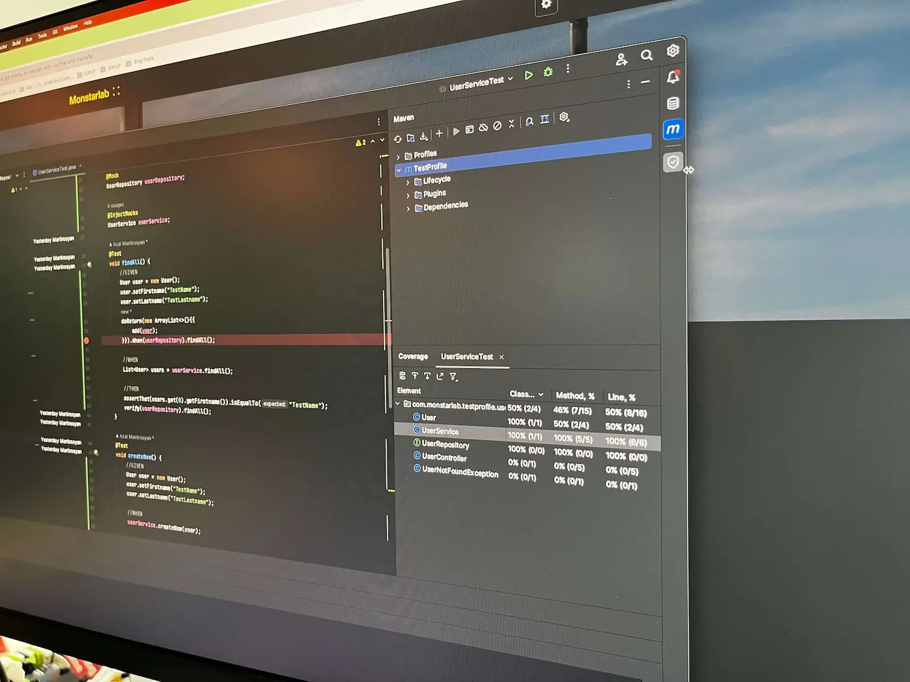
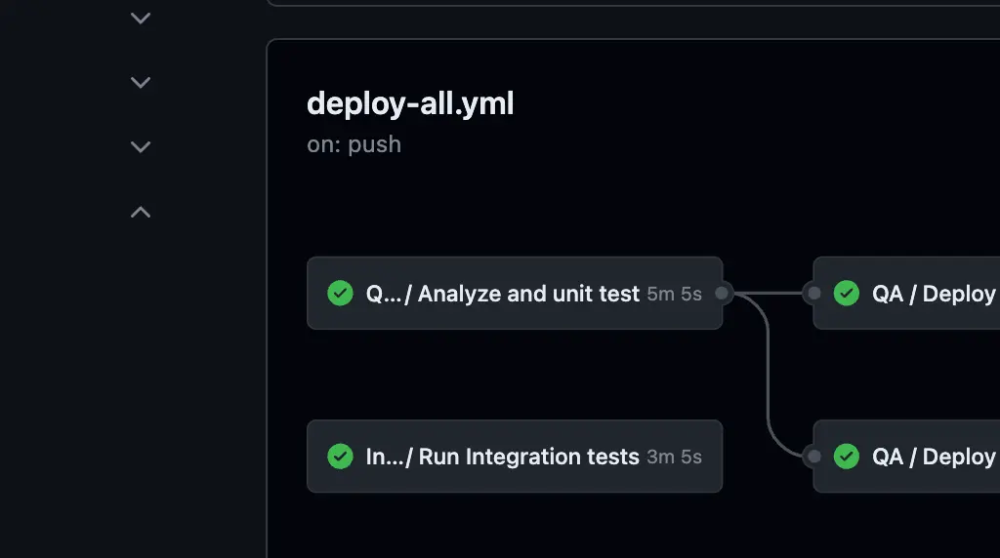

Why split the test execution in the build process for different types of tests?

By default, all unit tests written with JUnit and Mockito will be categorised as Unit tests whereas all other types of tests
integrate one or more pieces or units of the system.

Here are for example some common context type annotations provided by SpringBoot for integration tests, which can be used
to test various components in a backend application:

```
@DataJpaTest

@DataMongoTest

@WebMvcTest

@SpringBootTest
```

If you are interested in how to set up an isolated test with SpringBoot and TestContainers,
then please refer to our [previous blog post provided with Gradle and Kotlin](https://engineering.monstar-lab.com/en/post/2023/08/01/Test-Isolation-with-TestContainers-and-SpringBoot/).

The purpose of this article is to share our own experience with a few arguments about
how to structure the common type of unit and integration tests (also shortly named as *IT) 
in Spring Boot with Maven and Java. This type of setup can be very individual 
and might be considerable only by some engineers. This knowledge share will just demonstrate how to achieve
it and how to organise them best, as well as which arguments support this idea.

#
***
#

Below are some reasons which might serve as an argument for setting up your build profiles in this way:


Figure: Conflict in Intention

The complexity of unit and integration tests can vary from each other by setup and the amount of components involved. 
Unit tests are normally short, they use very little dependencies or no dependencies at all and are fast in their execution. 
The Integration tests on the other hand could have the size from small to huge, 
depending on the part of the system they will be executed against and 
often instability might come into question. If the setup requires multiple dependencies which are not just Beans, 
but an entire system or containers to be provided, they will also run longer.
If a problem occurs in a unit test, it will cause the pipeline to fail. 
On the other hand, some other integration test may have already been executed before this failure, which could have been avoided
and postponed for a later phase. Parallel execution of these 2 different types of tests could alert about a failing unit test
way earlier, which means putting the shorter and simpler execution beforehand will cost less time and effort by providing early
feedback about failures.


Figure: Code Coverage

Success is measured, and in this scenario, the measurement scale is the code coverage report, 
which is normally generated and provided with specific tools such as Jacoco with SonarQube visualisation and code quality checks. 
After unit test execution, Jacoco could help collect reports from different parts of the execution in order to visualise it.
Unit tests could for example provide line coverage for the methods that they are bound to.
This is not true for the integration tests, because integration tests might aim to test or connect a few units of an application, 
but in reality, the execution can start or execute many other parts of it: as a result the report will include all parts
executed during the test, even though some units weren't intended to be part of the testing at all.


Figure: Time is precious

As unit tests are small, they also run fast. On the other hand the integration tests are not only different in size, 
but also in execution time. This can of course depend on several aspects such as how many beans need to be created, 
or which context is necessary for the application to prepare, or how many containers or systems should be started
in order to get ready for the test completion. This leads the test execution to take much longer and even 
with some intentional delays put in the code, it might prolong to some minutes.  


Figure: Stability

The more "parties" are involved in the "business" the more problems and blockers are possible. 
As unit tests normally do not have many services or components as dependencies, 
they always run stable and are important to fix, because this would be the first quality control. 
Of course, it is always a good practice to achieve maximum stability for the integration tests, 
but this is not always possible or should be postponed for internal specific reasons. As many different typesIf the arguments above were convincing, then the example below  
of technologies might be used to prepare the test system, it could also be preferred to fix them at a later time.

### Technical Setup

If the arguments above were convincing, then the example below should provide a very simple technical setup
to create different build profiles which can later be used in CI/CD pipeline configuration.

In the current example a standard SpringBoot application is used with the following components

 - Controllers for endpoint calls
 - Service layer for repository access
 - Repository layer to access PostgreSQL Database


The unit tests mock all dependencies with Mockito and JUnit5 as following:

```
@ExtendWith(SpringExtension.class)
class UserServiceTest {

    @Mock
    UserRepository userRepository;

    @InjectMocks
    UserService userService;

    @Test
    void findAll() {
        //GIVEN
        User user = new User();
        user.setFirstname("TestName");
        user.setLastname("TestLastname");
        doReturn(new ArrayList<>(){{
            add(user);
        }}).when(userRepository).findAll();

        //WHEN
        List<User> users = userService.findAll();

        //THEN
        assertThat(users.get(0).getFirstname()).isEqualTo("TestName");
        verify(userRepository).findAll();
    }
}
```

In order to demonstrate the separation we also provided a full isolation test with TestContainers,
which tests the following integration in an isolated context:
Endpoint Call >> Service Layer >> Repository Layer >> PSQL Instance.


```
@Testcontainers
@SpringBootTest(classes = TestProfileApplication.class)
@ActiveProfiles("test")
@AutoConfigureMockMvc(addFilters = false)
class UserServiceIT {

  @Autowired
  UserRepository userRepository;

  @Autowired
  MockMvc mockMvc;

  @Test
  void retrieveSavedUser() throws Exception {
    //GIVEN
    var user = new User();
    user.setFirstname("Name");
    user.setLastname("Lastname");
    userRepository.save(user);

    //WHEN
    mockMvc.perform(MockMvcRequestBuilders.get("/user/{id}", 1))

    //THEN
            .andExpect((MockMvcResultMatchers.status().isOk()))
            .andExpect(result -> {
              var content = result.getResponse().getContentAsString();
              Assertions.assertThat(content).contains("Lastname");
            });
  }
}
```
For simplicity in the structure, both tests follow the famous Given-When-Then pattern for writing the tests.

And finally, to configure it, the following 2 plugin configurations for Surefire and Failsafe are added in ```pom.xml```.

```
    <build>
        <plugins>
            <plugin>
                <groupId>org.apache.maven.plugins</groupId>
                <artifactId>maven-surefire-plugin</artifactId>
                <version>2.22.0</version>
                <configuration>
                    <skipTests>${skip.unit.tests}</skipTests>
                </configuration>
            </plugin>

            <plugin>
                <groupId>org.apache.maven.plugins</groupId>
                <artifactId>maven-failsafe-plugin</artifactId>
                <executions>
                    <execution>
                        <goals>
                            <goal>integration-test</goal>
                            <goal>verify</goal>
                        </goals>
                    </execution>
                </executions>
            </plugin>
        </plugins>
    </build>
```

If we execute the usual ```mvn clean isntall``` in CLI, then both tests would execute after each other without an order.

In order to split the execution we would need to be more specific 
about which plugin we would like to make part of the maven lifecycle.
By default, in SpringBoot and Maven using the following command would skip the Integration Test
by scanning the files which end with *IT.java, 
which of course can also be configured with a different naming convention pattern if needed.

```
mvn clean -DskipITs=true verify
```

This will then let the Surefire plugin execute all tests by ignoring *IT tests.

In order to do the opposite, a flag configuration will be held for Surefire to let it ignore the unit test execution phase.
In the end, running the following command for Failsafe, will run the IT tests accordingly. 

```
mvn clean -Dskip.unit.tests=true verify
```

As a result of this setup the pipeline can be configured to run separately
to block the follow-up checks based on the results off both execution phases.

Below is a sample from GitHub Actions. 


Figure: Locked only by Unit test phase


Figure: Locked also by Integration test phase


#### Tools & References used here...
* [Monstarlab:: template with Kotlin and Gradle](https://github.com/monstar-lab-oss/TestProfile)
* [Maven as build tool](https://maven.apache.org/)
* [Java and OpenJDK as a programming and runtime environment](https://openjdk.org/)
* [Hibernate as an ORM layer for JPA](https://hibernate.org/)
* [PostgreSQL as a Datasource](https://www.postgresql.org/)
* [FlyWay for DB script migrations](https://flywaydb.org/)
* [Spring Boot for Backend Application development](https://spring.io/projects/spring-boot)
* [Test Containers for running PSQL Docker based Container](https://testcontainers.com/)
* [Unsplash Images for writing the blog post](https://unsplash.com/)
* [Brain and Mind from Monstarlab::](https://monstar-lab.com/global/)

