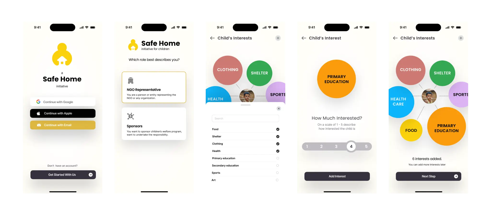
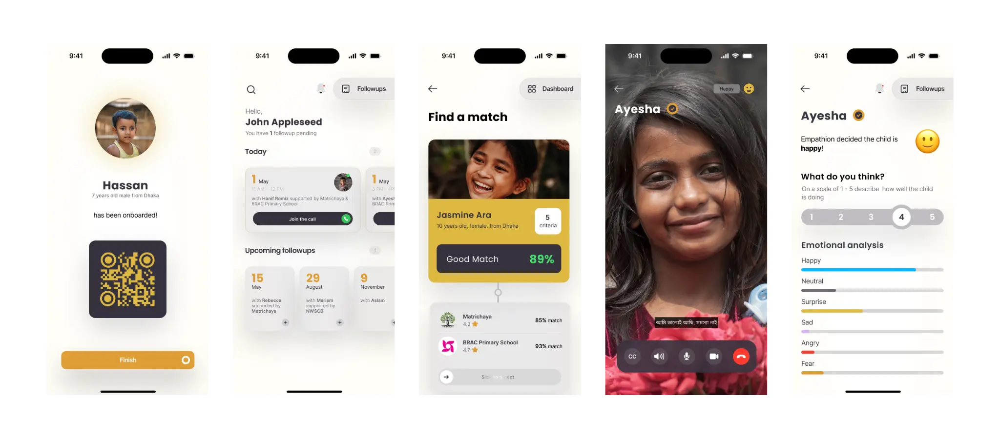
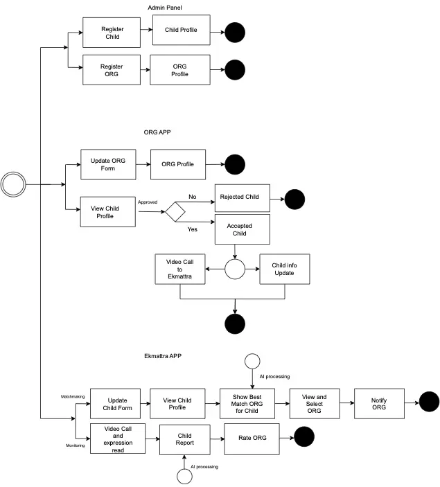
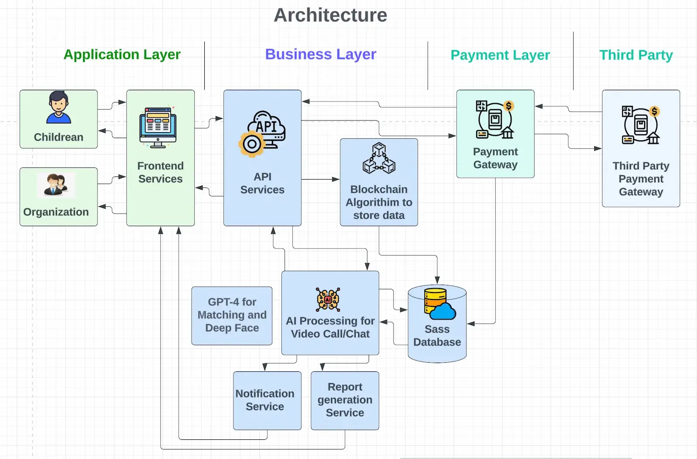

As part of Monstarlab's 3rd edition of the internal hackathon, [MonstarHacks](https://www.linkedin.com/showcase/monstarhacks), our team, Innovation Infusion, developed **The Safe Home Initiative for Children** which is a project designed to tackle the challenge faced by the partnering NGO [Ekmattra](https://ekmattra.org/).

The difficulty lies in analyzing the orphaned children's needs and finding the ideal match from a pool of organizations and schools that may not necessarily possess the required information to provide effective support.

This is where the Safe Home Initiative comes in, using advanced technologies like AI, blockchain, and machine learning to match children with the best organizations while ensuring their privacy and security.

In this article, we outline the technologies used in building our solution.

## Backend technologies
- **Java**
- **Spring Boot**
- **AI Models**
- **Blockchain**
- **Data Security**

The backend of the **Safe Home Initiative** is built using Java and the Spring Boot framework, which allows for efficient data processing and management. AI models, such as ChatGPT-3.5, DeepFace, Facenet, and Facenet512, are used to gather information about children's interests, skills, and future plans. This information is then fed into a matching algorithm that utilizes blockchain technologies like Hyperledger Fabric and Corda, to guarantee the security and reliability of the system.

To ensure the privacy and security of the children's information, the Safe Home Initiative follows the OWASP and NIST Cybersecurity Framework. These frameworks provide guidelines and best practices to protect data from cyber threats, thereby safeguarding the children's information against unauthorized access and usage.

## Frontend technologies
- **JavaScript**
- **React**

The frontend of the Safe Home Initiative is built using JavaScript and the React framework, providing a user-friendly interface for NGOs and organizations to access and manage information about children and potential matches. This frontend interface facilitates the communication and evaluation of placements, thereby improving effectiveness and ensuring that children are matched with the most suitable organizations to meet their needs.

## Mobile technologies
- **Dart**
- **Kotlin**
- **Java**
- **Firebase**
- **Android**
- **Flutter**
- **iOS**
- **HealthKit**

The Safe Home Initiative also incorporates mobile technologies to monitor the health and wellbeing of the children. Mobile apps built using Dart, Kotlin, and Java, along with Firebase and HealthKit, facilitate easy tracking of the children's physical and emotional health. These apps are available on Android, Flutter, and iOS devices, making it easy for caregivers and organizations to monitor the children's progress and provide tailored support.

Figure: User story

Figure: Architecture

## Conclusion

### Making a positive impact on orphaned children

Our team's MonstarHacks project combines advanced technologies with a commitment to social impact to revolutionize the matchmaking process for orphaned children.

By leveraging AI models, blockchain technologies, and machine learning algorithms, the Safe Home Initiative provides personalized matches and tailored support to help orphaned children succeed in the future.

With a focus on data security and privacy, the Safe Home Initiative offers a safe and reliable solution for NGOs like Ekmattra and other organizations to find the best matches for the children under their care.

The project's ultimate goal is to make a significant positive impact on the lives of orphaned children and provide them with the support they need to thrive.

_Article Photo by [Ekmattra](https://ekmattra.org/about-us/)_
