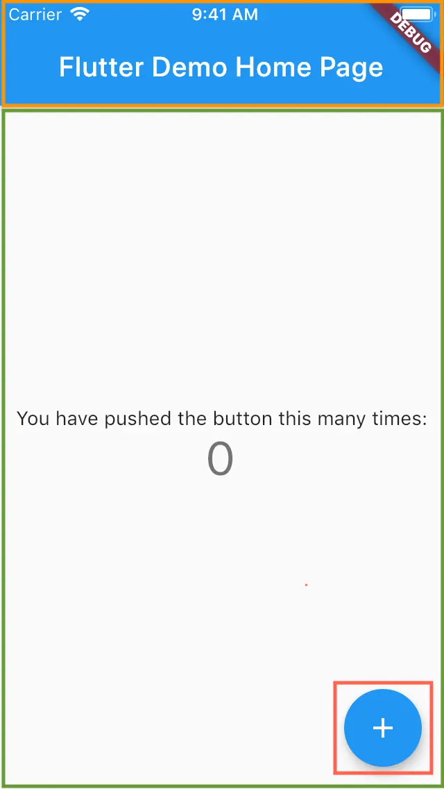
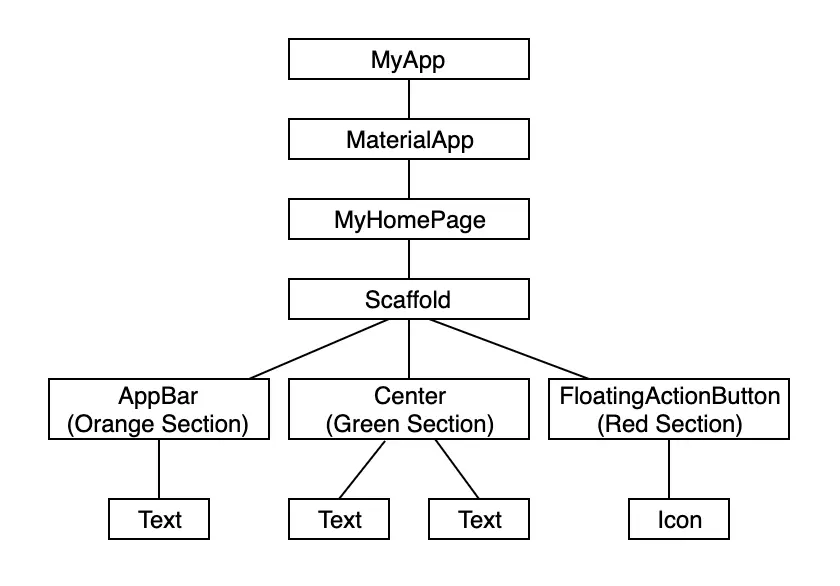

Flutter is a cross-platform development framework that allows us to create iOS and Android apps using a single programming language called Dart, which was released by Google itself.

I would like to share a few things I wish I would have known before starting Flutter as an iOS developer.

## Dart programming language

Like Android uses Java/Kotlin and iOS uses Objective C/Swift programming languages to build Android and iOS apps, Flutter uses Dart programing language. You can Get Started from [here](https://dart.dev/guides/language/language-tour) with learning Dart.

Dart supports all the features for the Object-oriented programing paradigm(OOP). It is a C-like language with brackets and semicolons. It is uneasy to grasp for swift developers, but it is not hard to learn and use.

## DartPad and CodePen

In iOS we have **Playground**, to test our Swift code. Similarly, we have [DartPad](https://dartpad.dev/) and [CodePen](https://codepen.io/about) for the Dart programming language.

- **DartPad:** It is an online editor that runs Dart programs directly in our browser and also renders a real preview of a screen/widget. It's an easy way to test some of the **business logic** of Flutter apps. We can experiment with our Dart code in this editor.

- **CodePen:** CodePen is an online editor for HTML, CSS and JavaScript. Recently it was announced that CodePen supports Flutter. One of the advantage of CodePen over DartPad is that DartPad uses GitHub [gists](https://gist.github.com/) to publicly share our code while in CodePen we can share our code directly by sharing Url.

## IDEs

For Android developers, it's easy as Flutter supports Android Studio. For iOS devs - maybe not harder, but a little different than Xcode. Flutter is available on different IDEs. The two main code editors are:

- **Android Studio(IntelliJ):** It's a complete software with everything already integrated. You have to download Flutter and Dart plugins and set up Flutter SDK to start.

- **VSCode:** It is used for developing Flutter and Web applications. It is lightweight and fast. You should first install Dart and Flutter SDK extensions from VS Code market and then set up your SDK

For more detail click [here](https://flutter.dev/docs/get-started/editor?tab=androidstudio)

## Widgets

Flutter uses the concept of the **Widgets** which can be used to build complex user interfaces. It is easy to create our own widgets or customize existing widgets. You can browse a catalog of Flutter’s widgets [here](https://flutter.dev/docs/development/ui/widgets) and view, for example, [Material Design widgets](https://flutter.dev/docs/development/ui/widgets/material) for Android and [Cupertino widgets](https://flutter.dev/docs/development/ui/widgets/cupertino) for iOS.

Flutter uses [declarative UI](https://flutter.dev/docs/get-started/flutter-for/declarative).
SwiftUI looks a lot like Flutter but SwiftUI requires iOS 13 and works only with Apple Products. Whereas Flutter is not dependent on OS version and works cross-platform i.e Flutter works with the earlier version of iOS.

Every component in Flutter is known as a **Widget**. The Flutter apps are created by combining these widgets (like building blocks) to form a widget tree. Even the final app we get is also a widget.

For Example - Text Widget

```dart
Text(
     'Hello World',
      style: TextStyle(
        fontSize: 18.0,
        color: Colors.grey[600],
      ),
    )
```

**Note:** Every program starts with **main** function which is the entry point of our application.

## Stateless and Stateful widget

The Flutter UI is basically a tree of stateless or stateful widgets.

- `Stateless Widgets:` These widgets are immutable, so they cannot change their state during runtime. i.e won't change when a user interacts with them.

  For example - Text, Icon, etc are the stateless widgets that will remain static.

- `Stateful widget:` These widgets are mutable, they change over time. These widgets can change their state multiple times and can be redrawn on to the screen any number of times while the app is in action.

  For example - Checkbox, Radio, etc are the stateful widgets that change as a user interacts with them.

## JIT (Just-In-Time)

Dart uses JIT compilation. Flutter allows for fast app reloading by providing a **Hot Reload** option. You don't have to **restart** the app for every change. Just press the `Hot Reload` button on the toolbar or press `cmd-s`(Save All) to the running **Dart VM** to send incremental changes of source code, which will reload the changes on device or simulator in few seconds.

## Dependency management

The dependency management for iOS depends on CocoaPods or Carthage. Flutter uses its own dependency management system called Pub. The `pubspec.yaml` file is inbuilt with the Flutter apps so that it's easy to add new dependencies as needed for the development.

For example - I want to use the [Equatable](https://pub.dev/packages/equatable#-readme-tab-) Flutter package.

**Note:** For every Flutter package please check out the **installing** option. For an equatable package, I'll copy the text from [here](https://pub.dev/packages/equatable#-installing-tab-) and paste it in pubspec.yaml.

My pubspec.yaml file will look like this

```dart
dependencies:
  equatable: ^1.1.1
```

and then run command `pub get` on the terminal to install the package.

**For using Assets and Fonts:** Drag and drop your assets and fonts in your app and add them to pubspec.yaml file.

For example - I've created two folders: `assets` and `fonts` and inside, I've added the image `image1.jpg` and font `IndieFlower-Regular.ttf`. My pubspec.yaml file will look like this:

```dart
assets:
    - assets/image1.jpg

fonts:
   - family: IndieFlower
     fonts:
       - asset: fonts/IndieFlower-Regular.ttf
```

and then run command `pub get` on terminal to use them.

**Importing files and packages**

If you want to use any files or packages in your current file, then you have to import that file or package.

For example - I want to use the `equatable` package. Then I will import like this:

```dart
import 'package:equatable/equatable.dart';
```

## Flutter example

You can install Flutter SDK by following instructions from [here](https://flutter.dev/docs/get-started/install)

Create **New Flutter Application**. You can see the Sample App that Flutter has created for us and when you run it looks like this:




If you compare the simulator screenshot and code with the above tree, I hope you will understand the basics of UI structure. The code looks like this:

```dart
import 'package:flutter/material.dart';

void main() {
  runApp(MyApp());
}

class MyApp extends StatelessWidget {
  @override
  Widget build(BuildContext context) {
    return MaterialApp(
      title: 'Flutter Demo',
      theme: ThemeData(
        primarySwatch: Colors.blue,
        visualDensity: VisualDensity.adaptivePlatformDensity,
      ),
      home: MyHomePage(title: 'Flutter Demo Home Page'),
    );
  }
}

class MyHomePage extends StatefulWidget {
  MyHomePage({Key key, this.title}) : super(key: key);

  final String title;

  @override
  _MyHomePageState createState() => _MyHomePageState();
}

class _MyHomePageState extends State<MyHomePage> {
  int _counter = 0;

  void _incrementCounter() {
    setState(() {
      _counter++;
    });
  }

  @override
  Widget build(BuildContext context) {
    return Scaffold(
      appBar: AppBar(
        title: Text(widget.title),
      ),
      body: Center(
        child: Column(
          mainAxisAlignment: MainAxisAlignment.center,
          children: <Widget>[
            Text(
              'You have pushed the button this many times:',
            ),
            Text(
              '$_counter',
              style: Theme.of(context).textTheme.headline4,
            ),
          ],
        ),
      ),
      floatingActionButton: FloatingActionButton(
        onPressed: _incrementCounter,
        tooltip: 'Increment',
        child: Icon(Icons.add),
      ),
    );
  }
}

```

## References

[flutter.dev](https://flutter.dev/)

[Ray Wenderlich - Getting started with Flutter](https://www.raywenderlich.com/4529993-getting-started-with-flutter#toc-anchor-001)
