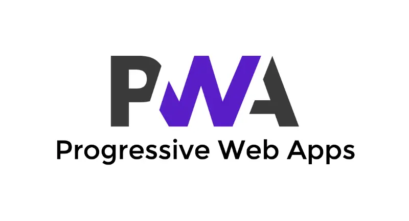
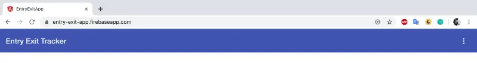
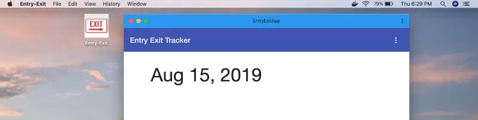
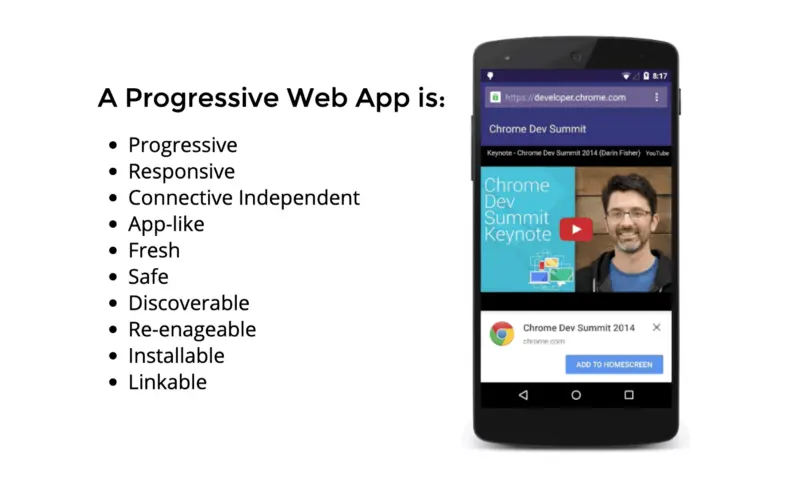
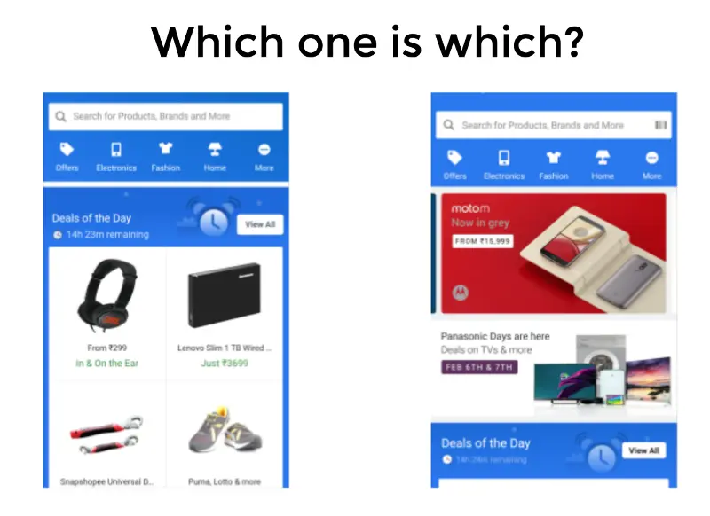

What started as best of both worlds, web and native, Progressive Web Apps can now also be installed and run on desktop, from Windows to Mac, from Linux to Chrome OS. **You code once and it can run anywhere**, ensuring PWAs as the **Universal App Platform.**

In March 2019, [it was announced that PWAs can now be installed on Mac OS](https://developers.google.com/web/updates/2019/03/nic73), thus bringing support for PWAs to all desktop and mobile platforms.

[As of Chrome 76](https://developers.google.com/web/updates/2019/07/nic76#pwa-install), announced in July 2019, whenever any PWA URL is hit, the install prompt would be shown in the address bar/omnibox, thus making it easier to discover.

Here you can see the (+) sign. It is the install prompt. Once clicked, you can run your PWA on macOS in a separate window!

Progressive Web Apps, PWAs, use modern web capabilities to deliver an app-like user experience. ‘App-like’ referring to the fact that PWAs are the perfect symbiosis between web and native apps.

I would highly recommend you all to watch this year’s [Google I/O 19 talk by Paul Covell and Dominick Ng](https://youtu.be/2KhRmFHLuhE), which tells you about the traditional differences between web and native apps and how PWAs successfully manage to bring to the table the best of both worlds.

Back in June 2015, [Alex Russell](https://medium.com/@slightlylate) first posted about the [Progressive Web App](https://infrequently.org/2015/06/progressive-apps-escaping-tabs-without-losing-our-soul/) and the idea soon began to gain traction.

> “Critically, these apps can [deliver an even better user experience](https://www.youtube.com/watch?v=d5_6yHixpsQ) than traditional web apps. Because it’s also possible to build this performance in as progressive enhancement, the tangible improvements make it worth building this way regardless of “appy” intent.

> [Frances](http://fberriman.com/) called them “Progressive Open Web Apps” and we both came around to just “Progressive Apps”. They existed before, but now they have a name.”

When users first came across a pop-up in their mobile chrome saying: “Do you want to add this site to your Home Screen?”, and pressed ‘Yes’, they noticed something amazing, beyond a simple bookmark, on their mobile devices.

After installation, users could see an icon on their phone screen. When tapped it opened in full screen, without any tabs of the browser. It became their first app that didn’t come from any App store/Play store!

At Google I/O 2016, when [Jake Archibald](https://twitter.com/jaffathecake) showed [the magic of how web apps can work offline](https://www.youtube.com/watch?v=cmGr0RszHc8), developers started to develop and convert existing applications into PWAs with much interest.

I had the privilege to introduce [**PWAs**](https://slides.com/saadbinamjad/pwa#/) in my office back in September 2017, and fast forward to 2019 we have already deployed PWAs for production as well.

But let’s go over the **core features** of PWAs again today and relate their state in 2019.

As [Dominick Ng](https://twitter.com/dominickng) puts it, PWAs are just like another **website but with some added pieces in it**. And the pieces are increasing in number, progressively with time.

Being **progressive** has several meanings. PWA **app experiences get better with time**, progressively, as frequent usage leads to better caching. Push notifications, for various events inside the applications, make it even more engaging for the user to keep on using the app. PWAs never discriminate against who can install and use them. From a mobile user with a 2G connection to a 4G user, both can use it without any data concerns. It doesn’t even discriminate which device they are using, unlike certain native apps and their devices/OS bindings.

**Incremental feature sets**, expanded capabilities of modern web APIs, and their adoption, powers PWA to deliver more native-like experiences. For example, we will soon have a native file system API integrated into PWAs, that will allow users to access their phone storage directly using PWAs, and that too with prior consent.

PWAs are **reliable**, can only be served over https and are also **fresh**, meaning that users do not need to run updates whenever there is a change from the developer’s side, unlike those of native applications.

**Responsiveness** and **full-screen UI**, powered by the Web App Manifest (a JSON-based manifest file that controls the web application’s name, links to icons, sets the default orientation of the app), also helps to generate an **app-like** experience for the users.

Hard to differentiate which one is native and which one is a PWA.

Features like **offline support** which are powered by Service Workers (think of it as a proxy server between your browser and the network, which controls what requests are being sent to and from the network) help users to engage more often with their application and thus feeling a sense of ownership like that with any other native apps independent of network connection.

Service Worker’s ability over caching and how requests are being handled ensure implementation of strategies like Cache First Strategies, which offers PWAs as a **fast** application that consumes **less network** **data.**

The App-Shell on mobile allows PWAs to have a **faster first-paint**, i.e. how fast the screen loads before dynamic content is loaded on a user's device, even with flaky internet connections.

Since PWAs are applications which we **do not need to download from the app stores/play stores**, it is like any other website **link** that can be found in a google search result and also can be shared to anybody. When anyone visits that URL, it will ask users to **install** the app on their phone or desktop. And done. It is installed! Thus making it highly **discoverable** over native apps, as still now we can’t find app links in google search results.

But as of now, many clients want to move their PWAs to play stores as to be **discoverable in play stores**. Yes, you can also ship your **PWA to the Play store**, as Chrome announced [Trusted Web Activity (TWA)](https://developers.google.com/web/updates/2019/02/using-twa) in February 2019.

In short, TWAs are better than traditional sandboxed WebViews, as they handle more features than PWAs in browsers, e.g. OAuth redirections, sharing cookies, local storage, etc.

When it comes to **expanding capabilities**, there are many modern web APIs that can be used by PWAs. Also, the PWA Google team showed a roadmap as to what to expect and the tentative launches for the in-flight APIs.

However, it is **true that adoption of most of the expanded capabilities is not present in Safari as of now**, but the fact that Service Workers are included from Safari 11.1 onwards, PWA features similar to Chrome will surely be adopted over time. [For now, features like geolocation, sensors (Magnetometer, Accelerometer, Gyroscope), and camera are included but push notifications are still not available to iOS PWA experiences.](https://medium.com/@firt/progressive-web-apps-on-ios-are-here-d00430dee3a7)

There is a [checklist](https://developers.google.com/web/progressive-web-apps/checklist) outlining the characteristics of a PWA. Feel free to check it out. And also once you make an app, you can use a tool, [Lighthouse](https://developers.google.com/web/tools/lighthouse/) to see your PWA score to better understand how well your app performs as a PWA.

> You can make a web app, you can make them offline first, turn them into PWAs, leverage installation, and system integrations, and take advantage of the best of the web and native worlds. Hopefully, we’ve shown you just how compelling Progressive Web Apps are as a universal app platform and how much more compelling they’re going to get over the next year.” — Dominick Ng at [Google I/O 2019](https://www.youtube.com/watch?v=2KhRmFHLuhE&feature=youtu.be&list=LLyozycENfJgBB6BlL5BfFQw&t=1987).

When [comScore 2016 reported](http://www.comscore.com/Insights/Presentations-and-Whitepapers/2016/The-2016-US-Mobile-App-Report) that **1/2 of U.S. smartphone users downloaded 0 apps/month**, it set off an alarm and a bit of a shock in the ecosystem. Native apps are always meant to stay for their specific use cases, that certainly cannot be denied. However, with PWAs making giant steps in redefining how we view and develop web applications, a paradigm shift awaits. The development landscape for applications in the coming years will surely change as users look for applications in search results and appreciate ways to easily download/install apps with minimum prerequisites. Clients would also love to re-use a single code base for multiple platforms to cut down costs without hampering quality.

That's all for today, happy coding folks!

_Article Photo by [Suad Kamardeen](https://unsplash.com/@skmuse_)_
