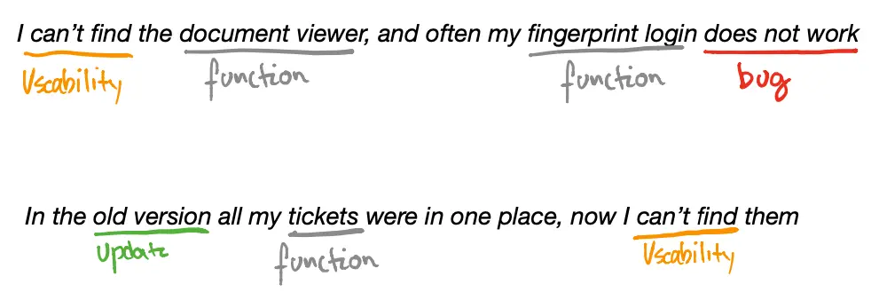
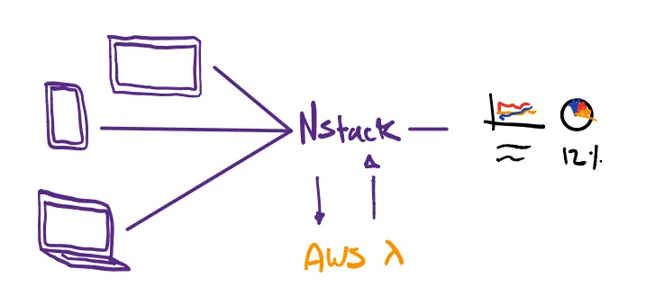
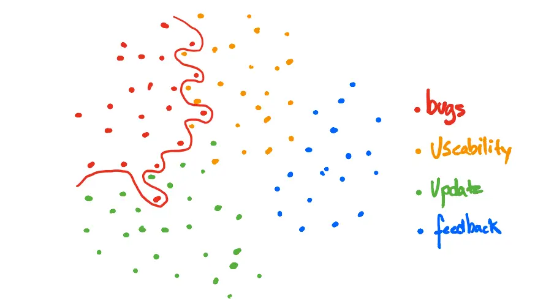
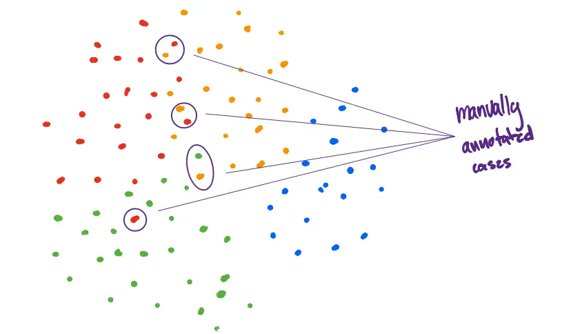
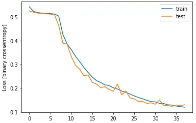

At Nodes we use Deep Learning to classify thousands of user-generated feedback messages across our digital solutions. We do this to create actionable insights for our clients, giving them a way to decipher large amounts of data that otherwise would be very expensive to manually label.

You should read this if you are interested in

- Machine Learning in production
- Natural Language Processing
- TensorFlow using Keras
- Hand-drawn illustrations of questionable aesthetic quality

## What's this about?

At Nodes we collect large amounts of user generated data through our feedback module. This is an optional module that some of our clients choose to activate in the applications we make for them. The module can be set to prompt users to provide feedback at specific times, like after a period of sustained use, at a certain date, or when some use-pattern emerges.

Since 2017 this module has been active in several of our applications, and since then **42000** feedback messages have made their way through to our system, and this number keeps increasing every day.

The end-goal of this solution is to offer our clients a detailed overview of how their applications are doing, as phrased by the users. Ultimately, this allows for a data-driven approach to development, where product owners can prioritise the bugs that are most frequency reported, and as solutions are released they can monitor the development of certain kinds of user-reported issues.

While this solution requires several parts, this blogpost will focus on machine learning. Because the data is text messages, we will be looking at how to process text data with **Natural Language Processing**. The essence of NLP is to make words, sentences or entire documents into vectors so we can apply standard machine learning methods to them.

## Why are we doing this?

Our primary focus with this project is to empower our clients with valuable and actionable insights based on the messages users provide. To achieve this we identified two important questions our solution needed to address:

1. What is the core content of this message?
2. What kind of specific functionality - if any - is this message about?

In our analysis of the data, which I will expand on later, we identified four different kinds of messages: **bugs**, **usability**, **update** and **feedback**.

- **Bugs** are usually the messages that underline that some functionality is not working as intended, or that an interaction with the application was unsuccessful.

- **Usability** messages are often directed at how users find interaction unintuitive, or can't find certain functionality where they expected it.

- **Update** messages are characterised by users pointing out that a functionality used to work and that a recent update to the solution broke this functionality, or made is less user-friendly.

- **Feedback**, are the rare messages where users take their time and suggest new functionality or changes to the solution.

Take these example sentences:



As you can tell, both sentences have aspects of bugs and usability issues. Because of the nature of these types of multifaceted messages, it makes a lot of sense to allow for multiple labels.

For example, a bug can come around as a consequence of an update, so it seems appropriate to have both the **bug** and **update** label. In machine learning lingo, when something we want to classify has several labels, we call it a **multi-label problem**.

As you can imagine, reading, understanding and labelling thousands of messages is a daunting manual task. So, instead of spending precious resources on manual labour, why not let a machine do the work?

## The solution (Yes, its deep learning)

Since this is a ML post, I wont go through the details of production, but quickly summarise the core of the infrastructure.



In short, messages come in from all our different solutions and are stored in our backend (NStack). For each message, NStack sends the free-form message to the ML API, that lives in a AWS Lambda function, where the four steps below are executed.

1. Detects the input language.

2. Translates the message to english.

3. Returns the translated message, the predicted label and any keywords that pertain to functionality.

4. This is stored in NStack and used as data in a dashboard.

The API and ML model lives in the cloud as a serverless AWS Lambda function. How to deploy models like this on AWS Lambda will be the focus of a later blog-post, so stay tuned.

### Using semi-supervised clustering to generate labels

Our first problem is that the data was not annotated. This means that we dont know what categories the messages belong to. This information is essential, because that's the data we want to use to train our model.

To solve this problem, we used a simple approach of generating labels based clustering and then confirming edge cases manually. Hence the name _semi-supervised_ because the labels are generated part supervised (manually) and part unsupervised (clustering).

Before we can cluster anything, we need to turn our messages into something our clustering algorithms can understand. We often call this step preprocessing.

### Preprocessing

With NLP problems, preprocessing can be quite different depending on what you’re trying to achieve. It's beyond the scope of this post to explain all the nuances, but I encourage anyone interesting in starting with NLP to check out this excellent [guide to spaCy](https://course.spacy.io/en/chapter1) a NLP framework for Python.

Let's get get into it!

To do simple clustering, we need to complete three key steps:

1. Clean each message
2. Remove stop words in each sentence
3. Tokenise the sentences

Each of those steps can be illustrated with simple examples.

Consider this made-up sentence:

> “_I cant find the bøtton that closes my 5,, tabs when they are OPEN!!_”

Cleaning the text is basically about standardisation. Removing superfluous characters such as `!/&#`, numbers, extra spaces, making everything lowercase, etc. So the sentence becomes:

> “_i cant find the btton that closes my tabs when they are open_”

Stop words are words like “is”, “an”, “the” etc. They often bring little information to our model, so we remove them. After removing stop words, the sentence would look like:

> “_i cant find btton closes my tabs open_”

Tokenization is the task of chopping up a sentence into pieces called **tokens**. For our sentence, there are eight unique tokens because there are eight different words after removing the stop words. If the same word appears twice, it will be counted in the hash table with frequency two.

Before we can use clustering, we apply a method called [TFIDF](http://www.tfidf.com/) (term frequency–inverse document frequency). This method is a product of how frequent a word is in a document, multiplied with how unique (inverse frequency) it is in the entire collection of messages.

Using the TFIDF distribution, we apply a simple K-Means clustering algorithm to identify the clusters. As illustrated below, we're trying to get our algorithm to draw a sensible squiggly line that separates messages in a manner that is semantically meaningful.



After some experimentation with defining the clusters and manual inspection of sentences, we decide our four main clusters are **bug, usability, update** and **feedback.**

As an example of what we found in the clusters, consider the sentence

> “_I dont like the new drop down menu._”

This sentence is semantically different from

> “_The new drop down menu does not work_”

because it allures to usability or design issue (the user does not like the design) versus a bug (the menu does not work).

The rest of the effort here is to manually go through most of the sentences where clusters overlap and manually decide on their labels.



We manually went through approximately 1000 sentences and labelled them manually. This means that **we labelled less than 2 percent of our data manually** and 98% automatically.

### The Deep Neural Network

After the step above, we have the labels we need to train our machine learning model.

Now you might ask: Why not just use the unsupervised method to classify future messages as well?

Well, we can't be bothered to run our semi-supervised approach every single time a new message comes into our system. The reason we cant be bothered to do this is because K-Means clustering is a **greedy** algorithm with a time complexity of $$O(n^2)$$, which is computer science language for slow.

Also, we manually tagged a lot of messages, so we would like our machine learning model to: **a**) Learn the patterns that our KMeans clustering found but still be computationally cheap to run inference on. **b**) Be able to learn from the messages we tagged manually.

To achieve this we use a **Long Short-Term Memory** (LSTM) model. This is a specific type of [Recurrent Neural Network](https://en.wikipedia.org/wiki/Recurrent_neural_network) (RNN) that - unlike feed forward neural networks such as the [Perceptron](https://en.wikipedia.org/wiki/Perceptron) - allows for **feedback connections**. Feedback connections in sequence allow for memory, something a feed forward network does not have.

Deep learning models that have memory are very useful when the _order of the input matters_, which is very much the case for sentences (unless you are Yoda).


Let's do as Master Yoda says and remember our imports.

```python
import tensorflow as tf
import numpy as np

from tensorflow.keras.preprocessing.text import Tokenizer
from tensorflow.keras.preprocessing.sequence import pad_sequences
from tensorflow.keras.models import Sequential
from tensorflow.keras.layers import Dense, Dropout, Activation, Embedding, SpatialDropout1D, LSTM
from tensorflow.keras.optimizers import SGD
from tensorflow.keras.callbacks import EarlyStopping

import tensorflow_docs as tfdocs
import tensorflow_docs.plots
import tensorflow_docs.modeling


from sklearn.model_selection import train_test_split

import matplotlib.pyplot as plt
```

### Steps before training

Building a deep learning model with LSTM layers is relatively simple with the [Keras API for TensorFlow 2.0](https://www.tensorflow.org/guide/keras).

From their own site:

> `tf.keras` is TensorFlow's high-level API for building and training deep learning models. It's used for fast prototyping, state-of-the-art research, and production, ...

To train the model, we apply the same preprocessing steps as we did when we did the clustering, with one additional step.

Before training the model, **all sentences need to be equal length**. Thos is done by choosing a maximum length that a sentence can be, and then either removing tokens or padding them with zeros.

The following code shows the four steps: Cleaning, removing stop words, tokenisation and padding.

```python
def get_train_test_sequences(messages, labels):

    tokenized_messages = []
    tokenized_labels = []

    for m, l in zip(messages, labels):
        tm, ll = remove_stopwords(m, l)

        tokenized_messages.append(tm)
        tokenized_labels.append(ll)

    X_train, X_test, y_train, y_test = train_test_split(tokenized_messages, tokenized_labels, test_size=0.2, random_state=2020)

    tokenizer = Tokenizer(num_words = VOCAB_SIZE, oov_token=OOV_TOK)
    tokenizer.fit_on_texts(X_train)

    word_index = tokenizer.word_index

    train_sequences = tokenizer.texts_to_sequences(X_train)
    train_padded = pad_sequences(train_sequences, maxlen=MAX_LENGTH, padding=PADDING_TYPE, truncating=TRUNC_TYPE)

    print(len(train_sequences))
    print(train_padded.shape)

    test_sequences = tokenizer.texts_to_sequences(X_test)
    test_padded = pad_sequences(test_sequences, maxlen=MAX_LENGTH, padding=PADDING_TYPE, truncating=TRUNC_TYPE)

    print(len(test_sequences))
    print(test_padded.shape)

    return train_padded, test_padded, np.array(y_train), np.array(y_test)
```

This function takes in clean messages, removes stop words, splits the data into test and training sets, tokenises, adds padding and returns them.

Looking at a randomly chosen sentence after these steps, we see that it is arranged as sequence of tokens (just numbers) followed by zeros until we get to the desired padding length of 20. No matter how long our sentences are, they will be represented by a length of 20 tokens.

```python
array([   5, 1039, 1657,   82,  227,  562,  229,  855,   65, 227,   18, 0,    0,    0,    0,    0,    0,    0,    0,    0], dtype=int32)
```

Arrays like the above one is the training input for our LSTM model. Similarly, the training labels are simply lists that correspond to one, or several, of the labels, like this:

```python
array([1, 0, 0, 0])
```

Where `array([1, 0, 0, 0])` is binary encoding for `bug`. Remember, that a message can have several tags, so this could also look like this:

```python
array([1, 1, 0, 0])
```

Which would mean the sentence was both a bug and a usability issue.

Now we are ready for training!

### Building and training the LSTM

As mentioned earlier, Keras is a high-level API for TensorFlow that allows putting a lot of functionality into a few lines of code. The real model that we use in production is slightly more complicated, but I have removed some complexity in order to make it easier to explain.

Thus, behold a minimal viable example of the model training code:

```python
def train_model():

    model = Sequential()
    model.add(Embedding(VOCAB_SIZE, EMBEDDING_DIM, input_length=train_padded.shape[1]))
    model.add(SpatialDropout1D(0.2))
    model.add(LSTM(100, dropout=0.2, recurrent_dropout=0.2))
    model.add(Dense(y_train.shape[1], activation='sigmoid'))

    sgd = SGD(lr=0.01, decay=1e-6, momentum=0.9, nesterov=True)

    model.compile(loss='binary_crossentropy',
                  optimizer=sgd)

    early_stop = EarlyStopping(monitor='val_loss', patience=3, min_delta=0.0001)

    history = model.fit(train_padded,
                        y_train,
                        epochs = 750,
                        batch_size = 64,
                        validation_split = 0.2,
                        callbacks = [early_stop, tfdocs.modeling.EpochDots()])

    return model, history
```

So we are training a relatively advanced model in something like ten lines of code. Impressive!

However, loads of things are happening behind the scenes here. Lets look at a few of them in detail.

#### 1. Model architecture

Keras allows us to explore our small model by simply calling `model.summary()`.

```shellscript
Model: "sequential"
_________________________________________________________________
Layer (type)                 Output Shape              Param #
=================================================================
embedding (Embedding)        (None, 20, 64)            3200000
_________________________________________________________________
spatial_dropout1d (SpatialDr (None, 20, 64)            0
_________________________________________________________________
lstm (LSTM)                  (None, 100)               66000
_________________________________________________________________
dense (Dense)                (None, 4)                 404
=================================================================
Total params: 3,266,404
Trainable params: 3,266,404
Non-trainable params: 0
```

First, we define a sequential model by calling `model = Sequential()`. Then we add layers.

The first layer is a `Embedding` layer, and is interesting in its own right. This layer takes a sentence and learns a representation (basically a function) of that sentence. This has a lot of advantages over other methods, can you can read more about [here](https://machinelearningmastery.com/use-word-embedding-layers-deep-learning-keras/).

The second layer is a `SpatialDropout1D` layer. Coarsely put, this layer remove features from the data, which has been [shown to](https://arxiv.org/abs/1207.0580) help greatly in preventing [overfitting](https://en.wikipedia.org/wiki/Overfitting).

Our third layer is the `LSTM` layer. I wont go into detail with what's the layer as its quite complex, but look here for [a more detailed blogpost](https://towardsdatascience.com/understanding-lstm-and-its-quick-implementation-in-keras-for-sentiment-analysis-af410fd85b47). The `100` parameter is the number of units, which dimensions the output space for our next layer.

The fourth and last layer is the output of the model. This is where we get the classification, e.g. `[1, 1, 0, 0]` for a sentence which has the bug and usability tags.

One important thing to notice is the choice of activation function. This function is what sits between the layers and "interprets" the output between the layers.

When doing multi-label classification like we are doing, its important not to have an activation function that decreases the probability of one class as a function of the probability of the other classes. If had two outputs that were mutually exclusive, like predicting if a sentence was _either_ a bug or a usability issue, it would be fine to use something like `softmax` that does exactly this.

#### 2. Parameter optimisation

Training the model happens with gradient descent. If you dont know what that is, you should do some [googling](https://lmgtfy.com/?q=what+is+gradient+descent) as this method is at the core of 95% of methods for optimising parameters in machine learning.

We choose stochastic gradient descent with a learning rate of `0.01`.

```python
sgd = SGD(lr=0.01, decay=1e-6, momentum=0.9, nesterov=True)
```

By defining the model and our choice of optimiser, we are ready to compile our model.

```python

model.compile(loss='binary_crossentropy',
                  optimizer=sgd)

early_stop = EarlyStopping(monitor='val_loss', patience=3, min_delta=0.0001)

history = model.fit(train_padded,
                        y_train,
                        epochs = 750,
                        batch_size = 64,
                        validation_split = 0.2,
                        callbacks = [early_stop, tfdocs.modeling.EpochDots()])

```

There are two important things to notice here. **First**, our choice of loss function. **Second** the `EarlyStopping` call.

The loss function is the function that we are trying to minimise by choosing certain parameters for our neural network - this is the essence of _learning_ in machine learning.

The choice of loss function is pivotal, but also a quite mathematical subject. You can read a great visual explanation of binary cross entropy [here](https://towardsdatascience.com/understanding-binary-cross-entropy-log-loss-a-visual-explanation-a3ac6025181a).

Early stopping is an important trick we use to prevent overfitting. It simply stops model training when the loss has not improved in a number of epochs. This decreases the probability of the model running for too many epochs, which in some cases leads to overfitting the training data.

Looking at test run of the model, we see that early stopping is invoked after epoch 38, because the model loss hasn't improved for the last three rounds.

#### 3. Training

Training is an iterative process where our algorithm is constantly choosing new parameters with the constant aim of minimising the loss function. By doing this, the model is learning an effective representation of the training data, which is the goal of all this effort. After 38 epochs of 750 iterations, our model grind to a halt because of our early stop criteria explained above.

```shellscript
Epoch 36/750
19752/19752 [==============================] - 27s 1ms/sample - loss: 0.1240 - val_loss: 0.1286
Epoch 37/750
19752/19752 [==============================] - 28s 1ms/sample - loss: 0.1213 - val_loss: 0.1250
Epoch 38/750
19752/19752 [==============================] - 28s 1ms/sample - loss: 0.1191 - val_loss: 0.1296
```

Lets looks at the loss that our loss function outputs over the 38 epochs we are training the model.



The training and test loss decrease steadily, and slowly stops to improve a lot after the 35th epoch. Because it does not see further improvement, our early stop rule halts the training.

#### 4. Evaluating our model

Now we have a trained model we can use to generate predictions with on our test set, to see how well the model does on data it has never seen before (the test set).

```python
preds = model.predict(test_padded)

preds[preds>=0.5] = 1
preds[preds<0.5] = 0

_ = abs(preds - y_test)

sum(_)

array([364., 530., 114.,  93.])
```

These numbers show that out of 6173 messages in the test set, our model labels 363 bug, 530 usability, 114 update and 93 feedback messages wrong. This translates to an accuracy of 95%, 93%, 98% and 99% respectively for the four classes. Not too bad for a relatively simple setup!

Is accuracy the right or the only metric we should look at when training a model? Definitely not - but evaluating a model like this takes some effort, and that's for another day.

## Summary and next steps

In the above, I sketched the overarching approach we at Nodes take to labelling all the feedback users provide when they interact with our digital solutions. To do this I demonstrated how to use natural language processing to process text so it can be fed to a clustering algorithm that automatically identifies clusters in the text. After resolving some edge cases manually, I showed how to feed this data to a deep learning model that learns the structure of each sentence and is able to classify new messages as either being either a bug, a usability issue, an issue with an update or constructive feedback.

The aim of all of this is to provide a solution that generates actionable insights into what users are saying about the digital solutions we build for our clients. Our next step is to build a dashboard that summarises this information and makes it available for product owners across our digital solutions.
