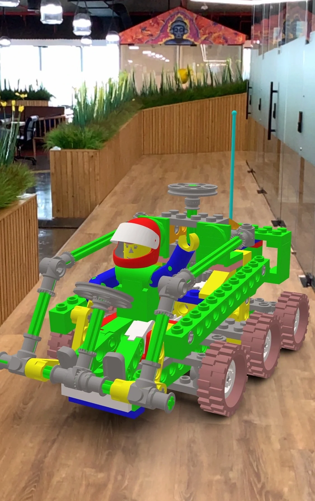

[ARKit 3.0](https://developer.apple.com/augmented-reality/arkit/) was officially released together with iOS 13.0 and it includes a lot of augmented reality goodies, such as people occlusion and motion capture. You can read about all the new features [here]( {{ site.baseurl }} ).

The AR focused file format (USDZ) was announced at the WWDC Conference in 2018 and it's supported on iOS, macOS and tvOS. In this post we will dive into what this format is and how we can convert and create USDZ files.

## What is USDZ?

One of the biggest advantages of USDZ is its seamless integration with iOS apps like Messages, Mail, Safari, Notes, News, Files and of course, 3rd party apps.

The technology behind it is called [USD (Universal Scene Description)](http://openusd.org). It is a 3D file format developed by Pixar and it has a focus on **speed, scalability and collaboration**. USDZ is the distribution format for USD, which is a compact single file that is optimised for sharing. It is also the file used for AR quick look (checkout some AR quick look examples [here](https://developer.apple.com/augmented-reality/quick-look/)).


## How to convert an existing file to USDZ?

As it is early ages for this format, you will probably still have your 3D content available in other formats like .obj, .gltf, .fbx or .abc. But the good news is that converting any of those to .usdz has been made easy by Apple with the `usdzconvert` command line tool. It also performs asset validation so you will be able to know if your files has been converted properly.

**Installing the USD Python Tools**

1. Download the USD Python Tools from [here](https://developer.apple.com/download/more/?=USDPython)
2. Open the unzipped folder
3. Double click on the `USD.command`

**See all options**

```shell
usdzconvert -h
```

**Convert a file to .usdz**

```shell
usdzconvert <file>
```

**Convert a file to .usdz while also adding materials**

```shell
usdzconvert <file> -diffuseColor <file> -normal <file> -metallic <file> -roughness <file>
```

**Plain text representation of your .usdz file**

```shell
usdcat <file>
```

**The structure of the model**

```shell
usdtree <file>
```

**Asset validator**

```shell
usdchecker <file>
```

## [Converting a glTF file example](https://en.wikipedia.org/wiki/GlTF)

For testing the .usdz converter with a .glTF file I used the [Buggy](https://github.com/KhronosGroup/glTF-Sample-Models/tree/master/2.0/Buggy/glTF) model from the [glTF-Sample-Models](https://github.com/KhronosGroup/glTF-Sample-Models) repository by KhronosGroup. In my test folder I made sure to have both the .glTF and .bin files for the conversion to work properly.

```shell
usdzconvert Buggy.gltf
Input file: Buggy.gltf
Output file: Buggy.usdz
usdARKitChecker: [Pass] Buggy.usdz
```

To test out the file, I drag and dropped the **Buggy.usdz** file into my **Notes** app on my MacBook which is synchronised with my iPhone.
Then I was able to open the file directly from my iPhone. Simple as that!



## [Converting a FBX file example](https://en.wikipedia.org/wiki/FBX)

To be able to convert .fbx (Filmbox) files you will need to take some extra steps as it doesn't come supported out of the box.

1. Install the Autodesk FBX SDK and FBX Phython bindings from [here](https://www.autodesk.com/developer-network/platform-technologies/fbx-sdk-2019-5)
2. Edit the `USD.command` file from the USD Python Tools folder, uncomment and update the file path to point to the location of the fbx.so (Phython 2.7). In my case I had to update it to `export PYTHONPATH=$PYTHONPATH:/Applications/Autodesk/FBX\ Python\ SDK/2019.5/lib/Python27_ub`
3. Rerun the `USD.command`. Now you should be able to convert FBX files.

For a testing example I used the [Rose](https://free3d.com/3d-model/rose-31675.html) model from Free3d.com website. I downloaded the model and copied the .fbx file and textures to my test folder.

```shell
usdzconvert rose.fbx
Input file: rose.fbx
Output file: rose.usdz
usdARKitChecker: [Pass] rose.usdz
```

You can preview the converted model by selecting it in the folder and pressing `SPACE` on your Mac keyboard. Another way is by opening it with Xcode, or if you want to see it in real life, copy it into your iPhone and test it out.


A few notes to keep in mind:

- If you have an FBX file with external texture files make sure to have them in the same folder when making the conversion
- Texture files can be of type .png or .jpg
- Experimenting more with other models, it is quite often that the models fail conversion from first try. Most of the time, the issue is caused by missing or wrong formatted textures. This could be avoided by passing on the requirements for a good conversion to the 3d model designer.

## How to create a USDZ file?

If you want to create your 3D assets directly in the USDZ file format there are different options and here are some examples:

1. [Substance painter by Adobe](https://www.adobe.com/products/substance.html) - Supported
2. [Autodesk Maya](https://www.autodesk.com/products/maya/overview) - Supported through a plugin (written and maintained by Pixar)
3. [SceneKit](https://developer.apple.com/documentation/scenekit) - Create or load a `SCNScene` that you can export to USDZ with an API call or directly from the user interface.

## Resources

- [USDZ File Format Specification](https://graphics.pixar.com/usd/docs/Usdz-File-Format-Specification.html)
