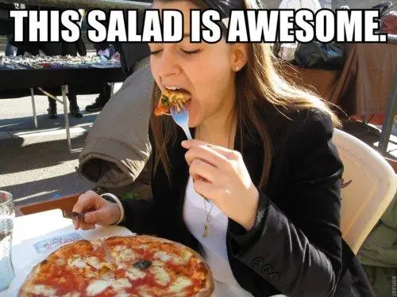
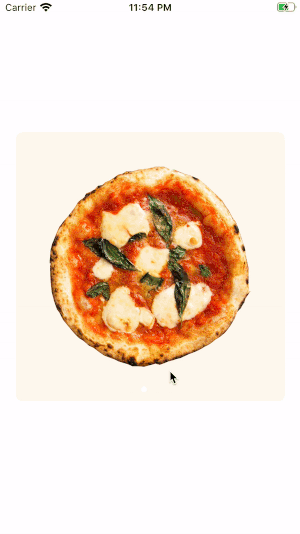
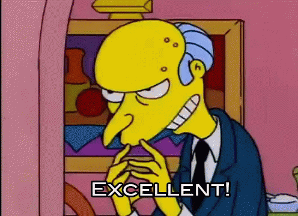

The hunger for magnificent design, animations and transitions is huge and nowadays designers are pushing developers to create beautiful views with lots of animations and smooth transitions.

Based on this, I will present some basic concepts of transitions and animations. This is the first in a series of three blogposts.

In this article, we will create a custom transition with [View Controller Transitions](https://developer.apple.com/documentation/uikit/animation_and_haptics/view_controller_transitions) and understand how it works based on UIKit. This is a powerful framework and you can use it to create smooth transitions and animate the elements of your view controller.

And to satisfy this hunger, nothing better than a Pizza App, right? Or maybe a salad if you don't like pizza...



By the end of this article you will be able to:

- Create your custom transition
- Animate view elements
- Understand the transition delegates methods

The final result should look something like this 😉



You can also clone the final project from [here](https://github.com/nodes-ios/transitions-animations-part1).

## Let's get started!

In this example, I'm using a simple ViewController with a UICollectionView. When an item is selected, a second ViewController is presented.

As our `PizzaViewController` is embedded in a UINavigationController, our ViewController must conform to the protocol `UINavigationControllerDelegate`. In this case, we are assigning the delegate to self and we will implement this protocol in a second.

```swift
override func viewDidLoad() {
    super.viewDidLoad()

    navigationController?.delegate = self

    viewModel.delegate = self
    viewModel.getPizzas()
}
```

To trigger our animation every time you click in one of the cells, we store the IndexPath in a variable in the ViewModel for future reference, and for presenting the `PizzaDetailViewController`

```swift
extension PizzaViewController: UICollectionViewDelegate {
    func collectionView(_ collectionView: UICollectionView, didSelectItemAt indexPath: IndexPath) {

        viewModel.indexPath = indexPath
        let pizza = viewModel.pizzas[indexPath.row]

        let detailVC = PizzaDetailViewController.instantiate()
        detailVC.pizza = pizza

        navigationController?.modalPresentationStyle = .custom
        navigationController?.pushViewController(detailVC, animated: true)
    }
}
```

So far there's nothing special other than assigning the NavigationController delegate to our ViewController.

### Implementing the delegate

This is where things starts getting interesting 😀

We can have different animations, depending on whether you are presenting or dismissing a ViewController. To find out which one you should use, you can check the value of a property called `operation` with type `UINavigationController.Operation`. This property will tell us whether the user is presenting or dismissing a view.

In the first part of this example, we will implement only the presentation animation.

Your code should look like this:

```swift
extension PizzaViewController: UINavigationControllerDelegate {
    func navigationController(_ navigationController: UINavigationController,
                              animationControllerFor operation: UINavigationController.Operation,
                              from fromVC: UIViewController,
                              to toVC: UIViewController) -> UIViewControllerAnimatedTransitioning? {
        switch operation {
        case .push:
            return AnimationManager(animationDuration: 1.5, animationType: .present)
        case .pop:
            return AnimationManager(animationDuration: 1.5, animationType: .dismiss)
        default:
            return nil
        }
    }
}
```

Notice here that we are returning an object of type `UIViewControllerAnimatedTransitioning` which is our `AnimationManager`class. We'll cover that later. Hold on!

To make our life easier, both of our ViewControllers implement the protocol `PizzaTransitionable`. This protocol has two properties and we will use them in our animations. As we are dealing with a CollectionView and IndexPath, it's handy to have this kind of helper.

```swift
protocol PizzaTransitionable {
    var backgroundView: UIView { get }
    var pizzaImage: UIImageView { get }
}
```

##### Implementing the protocol on PizzaViewController

```swift
extension PizzaViewController: PizzaTransitionable {
    var backgroundView: UIView {
        guard
            let indexPath = viewModel.indexPath,
            let pizzaCell = collectionView.cellForItem(at: indexPath) as? PizzaViewCell
        else {
            return UIView()
        }
        return pizzaCell.containerView
    }

    var pizzaImage: UIImageView {
        guard
            let indexPath = viewModel.indexPath,
            let pizzaCell = collectionView.cellForItem(at: indexPath) as? PizzaViewCell
        else {
            return UIImageView()
        }
        return pizzaCell.pizzaImage
    }
}
```

##### Implementing the protocol on PizzaDetailViewController

```swift
extension PizzaDetailViewController: PizzaTransitionable {
    var backgroundView: UIView {
        return detailBackgroundView
    }

    var pizzaImage: UIImageView {
        return detailPizzaImage
    }
}
```

Right now we have everything ready to get our hands dirty.



## Animating the transition 😍

Now it's time to see what's inside of our `AnimationManager` class.

Here we have two properties `animationDuration` and `animationType`. Probably you already know what they mean, right?

```swift
final class AnimationManager: NSObject {

    // MARK: - Variables
    private let animationDuration: Double
    private let animationType: AnimationType

    // MARK: - Init
    init(animationDuration: Double, animationType: AnimationType) {
        self.animationDuration = animationDuration
        self.animationType = animationType
    }
}
```

The `AnimationType` is a custom enum and it has only 2 cases. We use it to know when we need to animate the presenting or dismissing of a view.

```swift
enum AnimationType {
    case present
    case dismiss
}
```

We also need to make our AnimationManager conform to the `UIViewControllerAnimatedTransitioning` protocol.

The view controller will call the animator object from the transitioning delegate and will use it to perform the animation as you can see at the end of this snippet code.

```swift
extension AnimationManager: UIViewControllerAnimatedTransitioning {
    // Return the animation duration defined when we instantiated the view.
    func transitionDuration(using transitionContext: UIViewControllerContextTransitioning?) -> TimeInterval {
        return TimeInterval(exactly: animationDuration) ?? 0
    }

    // Retrieve the ViewControllers and call the animation method
    func animateTransition(using transitionContext: UIViewControllerContextTransitioning) {
        guard
            let toViewController = transitionContext.viewController(forKey: .to),
            let fromViewController = transitionContext.viewController(forKey: .from)
        else {
            // We only complete transition with success if the transition was executed.
            transitionContext.completeTransition(false)
            return
        }

        // According to the animation type we call the method to animate the presenting or dismissing.
        switch animationType {
        case .present:
            presentAnimation(
                transitionContext: transitionContext,
                fromView: fromViewController,
                toView: toViewController
            )
        case .dismiss:
            dismissAnimation(
                transitionContext: transitionContext,
                fromView: fromViewController,
                toView: toViewController
            )
        }
    }
}
```

#### Presenting the animation

For a clean and organized codebase, the logic is split into different chunks of code using extensions. That way the code is more readable and nicer as you can see in the example project! 🤓

But here it is shown separately:

For this animation, the duration is split in two parts. The first one should run in 1/3 of the duration and the second part the other 2/3 of the time.

```swift
// Assigning the context to a variable.
let containerView = transitionContext.containerView

// We split the whole animation in 2 different parts.
// The fist part should run in 1/3 of the time and the second part 2/3 of the time.
let firstPartDuration = (animationDuration / 3)
let secondPartDuration = (animationDuration / 3) * 2
```

Since delegate provides us a ViewController object, we need to cast it into the view type to access its objects.

```swift
// Cast the ViewControllers to their original type
guard let fromPizzaVC = fromView as? PizzaViewController else { return }
guard let toPizzaDetailVC = toView as? PizzaDetailViewController else { return }
```

Instead of animating the real objects of the view, we mirror them by creating new objects assigning the same position as the original ones. That way we can hide the ViewController and play with the "fake" objects.

```swift
// Mirroring the objects that we will animate.
let backgroundView = UIView()
let pizzaSnapshot = UIImageView()

// Storing the frame positions.
let backgroundFrame = containerView.convert(
    fromPizzaVC.backgroundView.frame,
    from: fromPizzaVC.backgroundView.superview
)

let pizzaSnapshotFrame = containerView.convert(
    fromPizzaVC.pizzaImage.frame,
    from: fromPizzaVC.pizzaImage.superview
)

// Setting up new objects with original attributes from the presented view controller.
backgroundView.frame = backgroundFrame
backgroundView.backgroundColor = fromPizzaVC.backgroundView.backgroundColor
backgroundView.layer.cornerRadius = fromPizzaVC.backgroundView.layer.cornerRadius

pizzaSnapshot.frame = pizzaSnapshotFrame
pizzaSnapshot.image = fromPizzaVC.pizzaImage.image
pizzaSnapshot.contentMode = .scaleAspectFit
```

Right after creating our "fake" objects, we need to add it to the containerView, then we can hide/show the objects from the original ViewControllers as you wish.

```swift
// Adding the subviews to the container view.
containerView.addSubview(fromPizzaVC.view)
containerView.addSubview(toPizzaDetailVC.view)
containerView.addSubview(backgroundView)
containerView.addSubview(pizzaSnapshot)

// Hidding/Showing objects to not/be displayed while animating the transition.
fromPizzaVC.view.isHidden = false
fromPizzaVC.collectionView.isHidden = true
toPizzaDetailVC.view.isHidden = true
```

Since the animations are running in a chain, we animate the objects using `UIViewPropertyAnimator`. That way, we have more control over our animations and the code is more readable.

```swift
// Background view final position.
let frameAnim = CGRect(x: 0, y: 0, width: UIScreen.main.bounds.width, height: UIScreen.main.bounds.height)

// Animate the view objects using PropertyAnimator
let animator1 = {
    UIViewPropertyAnimator(duration: firstPartDuration, dampingRatio: 1) {
        backgroundView.transform = CGAffineTransform(scaleX: 0.9, y: 0.9)
    }
}()

let animator2 = {
    UIViewPropertyAnimator(duration: secondPartDuration, curve: .easeInOut) {
        backgroundView.frame = frameAnim
        pizzaSnapshot.transform = CGAffineTransform(rotationAngle: .pi)
        pizzaSnapshot.frame = containerView.convert(
            toPizzaDetailVC.pizzaImage.frame,
            from: toPizzaDetailVC.pizzaImage.superview
        )
    }
}()
```

And the final step is to define the sequence and start the animation. 🤗

```swift
// Prepare the animations sequence
animator1.addCompletion { _ in
    animator2.startAnimation()
}

animator2.addCompletion { _ in
    fromPizzaVC.collectionView.isHidden = false
    toPizzaDetailVC.view.isHidden = false

    backgroundView.removeFromSuperview()
    pizzaSnapshot.removeFromSuperview()

    transitionContext.completeTransition(true)
}

// Run animations
animator1.startAnimation()
```

#### Dismissing the animation

As you know, we are not going to implement the dismiss method in this article. But stay tuned because we'll prepare some interesting animations in the future. For now, let's just go back to the `PizzaViewController` without doing anything.

```swift
private extension AnimationManager {
    func dismissAnimation(transitionContext: UIViewControllerContextTransitioning,
                          fromView: UIViewController,
                          toView: UIViewController) {

        let containerView = transitionContext.containerView

        containerView.addSubview(toView.view)
        containerView.addSubview(fromView.view)

        // We'll not animate anything. This will be covered in the next part of the article.
        transitionContext.completeTransition(true)
    }
}
```

## Where to Go From Here?

Now that you've learned some of the basics animations when transitioning your ViewControllers you can try to improve and make some incredible transitions! The possibilities are endless!!

## Resources

- [Customizing the Transition Animations](https://developer.apple.com/library/archive/featuredarticles/ViewControllerPGforiPhoneOS/CustomizingtheTransitionAnimations.html)

Photo by Rodolfo Clix from Pexels
