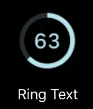
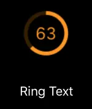
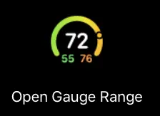
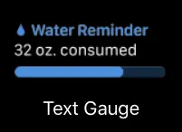
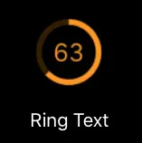
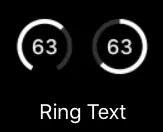

Complications are bits of watchOS application that can be put on the user's watch face and offer quick information, simply by looking at his/her Apple Watch, without opening the accompanying watchOS/iOS app. The Apple Watch ships with some default complications: Calendar, Weather, Activity, Battery (it shows only the watch’s battery level), etc.

There are 5 complication families. This article will show how to make 7 types of complications, from each complication family. 2 of the shown complications are only available in watchOS 5, and only on the Apple Watch Series 4 and up.

Recently, I had the chance to play with watchOS complications. This led me on a learning path.

`There is a goodie at the end of the article :)`

Before starting, I would like to point out a series of links that turned out to be useful on the subject of watchOS complications:

- [CLKComplicationFamily](https://developer.apple.com/documentation/clockkit/clkcomplicationfamily)
- [HIG on watchOS Complications](https://developer.apple.com/design/human-interface-guidelines/watchos/app-architecture/complications/)
- [HIG on watchOS Complication images](https://developer.apple.com/design/human-interface-guidelines/watchos/icons-and-images/complication-images/)

The examples that follow will show how to achieve one flavour for each of the complication family.

We start off with:

### [Circular Small](https://developer.apple.com/documentation/clockkit/circular_small)

```swift
circularSmall.textProvider = CLKSimpleTextProvider(text: "")
circularSmall.fillFraction = Float()
circularSmall.ringStyle = CLKComplicationRingStyle.closed
```

The snippet creates a closing ring, with a string in the middle.



The **fillFraction** takes values between 0.0 and 1.0. The closer the value is to 1.0, the more closed the ring is.

This complication can be used in the _Color_ watch face.

### [Extra Large](https://developer.apple.com/documentation/clockkit/extra_large)

```swift
let extraLarge = CLKComplicationTemplateExtraLargeRingText()
extraLarge.textProvider = CLKSimpleTextProvider(text: "")
extraLarge.fillFraction = Float()
extraLarge.ringStyle = CLKComplicationRingStyle.closed
```



The snippet creates a closing ring, with a string in the middle.
The **fillFraction** takes values between 0.0 and 1.0. The closer the value is to 1.0, the more closed the ring is.

This complication can be used in the _X-Large_ watch face

### [Graphic Circular](https://developer.apple.com/documentation/clockkit/graphic)

Graphic Circular is one of the new complications introduced in watchOS 5 and only available on the Apple Watch Series 4 and up.

```swift
let graphicCircular = CLKComplicationTemplateGraphicCircularOpenGaugeRangeText()
graphicCircular.centerTextProvider = CLKSimpleTextProvider(text: "")
graphicCircular.leadingTextProvider = CLKSimpleTextProvider(text: "")
graphicCircular.trailingTextProvider = CLKSimpleTextProvider(text: "")
graphicCircular.gaugeProvider = CLKTimeIntervalGaugeProvider(style: .ring, gaugeColors: [Array of UIColors], gaugeColorLocations: nil, start: startDate, end: endDate)
```



The _center text_ is the text that will be in the "middle" of the ring.
The _leading text_ will be in the bottom left of the ring, while the _trailing text_ will be in the bottom right.

The gauge can be either filled-style or ring-style. In the above example, the ring-style is chosen. Depending on the start date and the end date provided, it will have a small circle that will move along the gauge.

The `gaugeColors` parameters has to be given an array of colors. If you provide `gaugeColorLocations` with a `nil` value, watchOS will place the colors in an even out manner.

### [Graphic Rectangular](https://developer.apple.com/documentation/clockkit/graphic)

Graphic Rectangular is one of the new complications introduced in watchOS 5 and only available on the Apple Watch Series 4 and up.

```swift
let graphicRectangular = CLKComplicationTemplateGraphicRectangularTextGauge()
graphicRectangular.headerTextProvider = CLKSimpleTextProvider(text: "")
graphicRectangular.body1TextProvider = CLKSimpleTextProvider(text: "")
graphicRectangular.gaugeProvider = CLKSimpleGaugeProvider(style: .fill, gaugeColors: [Array of UIColors], gaugeColorLocations: nil, fillFraction: Float())```
```



### [Modular Lage](https://developer.apple.com/documentation/clockkit/modular_large)

```swift
let modularLargeTemplate = CLKComplicationTemplateModularLargeStandardBody()
modularLargeTemplate.headerTextProvider = CLKSimpleTextProvider(text: "")
modularLargeTemplate.body1TextProvider = CLKSimpleTextProvider(text: "")
modularLargeTemplate.body2TextProvider = CLKSimpleTextProvider(text: “”)
```


### [Modular small](https://developer.apple.com/documentation/clockkit/modular_small)

```swift
let modularSmall = CLKComplicationTemplateModularSmallRingText()
modularSmall.textProvider = CLKSimpleTextProvider(text: "")
modularSmall.fillFraction = Float()
modularSmall.ringStyle = CLKComplicationRingStyle.closed
```



This complication is very similar to set up like the Circular Small one.

### [Utilitarian Small](https://developer.apple.com/documentation/clockkit/utilitarian)

```swift
let utilitarianSmall = CLKComplicationTemplateUtilitarianSmallRingText()
utilitarianSmall.textProvider = CLKSimpleTextProvider(text:"")
utilitarianSmall.fillFraction = Float()
utilitarianSmall.ringStyle = CLKComplicationRingStyle.closed
```



This complication is very similar to set up like the Circular Small one.

---

The examples show how to make a complication for only 7 out of the 11 types of complications.

Keep in mind that each complication has other possibilities to show the information — instead of a closed/open ring, one could only show text or only an image.

### At the end

We gather all the complications available in one cheat sheet to make it easier to have an overview over the many complications that Apple has to offer.
You can find the name of the complication and links to Apple's documentation.
<!-- TODO -->
You can get [the cheat sheet here](watchOS_Cheat_Sheet.pdf)

_Article Header Photo by [Lloyd Dirks on Unsplash](https://unsplash.com/@lloyddirks?utm_source=unsplash&utm_medium=referral&utm_content=creditCopyText)_

_All other pictures taken from [Apple's documentation](https://developer.apple.com/documentation/clockkit)_
