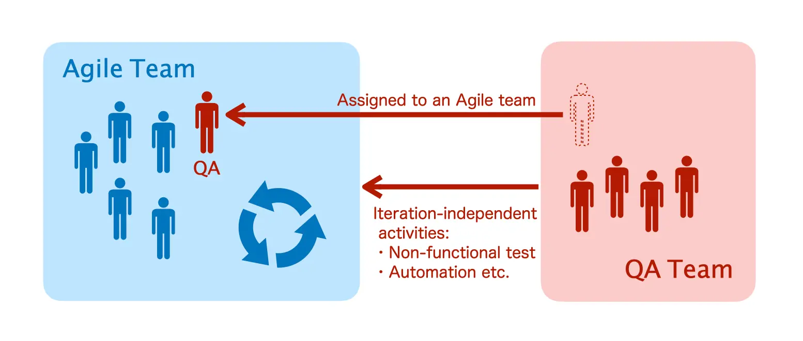

In this article we will have a look at testing in an Agile process, with reference to the ISTQB Foundation Level Agile Tester (*1) syllabus, and will be covering the following three topics:
1. The differences from testing in a Waterfall process
2. Improving the efficiency in testing
3. The dilemma between Agile Testing and Independence

*1 ISTQB (International Software Testing Qualifications Board) certification for Agile testing

## The differences from testing in a Waterfall process
#### Testing in a Waterfall process
In a Waterfall process, each process of requirements analysis, design, development, and testing proceeds to the next process after the deliverables are fixed.

In terms of testing, the basic principle is to start component testing, follow up by integration testing, and upon completion begins system testing.

As shown in figure 1, there is a co-relation between each design-to-testing process. For example, once the Requirement Design is completed, then used to perform Acceptance Testing. The same goes for System Design to System Testing and so forth.

Figure: Fig.1 V-model

The client can only confirm the product when it reaches the acceptance testing stage. Depending on the scale of the project, it is not uncommon for the entire process to take more than a year.

### Agile: testing is repeated in a short period of time.
In Agile development, a working product is released every **short development cycle, iteration,** of a few weeks and is improved with feedback.

Testing is also conducted within each iteration. In order to complete the process from the test design to the test execution in a short period of time, **high efficiency** is required.

Figure: Fig.2 Agile Model

### Test Levels for Agile Testing
While Waterfall has clearly defined test levels for integration testing, system testing, etc., Agile testing is a little different. The table below is a summary of the syllabus description from the ISTQB Foundation Level Agile Tester with a few of my own interpretations.

Test Level|Executor|Execution Timing|Execution Content.
--|---|---|--
Unit Testing|Developer|In Iteration|Component Level Verification
Feature Validation Testing|Developer or QA|In Iteration|Confirmation that user story acceptance criteria are met
Feature Validation Testing|Developer, QA and Business Stakeholder|In Iteration|Verify that the feature is suitable for use
System testing|QA|Outside of iteration|Functional and non-functional testing with user stories as test basis(*2)
Acceptance testing|Users|Each iteration or after all iterations are completed|Alpha/Beta testing, user acceptance testing, etc.

It is not necessary to implement all of the above without fail, but rather, to consider and plan the level of testing according to the needs of the project.

In some cases, **regression testing**(*3) may be conducted prior to a release by building up the test cases conducted in each iteration.

*2 Test basis: The documents or information used as the basis for test analysis and design.

*3 Regression testing: Testing to verify that changes to a part of a program do not have an unintended impact on the system.

## Improving the efficiency in testing
### Exploratory testing: Test technique that can easily adapt to specification changes
One of the "Twelve Principles of Agile Software" is as follows:

> "Welcome changing requirements, even late in development." - [The principles behind the Agile Manifesto](https://Agilemanifesto.org/iso/ja/principles.html)

In Waterfall, specification changes in the late stages of the development cycle are unacceptable, but in an Agile development cycle, changes are acceptable as long as they increase the value of the product. This requires a testing strategy that can easily adapt to changes.

When specification changes occur in the late stage of development, we need to revise the test design and redo the tests. In the worst case scenario, all the test cases you have worked so hard to create may be wasted, resulting in unnecessary costs.

**Exploratory testing** is an effective testing technique for such situations.

Traditional **script testing** uses test cases that specify test procedures, expectations, etc., whereas exploratory testing does not use test cases.

Exploratory testing, however, is slightly different from ad-hoc testing or monkey testing, which is perform blindly.
The table below summarizes the differences between script testing and exploratory testing.

Test technique|Test case|Pros|Cons  
--|---|---|--
Script testing|Yes|・Slight individual difference in results. ・Coverage is ensured.|・Large rework in case of specification change.
Exploratory testing|No|・Can detect bugs efficiently by experience. ・No man-hour required for test case creation.|・A certain level of skill required for executors. ・Difficult to ensure coverage.

There are several approaches to exploratory testing. We, at TestarLab, often prepare a document called a **test charter**, which contains testing guidelines, and execute tests according to it. Using the test charter allows us to give hints to less experienced testers and also allows for quantitative analysis.

Exploratory testing seems to be a good fit for Agile development, but it also has its disadvantages, as shown in the table above. Therefore, it is necessary to distinguish between script testing and exploratory testing by using script testing for important functions.

### The necessity of test automation
In a normal Agile development flow, regressions are more likely to occur due to frequent code changes; therefore, the importance of **regression testing** increases.

On many occasions, regression testing involves the usage of prior test cases in the past and is repeatedly executed. Thus, automated regression testing is more than likely to reduce the workload. Another benefit from automated test is that this allows QA to **concentrate on new feature testing or other changes**.

In addition, running automated tests at the timing of a pull request to a deployment, defects are usually found earlier.

In conclusion, knowledge about test automation is necessary for QA in an Agile team.

## The Dilemma between Agile Testing and Independence
Generally speaking, the more independent a QA team is, the more efficiently bugs can be detected. In an environment where they are separated from the developers, they can evaluate the product from a more objective and unbiased point of view.

On the other hand, in Agile development, the QA team works in collaboration with business stakeholders and developers in an Agile team to improve the quality of the product's process. There is a trade-off for being an independent QA.

### The ISTQB approach
How do you maintain independence while collaborating within an Agile team?

The ISTQB Foundation Level Agile Tester syllabus describes another approach to this dilemma:
>"A third option is to have an independent, separate test team where testers are assigned to Agile teams on a long-term basis, at the beginning of the project, allowing them to maintain their independence while gaining a good understanding of the product and strong relationships with other team members."

As a division of roles, QA within an Agile team is responsible to understand the product and deepening the relationships with all team members, while the QA outside the Agile team is responsible for iteration-independent activities such as automation and non-functional testing.

Figure: Fig.3 QA inside and outside of an Agile Team

As a QA in an Agile team, certain abilities are still required, such as being able to think objectively and critically in any situation, otherwise, having a QA in an Agile team would be meaningless.

## Summary
As for the characteristics of Agile testing, I hope the following are clear to you through the article.
- Compared to Waterfall, there is no uniform definition, and project-specific planning is required
- Use of exploratory testing and test automation improves efficiency
- Be careful not to compromise the independence of QA

Most of the projects in which TestarLab participates are Agile-type development projects. There are other development models besides Waterfall and Agile, but our goal is to provide optimal quality assurance in any development model.

## References
- [ISTQB Foundation Level Agile Tester](https://www.istqb.org/certification-path-root/Agile-tester.html)
- [ISTQB Foundation Level 2018](https://www.istqb.org/certification-path-root/foundation-level-2018.html)

The images used in this article may not be reproduced without permission.

## What is "TESTAR LAB"?
TestarLab is a new service specialized in testing the quality of application functions and services. We offer cost-optimized and speedy proposals based on our abundant human resources in 29 cities in 17 countries and our extensive network of domestic and overseas partner companies.
Testarlab provides an independent third-party verification team that optimizes the cost and detection efficiency for customers who are experiencing quality issues within their services, as well as customers who frequently upgrade versions, which makes testing costly and time-consuming.

_Article Photo by [Patrick Perkins](https://unsplash.com/photos/ETRPjvb0KM0)_
